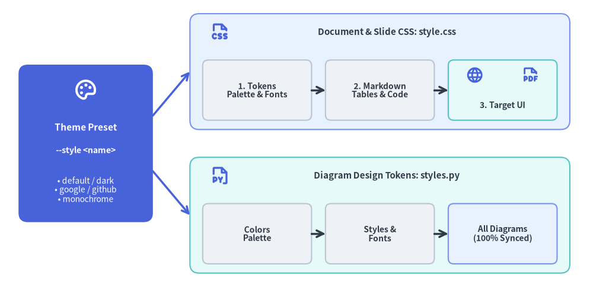
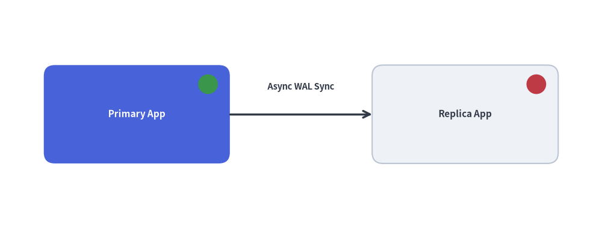

# Customization & Theming: Templates, CSS & Injected Code

Drawlib is designed to integrate seamlessly into corporate design languages and custom developer workflows. You can customize HTML layout structures, modify stylesheets, and inject project-wide Python drawing helpers and style definitions.

A single theme preset (`--style <preset>`) synchronizes both your document CSS (`style.css`) and your diagram design tokens (`styles.py`):


<figure class="drawlib-image" style="text-align: center;">
  
  <figcaption class="drawlib-caption">Unified Theme Architecture: Synchronizing Document CSS (style.css) and Diagram Tokens (styles.py)</figcaption>
</figure>

<details class="drawlib-code-details">
<summary>Source Code</summary>

```python
from drawlib.canvas import save, setup
from drawlib.icons import phosphor
from drawlib.lines import line
from drawlib.shapes import rectangle
from drawlib.styles import Styles
from drawlib.text import text

setup(width=128, height=62)

# Left Focal Card: Single Theme Preset
rectangle((18.5, 31), width=29, height=34, style=Styles.PrimaryFlat.patch(shape_r=2.0))
phosphor.palette((18.5, 42.5), width=5.2, style=Styles.WhiteBold)
text((18.5, 34.5), "Theme Preset", style=Styles.WhiteBold.patch(text_size=11.0))
text((18.5, 29.5), "--style <name>", style=Styles.WhiteBold.patch(text_size=10.2))
text((18.5, 21.0), "• default / dark\n• google / github\n• monochrome", style=Styles.White.patch(text_size=10.0))

# Branching connectors
line((33, 37), (41, 46.5), arrow_head="->", style=Styles.PrimaryBold)
line((33, 25), (41, 15.5), arrow_head="->", style=Styles.PrimaryBold)

# Top Branch: Document & Slide Styling (style.css)
rectangle((82, 46.5), width=82, height=25, style=Styles.PrimaryNeutral.patch(shape_r=2.0))
phosphor.file_css((47.5, 55.0), width=4.4, style=Styles.PrimaryBold)
text((83.5, 55.0), "Document & Slide CSS: style.css", style=Styles.DarkBold.patch(text_size=10.8))

rectangle(
    (55.5, 42.5),
    width=23.5,
    height=13,
    style=Styles.Neutral.patch(shape_r=1.2),
    text="1. Tokens\nPalette & Fonts",
    text_style=Styles.DarkBold.patch(text_size=10.0),
)
rectangle(
    (82.0, 42.5),
    width=23.5,
    height=13,
    style=Styles.Neutral.patch(shape_r=1.2),
    text="2. Markdown\nTables & Code",
    text_style=Styles.DarkBold.patch(text_size=10.0),
)
rectangle((108.5, 42.5), width=23.5, height=13, style=Styles.SecondaryNeutral.patch(shape_r=1.2))
phosphor.globe((102.5, 45.8), width=3.8, style=Styles.PrimaryBold)
phosphor.file_pdf((114.5, 45.8), width=3.8, style=Styles.PrimaryBold)
text((108.5, 39.2), "3. Target UI", style=Styles.DarkBold.patch(text_size=10.0))

line((67.25, 42.5), (70.25, 42.5), arrow_head="->", style=Styles.DarkBold)
line((93.75, 42.5), (96.75, 42.5), arrow_head="->", style=Styles.DarkBold)

# Bottom Branch: Diagram Canvas Styling (styles.py)
rectangle((82, 15.5), width=82, height=25, style=Styles.SecondaryNeutral.patch(shape_r=2.0))
phosphor.file_py((47.5, 24.0), width=4.4, style=Styles.PrimaryBold)
text((83.5, 24.0), "Diagram Design Tokens: styles.py", style=Styles.DarkBold.patch(text_size=10.8))

rectangle(
    (55.5, 11.5),
    width=23.5,
    height=13,
    style=Styles.Neutral.patch(shape_r=1.2),
    text="Colors\nPalette",
    text_style=Styles.DarkBold.patch(text_size=10.0),
)
rectangle(
    (82.0, 11.5),
    width=23.5,
    height=13,
    style=Styles.Neutral.patch(shape_r=1.2),
    text="Styles &\nFonts",
    text_style=Styles.DarkBold.patch(text_size=10.0),
)
rectangle(
    (108.5, 11.5),
    width=23.5,
    height=13,
    style=Styles.PrimaryNeutral.patch(shape_r=1.2),
    text="All Diagrams\n(100% Synced)",
    text_style=Styles.DarkBold.patch(text_size=10.0),
)
line((67.25, 11.5), (70.25, 11.5), arrow_head="->", style=Styles.DarkBold)
line((93.75, 11.5), (96.75, 11.5), arrow_head="->", style=Styles.DarkBold)

save()
```

</details>


---

## 1. Customizing HTML Templates (`template.html`)

Every Drawlib site and PDF project contains a Jinja2 template (`template.html`) in its source directory. You can edit this file to:
- Inject corporate branding, header navigation bars, or company logos.
- Add external web analytics (Google Analytics, Plausible) or telemetry scripts.
- Include custom Google Fonts or CSS frameworks.

### Template Variables Provided by Drawlib:
- `{{ title }}`: The title of the current document or site brand.
- `{{ body }}`: The compiled HTML content parsed from Markdown and embedded diagrams.
- `{{ nav_sections }}` / `{{ nav_items }}`: Structured navigation tree for the sidebar (in `site` projects).
- `{{ css_href }}`: Relative path to `style.css`.
- `{{ custom_css }}`: Injected inline CSS overrides.

---

## 2. Customizing CSS Stylesheets (`style.css`)

Drawlib projects include a local `style.css` in the source folder built with a 3-layer architecture (Layer 1: theme tokens, Layer 2: code & Markdown components, Layer 3: target layout for `site`, `doc`, `pdf`, or `slide`). You can edit this stylesheet directly to alter colors, typography, or spacing.

### Built-In CSS Theme Presets:

| Theme Preset | HTML / Site | PDF / Doc | Slide | Description |
| :--- | :---: | :---: | :---: | :--- |
| **`default`** | Yes | Yes | Yes | Modern developer light theme inspired by VitePress & Tailwind CSS. |
| **`default-dark`** | Yes | Yes | Yes | Modern developer dark theme with deep slate & indigo palette. |
| **`default-auto`** | Yes | No | No | Responsive theme switching automatically via `@media (prefers-color-scheme)`. |
| **`google`** | Yes | Yes | Yes | Clean editorial Google Blog & Material Design light style. |
| **`google-dark`** | Yes | Yes | Yes | Google editorial dark theme with Material Dark palette. |
| **`google-auto`** | Yes | No | No | Google editorial responsive theme switching between light and dark. |
| **`github`** | Yes | Yes | No | GitHub-flavored Markdown style with familiar code block and table formatting. |
| **`minimal`** | Yes | Yes | No | Lightweight, distraction-free minimalist typography. |
| **`monochrome`** | Yes | Yes | Yes | High-contrast black-and-white style suited for formal publications. |

### Inspecting & Exporting Built-In CSS Themes (`drawlib css`):
You can inspect or overwrite your local `style.css` with any built-in Drawlib theme preset using `drawlib css list` and `drawlib css show`:

```bash
# List all available CSS presets for HTML and PDF targets:
drawlib css list

# Export the Google HTML theme to your project's style.css:
drawlib css show html google -o docs_src/style.css --force

# Export the GitHub HTML theme:
drawlib css show html github -o docs_src/style.css --force

# Export the Monochrome PDF theme:
drawlib css show pdf monochrome -o doc_src/style.css --force
```

---

## 3. Injected Project Styles (`styles.py`)

Rather than re-declaring custom colors and font styles in every single diagram or scattering ad-hoc style variables, Drawlib allows you to define a `styles.py` file in your source directory.

When placed in the project source directory (or passed via `-s docs_src/styles.py`), Drawlib loads `styles.py` to configure the project-wide `Colors` and `Styles` design tokens:

```python
# docs_src/styles.py
from drawlib.fonts import FontRoboto
from drawlib.preset_colors import GoogleColors
from drawlib.preset_styles import GoogleStyles

# 1. Initialize project-wide color palette and style catalog
Colors = GoogleColors()
Styles = GoogleStyles().patch_font(
    regular=FontRoboto.ROBOTO_REGULAR,
    bold=FontRoboto.ROBOTO_BOLD,
    thin=FontRoboto.ROBOTO_THIN,
)

# 2. Derive reusable custom component tokens
CustomCard = Styles.PrimaryNeutral.patch(
    shape_line_width=1.5,
    text_size=10.0,
)
```

### Available Preset `Styles` & `Colors` Classes:
- **`drawlib.preset_styles`**: `DefaultStyles`, `DefaultDarkStyles`, `GoogleStyles`, `GoogleDarkStyles`, `MonochromeStyles`, `MonochromeDarkStyles`
- **`drawlib.preset_colors`**: `DefaultColors`, `GoogleColors`, `MonochromeColors`, `CssColors`

### Seamless Theming with `from drawlib.styles import Styles, Colors`
When `styles.py` is present, all embedded ````drawlib```` blocks automatically inherit these settings when importing standard tokens:

```python
# Inside your Markdown drawing code:
from drawlib.canvas import setup
from drawlib.shapes import rectangle
from drawlib.styles import Styles

setup(width=80, height=40)
# Automatically rendered using the GoogleStyles theme and Roboto fonts configured in styles.py
rectangle((40, 20), width=50, height=25, style=Styles.PrimaryFlat, text="Unified Themed Card", text_style=Styles.WhiteBold)
```

### Cohesive Design with `style.css`
When scaffolding projects using `drawlib init <type> --style google` (or `monochrome`, `default`, `default-dark`, `google-dark`), Drawlib automatically synchronizes both `styles.py` (for Python illustrations) and `style.css` (for HTML/PDF/Slide typography and card backgrounds). This ensures that **editorial prose and embedded architectural diagrams share a 100% unified visual identity**.

---

## 4. Injected Helper Functions (`utils.py`)

For reusable composite drawing elements (such as specialized server racks, status badges, or complex icons), author custom functions in `utils.py`:


```python
from drawlib.canvas import save, setup
from drawlib.lines import line
from drawlib.shapes import circle, rectangle
from drawlib.styles import Styles
from drawlib.text import text


# Defined in docs_src/utils.py (imported as `import utils` in Markdown blocks):
def draw_server_node(xy: tuple[float, float], name: str, *, is_active: bool = True) -> None:
    x, y = xy
    style = Styles.PrimaryFlat.patch(shape_r=2.0) if is_active else Styles.Neutral.patch(shape_r=2.0)
    t_style = Styles.WhiteBold.patch(text_size=11.0) if is_active else Styles.DarkBold.patch(text_size=11.0)
    rectangle((x, y), width=34, height=18, style=style, text=name, text_style=t_style)

    # Status indicator LED (Green = Active, Red = Standby/Offline)
    indicator_style = Styles.SuccessFlat if is_active else Styles.DangerFlat
    circle((x + 13, y + 5.5), radius=1.8, style=indicator_style)


# Inside your Markdown drawing code (`drawlib build ... -u docs_src/utils.py`):
setup(width=110, height=42)

draw_server_node((25, 21), "Primary App", is_active=True)
draw_server_node((85, 21), "Replica App", is_active=False)

line((42, 21), (68, 21), arrow_head="->", style=Styles.DarkBold)
text((55, 26.0), "Async WAL Sync", style=Styles.DarkBold.patch(text_size=10.5))

save()
```

<figure class="drawlib-image" style="text-align: center;">
  
  <figcaption class="drawlib-caption">Reusable Composite Server Node Helper Defined in utils.py</figcaption>
</figure>


