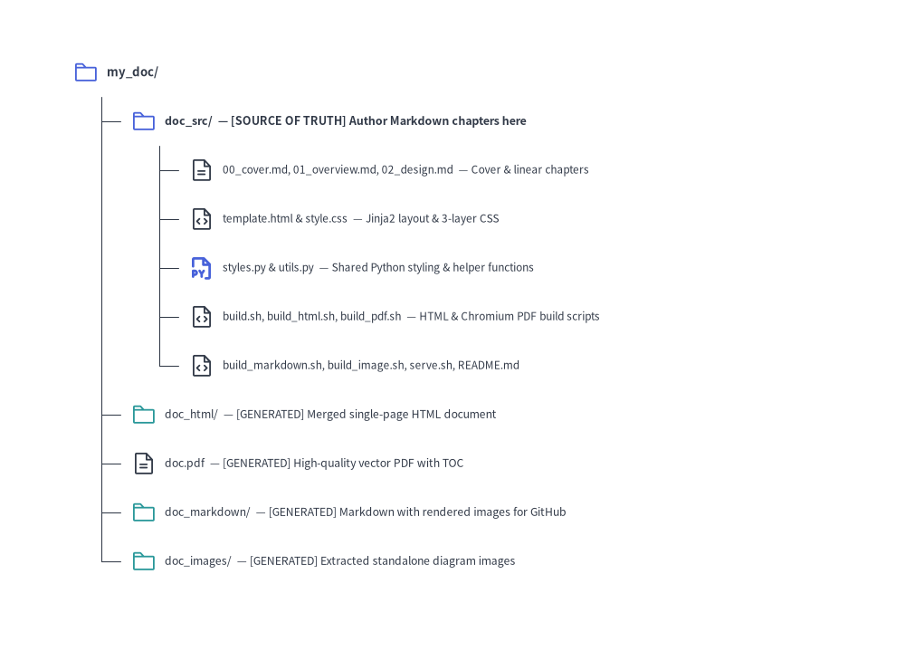

# Linear Document Project Guide (`drawlib init doc`)

The `doc` starter template is designed for authoring linear technical documents — such as specifications, Request for Comments (RFCs), system architecture proposals, whitepapers, thesis papers, and formal engineering reports.

By unifying single-page specs and multi-chapter reports into a single archetype, Drawlib allows you to compile **HTML, PDF, Markdown, and standalone images** from the same Markdown source files.

---

## 1. Project Initialization

Scaffold a linear document project using `drawlib init`:

```bash
# Scaffold standard doc project in current directory (creates 'doc_src/'):
drawlib init doc

# With custom target name, theme, and language (creates 'my_report_src/'):
drawlib init doc my_report -s google -l en
```

---

## 2. Directory Layout & Anatomy


<figure class="drawlib-image" style="text-align: center;">
  
  <figcaption class="drawlib-caption">Directory Structure of a Linear Document (doc) Project</figcaption>
</figure>

<details class="drawlib-code-details">
<summary>Source Code</summary>

```python
from drawlib.canvas import save, setup
from drawlib.icons import phosphor
from drawlib.smartarts import TreeNode
from drawlib.styles import Styles

setup(width=100, height=74)

TreeNode.register_drawing_item(
    name="folder",
    location="before",
    padding_width=3.8,
    function=phosphor.folder,
    style=Styles.PrimaryFlat,
    args={"width": 2.8},
)
TreeNode.register_drawing_item(
    name="folder_out",
    location="before",
    padding_width=3.8,
    function=phosphor.folder,
    style=Styles.Secondary,
    args={"width": 2.8},
)
TreeNode.register_drawing_item(
    name="md",
    location="before",
    padding_width=3.8,
    function=phosphor.file_text,
    style=Styles.Dark,
    args={"width": 2.8},
)
TreeNode.register_drawing_item(
    name="py",
    location="before",
    padding_width=3.8,
    function=phosphor.file_py,
    style=Styles.PrimaryBold,
    args={"width": 2.8},
)
TreeNode.register_drawing_item(
    name="code",
    location="before",
    padding_width=3.8,
    function=phosphor.file_code,
    style=Styles.Dark,
    args={"width": 2.8},
)

root = TreeNode(
    "my_doc/",
    text_style=Styles.DarkBold.patch(text_size=9.5),
    line_style=Styles.DarkThin,
    line_horizontal_margin=3.2,
    line_horizontal_length=3.2,
    line_vertical_margin=5.4,
).set_drawing_item("folder")

src = root.add(
    "doc_src/  — [SOURCE OF TRUTH] Author Markdown chapters here",
    text_style=Styles.DarkBold.patch(text_size=9.0),
).set_drawing_item("folder")
src.add(
    "00_cover.md, 01_overview.md, 02_design.md  — Cover & linear chapters",
    text_style=Styles.Dark.patch(text_size=8.5),
).set_drawing_item("md")
src.add(
    "template.html & style.css  — Jinja2 layout & 3-layer CSS",
    text_style=Styles.Dark.patch(text_size=8.5),
).set_drawing_item("code")
src.add(
    "styles.py & utils.py  — Shared Python styling & helper functions",
    text_style=Styles.Dark.patch(text_size=8.5),
).set_drawing_item("py")
src.add(
    "build.sh, build_html.sh, build_pdf.sh  — HTML & Chromium PDF build scripts",
    text_style=Styles.Dark.patch(text_size=8.5),
).set_drawing_item("code")
src.add(
    "build_markdown.sh, build_image.sh, serve.sh, README.md",
    text_style=Styles.Dark.patch(text_size=8.5),
).set_drawing_item("code")

root.add(
    "doc_html/  — [GENERATED] Merged single-page HTML document",
    text_style=Styles.Dark.patch(text_size=8.8),
).set_drawing_item("folder_out")
root.add(
    "doc.pdf  — [GENERATED] High-quality vector PDF with TOC",
    text_style=Styles.Dark.patch(text_size=8.8),
).set_drawing_item("md")
root.add(
    "doc_markdown/  — [GENERATED] Markdown with rendered images for GitHub",
    text_style=Styles.Dark.patch(text_size=8.8),
).set_drawing_item("folder_out")
root.add(
    "doc_images/  — [GENERATED] Extracted standalone diagram images",
    text_style=Styles.Dark.patch(text_size=8.8),
).set_drawing_item("folder_out")

root.draw(xy=(8, 66))
save()
```

</details>


---

## 3. Four Target Outputs from One Source

A `doc` project compiles into 4 distinct target artifacts:

| Output Target | Target Audience | Primary Use Case | Build Script |
| :--- | :--- | :--- | :--- |
| **`doc_html/`** | Web Browsers | Fast local preview, web publishing, internal documentation wikis | `build_html.sh` |
| **`doc.pdf`** | Print & Distribution | Formal whitepapers, client deliverables, printable reports with Table of Contents | `build_pdf.sh` |
| **`doc_markdown/`** | GitHub & Version Control | Direct viewing in GitHub/GitLab repositories with rendered image links | `build_markdown.sh` |
| **`doc_images/`** | Presentations & Messaging | Drag-and-drop into Google Slides, Keynote, PowerPoint, Slack, or PRs | `build_image.sh` |

---

## 4. Chapter Ordering, Cover Page & Table of Contents Mechanics

Because a `doc` project does not use a `navbar.md` sidebar file, Drawlib merges all `.md` files in `doc_src/` (excluding `README.md`) into a single linear document for both `doc_html/index.html` and `doc.pdf`:
1. **Lexicographical Chapter Sorting**: Name your chapter files with numeric prefixes (`00_cover.md`, `01_overview.md`, `02_design.md`, `03_benchmarks.md`) so they are merged in deterministic reading order.
2. **Cover Page Convention (`00_cover.md`)**: The first file in sorted order acts as the document cover page. When `--toc` (`--generate-index`) is passed to `drawlib build pdf`, the automated Table of Contents is inserted cleanly **between the 1st document (`00_cover.md`) and the 2nd document (`01_overview.md`)**.
3. **Chapter Page Breaks (`--page-break`)**: By default in PDF compilation (`--page-break`), each merged `.md` file begins on a new A4 page (`page-break-before: always`). Pass `--no-page-break` if you prefer continuous flow without forced page breaks between files.

---

## 5. Modular Build Scripts Architecture

Each project contains specialized scripts alongside a master orchestrator:

1. **`build_html.sh`**:
   Compiles and merges Markdown chapters into a standalone HTML document (`doc_html/index.html`). Extremely fast for local verification.
2. **`build_pdf.sh`**:
   Renders the merged document into an A4 vector PDF via headless Chromium (`page.pdf()`). Supports automatic Table of Contents (`--toc`) and clean chapter page breaks (`--page-break`).
3. **`build_markdown.sh`**:
   Converts inline ````drawlib```` blocks into standard Markdown image tags pointing to rendered diagrams in `doc_markdown/<chapter>_images/`.
4. **`build_image.sh`**:
   Scans all Markdown files, extracts embedded ````drawlib```` blocks, and renders them cleanly into `doc_images/<chapter>_images/` without risk of name collisions.
5. **`build.sh` (Master Script)**:
   Runs all of the above target builds in sequence to produce a complete set of release artifacts.

---

## 6. Direct CLI Commands

You can also run the build commands directly from the terminal:

```bash
# 1. Compile to HTML:
drawlib build html doc_src/ -o doc_html/

# 2. Compile to PDF with Cover and Table of Contents:
drawlib build pdf doc_src/ -o doc.pdf --toc --page-break

# 3. Compile to GitHub-ready Markdown:
drawlib build markdown doc_src/ -o doc_markdown/

# 4. Extract diagram images from Markdown:
drawlib build image doc_src/ -o doc_images/
```
