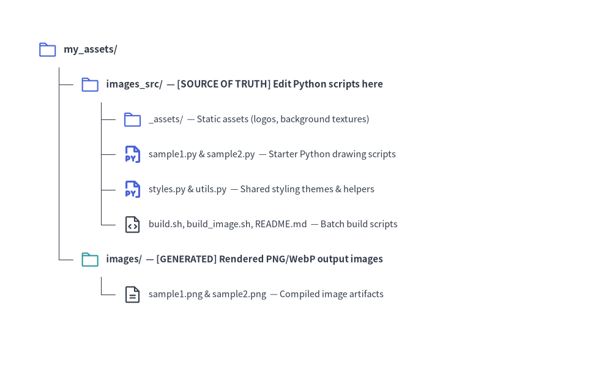
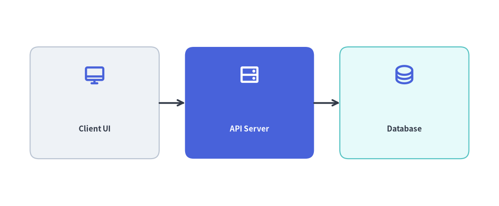

# Images Project Guide (`drawlib init images`)

The `images` starter template (CLI alias: `image`) is designed for generating standalone illustration assets, presentation diagrams, article hero banners, and social preview cards directly from batch Python scripts.

Each project separates editable Python source scripts (`images_src/`) from generated image artifacts (`images/`):


<figure class="drawlib-image" style="text-align: center;">
  
  <figcaption class="drawlib-caption">Directory Structure of a Standalone Batch Image (images) Project</figcaption>
</figure>

<details class="drawlib-code-details">
<summary>Source Code</summary>

```python
from drawlib.canvas import save, setup
from drawlib.icons import phosphor
from drawlib.smartarts import TreeNode
from drawlib.styles import Styles

setup(width=98, height=62)

TreeNode.register_drawing_item(
    name="folder",
    location="before",
    padding_width=4.2,
    function=phosphor.folder,
    style=Styles.PrimaryFlat,
    args={"width": 3.2},
)
TreeNode.register_drawing_item(
    name="folder_out",
    location="before",
    padding_width=4.2,
    function=phosphor.folder,
    style=Styles.Secondary,
    args={"width": 3.2},
)
TreeNode.register_drawing_item(
    name="py",
    location="before",
    padding_width=4.2,
    function=phosphor.file_py,
    style=Styles.PrimaryBold,
    args={"width": 3.2},
)
TreeNode.register_drawing_item(
    name="code",
    location="before",
    padding_width=4.2,
    function=phosphor.file_code,
    style=Styles.Dark,
    args={"width": 3.2},
)
TreeNode.register_drawing_item(
    name="img",
    location="before",
    padding_width=4.2,
    function=phosphor.file_text,
    style=Styles.Dark,
    args={"width": 3.2},
)

root = TreeNode(
    "my_assets/",
    text_style=Styles.DarkBold.patch(text_size=11.5),
    line_style=Styles.DarkThin,
    line_horizontal_margin=3.4,
    line_horizontal_length=3.4,
    line_vertical_margin=5.6,
).set_drawing_item("folder")

src = root.add(
    "images_src/  — [SOURCE OF TRUTH] Edit Python scripts here",
    text_style=Styles.DarkBold.patch(text_size=11.0),
).set_drawing_item("folder")
src.add(
    "_assets/  — Static assets (logos, background textures)",
    text_style=Styles.Dark.patch(text_size=10.5),
).set_drawing_item("folder")
src.add(
    "sample1.py & sample2.py  — Starter Python drawing scripts",
    text_style=Styles.Dark.patch(text_size=10.5),
).set_drawing_item("py")
src.add(
    "styles.py & utils.py  — Shared styling themes & helpers",
    text_style=Styles.Dark.patch(text_size=10.5),
).set_drawing_item("py")
src.add(
    "build.sh, build_image.sh, README.md  — Batch build scripts",
    text_style=Styles.Dark.patch(text_size=10.5),
).set_drawing_item("code")

out = root.add(
    "images/  — [GENERATED] Rendered PNG/WebP output images",
    text_style=Styles.DarkBold.patch(text_size=10.8),
).set_drawing_item("folder_out")
out.add(
    "sample1.png & sample2.png  — Compiled image artifacts",
    text_style=Styles.Dark.patch(text_size=10.5),
).set_drawing_item("img")

root.draw(xy=(6, 54))
save()
```

</details>


---

## 1. Project Initialization

Scaffold a new images project using `drawlib init`:

```bash
# Scaffold standard images project in current directory (creates 'images_src/'):
drawlib init images

# Or with custom target name, theme, and language (creates 'my_assets_src/'):
drawlib init images my_assets -s google -l en
```

---

## 2. Directory Layout & Anatomy

### Key Rules:
- **Source of Truth**: Always author drawing scripts in `images_src/`. After scaffolding, replace or remove the starter `sample1.py` and `sample2.py` files so only your desired diagrams are built.
- **Never Edit `images/`**: The `images/` folder is an output artifact directory overwritten during builds.

---

## 3. Writing Drawing Scripts

In an `images` project, each `.py` file inside `images_src/` is an independent drawing script. Call `save()` at the end of the script to output the image:


```python
# images_src/architecture_overview.py
from drawlib.canvas import save, setup
from drawlib.icons import phosphor
from drawlib.lines import line
from drawlib.shapes import rectangle
from drawlib.styles import Styles
from drawlib.text import text

setup(width=116, height=48)

# Draw components (50%+ neutral baseline + 1 primary focal point)
rectangle((22, 24), width=30, height=26, style=Styles.Neutral.patch(shape_r=2.0))
phosphor.desktop((22, 30.5), width=5.2, style=Styles.PrimaryBold)
text((22, 18.0), "Client UI", style=Styles.DarkBold.patch(text_size=11.0))

rectangle((58, 24), width=30, height=26, style=Styles.PrimaryFlat.patch(shape_r=2.0))
phosphor.hard_drives((58, 30.5), width=5.2, style=Styles.WhiteBold)
text((58, 18.0), "API Server", style=Styles.WhiteBold.patch(text_size=11.0))

rectangle((94, 24), width=30, height=26, style=Styles.SecondaryNeutral.patch(shape_r=2.0))
phosphor.database((94, 30.5), width=5.2, style=Styles.PrimaryBold)
text((94, 18.0), "Database", style=Styles.DarkBold.patch(text_size=11.0))

line((37, 24), (43, 24), arrow_head="->", style=Styles.DarkBold)
line((73, 24), (79, 24), arrow_head="->", style=Styles.DarkBold)

# Save image (defaults to <script_stem>.png or save("architecture_overview.png") in scripts)
save()
```

<figure class="drawlib-image" style="text-align: center;">
  
  <figcaption class="drawlib-caption">Rendered Output of images_src/architecture_overview.py</figcaption>
</figure>


### How `save()` Interacts with `drawlib build image -o images/`:
- **Automatic Output Redirection**: When executed via `drawlib build image images_src/ -o images/`, relative paths passed to `save("architecture_overview.png")` (or `save()` with no filename, which defaults to `<script_stem>.png`) are automatically written inside the `-o images/` directory, preserving any nested subdirectory hierarchy under `images_src/`.
- **Pre-Execution AST Duplicate Collision Check**: Before running any scripts in a batch, Drawlib parses the Python AST of all target `.py` files to inspect their `save(...)` targets. If two scripts would write to the exact same output file path, the build aborts immediately before modifying disk state.

---

## 4. Building Images

### Automated Build (`./build_image.sh` or `./build.sh`)
Execute the provided build script:

```bash
./images_src/build.sh
```

### Direct CLI Command
Alternatively, invoke the builder directly:

```bash
drawlib build image images_src/ -o images/ -s images_src/styles.py -u images_src/utils.py
```

### Useful Build Flags:
- `--grid` (`-g`): Automatically generates companion `*_grid.png` images overlaid with coordinate grid lines for visual debugging.
- `-f webp`: Overrides output format across all scripts to modern WebP.
- `--no-cache`: Forces a clean re-render of all images, bypassing the SQLite hash cache (`.drawlib/cache.db`).
