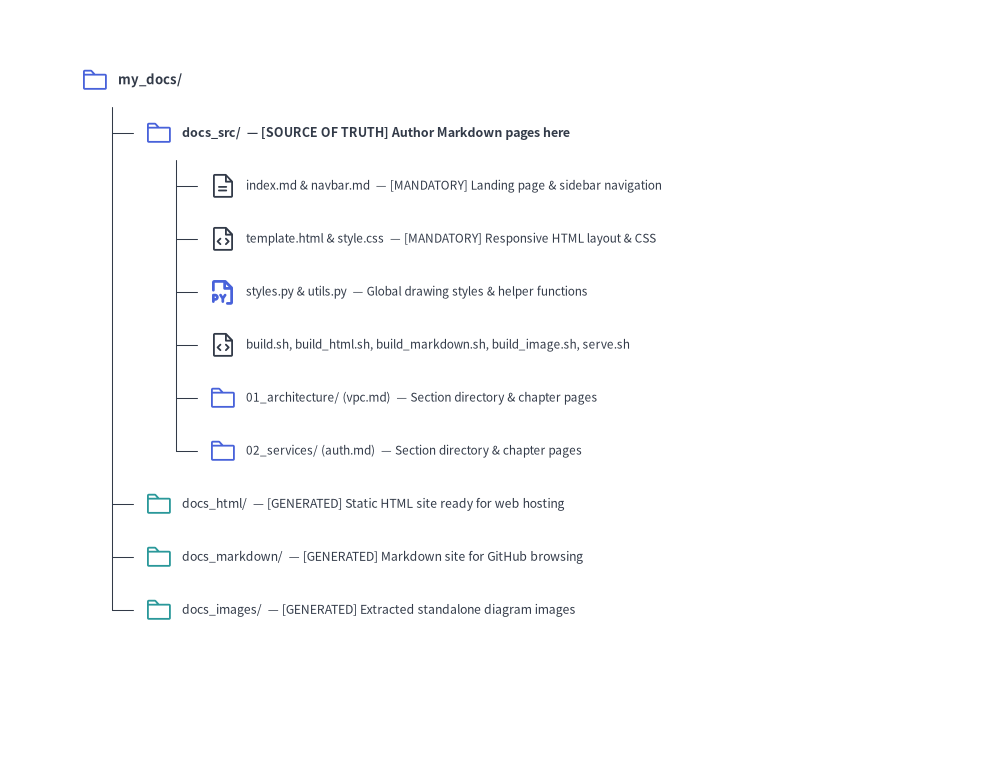

# Site Project Guide (`drawlib init site`)

The `site` starter template builds a responsive multi-page technical documentation website with hierarchical sidebar navigation, mobile-responsive layout, syntax highlighting, and dual publishing to static HTML and GitHub-ready Markdown.

---

## 1. Project Initialization

Scaffold a documentation website using `drawlib init`:

```bash
# Scaffold default 'docs_src/' in the current directory:
drawlib init site

# Or specify a custom target prefix (creates 'my_docs_src/', 'my_docs_html/', etc.):
drawlib init site my_docs --style google --lang en
```

---

## 2. Directory Layout & Architecture


<figure class="drawlib-image" style="text-align: center;">
  
  <figcaption class="drawlib-caption">Directory Structure of a Multi-Page Documentation Website (site) Project</figcaption>
</figure>

<details class="drawlib-code-details">
<summary>Source Code</summary>

```python
from drawlib.canvas import save, setup
from drawlib.icons import phosphor
from drawlib.smartarts import TreeNode
from drawlib.styles import Styles

setup(width=100, height=78)

TreeNode.register_drawing_item(
    name="folder",
    location="before",
    padding_width=3.8,
    function=phosphor.folder,
    style=Styles.PrimaryFlat,
    args={"width": 2.8},
)
TreeNode.register_drawing_item(
    name="folder_out",
    location="before",
    padding_width=3.8,
    function=phosphor.folder,
    style=Styles.Secondary,
    args={"width": 2.8},
)
TreeNode.register_drawing_item(
    name="md",
    location="before",
    padding_width=3.8,
    function=phosphor.file_text,
    style=Styles.Dark,
    args={"width": 2.8},
)
TreeNode.register_drawing_item(
    name="py",
    location="before",
    padding_width=3.8,
    function=phosphor.file_py,
    style=Styles.PrimaryBold,
    args={"width": 2.8},
)
TreeNode.register_drawing_item(
    name="code",
    location="before",
    padding_width=3.8,
    function=phosphor.file_code,
    style=Styles.Dark,
    args={"width": 2.8},
)

root = TreeNode(
    "my_docs/",
    text_style=Styles.DarkBold.patch(text_size=9.5),
    line_style=Styles.DarkThin,
    line_horizontal_margin=3.2,
    line_horizontal_length=3.2,
    line_vertical_margin=5.3,
).set_drawing_item("folder")

src = root.add(
    "docs_src/  — [SOURCE OF TRUTH] Author Markdown pages here",
    text_style=Styles.DarkBold.patch(text_size=9.0),
).set_drawing_item("folder")
src.add(
    "index.md & navbar.md  — [MANDATORY] Landing page & sidebar navigation",
    text_style=Styles.Dark.patch(text_size=8.5),
).set_drawing_item("md")
src.add(
    "template.html & style.css  — [MANDATORY] Responsive HTML layout & CSS",
    text_style=Styles.Dark.patch(text_size=8.5),
).set_drawing_item("code")
src.add(
    "styles.py & utils.py  — Global drawing styles & helper functions",
    text_style=Styles.Dark.patch(text_size=8.5),
).set_drawing_item("py")
src.add(
    "build.sh, build_html.sh, build_markdown.sh, build_image.sh, serve.sh",
    text_style=Styles.Dark.patch(text_size=8.5),
).set_drawing_item("code")
src.add(
    "01_architecture/ (vpc.md)  — Section directory & chapter pages",
    text_style=Styles.Dark.patch(text_size=8.5),
).set_drawing_item("folder")
src.add(
    "02_services/ (auth.md)  — Section directory & chapter pages",
    text_style=Styles.Dark.patch(text_size=8.5),
).set_drawing_item("folder")

root.add(
    "docs_html/  — [GENERATED] Static HTML site ready for web hosting",
    text_style=Styles.Dark.patch(text_size=8.8),
).set_drawing_item("folder_out")
root.add(
    "docs_markdown/  — [GENERATED] Markdown site for GitHub browsing",
    text_style=Styles.Dark.patch(text_size=8.8),
).set_drawing_item("folder_out")
root.add(
    "docs_images/  — [GENERATED] Extracted standalone diagram images",
    text_style=Styles.Dark.patch(text_size=8.8),
).set_drawing_item("folder_out")

root.draw(xy=(8, 70))
save()
```

</details>


---

## 3. Sidebar Navigation (`navbar.md`)

The sidebar navigation structure is governed entirely by `docs_src/navbar.md`:

```markdown
# Drawlib Documentation

- [Home](index.md)

## Core Infrastructure
- [VPC Architecture](01_architecture/vpc.md)
- [Storage Tier](01_architecture/storage.md)

## Microservices
- [Authentication Gateway](02_services/auth.md)
- [Payment Service](02_services/payments.md)

## External Resources
- [GitHub Repository](https://github.com/example/repo)
```

### Authoring Rules:
1. **Brand Header (`# Title`)**: The top level `# Heading 1` sets the brand title in the sidebar header.
2. **Category Groupings (`## Category`)**: Each `## Heading 2` defines a collapsible navigation category section.
3. **Internal Document Links**: Relative paths must point to existing Markdown files within `docs_src/`.
4. **External Links**: URLs beginning with `http://` or `https://` automatically open in a new tab (`target="_blank"`) with an external link indicator.
5. **Strict Build-Time Validation**: If any linked document does not exist, the build immediately aborts with an error indicating the file and line number.
6. **Active Page Tracking**: The currently viewed page is automatically highlighted (`.nav-item.active`) with dynamic relative path resolution.

---

## 4. Static Asset Synchronization

Any static assets placed in `docs_src/` (such as custom logos, sample data files, or images in `_assets/`) are recursively mirrored to `docs_html/` and `docs/`, preserving folder hierarchies.

---

## 5. Building & Local Preview

### Compile Site
```bash
./docs_src/build_html.sh       # Compile HTML site (docs_html/)
./docs_src/build_markdown.sh   # Compile Markdown site (docs_markdown/ or docs/)
./docs_src/build_image.sh      # Extract standalone images (docs_images/)
./docs_src/build.sh            # Run all builds sequentially
```

### Local Preview Server & Link Audit
Start the local development server to preview pages:

```bash
uv run drawlib serve docs_html/
```

Before deploying to production, run a headless pre-flight audit:

```bash
uv run drawlib serve docs_html/ --check
```
