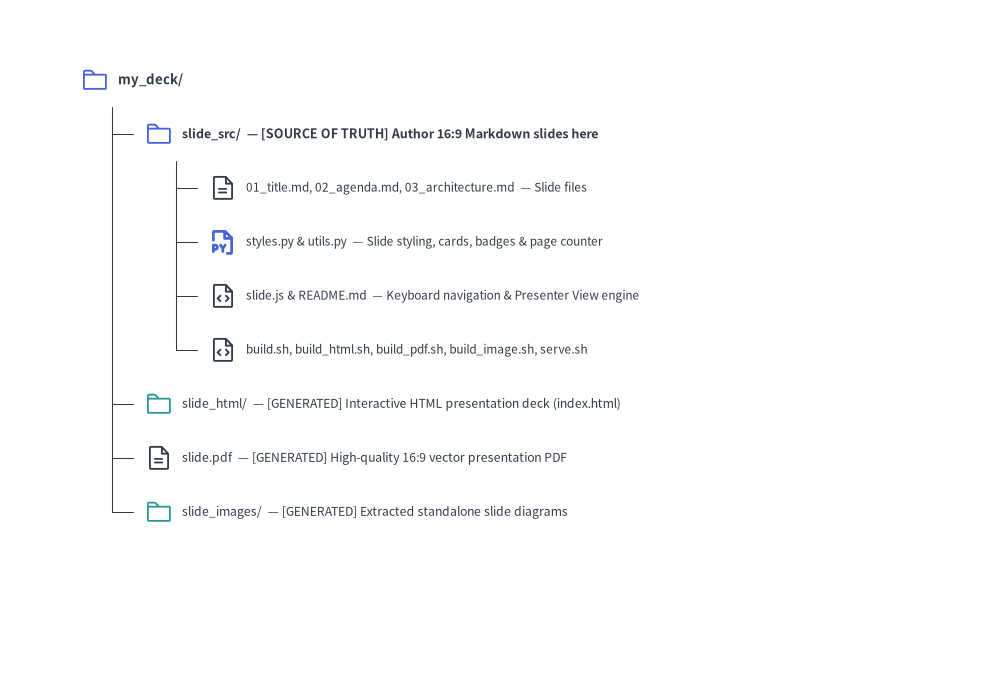

# Slide Deck Project Guide (`drawlib init slide`)

The `slide` starter template creates 16:9 presentation slide decks with rich architectural diagrams, metrics cards, badges, and structured layouts.

Drawlib compiles your slide deck into both an **interactive HTML web presentation** and a **1-slide-per-page vector PDF**, perfectly sized for conferences, client briefings, and team reviews.

---

## 1. Project Initialization

Scaffold a presentation project using `drawlib init`:

```bash
# Scaffold standard slide project in current directory (creates 'slide_src/'):
drawlib init slide

# With custom target name, theme, and language (creates 'my_deck_src/'):
drawlib init slide my_deck -s google -l en
```

---

## 2. Directory Layout & Anatomy


<figure class="drawlib-image" style="text-align: center;">
  
  <figcaption class="drawlib-caption">Directory Structure of a 16:9 Presentation Slide Deck (slide) Project</figcaption>
</figure>

<details class="drawlib-code-details">
<summary>Source Code</summary>

```python
from drawlib.canvas import save, setup
from drawlib.icons import phosphor
from drawlib.smartarts import TreeNode
from drawlib.styles import Styles

setup(width=100, height=68)

TreeNode.register_drawing_item(
    name="folder",
    location="before",
    padding_width=3.8,
    function=phosphor.folder,
    style=Styles.PrimaryFlat,
    args={"width": 2.8},
)
TreeNode.register_drawing_item(
    name="folder_out",
    location="before",
    padding_width=3.8,
    function=phosphor.folder,
    style=Styles.Secondary,
    args={"width": 2.8},
)
TreeNode.register_drawing_item(
    name="md",
    location="before",
    padding_width=3.8,
    function=phosphor.file_text,
    style=Styles.Dark,
    args={"width": 2.8},
)
TreeNode.register_drawing_item(
    name="py",
    location="before",
    padding_width=3.8,
    function=phosphor.file_py,
    style=Styles.PrimaryBold,
    args={"width": 2.8},
)
TreeNode.register_drawing_item(
    name="code",
    location="before",
    padding_width=3.8,
    function=phosphor.file_code,
    style=Styles.Dark,
    args={"width": 2.8},
)

root = TreeNode(
    "my_deck/",
    text_style=Styles.DarkBold.patch(text_size=9.5),
    line_style=Styles.DarkThin,
    line_horizontal_margin=3.2,
    line_horizontal_length=3.2,
    line_vertical_margin=5.4,
).set_drawing_item("folder")

src = root.add(
    "slide_src/  — [SOURCE OF TRUTH] Author 16:9 Markdown slides here",
    text_style=Styles.DarkBold.patch(text_size=9.0),
).set_drawing_item("folder")
src.add(
    "01_title.md, 02_agenda.md, 03_architecture.md  — Slide files",
    text_style=Styles.Dark.patch(text_size=8.5),
).set_drawing_item("md")
src.add(
    "styles.py & utils.py  — Slide styling, cards, badges & page counter",
    text_style=Styles.Dark.patch(text_size=8.5),
).set_drawing_item("py")
src.add(
    "slide.js & README.md  — Keyboard navigation & Presenter View engine",
    text_style=Styles.Dark.patch(text_size=8.5),
).set_drawing_item("code")
src.add(
    "build.sh, build_html.sh, build_pdf.sh, build_image.sh, serve.sh",
    text_style=Styles.Dark.patch(text_size=8.5),
).set_drawing_item("code")

root.add(
    "slide_html/  — [GENERATED] Interactive HTML presentation deck (index.html)",
    text_style=Styles.Dark.patch(text_size=8.8),
).set_drawing_item("folder_out")
root.add(
    "slide.pdf  — [GENERATED] High-quality 16:9 vector presentation PDF",
    text_style=Styles.Dark.patch(text_size=8.8),
).set_drawing_item("md")
root.add(
    "slide_images/  — [GENERATED] Extracted standalone slide diagrams",
    text_style=Styles.Dark.patch(text_size=8.8),
).set_drawing_item("folder_out")

root.draw(xy=(8, 60))
save()
```

</details>


---

## 3. Multiple Presentation Outputs

A `slide` project produces presentation artifacts tailored for every scenario:

| Output | Audience & Environment | Key Features | Build Script |
| :--- | :--- | :--- | :--- |
| **`slide_html/index.html`** | Interactive Presenting | 1920x1080 fixed stage, auto-scaling viewport, keyboard navigation (`Space`, `Arrows`, `F`), overview grid | `build_html.sh` |
| **`slide.pdf`** | Offline Distribution | 1 slide per page, vector-sharp graphics, exact 16:9 aspect ratio (`@page { size: 1920px 1080px; margin: 0; }`) | `build_pdf.sh` |
| **`slide_images/`** | Slides & Social Media | Extracted standalone slide illustrations for external decks and sharing | `build_image.sh` |

---

## 4. Authoring Slides & Stage Blocks

Each Markdown file in `slide_src/` represents a single 16:9 slide (`1920x1080` stage). Use `::: block (x, y) (w, h)` containers alongside standard Markdown and helper components from `utils.py` (see [Slide Stage Layout & API](./slide_layout_and_api.md) for the complete stage coordinate reference, layout templates, and `drawlib.slide` API):

````markdown
::: block (80, 40) (1760, 60)
# Architecture Overview
:::

::: block (80, 140) (1760, 840)
```drawlib file:arch_flow.svg
from drawlib.canvas import clear, save, setup
from drawlib.shapes import rectangle
from drawlib.lines import line
from drawlib.styles import Styles

clear()
setup(width=176, height=84)
rectangle((35, 42), width=38, height=22, style=Styles.Neutral, text="Producer")
rectangle((88, 42), width=38, height=22, style=Styles.PrimaryFlat, text="Kafka", text_style=Styles.WhiteBold)
rectangle((141, 42), width=38, height=22, style=Styles.SecondaryNeutral, text="Consumer")
line((54, 42), (69, 42), arrow_head="->", style=Styles.DarkBold)
line((107, 42), (122, 42), arrow_head="->", style=Styles.DarkBold)
save()
```
:::
````

---

## 5. Modular Build Scripts Architecture

- **`build_html.sh`**:
  Compiles slides into the web presentation deck in `slide_html/index.html`.
- **`build_pdf.sh`**:
  Uses headless Chromium to capture each slide into a multi-page vector PDF (`slide.pdf`).
- **`build_image.sh`**:
  Extracts embedded ````drawlib```` blocks into standalone diagram images in `slide_images/`.
- **`build.sh` (Master Script)**:
  Runs HTML, PDF, and Image builds in sequence.

---

## 6. Local Preview & Presenting

Launch the local development preview server:

```bash
./slide_src/serve.sh
```

Or run directly:

```bash
uv run drawlib serve slide_html/
```

### Keyboard Shortcuts & URL Deep-Linking:
- **`→` / `Space` / `PageDown`**: Next slide
- **`←` / `PageUp`**: Previous slide
- **`F`**: Toggle full screen
- **`O` / `Esc`**: Toggle slide overview grid
- **`P` / `S`**: Open **Presenter View** in a synchronized companion window
- **`A`**: Play / pause / resume animation on the current slide
- **URL Hash Deep-Linking (`#1`, `#2`, ...)**: Navigating to `index.html#4` jumps directly to Slide 4, and advancing slides updates the URL hash in real time for bookmarking and sharing.
- **Direct Presenter URL (`?presenter=1`)**: Appending `?presenter=1#1` launches the window directly in Presenter View mode, synchronizing slide changes and animation playback across windows via `BroadcastChannel` / `localStorage`.

### Speaker Notes (`::: note`) & Presenter View:
Add speaker notes to any slide using `::: note` (or `::: notes`) blocks. If a slide contains multiple `::: note` blocks, they are automatically joined with a blank line (`\n\n`) and rendered as Markdown in **Presenter View** (while remaining completely hidden on the main presentation screen and in PDF exports):

```markdown
::: note
**Key Talking Points**:
- Emphasize single source of truth in Git.
- Click **Play Animation** (or press `A`) to step through the pipeline.
:::
```

Pressing **`P`** or **`S`** (or clicking the `🗒` button in the bottom-right control bar) opens **Presenter View** (`?presenter=1`), featuring:
- **Left Column**: Vertical scrollable list of live slide thumbnails for instant jumping.
- **Right Top**: Live 16:9 preview of the current slide.
- **Right Middle (Control Bar)**: `◀ Prev` / `Next ▶` navigation, **`▶ Play Animation` button** (synchronized with the main window; automatically disabled/grayed out on slides without animations), and an elapsed presentation timer (`00:00`).
- **Right Bottom (Speaker Notes)**: Compiled speaker notes with `A-` / `A+` font-size controls.

### Interactive Animation Playback (`anim-trigger`, `anim-loop`, `anim-pause`):
When embedding APNG (`.png` / `.apng`) or Animated WebP (`.webp`) diagrams inside slides, you can attach playback control attributes to the ````drawlib```` code fence:

````markdown
```drawlib file:workflow.webp anim-trigger:click anim-loop:once anim-pause:2,4
```
````

- **`anim-trigger:click`** (`auto` | `click`): Holds on Frame 0 until clicked by the presenter.
- **`anim-loop:once`** (`once` | `infinite`): Stops on the final frame (`ENDED`); clicking again replays from Frame 0.
- **`anim-pause:2,4`**: Pauses at 0-based frame indices `2` and `4` (`PAUSED`); clicking resumes to the next step.
- **Vector PDF Export (`build_pdf.sh`)**: Automatically renders Frame 0 onto the slide without the interactive play badge.

