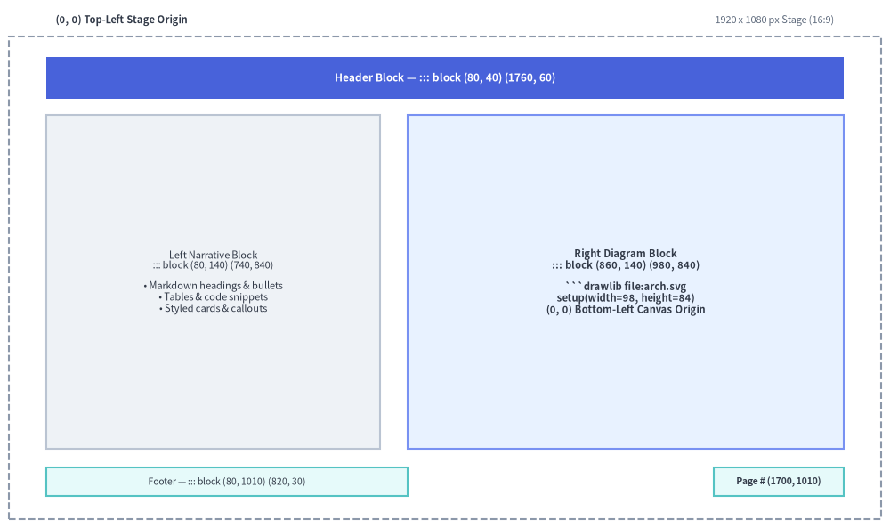
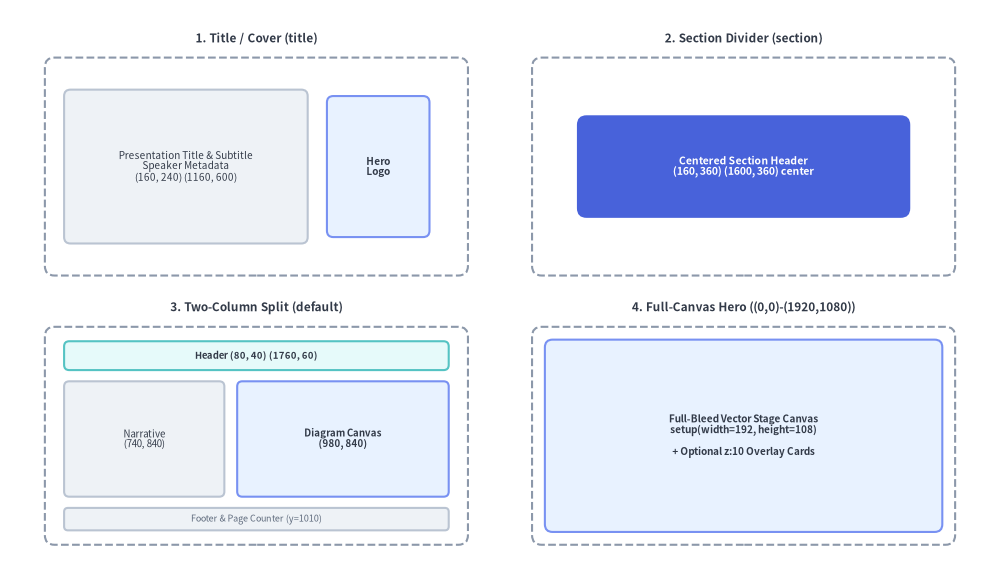

# Slide Stage Layout & API

When authoring 16:9 widescreen presentation decks (`drawlib init slide`), Drawlib provides a precision **1920 × 1080 pixel virtual stage** (`::: block`, `::: note`), built-in layout patterns, inline vector SVG font bundling, and the programmatic [`drawlib.slide`](../09_ai_agents_and_advanced/programmatic_api.md) Python runtime API (`current_slide`, `SlideContext`, `BoundingBox`, `build_slide`).

*(For initializing and building a slide deck project, see [Slide Deck Project Guide](./project_slide.md).)*

---

## 1. Dual Coordinate Systems: 1920×1080 Stage vs. Drawlib Canvas

Two coordinate systems work together on every slide:

1. **Slide Stage (`::: block (x, y) (w, h)`) — Top-Left Origin `(0, 0)`**:
   - Every slide renders on a fixed **1920 × 1080 pixel** widescreen stage (16:9 aspect ratio) that automatically scales to fit the browser viewport or PDF page.
   - Container blocks (`::: block`) are positioned in CSS stage pixels where **`(0, 0)` is the top-left corner**:
     - `x` increases rightward (`0` → `1920`).
     - `y` increases downward (`0` → `1080`).
   - **Standard Safe Content Zone**: Keep primary text and diagrams inside `x: 80..1840` (`w: 1760`) and `y: 140..980` (`h: 840`), reserving `y: 40..100` for the slide header and `y: 1010..1040` for the footer and page counter.
2. **Drawlib Canvas (````drawlib```` Python block) — Bottom-Left Origin `(0, 0)`**:
   - Inside any ````drawlib```` code block, `setup(width=W, height=H)` defines a mathematical Cartesian canvas where **`(0, 0)` is the bottom-left corner**:
     - `x` increases rightward (`0` → `W`).
     - `y` increases upward (`0` → `H`).


<figure class="drawlib-image" style="text-align: center;">
  
  <figcaption class="drawlib-caption">1920x1080 Virtual Slide Stage Zones and ::: block (x, y) (w, h) Layout Grid</figcaption>
</figure>

<details class="drawlib-code-details">
<summary>Source Code</summary>

```python
from drawlib.canvas import save, setup
from drawlib.shapes import rectangle
from drawlib.styles import Styles
from drawlib.text import text

setup(width=192, height=114)

# Outer 1920x1080 Stage Frame (mapped 1:10 to 192x108)
rectangle((96, 54), width=188, height=104, style=Styles.MutedDashed)
text((12, 109.5), "(0, 0) Top-Left Stage Origin", style=Styles.DarkBold.patch(text_size=8.0, halign="left"))
text((180, 109.5), "1920 x 1080 px Stage (16:9)", style=Styles.Muted.patch(text_size=8.0, halign="right"))

# Header Zone: ::: block (80, 40) (1760, 60)
rectangle(
    (96, 97),
    width=172,
    height=9,
    style=Styles.PrimaryFlat,
    text="Header Block — ::: block (80, 40) (1760, 60)",
    text_style=Styles.WhiteBold.patch(text_size=8.5),
)

# Left Narrative Column: ::: block (80, 140) (740, 840)
rectangle(
    (46, 53),
    width=72,
    height=72,
    style=Styles.Neutral,
    text="Left Narrative Block\n::: block (80, 140) (740, 840)\n\n• Markdown headings & bullets\n• Tables & code snippets\n• Styled cards & callouts",
    text_style=Styles.Dark.patch(text_size=8.0),
)

# Right Diagram Column: ::: block (860, 140) (980, 840)
rectangle(
    (135, 53),
    width=94,
    height=72,
    style=Styles.PrimaryNeutral,
    text="Right Diagram Block\n::: block (860, 140) (980, 840)\n\n```drawlib file:arch.svg\nsetup(width=98, height=84)\n(0, 0) Bottom-Left Canvas Origin",
    text_style=Styles.DarkBold.patch(text_size=8.0),
)

# Footer & Page Counter Blocks
rectangle(
    (49, 10),
    width=78,
    height=6,
    style=Styles.SecondaryNeutral,
    text="Footer — ::: block (80, 1010) (820, 30)",
    text_style=Styles.Dark.patch(text_size=7.5),
)
rectangle(
    (168, 10),
    width=28,
    height=6,
    style=Styles.SecondaryNeutral,
    text="Page # (1700, 1010)",
    text_style=Styles.DarkBold.patch(text_size=7.5),
)

save()
```

</details>


### 1.1. Golden Rule: Match `setup(width, height)` Aspect Ratio to Block `(w, h)`
Always set `setup(width=W, height=H)` proportional to the enclosing `::: block (x, y) (w, h)` pixel dimensions (typically dividing pixel width and height by `10` or `20`):

| Enclosing `::: block` Size `(w, h)` | Recommended `setup(width, height)` | Aspect Ratio |
| :--- | :--- | :--- |
| `(980, 840)` *(Right diagram column)* | `setup(width=98, height=84)` | `98 : 84` |
| `(1020, 840)` *(Wide right column)* | `setup(width=102, height=84)` | `102 : 84` |
| `(1760, 840)` *(Full-width content area)* | `setup(width=176, height=84)` | `176 : 84` |
| `(980, 1080)` *(Right half full-bleed)* | `setup(width=98, height=108)` | `98 : 108` |
| `(1920, 1080)` *(Full-canvas hero slide)* | `setup(width=192, height=108)` | `16 : 9` |

---

## 2. Stage Container Block Syntax (`::: block` & `::: note`)

Slide Markdown files use pure Markdown without YAML frontmatter (`---`). Every visual element on a slide is placed inside one or more `::: block` (or alias `::: box`) containers:

````markdown
::: block (x, y) (w, h) [options...]
<Markdown content or ```drawlib code fence>
:::
````

If a slide file contains no `::: block` tags at all, Drawlib automatically wraps the slide content in the default content zone `::: block (80, 140) (1760, 840)`. Similarly, if `(x, y)` or `(w, h)` are omitted on a `::: block` header, they default to `(80, 140)` and `(1760, 840)`.

### 2.1. Complete `::: block` Options Reference

| Option Token | Syntax Examples | Compiled CSS / Behavior |
| :--- | :--- | :--- |
| **Position `(x, y)`** | `(80, 140)`, `(0, 0)` | `position: absolute; left: 80px; top: 140px;` |
| **Dimensions `(w, h)`** | `(740, 840)`, `(1920, 1080)` | `width: 740px; height: 840px;` |
| **Font Size** | `font:22px`, `font-size:20px`, `fontsize:1.2rem`, `fs:18`, or bare `20px` | `font-size: 22px;` (bare numbers automatically append `px`). |
| **Compact Density** | `compact` | Adds `.compact` class to `<div class="slide-block slide-text-box compact">` for tighter line-height and list spacing. |
| **Text Alignment** | `left`, `center`, `right`, or `align:center` | `text-align: center;` |
| **Layer Depth (`z-index`)** | `z:5`, `z-index:10`, `z_index:1` | `z-index: 5;` — controls foreground/background stacking when blocks overlap. |
| **Custom CSS Classes** | `class:"card panel accent border shadow"` | Appends custom utility or theme classes (`card`, `panel`, `accent`, `transparent`, `border`, `shadow`, `middle`, etc.) to the container `<div>`. |
| **Inline CSS Styles** | `style:"padding: 24px; background: #f8fafc; border-radius: 12px"` | Appends custom inline CSS rules (`padding`, `background`, `border`, etc.) to the container `<div>`. |

*(Both `key:value` and `key=value` syntaxes are supported for keyed options.)*

### 2.2. Speaker Notes (`::: note` / `::: notes`)

Add presenter notes anywhere inside a slide Markdown file using `::: note` (or `::: notes`). Speaker notes are stripped from the visible slide stage and compiled into `<aside class="slide-notes" hidden>` for the synchronized dual-window **Presenter View** (`P` or `S` key):

````markdown
::: note
- Emphasize that **SQLite hash caching** restores unchanged diagrams in **< 1ms**.
- Press `A` or click **Play Animation** to step through the pipeline animation.
:::
````

---

## 3. Built-In Slide Layout Patterns & Templates


<figure class="drawlib-image" style="text-align: center;">
  
  <figcaption class="drawlib-caption">Visual Comparison of the Four Built-In 16:9 Slide Layout Templates</figcaption>
</figure>

<details class="drawlib-code-details">
<summary>Source Code</summary>

```python
from drawlib.canvas import save, setup
from drawlib.shapes import rectangle
from drawlib.styles import Styles
from drawlib.text import text

setup(width=156, height=88)

# 1. Top-Left: Title / Cover Slide (title)
text((40, 82), "1. Title / Cover (title)", style=Styles.DarkBold.patch(text_size=8.5))
rectangle((40, 62), width=66, height=34, style=Styles.MutedDashed.patch(shape_r=1.5))
rectangle(
    (29, 62),
    width=38,
    height=24,
    style=Styles.Neutral.patch(shape_r=1.0),
    text="Presentation Title & Subtitle\nSpeaker Metadata\n(160, 240) (1160, 600)",
    text_style=Styles.Dark.patch(text_size=7.2),
)
rectangle(
    (59, 62),
    width=16,
    height=22,
    style=Styles.PrimaryNeutral.patch(shape_r=1.0),
    text="Hero\nLogo",
    text_style=Styles.DarkBold.patch(text_size=7.2),
)

# 2. Top-Right: Section Divider / Closing (section)
text((116, 82), "2. Section Divider (section)", style=Styles.DarkBold.patch(text_size=8.5))
rectangle((116, 62), width=66, height=34, style=Styles.MutedDashed.patch(shape_r=1.5))
rectangle(
    (116, 62),
    width=52,
    height=16,
    style=Styles.PrimaryFlat.patch(shape_r=1.5),
    text="Centered Section Header\n(160, 360) (1600, 360) center",
    text_style=Styles.WhiteBold.patch(text_size=7.5),
)

# 3. Bottom-Left: Two-Column Split (default)
text((40, 40), "3. Two-Column Split (default)", style=Styles.DarkBold.patch(text_size=8.5))
rectangle((40, 20), width=66, height=34, style=Styles.MutedDashed.patch(shape_r=1.5))
rectangle(
    (40, 32.5),
    width=60,
    height=4.5,
    style=Styles.SecondaryNeutral.patch(shape_r=0.8),
    text="Header (80, 40) (1760, 60)",
    text_style=Styles.DarkBold.patch(text_size=6.8),
)
rectangle(
    (22.5, 19.5),
    width=25,
    height=18,
    style=Styles.Neutral.patch(shape_r=0.8),
    text="Narrative\n(740, 840)",
    text_style=Styles.Dark.patch(text_size=7.0),
)
rectangle(
    (53.5, 19.5),
    width=33,
    height=18,
    style=Styles.PrimaryNeutral.patch(shape_r=0.8),
    text="Diagram Canvas\n(980, 840)",
    text_style=Styles.DarkBold.patch(text_size=7.0),
)
rectangle(
    (40, 7),
    width=60,
    height=3.5,
    style=Styles.Neutral.patch(shape_r=0.6),
    text="Footer & Page Counter (y=1010)",
    text_style=Styles.Muted.patch(text_size=6.5),
)

# 4. Bottom-Right: Full-Canvas Hero ((0,0)-(1920,1080))
text((116, 40), "4. Full-Canvas Hero ((0,0)-(1920,1080))", style=Styles.DarkBold.patch(text_size=8.5))
rectangle((116, 20), width=66, height=34, style=Styles.MutedDashed.patch(shape_r=1.5))
rectangle(
    (116, 20),
    width=62,
    height=30,
    style=Styles.PrimaryNeutral.patch(shape_r=1.2),
    text="Full-Bleed Vector Stage Canvas\nsetup(width=192, height=108)\n\n+ Optional z:10 Overlay Cards",
    text_style=Styles.DarkBold.patch(text_size=7.2),
)

save()
```

</details>


### 3.1. Title / Cover Slide (`title`)
Places the main title, subtitle, and speaker metadata on the left and a hero illustration or logo on the right:

````markdown
::: block (160, 240) (1160, 600)
# Presentation Title
## Subtitle or Core Value Proposition

Brief one-line summary of the presentation topic

---

**Speaker Name** | Role / Organization  
*October 2026*
:::

::: block (1360, 260) (400, 480)

:::
````

### 3.2. Section Divider / Closing Slide (`section` / `closing`)
Centers a bold section header or closing call-to-action across the middle of the stage (`(160, 360) (1600, 360) center`), or uses a full-bleed `(0, 0) (1920, 1080)` vector background canvas:

````markdown
::: block (160, 360) (1600, 360) center
# Part 2: Distributed Storage Engine
## Consensus, Replication & Recovery Workflows
:::
````

### 3.3. Default Content & Two-Column Split (`default`)
Combines a standard header (`(80, 40) (1760, 60)`), footer (`(80, 1010) (820, 30)`), page counter (`(1700, 1010) (140, 30)`), left narrative column (`(80, 140) (740, 840)`), and right diagram column (`(860, 140) (980, 840)`):

````markdown
::: block (1700, 1010) (140, 30)
```drawlib file:page.svg
import utils
utils.draw_page_number()
```
:::

::: block (80, 40) (1760, 60)
# Cloud Microservices Topology
:::

::: block (80, 140) (740, 840)
## Key Architectural Decisions

- **API Gateway**: Centralized TLS termination and rate limiting
- **Service Mesh**: mTLS zero-trust east-west communication
- **Event Streaming**: Asynchronous decoupling via Pub/Sub
:::

::: block (860, 140) (980, 840)
```drawlib file:arch_topology.svg
from drawlib.canvas import clear, save, setup
from drawlib.shapes import rectangle
from drawlib.styles import Styles

clear()
setup(width=98, height=84)
rectangle((49, 42), width=80, height=60, style=Styles.Neutral, text="Architecture Diagram")
save()
```
:::

::: block (80, 1010) (820, 30) font:14px
*Deck Footer / Presentation Title*
:::
````

### 3.4. Full-Canvas Hero Slide (`(0, 0) (1920, 1080)`)
Use a single `(0, 0) (1920, 1080)` block with `setup(width=192, height=108)` and `z:10` overlays when you want to draw the entire 16:9 slide as a unified vector canvas.

---

## 4. Inline Vector `.svg` vs. Animated `.png` / `.webp` in Slides

| Output Format | Fence Syntax | How It Renders in `slide_html/` and `slide.pdf` |
| :--- | :--- | :--- |
| **Inline Vector SVG** *(default for static diagrams)* | ```` ```drawlib file:diagram.svg ```` | Inlined directly as `<div class="slide-svg-container"><svg>...</svg></div>`. Provides infinite vector sharpness at any zoom level and full `Ctrl+F` text searchability. Automatically bundles any referenced Drawlib `.ttf`/`.otf` text and icon fonts into `_assets/fonts/` with `@font-face` rules injected into `style.css`. |
| **Interactive `<canvas>` Animation** *(default when `Animation()` is used)* | ```` ```drawlib file:flow.png anim-trigger:click anim-loop:once anim-pause:2,4 ```` | Encodes the APNG (`.png`) or Animated WebP (`.webp`) payload as Base64 inside an interactive `<canvas class="drawlib-anim-canvas">` player so playback works seamlessly over both `http://` and `file://`. In PDF export (`build_pdf.sh`), Frame 0 is rendered cleanly as a static poster image. |

---

## 5. Programmatic `drawlib.slide` Python API

All slide runtime helpers, geometry models, and compilation functions are exported by `drawlib.slide`:

```python
from drawlib.slide import (
    BoundingBox,
    SlideContext,
    build_slide,
    current_slide,
)
```

| Symbol | Category | Description |
| :--- | :--- | :--- |
| **`current_slide`** | Runtime Proxy | Dynamic `contextvars`-backed proxy exposing the active slide's 1-based `index`, `total` slide count, `.text` (`"{index} / {total}"`), and `.format(template)` during deck compilation. |
| **`SlideContext`** | Frozen Dataclass | Immutable context model (`index: int = 1`, `total: int = 1`, `.text`, `.format()`) holding slide numbering state. |
| **`BoundingBox`** | Frozen Dataclass | Immutable stage geometry model (`x: float`, `y: float`, `width: float`, `height: float`) in 1920×1080 stage pixels. |
| **`build_slide`** | Compiler Function | Programmatically compiles a `slide_src/` Markdown directory into a standalone HTML presentation deck (`index.html`). |

### 5.1. `current_slide`, `SlideContext`, and `BoundingBox` Reference

| Object | Attribute / Method | Type | Description |
| :--- | :--- | :--- | :--- |
| **`current_slide`** / **`SlideContext`** | `.index` | `int` | 1-based index of the current slide in sorted deck order (defaults to `1` outside slide builds). |
| **`current_slide`** / **`SlideContext`** | `.total` | `int` | Total number of slides in the presentation deck (defaults to `1` outside slide builds). |
| **`current_slide`** / **`SlideContext`** | `.text` | `str` | Standard formatted slide counter string `f"{index} / {total}"` (e.g. `"4 / 9"`). |
| **`current_slide`** / **`SlideContext`** | `.format(template="{index} / {total}")` | `str` | Custom formatted counter string using `{index}` and `{total}` placeholders (e.g. `current_slide.format("Slide {index} of {total}")`). |
| **`BoundingBox`** | `.x`, `.y`, `.width`, `.height` | `float` | Top-left stage coordinates (`x`, `y`) and dimensions (`width`, `height`) in 1920×1080 stage pixels. |

During `build_slide()`, Drawlib binds `SlideContext(index=idx, total=N)` before executing each slide's ````drawlib```` blocks (defaulting safely to `1 / 1` when run standalone):

```python
# slide_src/utils.py
from drawlib.canvas import clear, setup
from drawlib.slide import current_slide
from drawlib.styles import Style, Styles
from drawlib.text import text


def draw_page_number(width: int = 14, height: int = 3, style: Style | None = None) -> None:
    """Draw a standardized slide page number badge on a transparent canvas."""
    clear()
    setup(width=width, height=height, alpha=0.0)
    effective_style = style or Styles.Black.patch(text_size=65, text_color=(128, 128, 128))
    text((width / 2.0, height / 2.0), current_slide.text, style=effective_style)
```

### 5.2. Compiling Slides Programmatically (`build_slide`)

```python
from drawlib.slide import build_slide

index_html_path = build_slide(
    input_dir="slide_src",
    output_dir="slide_html",
    title="System Architecture Deck",
    theme="google",
    image_format="svg",
    styles_path="slide_src/styles.py",
    utils_path="slide_src/utils.py",
    no_cache=False,
)
```
