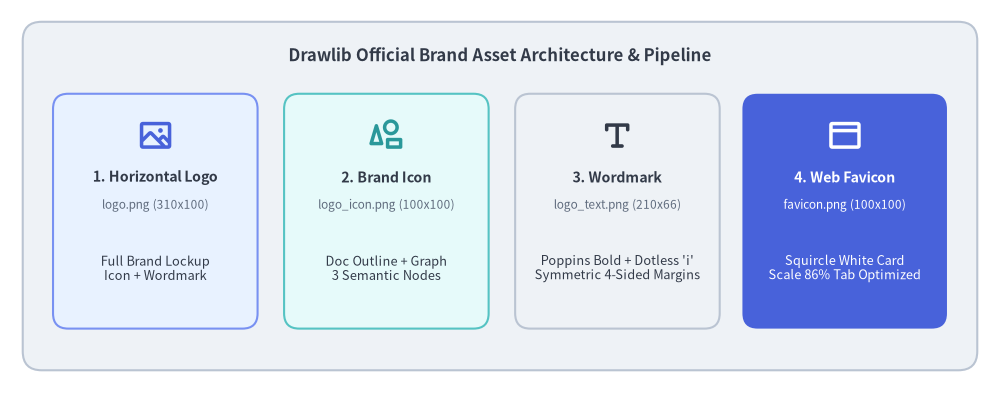
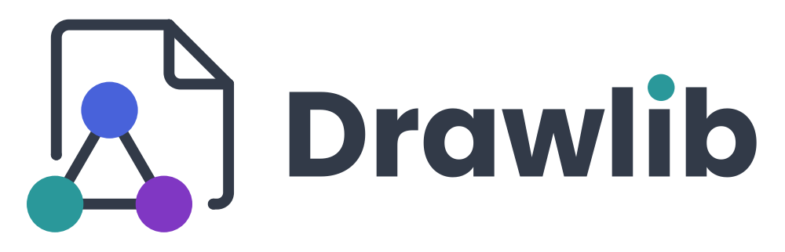
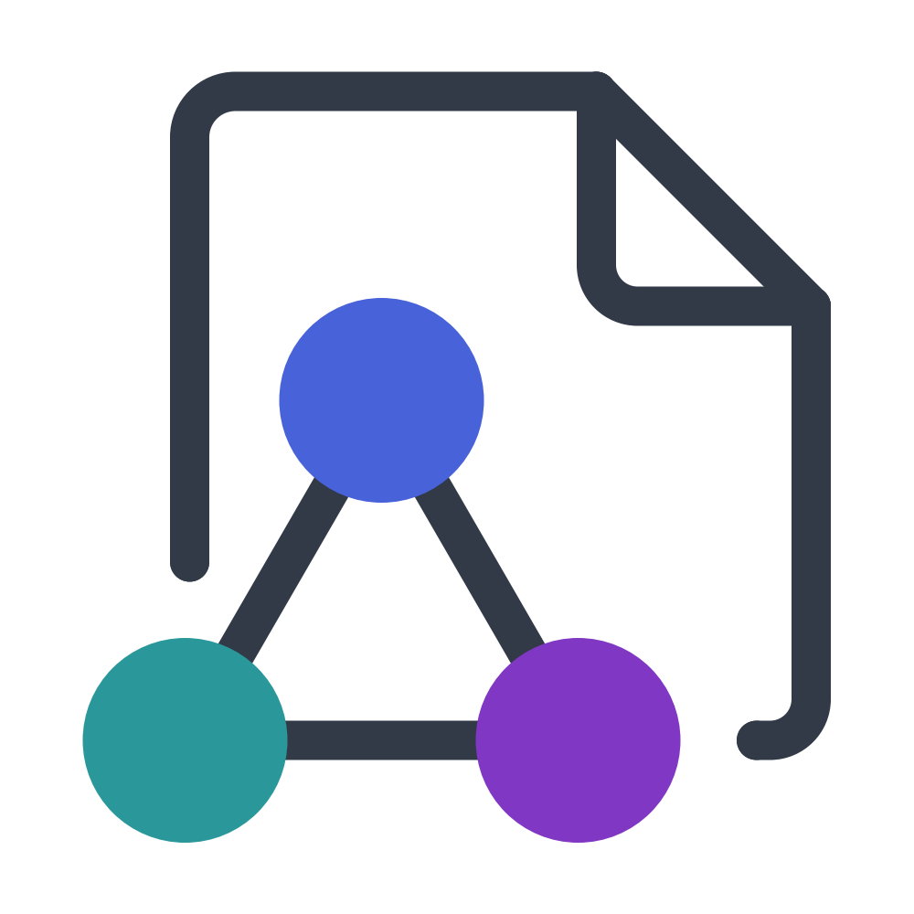
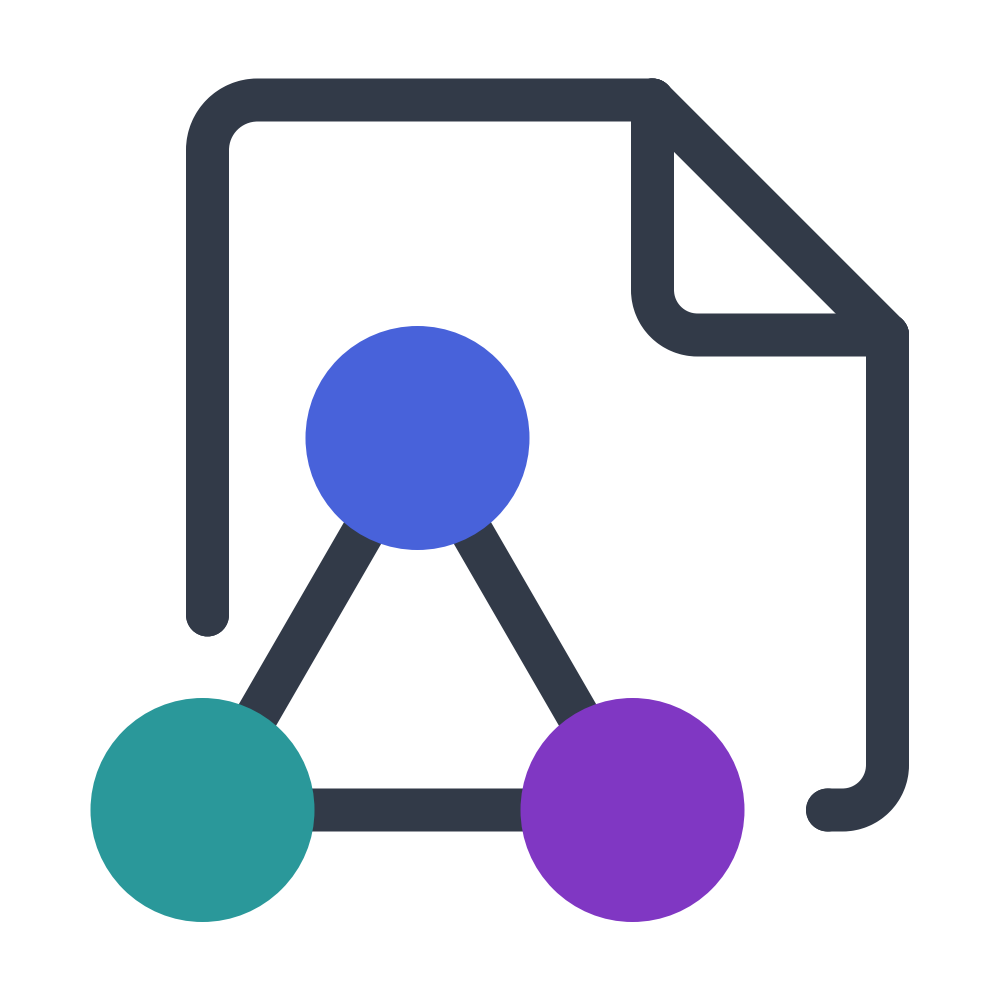
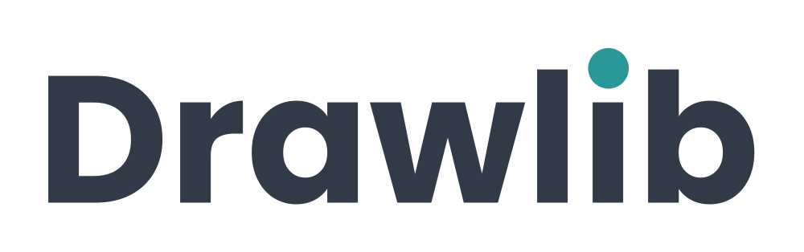
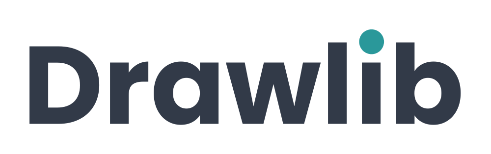
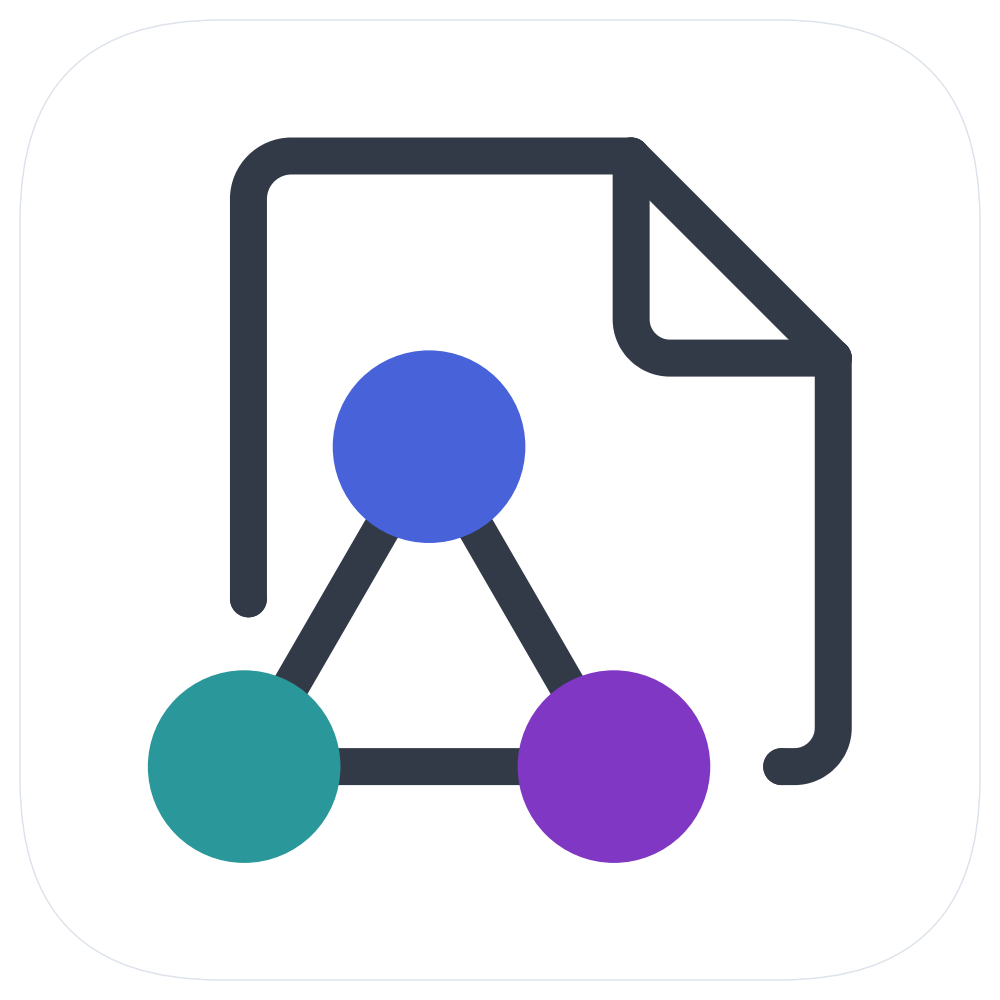
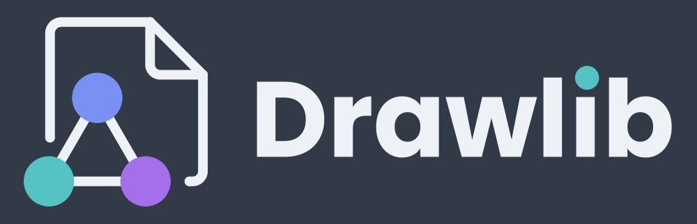
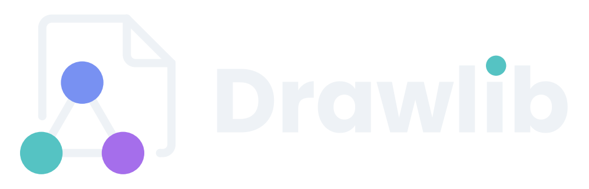

# Case Study: Designing Drawlib's Official Brand Assets

Drawlib's own visual identity—including its official horizontal brand logo, standalone square icon mark, typography wordmark, and browser favicon—was authored and compiled entirely in pure Python using Drawlib's declarative API.

This case study demonstrates the full lifecycle of **"Illustration as Code"** and the autonomous multimodal AI collaboration loop: translating rough design sketches into mathematical Bézier curves, tuning typography with sub-pixel precision, optimizing micro-scale favicon visibility for browser tabs, and integrating the resulting assets directly into the Drawlib project scaffolding engine.


<figure class="drawlib-image" style="text-align: center;">
  
  <figcaption class="drawlib-caption">Drawlib Official Brand Asset Architecture & Pipeline</figcaption>
</figure>

<details class="drawlib-code-details">
<summary>Source Code</summary>

```python
from drawlib.canvas import save, setup
from drawlib.icons import phosphor
from drawlib.shapes import rectangle
from drawlib.styles import Colors, Styles
from drawlib.text import text

setup(width=132, height=52)

# Outer container card
rectangle((66, 26), width=126, height=46, style=Styles.Neutral.patch(shape_r=2.5))
text(
    (66, 44.5),
    "Drawlib Official Brand Asset Architecture & Pipeline",
    style=Styles.DarkBold.patch(text_size=12.0),
)

# 4 Asset cards
cards = [
    (20.5, "1. Horizontal Logo", "logo.png (310x100)", "Full Brand Lockup\nIcon + Wordmark", phosphor.image, Styles.PrimaryNeutral, Colors.Primary),
    (51.0, "2. Brand Icon", "logo_icon.png (100x100)", "Doc Outline + Graph\n3 Semantic Nodes", phosphor.shapes, Styles.SecondaryNeutral, Colors.Secondary),
    (81.5, "3. Wordmark", "logo_text.png (210x66)", "Poppins Bold + Dotless 'i'\nSymmetric 4-Sided Margins", phosphor.text_t, Styles.Neutral, Colors.Dark),
    (111.5, "4. Web Favicon", "favicon.png (100x100)", "Squircle White Card\nScale 86% Tab Optimized", phosphor.browser, Styles.PrimaryFlat, Colors.White),
]

for cx, title, fname, desc, icon_fn, card_st, icon_col in cards:
    is_accent = (cx > 100)
    rectangle((cx, 24.0), width=27, height=31, style=card_st.patch(shape_r=2.0))
    icon_st = Styles.WhiteBold if is_accent else Styles.PrimaryBold.patch(icon_color=icon_col)
    icon_fn((cx, 34.0), width=4.8, style=icon_st)

    t_st = Styles.WhiteBold if is_accent else Styles.DarkBold
    d_st = Styles.White if is_accent else Styles.Dark
    f_st = Styles.White.patch(text_size=8.5) if is_accent else Styles.Muted.patch(text_size=8.5)

    text((cx, 28.5), title, style=t_st.patch(text_size=10.2))
    text((cx, 24.8), fname, style=f_st)
    text((cx, 16.5), desc, style=d_st.patch(text_size=9.2))

save()
```

</details>


---

## 1. Brand Concept & Design Token Discipline

Every piece of Drawlib's brand identity reflects the core mission of the library: bridging **code**, **structured documentation**, and **technical visualization**.

### 1.1. Core Visual Metaphors
- **Document with Dog-Ear Fold**: Represents technical specifications, design docs, whitepapers, and books. The upper-right diagonal crease conveys a crisp sheet of paper.
- **Equilateral 3-Node Graph Network**: Nestled within the lower-left cut-out of the document outline, three connected circular nodes symbolize relational models, cloud architectures, DAG workflows, and computer science abstractions.
- **Unified Harmony**: The document outline and graph lines share identical stroke thickness and dark ink styling, blending document and diagram into a single unified emblem.

### 1.2. Semantic Color Discipline
Rather than choosing arbitrary colors, the logo relies strictly on Drawlib's standard semantic design tokens:
- **`Colors.Dark` (`#323A48`)**: Deep slate ink used for the document outline, network edges, and primary wordmark typography.
- **`Colors.Primary` (`#4862DA`)**: Vibrant blue applied to the top network node.
- **`Colors.Secondary` (`#2A989A`)**: Fresh teal applied to the lower-left network node and the circular dot above the wordmark's `i`.
- **`Colors.Accent` (`#8037C3`)**: Royal purple applied to the lower-right network node.

---

## 2. Mathematical Geometry & Sub-Pixel Alignment

Creating clean brand logos in code requires exact mathematical foundations. In Drawlib, every corner, fillet, and baseline offset is computed analytically.

### 2.1. Exact 90° Circular Fillets via Cubic Bézier Curves
Drawlib's `lines_bezier()` function accepts control points for smooth path routing. To achieve an exact 90-degree circular corner arc using a cubic Bézier curve, the distance of the control handles from their endpoints is determined by the universal Bézier constant $\kappa$ (kappa):

$$\kappa = \frac{4(\sqrt{2} - 1)}{3} \approx 0.55228475$$

Given an incoming point $P_{\text{in}}$, a sharp corner vertex $P_{\text{corner}}$, and an outgoing point $P_{\text{out}}$, the helper function computes the control points $C_1$ and $C_2$:

$$C_1 = P_{\text{in}} + \kappa \cdot (P_{\text{corner}} - P_{\text{in}})$$
$$C_2 = P_{\text{out}} + \kappa \cdot (P_{\text{corner}} - P_{\text{out}})$$

This mathematical formulation produces indistinguishable circular arcs without distortion or discontinuities.

### 2.2. The Turkish Dotless `ı` Typography Innovation
When designing the wordmark `Drawlib`, we sought to highlight the letter `i` by rendering its circular dot in `Colors.Secondary` (Teal). However, standard fonts bundle the lowercase letter `i` and its black dot into a single compound glyph.

To solve this cleanly in code without modifying font files:
1. Render the text as `Drawlıb` using the Unicode Turkish Latin Small Letter Dotless I (`\u0131`).
2. Draw a standalone vector circle (`drawlib.shapes.circle`) at the exact center of the vertical stem.
3. Through sub-pixel empirical measurement in Poppins Bold, the stem center is located at:

$$\text{dot}_x = w_x + 3.1586 \times \text{unit\_scale}$$
$$\text{dot}_y = w_y + 0.39375 \times \text{unit\_scale}$$
$$\text{dot}_r = 0.1125 \times \text{unit\_scale}$$

This produces an accent dot perfectly aligned with the stem axis.

---

## 3. Official Brand Asset Gallery (Standalone Runnable Code)

Below are the 7 official Drawlib brand assets. Each code block is **100% self-contained and runnable**: simply copy the block into any Python file and execute it with `uv run python <file>.py`.

### 3.1. Full Horizontal Brand Logo (`logo.png` & `logo_transparent.png`)

The master horizontal brand lockup pairs the icon mark on the left with the Poppins Bold wordmark on the right within a $310 \times 100$ canvas space.


<figure class="drawlib-image" style="text-align: center;">
  
  <figcaption class="drawlib-caption">Official Drawlib Logo (Horizontal Lockup - White Background)</figcaption>
</figure>


For dark headers, hero banners, or navigation bars, the transparent background variant sets `color=Colors.Canvas, alpha=0.0`:


<figure class="drawlib-image" style="text-align: center;">
  
  <figcaption class="drawlib-caption">Official Drawlib Logo (Horizontal Lockup - Transparent Background)</figcaption>
</figure>


---

### 3.2. Brand Icon Mark (`logo_icon.png` & `logo_icon_transparent.png`)

The standalone square icon mark ($100 \times 100$ canvas space) is ideal for social profile avatars, GitHub repository icons, and application launcher icons.


<figure class="drawlib-image" style="text-align: center;">
  
  <figcaption class="drawlib-caption">Drawlib Brand Icon Mark (White Background)</figcaption>
</figure>


Transparent icon mark:


<figure class="drawlib-image" style="text-align: center;">
  
  <figcaption class="drawlib-caption">Drawlib Brand Icon Mark (Transparent Background)</figcaption>
</figure>


---

### 3.3. Typography Wordmark (`logo_text.png` & `logo_text_transparent.png`)

Rendered on a compact $210 \times 66$ canvas with four-sided symmetric padding (exact 120px left/right margins and 119px top/bottom margins at 2000px output).


<figure class="drawlib-image" style="text-align: center;">
  
  <figcaption class="drawlib-caption">Drawlib Typography Wordmark (White Background)</figcaption>
</figure>


Transparent wordmark:


<figure class="drawlib-image" style="text-align: center;">
  
  <figcaption class="drawlib-caption">Drawlib Typography Wordmark (Transparent Background)</figcaption>
</figure>


---

### 3.4. Browser Favicon (`logo_favicon.png`)

Favicons must remain recognizable at tiny pixel dimensions ($16 \times 16$ and $32 \times 32$ pixels in browser tab bars) while maintaining sharp contrast against both light and dark browser themes.

To achieve this:
1. **Squircle White Card**: A $96 \times 96$ white card with corner radius `shape_r=20.0` and a subtle `Colors.Gray3` border provides a clean, luminous backdrop on dark tabs.
2. **Transparent Canvas Corners**: The outer canvas corners are transparent (`alpha=0.0`), allowing the rounded squircle to clip naturally into browser tabs and OS app switchers.
3. **Scale 86% Geometry**: Scaled to 86% of canvas space, eliminating excessive whitespace so the three semantic color nodes remain crisp and discernible even at 16px.

*(Note: Unlike the logos above, the favicon does not require a separate transparent variant because its outer boundary is already transparent by design).*


<figure class="drawlib-image" style="text-align: center;">
  
  <figcaption class="drawlib-caption">Official Drawlib Favicon (Squircle White Card on Transparent Canvas)</figcaption>
</figure>


---

## 4. Framework Integration: Default Project Favicon

Rather than keeping brand assets isolated in a design repository, Drawlib integrates the official favicon into the framework itself:

1. **Automatic Scaffolding (`drawlib init`)**:
   - The master $512 \times 512$ favicon is packaged inside `src/drawlib/_templates/project/_assets/favicon.png`.
   - When developers scaffold a new project (`drawlib init site`, `drawlib init doc`, or `drawlib init slide`), `_assets/favicon.png` is automatically copied into `<target>_src/_assets/`.
2. **Automated Relative Path Resolution**:
   - The HTML documentation compiler (`drawlib build html`) automatically inspects the destination hierarchy.
   - For root pages (`index.html`), it links `_assets/favicon.png`.
   - For nested chapter subdirectories (e.g. `architecture/index.html`), it automatically calculates `../_assets/favicon.png`.
3. **Effortless Brand Customization**:
   - To replace the Drawlib favicon with a proprietary company or project logo, users simply overwrite `_assets/favicon.png`. No HTML templates need to be modified.

---

## 5. Dark Mode & High-Contrast Adaptation

Modern developer tools, IDEs, and documentation platforms frequently operate in dark mode. Placing standard dark-themed graphics on dark backgrounds results in severe contrast loss, while blinding pure white (`#FFFFFF`) produces visual glare and halation.

To ensure Drawlib's brand assets remain legible, harmonious, and elegant across all presentation environments, we engineered an official **Dark Variant** based on two core design principles:

1. **Luminance Harmony with `Colors.Gray2`**:
   - Rather than pure white, the document stroke and typography use `Colors.Gray2` (`#EEF2F6`, ~93% luminance).
   - This eliminates visual glare while carrying a subtle cool slate tone that matches developer dark themes.
2. **Vibrant Pastel Level 3 Tokens**:
   - Standard primary tokens (`#4158D0`, `#2A989A`, `#8037C3`) can feel overly dark and muted against deep backgrounds.
   - We shift the 3 graph nodes to Drawlib's **Level 3 Pastel Palette**: `Blue3` (`#7891F2`), `Teal3` (`#55C3C3`), and `Purple3` (`#A56EEB`).
   - This elevates luminescence, making the nodes appear softly luminous and vibrant without losing their distinct brand identity.

### 5.1. Dark Full Brand Logo


<figure class="drawlib-image" style="text-align: center;">
  
  <figcaption class="drawlib-caption">Official Drawlib Full Brand Logo (Dark Background)</figcaption>
</figure>

<details class="drawlib-code-details">
<summary>Source Code</summary>

```python
from drawlib.canvas import canvas, save, setup
from drawlib.fonts import FontSansSerif
from drawlib.lines import line, lines, lines_bezier
from drawlib.shapes import circle
from drawlib.styles import Colors, Style, Styles
from drawlib.text import text

setup(width=310, height=100, color=Colors.Dark)

pts_per_unit = 720.0 / 310.0
stroke_pt = 4.3 * pts_per_unit
cap_radius = 4.3 / 2.0
_KAPPA = 0.55228475

def _corner_arc(p_in, corner, p_out):
    cx, cy = corner
    return (
        (p_in[0] + _KAPPA * (cx - p_in[0]), p_in[1] + _KAPPA * (cy - p_in[1])),
        (p_out[0] + _KAPPA * (cx - p_out[0]), p_out[1] + _KAPPA * (cy - p_out[1])),
        p_out,
    )

with canvas.transform(origin=(0, 0), scale=1.0, translate=(1.5, 0.0)):
    x_left, y_left_end, y_top = 20.75, 38.5, 90.0
    x_fold, x_right, y_fold = 65.25, 88.75, 66.5
    y_bottom, x_right_end = 19.0, 82.75
    r_top_left, r_fold_inner, r_bottom_right = 5.0, 4.5, 4.5

    stroke_style = Style(line_color=Colors.Gray2, line_width=stroke_pt, line_style="solid")
    cap_style = Style(shape_fill_color=Colors.Gray2, shape_line_color=Colors.Gray2, shape_line_width=0.0)

    lines_bezier((x_left, y_left_end), [(x_left, y_top - r_top_left), _corner_arc((x_left, y_top - r_top_left), (x_left, y_top), (x_left + r_top_left, y_top)), (x_fold, y_top)], style=stroke_style)
    lines_bezier((x_fold, y_top), [(x_fold, y_fold + r_fold_inner), _corner_arc((x_fold, y_fold + r_fold_inner), (x_fold, y_fold), (x_fold + r_fold_inner, y_fold)), (x_right, y_fold)], style=stroke_style)
    line((x_fold, y_top), (x_right, y_fold), style=stroke_style)
    lines_bezier((x_right, y_fold), [(x_right, y_bottom + r_bottom_right), _corner_arc((x_right, y_bottom + r_bottom_right), (x_right, y_bottom), (x_right - r_bottom_right, y_bottom)), (x_right_end, y_bottom)], style=stroke_style)

    for cap_xy in [(x_left, y_left_end), (x_right_end, y_bottom), (x_fold, y_top), (x_right, y_fold)]:
        circle(cap_xy, radius=cap_radius, style=cap_style)

    lines([(20.25, 19.0), (41.75, 56.2), (63.25, 19.0), (20.25, 19.0)], style=stroke_style)
    circle((41.75, 56.2), radius=11.2, style=Style(shape_fill_color=Colors.Blue3, shape_line_color=Colors.Blue3, shape_line_width=0.0))
    circle((20.25, 19.0), radius=11.2, style=Style(shape_fill_color=Colors.Teal3, shape_line_color=Colors.Teal3, shape_line_width=0.0))
    circle((63.25, 19.0), radius=11.2, style=Style(shape_fill_color=Colors.Purple3, shape_line_color=Colors.Purple3, shape_line_width=0.0))

wx, wy = (111.5, 46.5)
text_size_pt = 110.0
text(
    (wx, wy),
    "Drawl\u0131b",
    style=Styles.DarkBold.patch(
        text_font=FontSansSerif.POPPINS_BOLD,
        text_size=text_size_pt,
        text_color=Colors.Gray2,
        halign="left",
        valign="center",
    ),
)

unit_scale = text_size_pt / pts_per_unit
circle(
    (wx + 3.1586 * unit_scale, wy + 0.39375 * unit_scale),
    radius=0.1125 * unit_scale,
    style=Style(shape_fill_color=Colors.Teal3, shape_line_color=Colors.Teal3, shape_line_width=0.0),
)

save()
```

</details>


### 5.2. Dark Full Brand Logo (Transparent)


<figure class="drawlib-image" style="text-align: center;">
  
  <figcaption class="drawlib-caption">Official Drawlib Full Brand Logo for Dark Backgrounds (Transparent)</figcaption>
</figure>

<details class="drawlib-code-details">
<summary>Source Code</summary>

```python
from drawlib.canvas import canvas, save, setup
from drawlib.fonts import FontSansSerif
from drawlib.lines import line, lines, lines_bezier
from drawlib.shapes import circle
from drawlib.styles import Colors, Style, Styles
from drawlib.text import text

setup(width=310, height=100, color=Colors.Canvas, alpha=0.0)

pts_per_unit = 720.0 / 310.0
stroke_pt = 4.3 * pts_per_unit
cap_radius = 4.3 / 2.0
_KAPPA = 0.55228475

def _corner_arc(p_in, corner, p_out):
    cx, cy = corner
    return (
        (p_in[0] + _KAPPA * (cx - p_in[0]), p_in[1] + _KAPPA * (cy - p_in[1])),
        (p_out[0] + _KAPPA * (cx - p_out[0]), p_out[1] + _KAPPA * (cy - p_out[1])),
        p_out,
    )

with canvas.transform(origin=(0, 0), scale=1.0, translate=(1.5, 0.0)):
    x_left, y_left_end, y_top = 20.75, 38.5, 90.0
    x_fold, x_right, y_fold = 65.25, 88.75, 66.5
    y_bottom, x_right_end = 19.0, 82.75
    r_top_left, r_fold_inner, r_bottom_right = 5.0, 4.5, 4.5

    stroke_style = Style(line_color=Colors.Gray2, line_width=stroke_pt, line_style="solid")
    cap_style = Style(shape_fill_color=Colors.Gray2, shape_line_color=Colors.Gray2, shape_line_width=0.0)

    lines_bezier((x_left, y_left_end), [(x_left, y_top - r_top_left), _corner_arc((x_left, y_top - r_top_left), (x_left, y_top), (x_left + r_top_left, y_top)), (x_fold, y_top)], style=stroke_style)
    lines_bezier((x_fold, y_top), [(x_fold, y_fold + r_fold_inner), _corner_arc((x_fold, y_fold + r_fold_inner), (x_fold, y_fold), (x_fold + r_fold_inner, y_fold)), (x_right, y_fold)], style=stroke_style)
    line((x_fold, y_top), (x_right, y_fold), style=stroke_style)
    lines_bezier((x_right, y_fold), [(x_right, y_bottom + r_bottom_right), _corner_arc((x_right, y_bottom + r_bottom_right), (x_right, y_bottom), (x_right - r_bottom_right, y_bottom)), (x_right_end, y_bottom)], style=stroke_style)

    for cap_xy in [(x_left, y_left_end), (x_right_end, y_bottom), (x_fold, y_top), (x_right, y_fold)]:
        circle(cap_xy, radius=cap_radius, style=cap_style)

    lines([(20.25, 19.0), (41.75, 56.2), (63.25, 19.0), (20.25, 19.0)], style=stroke_style)
    circle((41.75, 56.2), radius=11.2, style=Style(shape_fill_color=Colors.Blue3, shape_line_color=Colors.Blue3, shape_line_width=0.0))
    circle((20.25, 19.0), radius=11.2, style=Style(shape_fill_color=Colors.Teal3, shape_line_color=Colors.Teal3, shape_line_width=0.0))
    circle((63.25, 19.0), radius=11.2, style=Style(shape_fill_color=Colors.Purple3, shape_line_color=Colors.Purple3, shape_line_width=0.0))

wx, wy = (111.5, 46.5)
text_size_pt = 110.0
text(
    (wx, wy),
    "Drawl\u0131b",
    style=Styles.DarkBold.patch(
        text_font=FontSansSerif.POPPINS_BOLD,
        text_size=text_size_pt,
        text_color=Colors.Gray2,
        halign="left",
        valign="center",
    ),
)

unit_scale = text_size_pt / pts_per_unit
circle(
    (wx + 3.1586 * unit_scale, wy + 0.39375 * unit_scale),
    radius=0.1125 * unit_scale,
    style=Style(shape_fill_color=Colors.Teal3, shape_line_color=Colors.Teal3, shape_line_width=0.0),
)

save()
```

</details>


### 5.3. Dynamic Theme Switching in Documentation

Documentation websites can dynamically switch between light and dark brand logos without JavaScript using standard CSS media queries and dual image markup:

```html
<div class="sidebar-header">
    <a href="index.html" class="sidebar-brand">
        <!-- Rendered in Light Mode -->
        
        <!-- Rendered in Dark Mode -->
        
    </a>
</div>
```

```css
/* Base: Display light logo, hide dark logo */
.sidebar-logo-light { display: block; }
.sidebar-logo-dark { display: none; }

/* System Adaptive: Switch when user/OS prefers dark mode */
@media (prefers-color-scheme: dark) {
    .sidebar-logo-light { display: none !important; }
    .sidebar-logo-dark { display: block !important; }
}

/* Explicit Themes: Support data-theme or .dark toggle classes */
[data-theme="dark"] .sidebar-logo-light,
.dark .sidebar-logo-light {
    display: none !important;
}

[data-theme="dark"] .sidebar-logo-dark,
.dark .sidebar-logo-dark {
    display: block !important;
}
```

