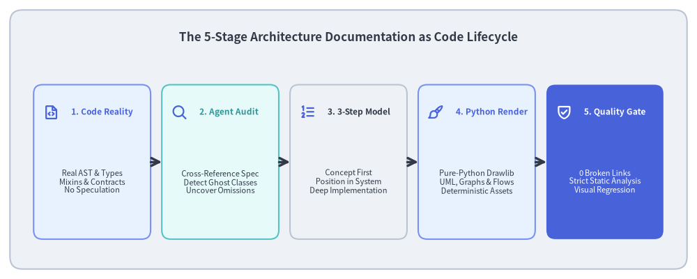
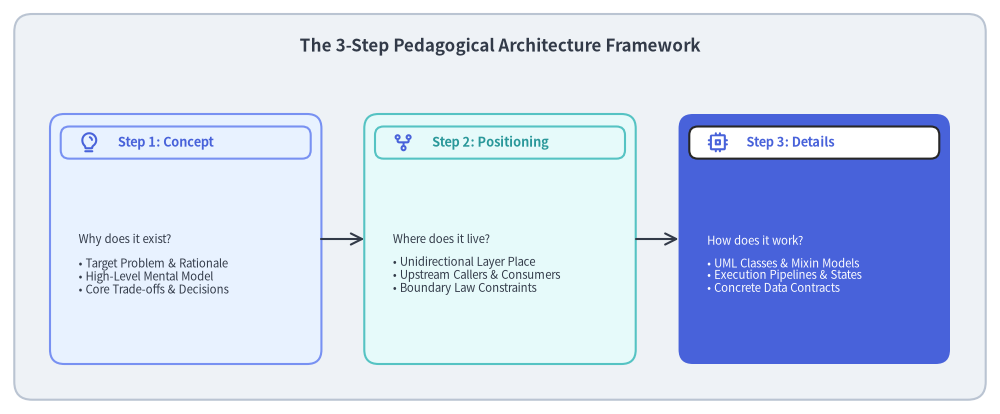
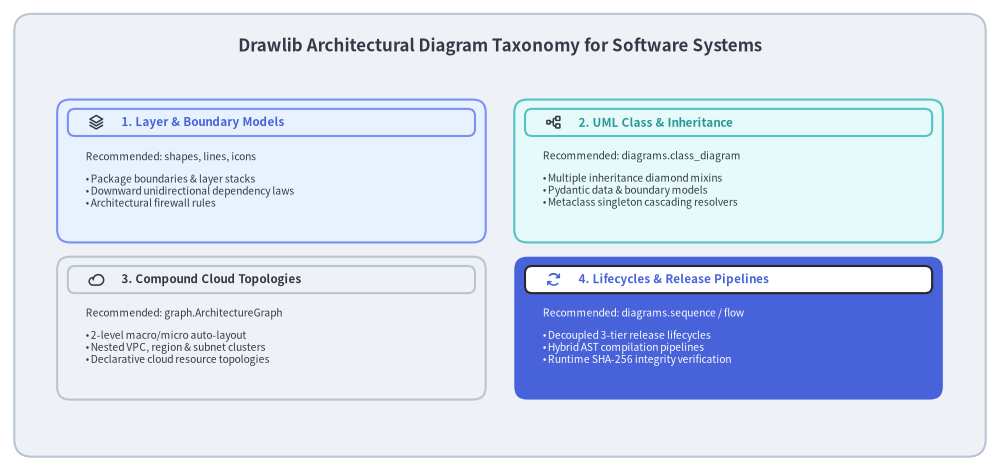
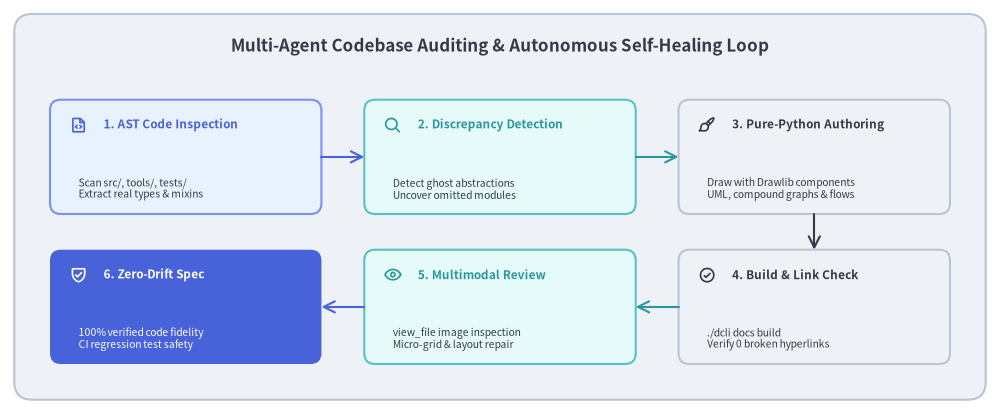

# Case Study: Authoring & Auditing Software Architecture as Code

Modern software systems require comprehensive, rigorous architectural documentation to guide contributors, onboard new engineers, and clarify non-trivial design decisions. However, software architecture documentation notoriously suffers from **Architectural Drift** and **Visio Debt**: diagrams drawn in external GUI tools quickly diverge from actual codebases, fictional "ghost abstractions" are documented instead of reality, and human review across complex inheritance trees becomes unsustainable.

Drawlib's own official architectural specification—documented across **21 comprehensive chapters, over 480 cross-references, and dozens of pure-Python UML class diagrams and compound graphs**—was constructed and audited autonomously through human-AI collaboration.

This case study outlines the methodology used to author, audit, and maintain production-grade software architecture specifications using **"Architecture Documentation as Code"**, the **3-Step Pedagogical Paradigm**, and **Multi-Agent Codebase Auditing**.


<figure class="drawlib-image" style="text-align: center;">
  
  <figcaption class="drawlib-caption">The 5-Stage Architecture Documentation as Code Lifecycle</figcaption>
</figure>

<details class="drawlib-code-details">
<summary>Source Code</summary>

```python
from drawlib.canvas import save, setup
from drawlib.icons import phosphor
from drawlib.lines import line
from drawlib.shapes import rectangle
from drawlib.styles import Styles
from drawlib.text import text

setup(width=140, height=56)

rectangle((70, 28), width=136, height=52, style=Styles.Neutral.patch(shape_r=2.5))
text(
    (70, 48.5),
    "The 5-Stage Architecture Documentation as Code Lifecycle",
    style=Styles.DarkBold.patch(text_size=12.2),
)

stages = [
    (18.5, "1. Code Reality", "Real AST & Types\nMixins & Contracts\nNo Speculation", phosphor.file_code, Styles.PrimaryNeutral, Styles.PrimaryBold),
    (44.25, "2. Agent Audit", "Cross-Reference Spec\nDetect Ghost Classes\nUncover Omissions", phosphor.magnifying_glass, Styles.SecondaryNeutral, Styles.SecondaryBold),
    (70.0, "3. 3-Step Model", "Concept First\nPosition in System\nDeep Implementation", phosphor.list_numbers, Styles.Neutral, Styles.DarkBold),
    (95.75, "4. Python Render", "Pure-Python Drawlib\nUML, Graphs & Flows\nDeterministic Assets", phosphor.paint_brush, Styles.PrimaryNeutral, Styles.PrimaryBold),
    (121.5, "5. Quality Gate", "0 Broken Links\nStrict Static Analysis\nVisual Regression", phosphor.shield_check, Styles.PrimaryFlat, Styles.WhiteBold),
]

for cx, title, desc, icon_fn, card_st, title_st in stages:
    is_accent = (card_st == Styles.PrimaryFlat)
    rectangle((cx, 23.5), width=23.5, height=31, style=card_st.patch(shape_r=1.8))
    icon_st = Styles.WhiteBold if is_accent else Styles.PrimaryBold
    icon_fn((cx - 8.2, 33.5), width=3.2, style=icon_st)
    text((cx - 4.2, 33.5), title, style=title_st.patch(halign="left", text_size=8.6))
    sub_st = Styles.White if is_accent else Styles.Dark
    text((cx, 19.5), desc, style=sub_st.patch(text_size=8.0))

for i in range(4):
    x_from = stages[i][0] + 11.75
    x_to = stages[i + 1][0] - 11.75
    line((x_from, 23.5), (x_to, 23.5), arrow_head="->", style=Styles.DarkBold)

save()
```

</details>


---

## 1. The Core Problem: Architectural Drift & Visio Debt

In conventional engineering organizations, architectural documentation suffers from three chronic structural failures:

1. **Disconnected Toolchains (Visio Debt)**:
   Engineers author code in Git, write RFCs in Markdown or Google Docs, and draw architecture diagrams in third-party GUI tools (Visio, draw.io, Lucidchart, Miro). Because updating visual diagrams requires manual exports, re-uploading, and multi-tool context switching, diagrams are rarely updated when internal implementations change.
2. **The "Ghost Abstraction" Trap**:
   When technical writers or AI assistants draft architecture specifications from memory or surface-level intuition, they frequently invent plausible-sounding but completely fictional design patterns—such as non-existent exception hierarchies (`CanvasError`, `StyleError`), imagined coordinate abstractions (`Point`, `Vector`), or classic OOP models where the real codebase uses functional tuples and Pydantic validators.
3. **Impenetrable Prose without Visual Models**:
   Complex architectural structures—such as diamond multiple inheritance, metaclass singleton cascades, or compound auto-layout DAGs—are nearly impossible to comprehend through text alone. Without precise, co-located visual models, team members develop divergent mental models of how the system works.

### The Drawlib Solution: "Architecture as Code"

Drawlib solves these problems by treating architecture documentation as version-controlled code inside the repository:
- **Executable Single Source of Truth (SoT)**: Markdown explanations and executable Python drawing blocks live side-by-side in `docs/architecture_src/`.
- **Zero Drift via Dogfooding**: If a public class is renamed or an internal method signature changes, the architecture documentation build (`./dcli docs build architecture`) fails immediately, alerting the team before regressions reach production.
- **Multimodal AI Auditing**: AI coding agents inspect the real codebase AST, cross-reference it against documentation drafts, detect discrepancies, and render publication-ready diagrams autonomously.

---

## 2. The 3-Step Pedagogical Architecture Framework

Technical documentation is often either too abstract (hand-wavy high-level overviews) or too dense (unexplained code dumps). To ensure maximum clarity and cognitive retention across all 21 architectural chapters, Drawlib establishes the **3-Step Pedagogical Paradigm**:


<figure class="drawlib-image" style="text-align: center;">
  
  <figcaption class="drawlib-caption">The 3-Step Pedagogical Architecture Framework</figcaption>
</figure>

<details class="drawlib-code-details">
<summary>Source Code</summary>

```python
from drawlib.canvas import save, setup
from drawlib.icons import phosphor
from drawlib.lines import line
from drawlib.shapes import rectangle
from drawlib.styles import Styles
from drawlib.text import text

setup(width=140, height=58)

rectangle((70, 29), width=136, height=54, style=Styles.Neutral.patch(shape_r=2.5))
text(
    (70, 51.5),
    "The 3-Step Pedagogical Architecture Framework",
    style=Styles.DarkBold.patch(text_size=12.2),
)

steps = [
    (
        26,
        "Step 1: Concept",
        "Why does it exist?\n\n• Target Problem & Rationale\n• High-Level Mental Model\n• Core Trade-offs & Decisions",
        phosphor.lightbulb,
        Styles.PrimaryNeutral,
        Styles.PrimaryBold,
    ),
    (
        70,
        "Step 2: Positioning",
        "Where does it live?\n\n• Unidirectional Layer Place\n• Upstream Callers & Consumers\n• Boundary Law Constraints",
        phosphor.git_fork,
        Styles.SecondaryNeutral,
        Styles.SecondaryBold,
    ),
    (
        114,
        "Step 3: Details",
        "How does it work?\n\n• UML Classes & Mixin Models\n• Execution Pipelines & States\n• Concrete Data Contracts",
        phosphor.cpu,
        Styles.PrimaryFlat,
        Styles.WhiteBold,
    ),
]

for cx, title, desc, icon_fn, card_st, title_st in steps:
    is_accent = (card_st == Styles.PrimaryFlat)
    rectangle((cx, 24.5), width=38, height=35, style=card_st.patch(shape_r=2.0))
    
    badge_bg = Styles.White if is_accent else card_st
    rectangle((cx, 38.0), width=35, height=4.5, style=badge_bg.patch(shape_r=1.2))
    
    badge_icon_st = Styles.PrimaryBold if is_accent else Styles.PrimaryBold
    icon_fn((cx - 13.5, 38.0), width=3.0, style=badge_icon_st)
    
    badge_text_st = Styles.PrimaryBold if is_accent else title_st
    text((cx - 9.5, 38.0), title, style=badge_text_st.patch(halign="left", text_size=9.2))
    
    sub_st = Styles.White if is_accent else Styles.Dark
    text((cx - 15.0, 21.0), desc, style=sub_st.patch(halign="left", text_size=8.2))

for i in range(2):
    x_from = steps[i][0] + 19.0
    x_to = steps[i + 1][0] - 19.0
    line((x_from, 24.5), (x_to, 24.5), arrow_head="->", style=Styles.DarkBold.patch(line_width=1.5))

save()
```

</details>


### Applying the 3 Steps:
1. **Step 1: Concept (Why does this subsystem exist?)**:
   Grounds the reader in motivation and trade-offs. For example, why did Drawlib implement a unified flat `Style` model with 28 properties and dynamic `supports` tracking rather than classic object-oriented inheritance? (Answer: To enable unified `.patch()` cascades across all 17 theme styles simultaneously without runtime type checks).
2. **Step 2: Positioning in Architecture (Where does it live in the system?)**:
   Defines architectural boundaries and layer invariants. Who is allowed to import this module, and what dependencies are strictly forbidden? (e.g., L3 Services may import L1/L2, but must never import L4 Canvas or public facades).
3. **Step 3: Details & Implementation Mechanics (How is it built under the hood?)**:
   Provides precise structural and operational blueprints: formal UML class diagrams, AST pipeline stages, SQLite WAL caching schemas, and exact error-handling contracts.

---

## 3. Architectural Diagram Taxonomy

Technical architecture requires diverse visual notations depending on the engineering perspective. Rather than forcing all diagrams into generic flowchart shapes, Drawlib provides specialized high-level diagramming modules:


<figure class="drawlib-image" style="text-align: center;">
  
  <figcaption class="drawlib-caption">Drawlib Architectural Diagram Taxonomy for Software Systems</figcaption>
</figure>

<details class="drawlib-code-details">
<summary>Source Code</summary>

```python
from drawlib.canvas import save, setup
from drawlib.icons import phosphor
from drawlib.shapes import rectangle
from drawlib.styles import Styles
from drawlib.text import text

setup(width=140, height=66)

rectangle((70, 33), width=136, height=62, style=Styles.Neutral.patch(shape_r=2.5))
text(
    (70, 59.5),
    "Drawlib Architectural Diagram Taxonomy for Software Systems",
    style=Styles.DarkBold.patch(text_size=12.2),
)

cards = [
    (
        38,
        42,
        "1. Layer & Boundary Models",
        "Recommended: shapes, lines, icons\n\n• Package boundaries & layer stacks\n• Downward unidirectional dependency laws\n• Architectural firewall rules",
        phosphor.stack,
        Styles.PrimaryNeutral,
        Styles.PrimaryBold,
    ),
    (
        102,
        42,
        "2. UML Class & Inheritance",
        "Recommended: diagrams.class_diagram\n\n• Multiple inheritance diamond mixins\n• Pydantic data & boundary models\n• Metaclass singleton cascading resolvers",
        phosphor.tree_structure,
        Styles.SecondaryNeutral,
        Styles.SecondaryBold,
    ),
    (
        38,
        20,
        "3. Compound Cloud Topologies",
        "Recommended: graph.ArchitectureGraph\n\n• 2-level macro/micro auto-layout\n• Nested VPC, region & subnet clusters\n• Declarative cloud resource topologies",
        phosphor.cloud,
        Styles.Neutral,
        Styles.DarkBold,
    ),
    (
        102,
        20,
        "4. Lifecycles & Release Pipelines",
        "Recommended: diagrams.sequence / flow\n\n• Decoupled 3-tier release lifecycles\n• Hybrid AST compilation pipelines\n• Runtime SHA-256 integrity verification",
        phosphor.arrows_clockwise,
        Styles.PrimaryFlat,
        Styles.WhiteBold,
    ),
]

for cx, cy, title, desc, icon_fn, card_st, title_st in cards:
    is_accent = (card_st == Styles.PrimaryFlat)
    rectangle((cx, cy), width=60, height=20, style=card_st.patch(shape_r=1.8))
    
    badge_bg = Styles.White if is_accent else card_st
    rectangle((cx, cy + 6.8), width=57, height=3.8, style=badge_bg.patch(shape_r=1.0))
    
    icon_st = Styles.PrimaryBold if is_accent else Styles.DarkBold
    icon_fn((cx - 24.5, cy + 6.8), width=2.4, style=icon_st)
    
    text_st = Styles.PrimaryBold if is_accent else title_st
    text((cx - 21.0, cy + 6.8), title, style=text_st.patch(halign="left", text_size=8.4))
    
    body_st = Styles.White if is_accent else Styles.Dark
    text((cx - 26.0, cy - 1.2), desc, style=body_st.patch(halign="left", text_size=7.4))

save()
```

</details>


### Mapping Architectural Perspectives to Drawlib Components:

| Architectural Concern | Primary Module | Core Components Used | Visual Output |
| :--- | :--- | :--- | :--- |
| **System Layers & Boundaries** | `drawlib.shapes`, `lines`, `icons` | Rounded cards, unidirectional arrow flows, boundary rules | Layer stacks, forbidden import rules |
| **OOP & Data Contracts** | `drawlib.diagrams.class_diagram` | `ClassNode`, `ClassAttribute`, `ClassMethod`, `Relation` | Multiple inheritance mixins, Pydantic models |
| **Cloud & Cluster Topology** | `drawlib.graph` | `ArchitectureGraph`, nested clusters, auto-routing | Multi-VPC networks, microservice meshes |
| **Runtime Lifecycles** | `drawlib.diagrams.sequence`, `flow` | `SequenceDiagram`, `Participant`, `Block`, `ChevronProcess` | Multi-tier release pipelines, compiler phases |

---

## 4. Real-World Case Study: Documenting Drawlib's Architecture

To prove the effectiveness of this methodology, the entire internal architecture of `drawlib` was documented in `docs/architecture_src/`. Three key architectural challenges demonstrate how Drawlib's declarative Python paradigm provides unmatched precision:

### 4.1. The Diamond Mixin Hierarchy (`CanvasBase` + 6 Mixins)
Drawlib's `Canvas` class does not implement drawing primitives as monolithic methods. Instead, it uses a multiple inheritance mixin architecture:
- `CanvasBase` provides the Matplotlib `Figure` and `Axes` coordinate mapping.
- 6 independent mixins (`CanvasShapeBasicFeature`, `CanvasShapePolygonFeature`, `CanvasShapeArrowFeature`, `CanvasLineFeature`, `CanvasTextFeature`, `CanvasImageFeature`) implement specialized drawing features.
- Using `drawlib.diagrams.class_diagram`, this diamond multiple-inheritance model is rendered with exact method signatures, visibility modifiers (`+`, `-`, `#`), and inheritance arrows in pure Python code.

### 4.2. Dynamic Style Catalogs with Metaclass Cascades
Drawlib's 17 theme styles (`Styles.Neutral`, `Styles.PrimaryFlat`, `Styles.DarkBold`, etc.) are not static global instances. When a user calls `styles.patch_font()`, all 17 styles must cascade updates instantaneously:
- The architecture document models the interaction between `BaseStyles(BaseModel)` and its dynamic metaclass singleton `_BaseStylesMeta`.
- A dedicated UML class diagram visualizes how property getters dynamically resolve and clone cached `Style` objects, providing complete transparency into Drawlib's design token engine.

### 4.3. The Decoupled Three-Tier Release Architecture
To prevent the published PyPI wheel from bloating with hundreds of megabytes of fonts, GCP icons, and GeoJSON maps, Drawlib implements a 3-tier release architecture:
1. **Tier 1: Code Release & SoT Synchronization**:
   `tools/dcli/release_assets/sync.py` builds in-memory deterministic `.zip` archives (normalized epoch `2026-01-01`, `0o644` permissions) and compiles their SHA-256 digests into `src/drawlib/_release_assets.py`. The PyPI wheel remains tiny (<2 MB).
2. **Tier 2: Binary Asset CDN (GitHub Releases)**:
   `tools/dcli/release_assets/client.py` uploads 53 deterministic ZIP packages to GitHub Releases under an immutable version tag (`v0.3`).
3. **Tier 3: Runtime Drawlib Lazy Resolution**:
   When client code calls `gcp.compute_engine()` or `geomap`, `ensure_asset_available()` checks `drawlib._cached_assets/`. If missing, it downloads the package, verifies the SHA-256 digest against the SoT to prevent tampering, and extracts it locally. Pre-warmed Docker images (`drawlib:assets`, `drawlib:full`) pre-download all assets for 100% offline, air-gapped execution.

---

## 5. Multi-Agent Codebase Auditing & Autonomous Self-Healing

The most transformative aspect of authoring architecture as code is the **Multi-Agent Verification Loop**. Rather than relying on a single human architect to manually verify dozens of pages against thousands of lines of code, Drawlib employs concurrent subagents:


<figure class="drawlib-image" style="text-align: center;">
  
  <figcaption class="drawlib-caption">The Multi-Agent Codebase Auditing & Autonomous Self-Healing Loop</figcaption>
</figure>

<details class="drawlib-code-details">
<summary>Source Code</summary>

```python
from drawlib.canvas import save, setup
from drawlib.icons import phosphor
from drawlib.lines import line
from drawlib.shapes import rectangle
from drawlib.styles import Styles
from drawlib.text import text

setup(width=140, height=58)

# Outer card
rectangle((70, 29), width=136, height=54, style=Styles.Neutral.patch(shape_r=2.5))
text(
    (70, 51.5),
    "Multi-Agent Codebase Auditing & Autonomous Self-Healing Loop",
    style=Styles.DarkBold.patch(text_size=12.2),
)

# Top row cards (y = 36)
top_cards = [
    (26, "1. AST Code Inspection", "Scan src/, tools/, tests/\nExtract real types & mixins", phosphor.file_code, Styles.PrimaryNeutral, Styles.PrimaryBold),
    (70, "2. Discrepancy Detection", "Detect ghost abstractions\nUncover omitted modules", phosphor.magnifying_glass, Styles.SecondaryNeutral, Styles.SecondaryBold),
    (114, "3. Pure-Python Authoring", "Draw with Drawlib components\nUML, compound graphs & flows", phosphor.paint_brush, Styles.Neutral, Styles.DarkBold),
]

# Bottom row cards (y = 15)
bottom_cards = [
    (114, "4. Build & Link Check", "./dcli docs build\nVerify 0 broken hyperlinks", phosphor.check_circle, Styles.Neutral, Styles.DarkBold),
    (70, "5. Multimodal Review", "view_file image inspection\nMicro-grid & layout repair", phosphor.eye, Styles.SecondaryNeutral, Styles.SecondaryBold),
    (26, "6. Zero-Drift Spec", "100% verified code fidelity\nCI regression test safety", phosphor.shield_check, Styles.PrimaryFlat, Styles.WhiteBold),
]

for cx, title, desc, icon_fn, card_st, title_st in top_cards:
    rectangle((cx, 36), width=38, height=16, style=card_st.patch(shape_r=1.5))
    icon_fn((cx - 15.0, 40.5), width=2.6, style=title_st)
    text((cx - 11.5, 40.5), title, style=title_st.patch(halign="left", text_size=8.5))
    text((cx - 15.0, 31.5), desc, style=Styles.Dark.patch(halign="left", text_size=7.4))

for cx, title, desc, icon_fn, card_st, title_st in bottom_cards:
    is_accent = (card_st == Styles.PrimaryFlat)
    rectangle((cx, 15), width=38, height=16, style=card_st.patch(shape_r=1.5))
    icon_st = Styles.WhiteBold if is_accent else title_st
    icon_fn((cx - 15.0, 19.5), width=2.6, style=icon_st)
    text_st = Styles.WhiteBold if is_accent else title_st
    text((cx - 11.5, 19.5), title, style=text_st.patch(halign="left", text_size=8.5))
    body_st = Styles.White if is_accent else Styles.Dark
    text((cx - 15.0, 10.5), desc, style=body_st.patch(halign="left", text_size=7.4))

# Top row horizontal arrows: 1 -> 2, 2 -> 3
line((45, 36), (51, 36), arrow_head="->", style=Styles.PrimaryBold.patch(line_width=1.5))
line((89, 36), (95, 36), arrow_head="->", style=Styles.SecondaryBold.patch(line_width=1.5))

# Vertical arrow down: 3 -> 4
line((114, 28), (114, 23), arrow_head="->", style=Styles.DarkBold.patch(line_width=1.5))

# Bottom row horizontal arrows: 4 -> 5, 5 -> 6
line((95, 15), (89, 15), arrow_head="->", style=Styles.SecondaryBold.patch(line_width=1.5))
line((51, 15), (45, 15), arrow_head="->", style=Styles.PrimaryBold.patch(line_width=1.5))

save()
```

</details>


### The Autonomous Workflow:
1. **Parallel Subagent Audit**:
   Subagents inspect specific directories (`src/drawlib/_core/`, `_graph/`, `_builder/`, `tools/dcli/`) using AST analysis, comparing actual classes and function signatures against the documentation drafts.
2. **Detecting "Ghost Abstractions" & Omissions**:
   In the initial draft of Drawlib's architecture spec, the audit identified multiple discrepancies:
   - *Ghost Classes Detected*: References to non-existent `CanvasError` and `ShapeStyle` classes were purged and replaced with Pydantic boundary models and universal `Style` representations.
   - *Omitted Subsystems Uncovered*: Critical subsystems like `ArchitectureGraph` (the 2-level macro/micro compound graph solver) and `l3_external` (the GitHub asset manager) were completely missing from the original docs and were promptly documented.
3. **Multimodal 3-Stage Visual Review**:
   AI agents inspect rendered diagram images using `view_file`:
   - **Stage 1**: Verify Top Hero placement (Lines 5–15), `text_size >= 10.0`, and anchor types (Center vs Bottom-Left).
   - **Stage 2**: Inspect coordinate grid previews (`-g`) to fix text collisions, card margins, and arrow routing in a single shot.
   - **Stage 3**: Validate complete documentation HTML builds and verify zero broken links via `drawlib serve --check`.

---

## 6. Measurable Impact & Best Practices

By adopting Architecture Documentation as Code, Drawlib achieved:
- **100% Code-to-Doc Fidelity**: Zero fictional classes, zero outdated method signatures, and exact structural parity with the `main` branch.
- **488 Verified Hyperlinks, 0 Broken Links**: Every cross-reference across 21 architectural documents is verified automatically in CI.
- **Instant Architectural Onboarding**: New developers and AI coding agents can grasp the entire subsystem hierarchy, mixin structure, and release lifecycle in minutes.

### 4 Golden Rules for Architectural Documentation as Code:
1. **Anchor Every Diagram in Code Truth**: Never draw a class, parameter, or layer boundary that does not exist in the actual codebase AST.
2. **Enforce the 50%+ Neutral Guideline**: Technical architecture requires calm, professional visual grounding (`Styles.Neutral`, `Styles.PrimaryNeutral`). Reserve saturated colors exclusively for 1–2 primary focal points.
3. **Maintain 720pt Typography Parity**: In a 10.0-inch canvas, set diagram `text_size >= 10.0` (standard 10.5–12.0) so in-image labels seamlessly match 16px HTML body text.
4. **Make Documentation Part of CI/CD**: Run `./dcli docs build` and link verification as mandatory pull request checks. A broken architectural diagram is a broken build.
