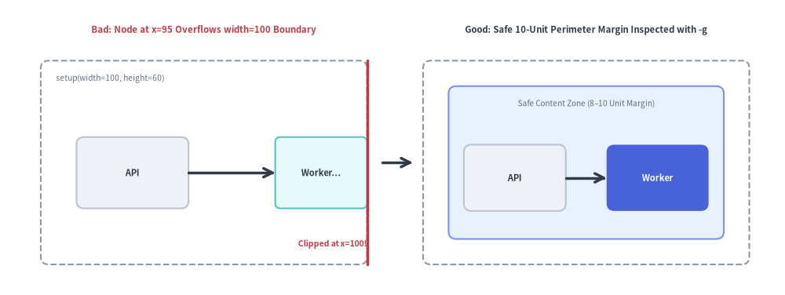

# Troubleshooting & Debugging

This guide provides solutions for common rendering errors, coordinate clipping, missing fonts, broken links, and cache anomalies when working with Drawlib.

---

## 1. Visual Geometry & Boundary Clipping

### Symptom: Shapes or Text Clipped at Canvas Edges
- **Cause**: In Drawlib's Cartesian coordinate system, `(0, 0)` is at the bottom-left. Elements placed with coordinates or radii extending beyond `width` or `height` are cropped.
- **Diagnosis**: List the blocks in your document or run `drawlib show` with the `-g` / `--grid` flag targeting the block's `file:` name:
  ```bash
  # List all drawlib blocks in the Markdown file:
  uv run drawlib show docs_src/doc.md

  # Render a specific block with the coordinate grid overlay:
  uv run drawlib show docs_src/doc.md arch.png -g -o .drawlib/scratch/debug_grid.png
  ```
  The coordinate grid reveals immediately if coordinates exceed `setup(width=..., height=...)`.
- **Solution**:
  1. Increase canvas dimensions in `setup(width=..., height=...)`.
  2. Or shift shapes inward, leaving at least 5–10 units of breathing room along all perimeter edges.


<figure class="drawlib-image" style="text-align: center;">
  
  <figcaption class="drawlib-caption">Boundary Clipping Defect vs. Safe 5%–10% Perimeter Margin with Grid (-g)</figcaption>
</figure>

<details class="drawlib-code-details">
<summary>Source Code</summary>

```python
from drawlib.canvas import save, setup
from drawlib.lines import line
from drawlib.shapes import rectangle
from drawlib.styles import Styles
from drawlib.text import text

setup(width=154, height=58)

# Left Panel: Bad (Boundary Clipping at x=100)
text((40, 52), "Bad: Node at x=95 Overflows width=100 Boundary", style=Styles.DangerBold.patch(text_size=8.2))
rectangle((40, 26), width=64, height=40, style=Styles.MutedDashed.patch(shape_r=1.5))
text((11, 42.5), "setup(width=100, height=60)", style=Styles.Muted.patch(text_size=7.2, halign="left"))

rectangle((26, 24), width=22, height=14, style=Styles.Neutral.patch(shape_r=1.5), text="API", text_style=Styles.DarkBold.patch(text_size=8.0))
# Simulated clipped box at right canvas edge (x=72)
rectangle((63, 24), width=18, height=14, style=Styles.SecondaryNeutral.patch(shape_r=1.0), text="Worker...", text_style=Styles.DarkBold.patch(text_size=8.0))
line((72, 6), (72, 46), style=Styles.DangerBold)
text((72, 10), "Clipped at x=100!", style=Styles.DangerBold.patch(text_size=7.5, halign="right"))
line((37, 24), (54, 24), arrow_head="->", style=Styles.DarkBold)

# Center Transition Arrow
line((75, 26), (81, 26), arrow_head="->", style=Styles.DarkBold)

# Right Panel: Good (Safe 10-Unit Perimeter Margin Inspected with -g)
text((115, 52), "Good: Safe 10-Unit Perimeter Margin Inspected with -g", style=Styles.DarkBold.patch(text_size=8.2))
rectangle((115, 26), width=64, height=40, style=Styles.MutedDashed.patch(shape_r=1.5))
# Inner safe-zone guide (10-unit margin)
rectangle((115, 26), width=54, height=30, style=Styles.PrimaryNeutral.patch(shape_r=1.5))
text((115, 37.5), "Safe Content Zone (8–10 Unit Margin)", style=Styles.Muted.patch(text_size=7.2))

rectangle((101, 23), width=20, height=13, style=Styles.Neutral.patch(shape_r=1.5), text="API", text_style=Styles.DarkBold.patch(text_size=8.0))
rectangle(
    (129, 23),
    width=20,
    height=13,
    style=Styles.PrimaryFlat.patch(shape_r=1.5),
    text="Worker",
    text_style=Styles.WhiteBold.patch(text_size=8.0),
)
line((111, 23), (119, 23), arrow_head="->", style=Styles.DarkBold)

save()
```

</details>


---

## 2. CLI Diagnostics & Developer Mode

By default, Drawlib formats exceptions into concise, user-friendly error summaries. When debugging deep issues or library internals:

### Enable Full Python Tracebacks (`--developer`)
```bash
uv run drawlib --developer build html docs_src/ -o docs_html/
```
Disables error suppression and prints full Python stack traces with exact file names and line numbers.

### Enable Diagnostic Logging (`--verbose` / `--debug`)
```bash
uv run drawlib --verbose build html docs_src/ -o docs_html/
```
Outputs timing metrics, image cache hits/misses, and document parsing phases.

---

## 3. Font Fallbacks & Missing Glyphs

### Symptom: Box Glyphs ("Tofu" `□`) in CJK or Non-Latin Text
- **Cause**: The active font does not contain glyphs for Chinese, Japanese, Korean, or specialized Unicode characters.
- **Solution**:
  1. Configure a CJK-capable font family (or scaffold with `drawlib init <type> --lang ja`):
     ```python
     from drawlib.fonts import FontJapanese
     from drawlib.types import Style
     
     jp_style = Style(text_font=FontJapanese.SANSSERIF_REGULAR)
     ```
  2. Ensure font assets are pre-cached:
     ```bash
     uv run drawlib cache download --fonts
     ```

---

## 4. Cache Anomalies & Stale Images

### Symptom: Changes to External Python Helper Modules Do Not Reflect in Output
- **Cause**: The SQLite diagram cache (`.drawlib/cache.db`) hashes the block's Python code, `styles.py`, `utils.py`, and string-literal local asset files. However, if a block imports an external custom Python module *outside* `styles.py` and `utils.py`, editing that external module will not automatically alter the block's SHA-256 cache key.
- **Solution**:
  1. Force clean re-rendering during build or preview:
     ```bash
     uv run drawlib build html docs_src/ -o docs_html/ --no-cache
     uv run drawlib show docs_src/doc.md arch.png -g -o .drawlib/scratch/preview.png --no-cache
     ```
  2. Or purge the SQLite image cache via the CLI (see [Caching Architecture & CI/CD](../08_doc_builder_and_cli/caching_and_cicd.md)):
     ```bash
     uv run drawlib cache clear --images
     ```

---

## 5. Broken Link & Missing Asset Auditing

### Pre-Flight Verification
Run `drawlib serve --check` before publishing your documentation site:

```bash
uv run drawlib serve docs_html/ --check
```

Drawlib scans all compiled HTML pages and verifies:
- Every `<a href="...">` internal link points to an existing file.
- Every `` source points to an existing image.
- Any orphaned or broken references are reported with exact file locations (exiting with status code `1`).

---

## 6. Common Build Error Messages & Fixes

| Error Message | Root Cause | Solution |
| :--- | :--- | :--- |
| **`Missing required 'file:...' option in drawlib code block`** | An embedded ````drawlib```` block in a `doc`, `site`, or `slide` Markdown file omitted the `file:<name>` attribute. | Add an explicit filename to the opening code fence (e.g. ```` ```drawlib 600px center file:service_arch.png caption:"..." ````). |
| **`Directory build requires "index.md" / "navbar.md"`** | Running `drawlib build html` on a `site` directory missing mandatory root files, or missing `template.html` / `style.css`. | Ensure `index.md`, `navbar.md`, `template.html`, and `style.css` exist in `docs_src/`, or scaffold with `drawlib init site`. |
| **`Refusing to overwrite input source directory / file`** | The `-o` output path points to the exact same path as the source input (`src_abs == dest_abs`). | Specify a separate output directory (e.g. `drawlib build markdown docs_src/ -o docs_markdown/`). |
| **`Duplicate output image file detected`** | Two embedded blocks in the same Markdown file share the same `file:<name>`, or two `.py` scripts in `images_src/` call `save()` with the same target path. | Assign a unique `file:<name>.png` to each block or script. |
| **`Playwright or Chromium not found`** | Running `drawlib build pdf` without Playwright or the headless Chromium binary installed. | Run `uv add "drawlib[pdf]"` (or `pip install "drawlib[pdf]"`) followed by `uv run playwright install chromium`. |
