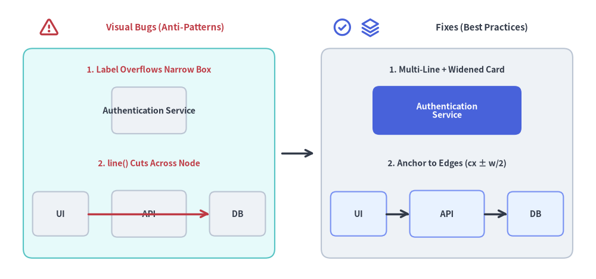

# Troubleshooting & Debugging

This guide provides solutions for common rendering errors, coordinate clipping, missing fonts, broken links, and cache anomalies when working with Drawlib.

Use `drawlib show -g` to inspect coordinate bounds and ensure shapes stay within a safe 5–10 unit perimeter margin:


<figure class="drawlib-image" style="text-align: center;">
  
  <figcaption class="drawlib-caption">Boundary Clipping Defect vs. Safe 5%–10% Perimeter Margin with Grid (-g)</figcaption>
</figure>

<details class="drawlib-code-details">
<summary>Source Code</summary>

```python
from drawlib.canvas import save, setup
from drawlib.icons import phosphor
from drawlib.lines import line
from drawlib.shapes import rectangle
from drawlib.styles import Styles
from drawlib.text import text

setup(width=128, height=58)

# Left Panel: Bad (Boundary Clipping at x=100)
phosphor.warning((10.5, 52.0), width=4.4, style=Styles.DangerBold)
text((35.5, 52.0), "Bad: Clipped at Boundary", style=Styles.DangerBold.patch(text_size=10.8))
rectangle((32, 26), width=54, height=40, style=Styles.MutedDashed.patch(shape_r=1.5))
text((9, 41.5), "setup(width=100)", style=Styles.Muted.patch(text_size=10.0, halign="left"))

rectangle((20, 24), width=18, height=14, style=Styles.Neutral.patch(shape_r=1.5), text="API", text_style=Styles.DarkBold.patch(text_size=10.5))
# Simulated clipped box at right canvas edge (x=59)
rectangle((50, 24), width=18, height=14, style=Styles.SecondaryNeutral.patch(shape_r=1.0), text="Work...", text_style=Styles.DarkBold.patch(text_size=10.5))
line((59, 6), (59, 46), style=Styles.DangerBold)
text((57, 10), "Clipped!", style=Styles.DangerBold.patch(text_size=10.2, halign="right"))
line((29, 24), (41, 24), arrow_head="->", style=Styles.DarkBold)

# Center Transition Arrow
line((60.5, 26), (67.5, 26), arrow_head="->", style=Styles.DarkBold)

# Right Panel: Good (Safe Perimeter Margin Inspected with -g)
phosphor.check_circle((73.5, 52.0), width=4.4, style=Styles.PrimaryBold)
phosphor.grid_four((79.5, 52.0), width=4.4, style=Styles.PrimaryBold)
text((103.5, 52.0), "Good: Safe Margin (-g)", style=Styles.DarkBold.patch(text_size=10.8))
rectangle((96, 26), width=54, height=40, style=Styles.MutedDashed.patch(shape_r=1.5))
# Inner safe-zone guide
rectangle((96, 26), width=46, height=32, style=Styles.PrimaryNeutral.patch(shape_r=1.5))
text((96, 37.5), "Safe Zone (Margin)", style=Styles.Muted.patch(text_size=10.0))

rectangle((84, 22), width=18, height=13, style=Styles.Neutral.patch(shape_r=1.5), text="API", text_style=Styles.DarkBold.patch(text_size=10.5))
rectangle(
    (108, 22),
    width=18,
    height=13,
    style=Styles.PrimaryFlat.patch(shape_r=1.5),
    text="Worker",
    text_style=Styles.WhiteBold.patch(text_size=10.5),
)
line((93, 22), (99, 22), arrow_head="->", style=Styles.DarkBold)

save()
```

</details>


---

## 1. Visual Geometry & Boundary Clipping

### Symptom: Shapes or Text Clipped at Canvas Edges
- **Cause**: In Drawlib's Cartesian coordinate system, `(0, 0)` is at the bottom-left. Elements placed with coordinates or radii extending beyond `width` or `height` are cropped.
- **Diagnosis**: List the blocks in your document or run `drawlib show` with the `-g` / `--grid` flag targeting the block's `file:` name:
  ```bash
  # List all drawlib blocks in the Markdown file:
  uv run drawlib show docs_src/doc.md

  # Render a specific block with the coordinate grid overlay:
  uv run drawlib show docs_src/doc.md arch.png -g -o .drawlib/scratch/debug_grid.png
  ```
  The coordinate grid reveals immediately if coordinates exceed `setup(width=..., height=...)`.
- **Solution**:
  1. Increase canvas dimensions in `setup(width=..., height=...)`.
  2. Or shift shapes inward, leaving at least 5–10 units of breathing room along all perimeter edges.

### Symptom: Label Overflow or Connector Line Cutting Across Node Text
- **Cause**:
  1. Single-line labels that are wider than the enclosing rectangle's `width` spill past the left and right borders.
  2. Drawlib uses the **Painter's Algorithm** (elements are rendered in the exact order they are called). Calling `line()` between two node centers *after* calling `rectangle()` draws the line right on top of the intermediate node's label.
- **Solution**:
  1. Insert explicit `\n` line breaks (`"Authentication\nService"`) and widen the card (e.g. `width=32`).
  2. Anchor connectors to shape perimeter edges (`cx ± width/2`) or draw background connectors *before* foreground nodes.


<figure class="drawlib-image" style="text-align: center;">
  
  <figcaption class="drawlib-caption">Common Visual Bugs and Fixes: Text Box Sizing and Painter's Algorithm Z-Order</figcaption>
</figure>

<details class="drawlib-code-details">
<summary>Source Code</summary>

```python
from drawlib.canvas import save, setup
from drawlib.icons import phosphor
from drawlib.lines import line
from drawlib.shapes import rectangle
from drawlib.styles import Styles
from drawlib.text import text

setup(width=128, height=60)

# Left Panel: Common Visual Bugs (Anti-Patterns)
phosphor.warning((10.5, 54.0), width=4.4, style=Styles.DangerBold)
text((35.5, 54.0), "Visual Bugs (Anti-Patterns)", style=Styles.DangerBold.patch(text_size=10.8))
rectangle((32, 27.0), width=54, height=45, style=Styles.SecondaryNeutral.patch(shape_r=2.0))

# Bug 1: Narrow box where "Auth Service" overflows borders
text((32, 45.0), "1. Label Overflows Narrow Box", style=Styles.DangerBold.patch(text_size=10.0))
rectangle(
    (32, 36.2),
    width=16,
    height=10,
    style=Styles.Neutral.patch(shape_r=1.2),
    text="Authentication Service",
    text_style=Styles.DarkBold.patch(text_size=10.2),
)

# Bug 2: Connector line drawn after node cuts across text label
text((32, 24.8), "2. line() Cuts Across Node", style=Styles.DangerBold.patch(text_size=10.0))
rectangle((13, 14.0), width=12, height=9.5, style=Styles.Neutral.patch(shape_r=1.2), text="UI", text_style=Styles.DarkBold.patch(text_size=10.0))
rectangle((32, 14.0), width=16, height=10.0, style=Styles.Neutral.patch(shape_r=1.2), text="API", text_style=Styles.DarkBold.patch(text_size=10.2))
rectangle((51, 14.0), width=12, height=9.5, style=Styles.Neutral.patch(shape_r=1.2), text="DB", text_style=Styles.DarkBold.patch(text_size=10.0))
line((19, 14.0), (45, 14.0), arrow_head="->", style=Styles.DangerBold)

# Center Transition Arrow
line((60.5, 27.0), (67.5, 27.0), arrow_head="->", style=Styles.DarkBold)

# Right Panel: Recommended Fixes (Best Practices)
phosphor.check_circle((73.5, 54.0), width=4.4, style=Styles.PrimaryBold)
phosphor.stack((79.5, 54.0), width=4.4, style=Styles.PrimaryBold)
text((103.5, 54.0), "Fixes (Best Practices)", style=Styles.DarkBold.patch(text_size=10.8))
rectangle((96, 27.0), width=54, height=45, style=Styles.Neutral.patch(shape_r=2.0))

# Fix 1: Multi-line wrap + widened card (width=32)
text((96, 45.0), "1. Multi-Line + Widened Card", style=Styles.DarkBold.patch(text_size=10.0))
rectangle(
    (96, 36.2),
    width=32,
    height=10.5,
    style=Styles.PrimaryFlat.patch(shape_r=1.5),
    text="Authentication\nService",
    text_style=Styles.WhiteBold.patch(text_size=10.2),
)

# Fix 2: Perimeter-anchored connectors (cx ± w/2) & clean Z-order
text((96, 24.8), "2. Anchor to Edges (cx ± w/2)", style=Styles.DarkBold.patch(text_size=10.0))
rectangle((77, 14.0), width=12, height=9.5, style=Styles.PrimaryNeutral.patch(shape_r=1.2), text="UI", text_style=Styles.DarkBold.patch(text_size=10.0))
rectangle((96, 14.0), width=16, height=10.0, style=Styles.PrimaryNeutral.patch(shape_r=1.2), text="API", text_style=Styles.DarkBold.patch(text_size=10.2))
rectangle((115, 14.0), width=12, height=9.5, style=Styles.PrimaryNeutral.patch(shape_r=1.2), text="DB", text_style=Styles.DarkBold.patch(text_size=10.0))
line((83, 14.0), (88, 14.0), arrow_head="->", style=Styles.DarkBold)
line((104, 14.0), (109, 14.0), arrow_head="->", style=Styles.DarkBold)

save()
```

</details>


---

## 2. CLI Diagnostics & Developer Mode

By default, Drawlib formats exceptions into concise, user-friendly error summaries. When debugging deep issues or library internals:

### Enable Full Python Tracebacks (`--developer`)
```bash
uv run drawlib --developer build html docs_src/ -o docs_html/
```
Disables error suppression and prints full Python stack traces with exact file names and line numbers.

### Enable Diagnostic Logging (`--verbose` / `--debug`)
```bash
uv run drawlib --verbose build html docs_src/ -o docs_html/
```
Outputs timing metrics, image cache hits/misses, and document parsing phases.

---

## 3. Font Fallbacks & Missing Glyphs

### Symptom: Box Glyphs ("Tofu" `□`) in CJK or Non-Latin Text
- **Cause**: The active font does not contain glyphs for Chinese, Japanese, Korean, or specialized Unicode characters.
- **Solution**:
  1. Configure a CJK-capable font family (or scaffold with `drawlib init <type> --lang ja`):
     ```python
     from drawlib.fonts import FontJapanese
     from drawlib.types import Style
     
     jp_style = Style(text_font=FontJapanese.SANSSERIF_REGULAR)
     ```
  2. Ensure font assets are pre-cached:
     ```bash
     uv run drawlib cache download --fonts
     ```

---

## 4. Cache Anomalies & Stale Images

### Symptom: Changes to External Python Helper Modules Do Not Reflect in Output
- **Cause**: The SQLite diagram cache (`.drawlib/cache.db`) hashes the block's Python code, `styles.py`, `utils.py`, and string-literal local asset files. However, if a block imports an external custom Python module *outside* `styles.py` and `utils.py`, editing that external module will not automatically alter the block's SHA-256 cache key.
- **Solution**:
  1. Force clean re-rendering during build or preview:
     ```bash
     uv run drawlib build html docs_src/ -o docs_html/ --no-cache
     uv run drawlib show docs_src/doc.md arch.png -g -o .drawlib/scratch/preview.png --no-cache
     ```
  2. Or purge the SQLite image cache via the CLI (see [Caching Architecture & CI/CD](../08_doc_builder_and_cli/caching_and_cicd.md)):
     ```bash
     uv run drawlib cache clear --images
     ```

---

## 5. Broken Link & Missing Asset Auditing

### Pre-Flight Verification
Run `drawlib serve --check` before publishing your documentation site:

```bash
uv run drawlib serve docs_html/ --check
```

Drawlib scans all compiled HTML pages and verifies:
- Every `<a href="...">` internal link points to an existing file.
- Every `` source points to an existing image.
- Any orphaned or broken references are reported with exact file locations (exiting with status code `1`).

---

## 6. Common Build Error Messages & Fixes

| Error Message | Root Cause | Solution |
| :--- | :--- | :--- |
| **`Missing required 'file:...' option in drawlib code block`** | An embedded ````drawlib```` block in a `doc`, `site`, or `slide` Markdown file omitted the `file:<name>` attribute. | Add an explicit filename to the opening code fence (e.g. ```` ```drawlib fold-code center file:service_arch.png caption:"..." ````). |
| **`Directory build requires "index.md" / "navbar.md"`** | Running `drawlib build html` on a `site` directory missing mandatory root files, or missing `template.html` / `style.css`. | Ensure `index.md`, `navbar.md`, `template.html`, and `style.css` exist in `docs_src/`, or scaffold with `drawlib init site`. |
| **`Refusing to overwrite input source directory / file`** | The `-o` output path points to the exact same path as the source input (`src_abs == dest_abs`). | Specify a separate output directory (e.g. `drawlib build markdown docs_src/ -o docs_markdown/`). |
| **`Duplicate output image file detected`** | Two embedded blocks in the same Markdown file share the same `file:<name>`, or two `.py` scripts in `images_src/` call `save()` with the same target path. | Assign a unique `file:<name>.png` to each block or script. |
| **`Playwright or Chromium not found`** | Running `drawlib build pdf` without Playwright or the headless Chromium binary installed. | Run `uv add "drawlib[pdf]"` (or `pip install "drawlib[pdf]"`) followed by `uv run playwright install chromium`. |
