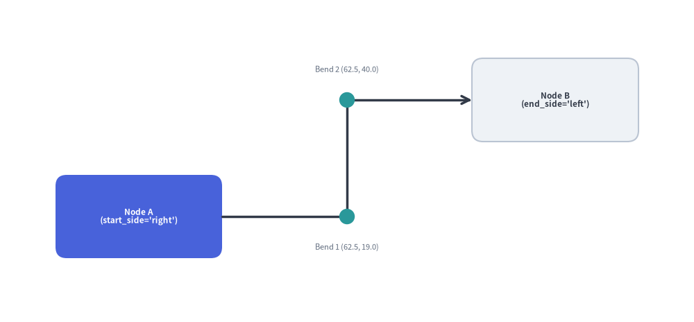
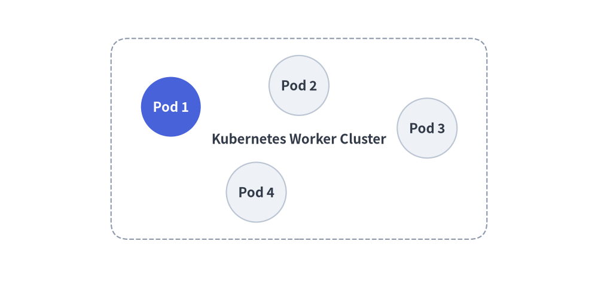
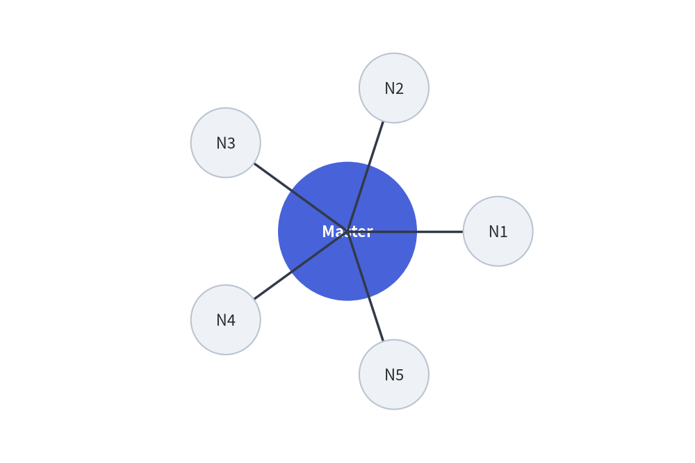
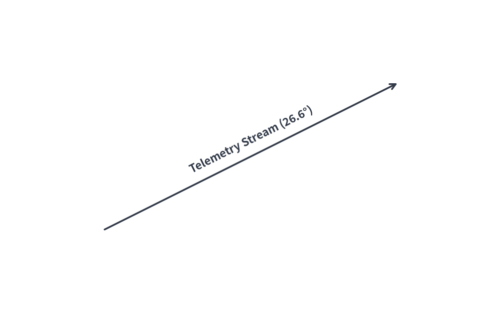

# Mathematical Utilities & Dynamic Geometric Layouts (`drawlib.math`)

Drawlib provides geometric and mathematical calculation utilities to streamline coordinate positioning, angle derivations, distance measurements, and dynamic bounding box computations for technical diagrams.

---

## 1. Imports & Core Functions

All public math, interpolation, transformation, and routing utilities are imported from `drawlib.math`:

```python
from drawlib.math import (
    # Distance, Angle & Bounding Box
    get_angle,                     # Calculate angle in degrees [0, 360) from point A to point B
    get_center_and_size,           # Compute center coordinates and bounding box dimensions
    get_distance,                  # Compute Euclidean distance between two points
    # Linear & Polyline Trajectory Interpolation
    get_intermediate_point,        # Compute the 50% midpoint between two points
    get_intermediate_points,       # Compute evenly spaced points along a straight segment
    get_intermediate_path_point,   # Compute 50% arc-length midpoint along a polyline path
    get_intermediate_path_points,  # Compute evenly spaced points along a polyline path
    get_intermediate_paths,        # Compute progressive partial sub-paths along a polyline
    # Vector Arithmetic, Rotation & Ellipse Geometry
    plus_2points,                  # Element-wise vector addition (x1 + x2, y1 + y2)
    minus_2points,                 # Element-wise vector subtraction (x1 - x2, y1 - y2)
    rotate_point,                  # Rotate a single point around a center by angle in degrees
    get_rotated_points,            # Rotate a list of points around a center by angle in degrees
    get_rotated_path_points,       # Rotate path points (including Bezier control tuples)
    get_point_on_ellipse,          # Calculate point on ellipse perimeter at a given angle
    # Orthogonal Waypoint Routing
    compute_orthogonal_path,       # Compute right-angled or direct waypoints between two anchors
    Side,                          # Literal["left", "right", "top", "bottom"]
    RoutingType,                   # Literal["direct", "orthogonal"]
)
```

---

## 2. Function Specifications

### 2.1 `get_angle(xy1, xy2) -> float`
Calculates the counter-clockwise angle in degrees from point `xy1` to point `xy2`:
- **Reference**: 0° points horizontally along the positive X-axis (East).
- **Range**: `[0.0, 360.0)`.
  - Point to the right: `0.0°`
  - Point directly above: `90.0°`
  - Point to the left: `180.0°`
  - Point directly below: `270.0°`
- **Primary Use Case**: Aligning text labels or rotating directional icons parallel to slanted connection lines.

### 2.2 `get_distance(xy1, xy2) -> float`
Calculates the Euclidean distance $\sqrt{(x_2 - x_1)^2 + (y_2 - y_1)^2}$ between two points:
- **Primary Use Case**: Determining line lengths, collision thresholds, and radial distribution spacing.

### 2.3 `get_center_and_size(xys) -> tuple[tuple[float, float], tuple[float, float]]`
Computes the geometric midpoint and outer bounding box dimensions for an arbitrary collection of coordinates:
- **Returns**: `((center_x, center_y), (width, height))`.
- **Primary Use Case**: Dynamically enclosing multiple service nodes inside an automated background container rectangle with uniform padding.

### 2.4 `get_intermediate_point(xy1, xy2)` & `get_intermediate_points(xy1, xy2, num=1, *, include_ends=False)`
Computes linearly interpolated coordinates between `xy1` and `xy2`:
- **`get_intermediate_point(xy1, xy2) -> tuple[float, float]`**: Returns the exact 50% midpoint `(mx, my)`.
- **`get_intermediate_points(xy1, xy2, num=1, *, include_ends=False) -> list[tuple[float, float]]`**: Returns `num` evenly spaced intermediate points (or `num + 2` points including `xy1` and `xy2` when `include_ends=True`).
- **Primary Use Case**: Animating moving packets or progressively extending block arrows (`arrow(xy1, pt, ...)`) and lines across frames.

### 2.5 `get_intermediate_path_point(xys)`, `get_intermediate_path_points(xys, ...)` & `get_intermediate_paths(xys, ...)`
Computes trajectory-aware intermediate points and progressive prefix sub-paths along a multi-point polyline `xys` (such as L-shaped or U-shaped routes):
- **`get_intermediate_path_point(xys) -> tuple[float, float]`**: Returns the coordinate at 50% of the total arc length along `xys` (e.g., the center of the bottom bar of a U-shaped path).
- **`get_intermediate_path_points(xys, num=1, *, include_ends=False) -> list[tuple[float, float]]`**: Returns `num` evenly spaced `(x, y)` coordinates along the trajectory of `xys` (or `num + 2` points with `include_ends=True`).
- **`get_intermediate_paths(xys, num=1, *, include_ends=False) -> list[list[tuple[float, float]]]`**: Returns `num` progressive partial coordinate lists `[(x0, y0), ..., (xt, yt)]` starting at `xys[0]`, passing through all corners reached so far, and ending at the step's tip (plus the full `xys` at the end when `include_ends=True`). Ideal for growing `lines()`, `lines_curved()`, or `arrow_polyline()` along L/U trajectories.

### 2.6 Vector Arithmetic, Rotation & Ellipse Helpers
- **`plus_2points(xy1, xy2)` / `minus_2points(xy1, xy2)`**: Element-wise 2D coordinate addition `(x1 + x2, y1 + y2)` and subtraction `(x1 - x2, y1 - y2)`.
- **`rotate_point(xy, angle, center=(0.0, 0.0))`**: Rotates `xy` counter-clockwise by `angle` degrees around `center`.
- **`get_rotated_points(xys, center, angle)` / `get_rotated_path_points(path_points, center, angle)`**: Rotates a list of polygon vertices or Bezier path control points around `center`.
- **`get_point_on_ellipse(center, width, height, angle)`**: Computes the `(x, y)` boundary point on an ellipse of size `(width, height)` at `angle` degrees (`0°` = East, `90°` = North).

### 2.7 Orthogonal Waypoint Routing (`compute_orthogonal_path`)
Computes right-angled (`"orthogonal"`) or straight (`"direct"`) polyline waypoints connecting two anchor coordinates given their exit/entry boundary sides (`"left"`, `"right"`, `"top"`, `"bottom"`):


```python
from drawlib.canvas import save, setup
from drawlib.lines import lines
from drawlib.math import compute_orthogonal_path
from drawlib.shapes import circle, rectangle
from drawlib.styles import Styles
from drawlib.text import text

setup(width=125, height=58)

# 1. Draw anchor nodes (Node A right edge = 40.0, Node B left edge = 85.0)
rectangle(
    (25, 19),
    width=30,
    height=15,
    style=Styles.PrimaryFlat.patch(shape_r=2.0),
    text="Node A\n(start_side='right')",
    text_style=Styles.WhiteBold.patch(text_size=8.5),
)
rectangle(
    (100, 40),
    width=30,
    height=15,
    style=Styles.Neutral.patch(shape_r=2.0),
    text="Node B\n(end_side='left')",
    text_style=Styles.DarkBold.patch(text_size=8.5),
)

# 2. Compute orthogonal Z-bend waypoints: [(40.0, 19.0), (62.5, 19.0), (62.5, 40.0), (85.0, 40.0)]
waypoints = compute_orthogonal_path(
    start_pt=(40.0, 19.0),
    end_pt=(85.0, 40.0),
    start_side="right",
    end_side="left",
    routing="orthogonal",
    offset=3.0,
)

# 3. Render orthogonal connector and intermediate bend markers
lines(waypoints, style=Styles.DarkBold, arrow_head="->")
for wx, wy in waypoints[1:-1]:
    circle((wx, wy), radius=1.4, style=Styles.SecondaryFlat)

text((62.5, 13.5), "Bend 1 (62.5, 19.0)", style=Styles.Muted.patch(text_size=8.0))
text((62.5, 45.5), "Bend 2 (62.5, 40.0)", style=Styles.Muted.patch(text_size=8.0))

save()
```

<figure class="drawlib-image" style="text-align: center;">
  
  <figcaption class="drawlib-caption">Orthogonal Z-Bend Waypoint Routing Computed by compute_orthogonal_path()</figcaption>
</figure>


---

## 3. Dynamic Automated Grouping Box

Using `get_center_and_size()`, you can calculate the exact boundary of a cluster of service nodes and draw an encompassing card behind them:


```python
from drawlib.canvas import save, setup
from drawlib.math import get_center_and_size
from drawlib.shapes import circle, rectangle
from drawlib.styles import Styles

setup(width=140, height=70)

# 1. Define service node positions
nodes = [(40, 45), (70, 50), (100, 40), (60, 25)]

# 2. Calculate dynamic bounding box
(cx, cy), (bw, bh) = get_center_and_size(nodes)

# 3. Draw background container with +28 width and +22 height padding
rectangle(
    (cx, cy),
    width=bw + 28,
    height=bh + 22,
    style=Styles.MutedDashed.patch(shape_r=4),
    text="Kubernetes Worker Cluster",
    text_style=Styles.DarkBold,
)

# 4. Render nodes
for i, (x, y) in enumerate(nodes, start=1):
    st = Styles.PrimaryFlat if i == 1 else Styles.Neutral
    t_st = Styles.WhiteBold if i == 1 else Styles.DarkBold
    circle((x, y), radius=7, style=st, text=f"Pod {i}", text_style=t_st)
save()
```

<figure class="drawlib-image" style="text-align: center;">
  
  <figcaption class="drawlib-caption">Automated Grouping Box via get_center_and_size()</figcaption>
</figure>


---

## 4. Radial Circular Node Distribution

To distribute $N$ worker nodes symmetrically around a central hub:


```python
import math
from drawlib.canvas import save, setup
from drawlib.lines import line
from drawlib.math import get_angle, get_distance
from drawlib.shapes import circle
from drawlib.styles import Styles

setup(width=120, height=80)

hub = (60, 40)
radius = 26
num_clients = 5

# Central Hub
circle(hub, radius=12, style=Styles.PrimaryFlat, text="Master", text_style=Styles.WhiteBold)

# Surrounding Worker Nodes
for i in range(num_clients):
    angle_rad = 2 * math.pi * i / num_clients
    node_xy = (hub[0] + radius * math.cos(angle_rad), hub[1] + radius * math.sin(angle_rad))
    
    # Calculate connection angle and distance
    dist = get_distance(hub, node_xy)
    angle_deg = get_angle(hub, node_xy)
    
    line(hub, node_xy, style=Styles.DarkBold)
    circle(node_xy, radius=6, style=Styles.Neutral, text=f"N{i+1}")
save()
```

<figure class="drawlib-image" style="text-align: center;">
  
  <figcaption class="drawlib-caption">Radial Topology with Polar Math Distribution</figcaption>
</figure>


---

## 5. Slanted Connection Line Text Alignment

Align text labels parallel to angled lines using `get_angle()`:


```python
from drawlib.canvas import save, setup
from drawlib.lines import line
from drawlib.math import get_angle
from drawlib.styles import Styles
from drawlib.text import text

setup(width=120, height=80)

p1 = (25, 25)
p2 = (95, 60)

# Draw slanted wire
line(p1, p2, arrow_head="->", style=Styles.DarkBold)

# Calculate rotation angle and midpoint
angle = get_angle(p1, p2)
midpoint = ((p1[0] + p2[0]) / 2, (p1[1] + p2[1]) / 2 + 4)

# Render rotated text parallel to the connection
text(midpoint, f"Telemetry Stream ({angle:.1f}°)", style=Styles.DarkBold.patch(angle=angle))
save()
```

<figure class="drawlib-image" style="text-align: center;">
  
  <figcaption class="drawlib-caption">Parallel Text on Angled Line</figcaption>
</figure>


