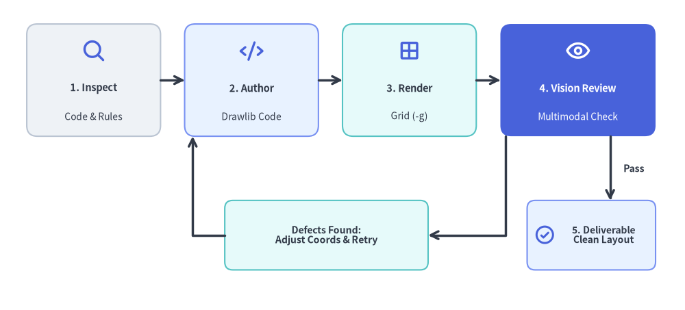
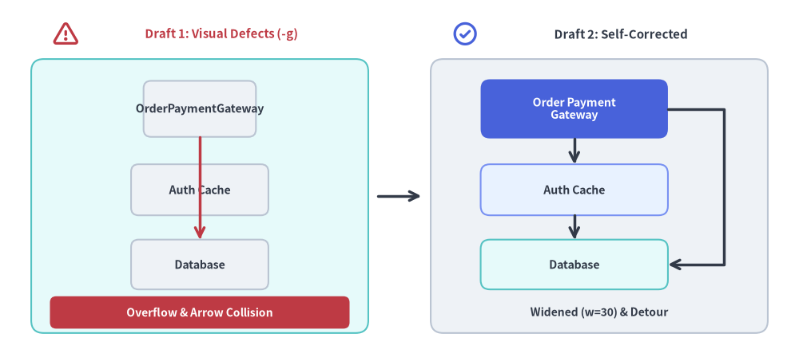

# The Autonomous Multimodal Visual Feedback Loop

A key strength of modern AI coding assistants equipped with vision tools (such as Claude 3.5 Sonnet, Gemini 1.5 Pro, and GPT-4o) is the ability to visually inspect their own drawings before presenting them to the user.

Drawlib is engineered specifically to empower this autonomous self-correction loop.


<figure class="drawlib-image" style="text-align: center;">
  
  <figcaption class="drawlib-caption">The Autonomous Multimodal AI Visual Self-Correction Loop</figcaption>
</figure>

<details class="drawlib-code-details">
<summary>Source Code</summary>

```python
from drawlib.canvas import save, setup
from drawlib.icons import phosphor
from drawlib.lines import line, lines
from drawlib.shapes import rectangle
from drawlib.styles import Styles
from drawlib.text import text

setup(width=128, height=58)

# Top Row: Stages 1 to 4
stages = [
    (17.5, "1. Inspect", "Code & Rules", Styles.Neutral, Styles.DarkBold, Styles.Dark, phosphor.magnifying_glass, Styles.PrimaryBold),
    (47.0, "2. Author", "Drawlib Code", Styles.PrimaryNeutral, Styles.DarkBold, Styles.Dark, phosphor.code, Styles.PrimaryBold),
    (76.5, "3. Render", "Grid (-g)", Styles.SecondaryNeutral, Styles.DarkBold, Styles.Dark, phosphor.grid_four, Styles.PrimaryBold),
    (108.0, "4. Vision Review", "Multimodal Check", Styles.PrimaryFlat, Styles.WhiteBold, Styles.White, phosphor.eye, Styles.WhiteBold),
]
for sx, title, sub, st, tst, sub_st, icon_fn, icon_st in stages:
    w = 29 if sx > 100 else 25
    rectangle((sx, 43.0), width=w, height=21, style=st.patch(shape_r=2.0))
    icon_fn((sx, 48.5), width=4.6, style=icon_st)
    text((sx, 41.5), title, style=tst.patch(text_size=10.5))
    text((sx, 36.2), sub, style=sub_st.patch(text_size=10.0))

# Forward Connectors (1 -> 2 -> 3 -> 4)
line((30.0, 43.0), (34.5, 43.0), arrow_head="->", style=Styles.DarkBold)
line((59.5, 43.0), (64.0, 43.0), arrow_head="->", style=Styles.DarkBold)
line((89.0, 43.0), (93.5, 43.0), arrow_head="->", style=Styles.DarkBold)

# Decision Branch A: Defects Found -> Loop Back to Step 2
rectangle(
    (61.0, 14.0),
    width=38,
    height=13,
    style=Styles.SecondaryNeutral.patch(shape_r=1.5),
    text="Defects Found:\nAdjust Coords & Retry",
    text_style=Styles.DarkBold.patch(text_size=10.2),
)
lines([(94.5, 32.5), (94.5, 14.0), (80.0, 14.0)], arrow_head="->", style=Styles.DarkBold)
lines([(42.0, 14.0), (36.0, 14.0), (36.0, 32.5)], arrow_head="->", style=Styles.DarkBold)

# Decision Branch B: Pass -> Step 5 Final Deliverable
rectangle((110.5, 14.0), width=24, height=13, style=Styles.PrimaryNeutral.patch(shape_r=1.5))
phosphor.check_circle((101.8, 14.0), width=4.0, style=Styles.PrimaryBold)
text((112.8, 14.0), "5. Deliverable\nClean Layout", style=Styles.DarkBold.patch(text_size=10.0))
line((114.0, 32.5), (114.0, 20.5), arrow_head="->", style=Styles.DarkBold)
text((116.5, 26.5), "Pass", style=Styles.DarkBold.patch(text_size=10.2, halign="left"))

save()
```

</details>


---

## 1. The Autonomous Feedback Cycle

### Stage 1: Inspect Context
Rather than imagining an architecture from thin air, the agent inspects real repository source code (`models.py`, API routes, microservice configurations).

### Stage 2: Prototype in Isolated Scratch Space (`.drawlib/scratch/`)
The agent drafts the drawing prototype code in an isolated scratch file (`.drawlib/scratch/test_diagram.py`) or tests a specific block instead of altering production assets blindly. Do NOT pollute the project root; ensure `.drawlib/` is in `.gitignore`.

### Stage 3: Headless Render with Coordinate Grid (`-g`)
The agent executes `drawlib show` with the `-g` flag to render the diagram overlaid with coordinate axes, tick marks, and numeric coordinate labels (targeting embedded Markdown blocks by their explicit `file:` name rather than fragile numeric index):

```bash
# Render an embedded Markdown block by explicit filename with coordinate grid (Recommended):
uv run drawlib show docs_src/architecture.md service_mesh.png -g -o .drawlib/scratch/preview.png

# Or render a standalone Python script with coordinate grid:
uv run drawlib show .drawlib/scratch/test_diagram.py -g -o .drawlib/scratch/test_diagram.png
```

### Stage 4: Multimodal Inspection
Using vision inspection tools (such as `view_file` or an image viewer), the agent examines the rendered output for five common visual defects:
1. **Text Overflow & Clipping**: Did a long service name or method label spill outside its enclosing box?
2. **Line & Arrow Overlaps**: Are orthogonal lines colliding awkwardly, or are arrowheads obscured by shapes?
3. **Canvas Margin Starvation**: Are outermost elements pushed right up against the canvas boundary with zero padding?
4. **Color Contrast**: Is dark text placed over dark shape fills, or light text on pale backgrounds?
5. **Color Overuse (Rainbow Chaos)**: Are all boxes colored with saturated fills? Ground 50%+ of nodes in calm neutral or tinted-neutral styles (`Styles.Neutral`, `Styles.NeutralFlat`, `Styles.PrimaryNeutral`, `Styles.SecondaryNeutral`) and reserve saturated hero fills (`Styles.PrimaryFlat`) for 1–2 key focal points.

### Stage 5: Iterative Refinement
Because the coordinate grid directly reveals the exact `(x, y)` location of every visual defect, the agent can adjust coordinates deterministically (e.g. "Move box X from 45.0 to 52.0 to eliminate overlap") rather than guessing.


<figure class="drawlib-image" style="text-align: center;">
  
  <figcaption class="drawlib-caption">Before vs. After Multimodal Self-Correction Using the Coordinate Grid (-g)</figcaption>
</figure>

<details class="drawlib-code-details">
<summary>Source Code</summary>

```python
from drawlib.canvas import save, setup
from drawlib.icons import phosphor
from drawlib.lines import line, lines
from drawlib.shapes import rectangle
from drawlib.styles import Styles
from drawlib.text import text

setup(width=128, height=58)

# Left Panel: Draft 1 with Visual Defects
phosphor.warning((10.5, 52.5), width=4.4, style=Styles.DangerBold)
text((35.5, 52.5), "Draft 1: Visual Defects (-g)", style=Styles.DangerBold.patch(text_size=10.8))
rectangle((32, 26.5), width=54, height=44, style=Styles.SecondaryNeutral.patch(shape_r=2.0))

# Narrow box (width=18) causing label overflow
rectangle(
    (32, 40.5),
    width=18,
    height=9.0,
    style=Styles.Neutral.patch(shape_r=1.2),
    text="OrderPaymentGateway",
    text_style=Styles.DarkBold.patch(text_size=10.2),
)
rectangle(
    (32, 27.5),
    width=22,
    height=8.2,
    style=Styles.Neutral.patch(shape_r=1.2),
    text="Auth Cache",
    text_style=Styles.DarkBold.patch(text_size=10.2),
)
rectangle(
    (32, 15.5),
    width=22,
    height=8.0,
    style=Styles.Neutral.patch(shape_r=1.2),
    text="Database",
    text_style=Styles.DarkBold.patch(text_size=10.2),
)
# Colliding arrow cutting straight through intermediate node
line((32, 36.0), (32, 19.5), arrow_head="->", style=Styles.DangerBold)

rectangle(
    (32, 7.8),
    width=48,
    height=5.2,
    style=Styles.DangerFlat.patch(shape_r=1.0),
    text="Overflow & Arrow Collision",
    text_style=Styles.WhiteBold.patch(text_size=10.0),
)

# Center Transition Arrow
line((60.5, 26.5), (67.5, 26.5), arrow_head="->", style=Styles.DarkBold)

# Right Panel: Draft 2 Self-Corrected
phosphor.check_circle((74.5, 52.5), width=4.4, style=Styles.PrimaryBold)
text((99.5, 52.5), "Draft 2: Self-Corrected", style=Styles.DarkBold.patch(text_size=10.8))
rectangle((96, 26.5), width=54, height=44, style=Styles.Neutral.patch(shape_r=2.0))

rectangle(
    (92, 40.5),
    width=30,
    height=9.5,
    style=Styles.PrimaryFlat.patch(shape_r=1.5),
    text="Order Payment\nGateway",
    text_style=Styles.WhiteBold.patch(text_size=10.2),
)
rectangle(
    (92, 27.5),
    width=30,
    height=8.2,
    style=Styles.PrimaryNeutral.patch(shape_r=1.5),
    text="Auth Cache",
    text_style=Styles.DarkBold.patch(text_size=10.2),
)
rectangle(
    (92, 15.5),
    width=30,
    height=8.0,
    style=Styles.SecondaryNeutral.patch(shape_r=1.5),
    text="Database",
    text_style=Styles.DarkBold.patch(text_size=10.2),
)

# Clean step connectors & orthogonal detour routing around intermediate node
line((92, 35.75), (92, 31.6), arrow_head="->", style=Styles.DarkBold)
line((92, 23.4), (92, 19.5), arrow_head="->", style=Styles.DarkBold)
lines([(107, 40.5), (116, 40.5), (116, 15.5), (107, 15.5)], arrow_head="->", style=Styles.DarkBold)

text((96, 7.8), "Widened (w=30) & Detour", style=Styles.DarkBold.patch(text_size=10.0))

save()
```

</details>


### Stage 6: Deliver Final Asset
The agent compiles the clean, verified drawing into the document or commits the Python script with 100% confidence.

---

## 2. Visual Self-Repair Checklist

When performing a multimodal self-review, check off each item in this matrix:

| Verification Area | Common Visual Flaw | Deterministic Fix |
|---|---|---|
| **Canvas Padding** | Outer nodes or labels touching canvas perimeter | Increase canvas dimensions in `setup(width=..., height=...)` or inset outer shapes by at least `8–12` units from all edges. |
| **Node Alignment** | Jagged, slightly crooked horizontal or vertical connection lines | Ensure horizontally aligned nodes share the exact same `y` coordinate and vertically stacked nodes share the exact same `x` coordinate. |
| **Label Breathing Room** | Multi-line text touching or overflowing card borders | Increase box `width` / `height`, insert explicit `\n` line breaks, or lower `text_size` via `.patch(text_size=...)`. |
| **Arrowheads & Edge Labels** | Arrowhead clipped inside target node, or parallel edge labels colliding | Add `padding=1.5` or `2.0` on connectors, route return paths onto distinct sides (`from_side="bottom"`, `to_side="bottom"`), or use `label_offset=(dx, dy)`. |
| **50%+ Neutral Baseline** | Confusing multi-color "rainbow" diagram where every node competes for attention | Ground 50%+ of shapes in calm neutral styles (`Styles.Neutral`, `Styles.PrimaryNeutral`, `Styles.SecondaryNeutral`), use `Styles.MutedDashed` for boundary containers, and reserve saturated hero fills (`Styles.PrimaryFlat`) for 1–2 focal components. |
| **Text Luminance Contrast** | Dark text over dark `Flat` fill or white text over light `Neutral` fill | Always pair saturated `Flat` fills (`Styles.PrimaryFlat`, `Styles.DangerFlat`) with `text_style=Styles.WhiteBold`, and light `Neutral` fills with `Styles.DarkBold` or `Styles.Dark`. |
