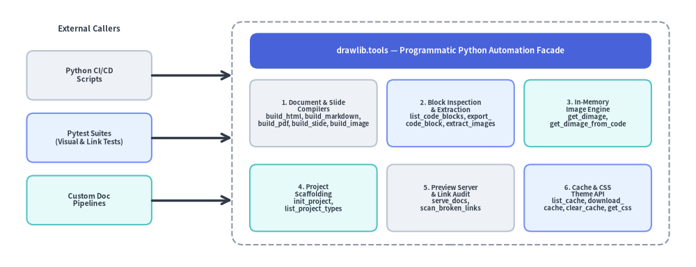
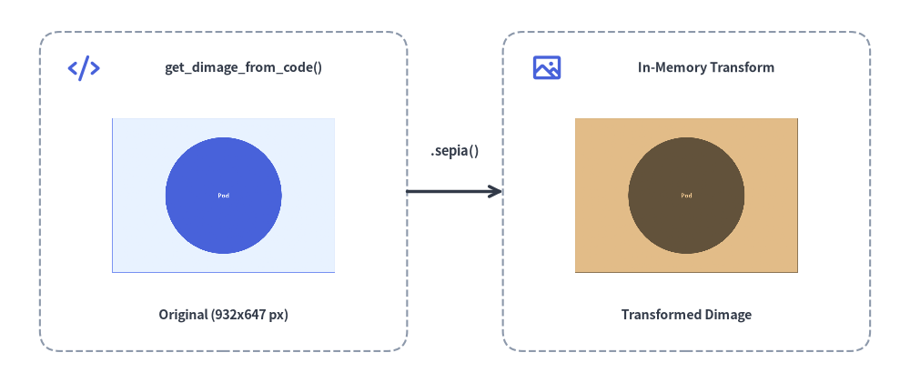

# Programmatic Python API (`drawlib.tools`)

While the `drawlib` CLI provides terminal commands for common workflows, Drawlib exposes a comprehensive Python developer API under `drawlib.tools`. This API allows you to integrate document compilation, diagram export, image snapshot testing, and template automation directly into CI/CD pipelines, web servers, and custom build scripts.

---

## 1. Module Overview & Complete Exports (`drawlib.tools`)

```python
from drawlib.tools import (
    # Document, Slide, & Image Compilation
    build_document,
    build_html,
    build_markdown,
    build_pdf,
    build_slide,
    build_image,
    detect_document_type,
    # Single Diagram Extraction & Desktop Preview
    export_code_block,
    show_code_block,
    # Project Scaffolding
    init_project,
    list_project_types,
    # Local Preview Server & Broken Link Scanner
    serve_docs,
    scan_broken_links,
    # Cache Management
    list_cache,
    clear_cache,
    download_cache,
    # CSS Stylesheet Presets
    list_css,
    list_html_css,
    list_pdf_css,
    list_slide_css,
    get_css,
    export_css,
)
```


<figure class="drawlib-image" style="text-align: center;">
  
  <figcaption class="drawlib-caption">Architecture of the drawlib.tools Programmatic Automation API</figcaption>
</figure>

<details class="drawlib-code-details">
<summary>Source Code</summary>

```python
from drawlib.canvas import save, setup
from drawlib.lines import line
from drawlib.shapes import rectangle
from drawlib.styles import Styles
from drawlib.text import text

setup(width=156, height=60)

# Left Column: External Callers
text((20, 53.5), "External Callers", style=Styles.DarkBold.patch(text_size=8.2))

rectangle(
    (20, 43),
    width=28,
    height=11,
    style=Styles.Neutral.patch(shape_r=1.5),
    text="Python CI/CD\nScripts",
    text_style=Styles.DarkBold.patch(text_size=7.5),
)
rectangle(
    (20, 29),
    width=28,
    height=11,
    style=Styles.PrimaryNeutral.patch(shape_r=1.5),
    text="Pytest Suites\n(Visual & Link Tests)",
    text_style=Styles.DarkBold.patch(text_size=7.3),
)
rectangle(
    (20, 15),
    width=28,
    height=11,
    style=Styles.SecondaryNeutral.patch(shape_r=1.5),
    text="Custom Doc\nPipelines",
    text_style=Styles.DarkBold.patch(text_size=7.5),
)

# Right Container: drawlib.tools Facade + 3x2 Subsystem Grid
rectangle((101, 30), width=98, height=50, style=Styles.MutedDashed.patch(shape_r=2.5))

rectangle(
    (101, 48.5),
    width=90,
    height=8.0,
    style=Styles.PrimaryFlat.patch(shape_r=1.8),
    text="drawlib.tools — Programmatic Python Automation Facade",
    text_style=Styles.WhiteBold.patch(text_size=8.2),
)

# Row 1 of 3x2 Grid
rectangle(
    (70.25, 34.5),
    width=28.5,
    height=15,
    style=Styles.Neutral.patch(shape_r=1.5),
    text="1. Document & Slide\nCompilers\nbuild_html, build_markdown,\nbuild_pdf, build_slide, build_image",
    text_style=Styles.DarkBold.patch(text_size=6.5),
)
rectangle(
    (101.0, 34.5),
    width=28.5,
    height=15,
    style=Styles.PrimaryNeutral.patch(shape_r=1.5),
    text="2. Block Inspection\n& Extraction\nlist_code_blocks, export_\ncode_block, extract_images",
    text_style=Styles.DarkBold.patch(text_size=6.8),
)
rectangle(
    (131.75, 34.5),
    width=28.5,
    height=15,
    style=Styles.SecondaryNeutral.patch(shape_r=1.5),
    text="3. In-Memory\nImage Engine\nget_dimage,\nget_dimage_from_code",
    text_style=Styles.DarkBold.patch(text_size=6.8),
)

# Row 2 of 3x2 Grid
rectangle(
    (70.25, 15.5),
    width=28.5,
    height=15,
    style=Styles.SecondaryNeutral.patch(shape_r=1.5),
    text="4. Project\nScaffolding\ninit_project,\nlist_project_types",
    text_style=Styles.DarkBold.patch(text_size=6.8),
)
rectangle(
    (101.0, 15.5),
    width=28.5,
    height=15,
    style=Styles.Neutral.patch(shape_r=1.5),
    text="5. Preview Server\n& Link Audit\nserve_docs,\nscan_broken_links",
    text_style=Styles.DarkBold.patch(text_size=6.8),
)
rectangle(
    (131.75, 15.5),
    width=28.5,
    height=15,
    style=Styles.PrimaryNeutral.patch(shape_r=1.5),
    text="6. Cache & CSS\nTheme API\nlist_cache, download_\ncache, clear_cache, get_css",
    text_style=Styles.DarkBold.patch(text_size=6.8),
)

# Connectors from External Callers to drawlib.tools Container
line((34, 43), (52, 43), arrow_head="->", style=Styles.DarkBold)
line((34, 29), (52, 29), arrow_head="->", style=Styles.DarkBold)
line((34, 15), (52, 15), arrow_head="->", style=Styles.DarkBold)

save()
```

</details>


| Category | Function | Description |
| :--- | :--- | :--- |
| **Compilation** | `build_html(input_dir, output_dir=None, *, image_format="png", styles_path=None, utils_path=None, no_cache=False, css_mode="external")` | Compile Markdown directory (`site` or `doc`) into static HTML. |
| **Compilation** | `build_markdown(input_dir, output_dir=None, *, image_format="png", styles_path=None, utils_path=None, no_cache=False)` | Compile source Markdown into GitHub-Flavored Markdown + companion images. |
| **Compilation** | `build_pdf(input_path=None, output_file=None, *, title=None, page_break=True, generate_index=False, styles_path=None, utils_path=None, no_cache=False, timestamp=False)` | Merge Markdown chapters or slide deck into a vector PDF via headless Chromium. |
| **Compilation** | `build_slide(input_dir, output_dir=None, *, title=None, theme=None, image_format="svg", styles_path=None, utils_path=None, no_cache=False)` | Compile a `slide_src/` directory into an interactive 16:9 HTML slide deck (`index.html`). |
| **Compilation** | `build_image(input_path, output_path=None, *, format=None, styles_path=None, utils_path=None, grid=False, disable_auto_clear=False, enable_auto_initialize=False, no_cache=False)` | Batch execute standalone `.py` scripts or extract `.md` blocks to image files. |
| **Compilation** | `build_document(input_dir, output_path=None, output_format=None, ...)` | Unified dispatcher for `"html"`, `"markdown"`, or `"pdf"` compilation. |
| **Inspection** | `detect_document_type(file_path, content=None)` | Detect whether a file/directory is Markdown or HTML (`DocumentInputInfo`). |
| **Extraction** | `export_code_block(file_path, target=None, output_path=None, styles_path=None, utils_path=None, grid=False, no_cache=False)` | Headlessly render a single ````drawlib```` block or `.py` script to disk (or list blocks when `target=None`). |
| **Extraction** | `show_code_block(file_path, target=None, styles_path=None, utils_path=None, grid=False, no_cache=False)` | Preview a single ````drawlib```` block or `.py` script in a desktop GUI window. |
| **Scaffolding** | `init_project(project_type, destination=".", target=None, force=False, lang="en", style=None)` | Scaffold a `"doc"`, `"site"`, `"slide"`, or `"images"` starter project. |
| **Scaffolding** | `list_project_types()` | Return `dict[str, str]` mapping starter template names (`doc`, `site`, `slide`, `images`) to descriptions. |
| **Server & Audit** | `serve_docs(directory, port=8000, open_browser=True, skip_check=False, check_only=False)` | Run local HTTP preview server (`Cache-Control: no-store`) with pre-flight link checking. |
| **Server & Audit** | `scan_broken_links(directory)` | Scan compiled HTML directory and return `(html_count, link_count, broken_links)`. |
| **Cache** | `list_cache()`, `download_cache(all_assets=True, fonts=False, icons=False, maps=False)`, `clear_cache()` | Inspect, pre-download, or purge cached font, icon, and map packages. |
| **CSS Themes** | `list_css(target="html")`, `list_html_css()`, `list_pdf_css()`, `list_slide_css()`, `get_css(name, target="html", lang="en")`, `export_css(name, output_path=None, target="html", force=False, lang="en")` | Inspect, synthesize, or export built-in 3-layer CSS theme stylesheets. |

---

## 2. Document, Slide & Image Compilation API

### 2.1 `build_html()` & `build_markdown()`
Compiles a documentation source directory (`docs_src/`) into a static HTML website and GitHub-Flavored Markdown:

```python
from drawlib.tools import build_html, build_markdown

build_html(
    input_dir="docs_src/",
    output_dir="docs_html/",
    styles_path="docs_src/styles.py",  # Optional custom styles script
    utils_path="docs_src/utils.py",    # Optional drawing helper script
    no_cache=False,                    # Set True to bypass SQLite cache
    image_format="png",                # "png" or "webp"
)

build_markdown(
    input_dir="docs_src/",
    output_dir="docs_markdown/",
    styles_path="docs_src/styles.py",
)
```

### 2.2 `build_pdf()` & `build_slide()`
Compiles linear documents or 16:9 slide decks into vector PDFs and interactive HTML presentations:

```python
from drawlib.tools import build_pdf, build_slide

# Compile linear document with Table of Contents and chapter page breaks:
build_pdf(
    input_path="doc_src/",
    output_file="doc.pdf",
    generate_index=True,               # Generate Table of Contents (--toc)
    page_break=True,                   # Page break before each chapter
)

# Compile 16:9 interactive HTML presentation deck:
build_slide(
    input_dir="slide_src/",
    output_dir="slide_html/",
    image_format="svg",
)
```

### 2.3 `build_image()`
Batch executes standalone Python scripts in `images_src/` or extracts embedded diagrams from Markdown files:

```python
from drawlib.tools import build_image

build_image(
    input_path="images_src/",
    output_path="images/",
    styles_path="images_src/styles.py",
    utils_path="images_src/utils.py",
    grid=False,
)
```

---

## 3. Single Diagram Extraction (`export_code_block`)

Extracts and renders a single diagram from a Markdown file or a standalone `.py` script without opening a GUI display:

```python
from drawlib.tools import export_code_block

# Extract a named block from Markdown with coordinate grid (Recommended):
export_code_block(
    file_path="docs_src/architecture.md",
    target="service_arch.png",         # Explicit file: name or 1-based index ("1")
    output_path=".drawlib/scratch/arch.png",
    grid=True,                         # Overlay coordinate grid
)

# Export from standalone Python script:
export_code_block(
    file_path="images_src/diagram.py",
    output_path="images/diagram.png",
    grid=False,
)
```

---

## 4. In-Memory Image API (`get_dimage` & `get_dimage_from_code`)

Drawlib can capture canvases directly into in-memory `Dimage` objects (`from drawlib.canvas import get_dimage` or `from drawlib.images import get_dimage_from_code`) without writing temporary files to disk:

- **`get_dimage()` (`from drawlib.canvas import get_dimage`)**: Captures the currently active canvas into a `Dimage` instance (`dimage.get_image_size()`, `dimage.get_pil_image()`, `dimage.trim()`, `dimage.sepia()`, `dimage.save(...)`).
- **`get_dimage_from_code(code)` (`from drawlib.images import get_dimage_from_code`)**: Executes a self-contained Python drawing snippet in an isolated sandbox and returns the rendered `Dimage` in memory:


```python
from drawlib.canvas import get_dimage, save, setup
from drawlib.images import get_dimage_from_code, image
from drawlib.lines import line
from drawlib.shapes import rectangle
from drawlib.styles import Colors, Styles
from drawlib.text import text

# 1. Execute a self-contained Python snippet in an isolated sandbox to get a Dimage
sub_dimage = get_dimage_from_code("""
from drawlib.canvas import setup
from drawlib.shapes import circle, rectangle
from drawlib.styles import Styles
setup(width=44, height=32)
rectangle((22, 16), width=40, height=28, style=Styles.PrimaryNeutral)
circle((22, 16), radius=10.5, style=Styles.PrimaryFlat, text="Pod", text_style=Styles.WhiteBold.patch(text_size=16))
""").trim()

# 2. Apply non-destructive Dimage transformations in memory
sepia_dimage = sub_dimage.sepia()
w_px, h_px = sub_dimage.get_image_size()

# 3. Composite both in-memory Dimage objects onto the main canvas
setup(width=120, height=52)

rectangle((32, 26), width=46, height=38, style=Styles.MutedDashed.patch(shape_r=2.5))
image((32, 28), width=32, image=sub_dimage, style=Styles.Primary.patch(shape_line_width=1.2, shape_line_color=Colors.Primary))
text((32, 12), f"Original Dimage ({w_px}x{h_px} px)", style=Styles.DarkBold.patch(text_size=8.0))

line((55, 26), (65, 26), arrow_head="->", style=Styles.DarkBold)
text((60, 31), ".sepia()", style=Styles.DarkBold.patch(text_size=8.0))

rectangle((88, 26), width=46, height=38, style=Styles.MutedDashed.patch(shape_r=2.5))
image((88, 28), width=32, image=sepia_dimage, style=Styles.Secondary.patch(shape_line_width=1.2))
text((88, 12), "Transformed Dimage (.sepia())", style=Styles.DarkBold.patch(text_size=8.0))

# Capture full composite canvas if needed via get_dimage()
_composite_snapshot = get_dimage()
save()
```

<figure class="drawlib-image" style="text-align: center;">
  
  <figcaption class="drawlib-caption">Generating an In-Memory Dimage via get_dimage_from_code() and Compositing onto Canvas</figcaption>
</figure>


*(For slide runtime context helpers `current_slide`, `SlideContext`, and `BoundingBox`, see [Slide Stage Layout & API](../08_doc_builder_and_cli/slide_layout_and_api.md).)*

---

## 5. Automated Visual & Link Regression Testing with Pytest

Integrate diagram rendering and broken-link scanning into your `pytest` suite to ensure code changes never break documentation or illustrations:

```python
from pathlib import Path
from drawlib.tools import export_code_block, scan_broken_links


def test_architecture_diagram_renders(tmp_path: Path) -> None:
    target_png = tmp_path / "test_diagram.png"

    export_code_block(
        file_path="docs_src/index.md",
        target="1",
        output_path=str(target_png),
        grid=False,
    )

    # Assert diagram was generated with valid file size
    assert target_png.exists()
    assert target_png.stat().st_size > 2048


def test_compiled_html_has_no_broken_links() -> None:
    html_count, link_count, broken = scan_broken_links("docs_html/")
    assert html_count > 0
    assert broken == [], f"Broken links detected: {broken}"
```
