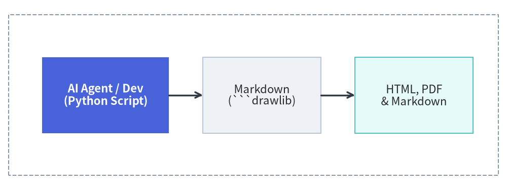
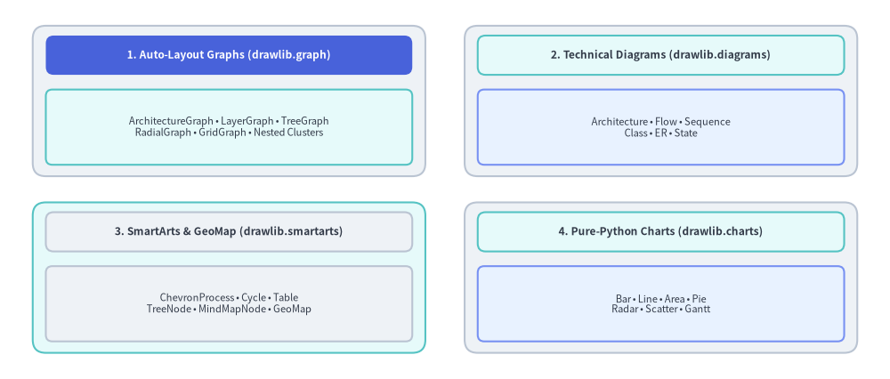

# Drawlib Documentation

Drawlib is a pure-Python drawing library and documentation compiler crafted for **"Illustration as Code"** and **"Documentation as Code"**.

Designed from the ground up for modern software engineering and **autonomous AI coding agents**, Drawlib eliminates manual GUI drawing tools and brittle image files. Developers and LLM agents can create, version-control, and publish publication-grade architectural diagrams, flowcharts, data charts, and complete multi-page documentation sites entirely from declarative Python code.


<figure class="drawlib-image" style="text-align: center;">
  
  <figcaption class="drawlib-caption">From Code to Publication with Drawlib</figcaption>
</figure>

<details class="drawlib-code-details">
<summary>Source Code</summary>

```python
from drawlib.canvas import save, setup
from drawlib.shapes import rectangle
from drawlib.lines import line
from drawlib.styles import Styles

setup(width=120, height=45)

# Background Boundary
rectangle((60, 22.5), width=116, height=38, style=Styles.MutedDashed)

# Pipeline stages: Hero focal point in PrimaryFlat, supporting nodes in calm Neutral cards
rectangle((25, 22.5), width=30, height=18, style=Styles.PrimaryFlat, text="AI Agent / Dev\n(Python Script)", text_style=Styles.WhiteBold)
rectangle((62, 22.5), width=28, height=18, style=Styles.Neutral, text="Markdown\n(```drawlib)")
rectangle((98, 22.5), width=28, height=18, style=Styles.SecondaryNeutral, text="HTML, PDF\n& Markdown")

# Connectors
line((40, 22.5), (48, 22.5), arrow_head="->", style=Styles.DarkBold)
line((76, 22.5), (84, 22.5), arrow_head="->", style=Styles.DarkBold)
save()
```

</details>


---

## Core Pillars

### 1. AI-Driven Documentation Pipeline
Drawlib is built to empower AI coding agents (such as Claude Code, Cursor, Gemini) to author and maintain technical documentation autonomously.
- **Rules & Context Injection**: Query targeted syntax rules on demand via `drawlib rules show <topic>`.
- **Multimodal Visual Verification Loop**: Agents export drawings with coordinate grids (`-g`), visually verify label boundaries and line routing, and self-correct layout issues automatically.

### 2. Rich High-Level Visualizations
Avoid assembling hundreds of primitive shapes by hand. Drawlib provides production-ready, declarative components:
- **Auto-Layout Graphs (`drawlib.graph`)**: Declarative graph layout solvers (`ArchitectureGraph`, `LayerGraph`, `TreeGraph`, `RadialGraph`, `GridGraph`) with nested clusters, `offset()` fine-tuning, and standalone code scaffolding (`export_code()`).
- **SmartArts**: Process pipelines (`ChevronProcess`), cyclical loops (`Cycle`), data tables (`Table`), and trees (`Tree`).
- **Data Charts**: Pure-Python bar, line, area, pie, radar, scatter, and Gantt charts without external graphing dependencies.
- **Technical Diagrams**: Cloud architectures (`ArchitectureDiagram`), flowcharts (`FlowDiagram`), API sequences (`SequenceDiagram`), UML class diagrams (`ClassDiagram`), ER diagrams (`ERDiagram`), and state machines (`StateDiagram`).


<figure class="drawlib-image" style="text-align: center;">
  
  <figcaption class="drawlib-caption">Drawlib High-Level Visualization Ecosystem</figcaption>
</figure>

<details class="drawlib-code-details">
<summary>Source Code</summary>

```python
from drawlib.canvas import save, setup
from drawlib.shapes import rectangle
from drawlib.styles import Styles

setup(width=136, height=58)

# 1. Top-Left: Auto-Layout Graphs (Hero primary header)
rectangle((35, 42.5), width=60, height=23, style=Styles.Neutral.patch(shape_r=2))
rectangle(
    (35, 49.5),
    width=56,
    height=6,
    style=Styles.PrimaryFlat.patch(shape_r=1.2),
    text="1. Auto-Layout Graphs (drawlib.graph)",
    text_style=Styles.WhiteBold.patch(text_size=8.6),
)
rectangle(
    (35, 38.5),
    width=56,
    height=11.5,
    style=Styles.SecondaryNeutral.patch(shape_r=1),
    text="ArchitectureGraph • LayerGraph • TreeGraph\nRadialGraph • GridGraph • Nested Clusters",
    text_style=Styles.Dark.patch(text_size=8.0),
)

# 2. Top-Right: Technical Diagrams
rectangle((101, 42.5), width=60, height=23, style=Styles.Neutral.patch(shape_r=2))
rectangle(
    (101, 49.5),
    width=56,
    height=6,
    style=Styles.SecondaryNeutral.patch(shape_r=1.2),
    text="2. Technical Diagrams (drawlib.diagrams)",
    text_style=Styles.DarkBold.patch(text_size=8.6),
)
rectangle(
    (101, 38.5),
    width=56,
    height=11.5,
    style=Styles.PrimaryNeutral.patch(shape_r=1),
    text="Architecture • Flow • Sequence\nClass • ER • State",
    text_style=Styles.Dark.patch(text_size=8.0),
)

# 3. Bottom-Left: SmartArts & GeoMap
rectangle((35, 15.5), width=60, height=23, style=Styles.SecondaryNeutral.patch(shape_r=2))
rectangle(
    (35, 22.5),
    width=56,
    height=6,
    style=Styles.Neutral.patch(shape_r=1.2),
    text="3. SmartArts & GeoMap (drawlib.smartarts)",
    text_style=Styles.DarkBold.patch(text_size=8.6),
)
rectangle(
    (35, 11.5),
    width=56,
    height=11.5,
    style=Styles.Neutral.patch(shape_r=1),
    text="ChevronProcess • Cycle • Table\nTreeNode • MindMapNode • GeoMap",
    text_style=Styles.Dark.patch(text_size=8.0),
)

# 4. Bottom-Right: Pure-Python Charts
rectangle((101, 15.5), width=60, height=23, style=Styles.Neutral.patch(shape_r=2))
rectangle(
    (101, 22.5),
    width=56,
    height=6,
    style=Styles.SecondaryNeutral.patch(shape_r=1.2),
    text="4. Pure-Python Charts (drawlib.charts)",
    text_style=Styles.DarkBold.patch(text_size=8.6),
)
rectangle(
    (101, 11.5),
    width=56,
    height=11.5,
    style=Styles.PrimaryNeutral.patch(shape_r=1),
    text="Bar • Line • Area • Pie\nRadar • Scatter • Gantt",
    text_style=Styles.Dark.patch(text_size=8.0),
)

save()
```

</details>


### 3. Integrated Documentation Compiler
Write your technical spec or system architecture in standard Markdown with embedded ````drawlib```` blocks. A single command (`drawlib build`) compiles everything into:
- **Responsive HTML Site (`docs_html/`)**: Complete static site with sidebar navigation and instant search.
- **GitHub Markdown (`docs/`)**: Clean Markdown with syntax-highlighted code and embedded relative images.
- **Headless PDF (`docs.pdf`)**: Publication-ready vector PDF generated via Chromium.

---

## Documentation Roadmap

Explore the comprehensive guides below:

1. [**Getting Started**](./01_getting_started/overview.md)
   - Core philosophy, installation, quickstart, coordinate principles, project scaffolding, and AI agent configuration.
2. [**Drawing Primitives & Styles**](./02_drawing_primitives/canvas.md)
   - Low-level vector shapes, polygons, domain primitives, block arrows, lines, typography, fonts, icons, image processing, preset themes, and color palettes.
3. [**SmartArts**](./03_smartarts/overview.md)
   - High-level infographics: process pipelines, cyclical loops, data tables, hierarchical trees, mindmaps, grids, pyramids, lists, source code blocks, and geographic maps.
4. [**Charts**](./04_charts/overview.md)
   - Declarative data plotting: axes & legends, bar, line, area, pie, radar, scatter, and project Gantt charts.
5. [**Technical Diagrams**](./05_diagrams/overview.md)
   - Coordinate-controlled engineering diagrams: cloud architectures, flowcharts, sequence diagrams, UML class diagrams, ER diagrams, and state machines.
6. [**Auto-Layout Graphs**](./06_graph/overview.md)
   - Declarative graph layout solvers (`ArchitectureGraph`, `LayerGraph`, `TreeGraph`, `RadialGraph`, `GridGraph`), nested clusters, `offset()` fine-tuning, and code export.
7. [**Animations (APNG & WebP)**](./07_animations/overview.md)
   - Multi-frame animations, smooth color transitions, progressive component reveals, arrow growth (`draw_ratio`), and camera pan/zoom across all Drawlib modules.
8. [**Document Builder & CLI**](./08_doc_builder_and_cli/overview.md)
   - Documentation as Code: Markdown block syntax, CLI reference, project templates (`doc`, `site`, `slide`, `images`), 1920×1080 slide stage layout, customization, and two-tier caching & CI/CD.
9. [**AI Agents & Advanced Integration**](./09_ai_agents_and_advanced/ai_agent_instructions.md)
   - Autonomous agent instructions, visual self-correction feedback loop, programmatic Python APIs, math utilities, and troubleshooting.
