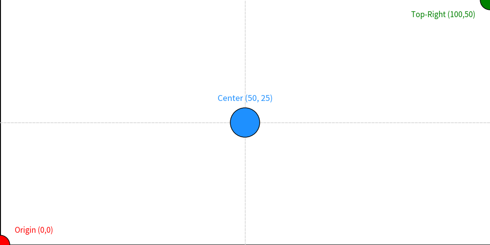
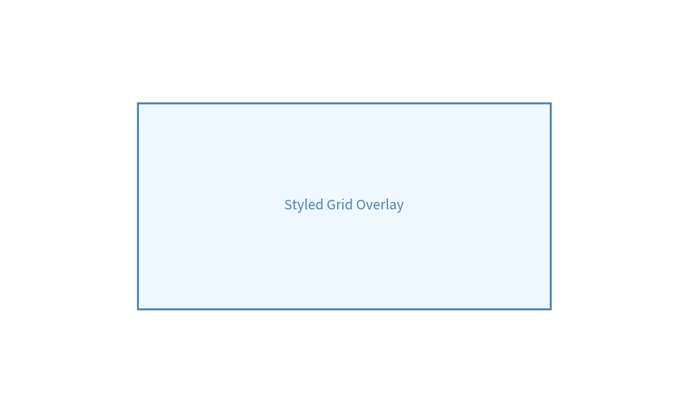
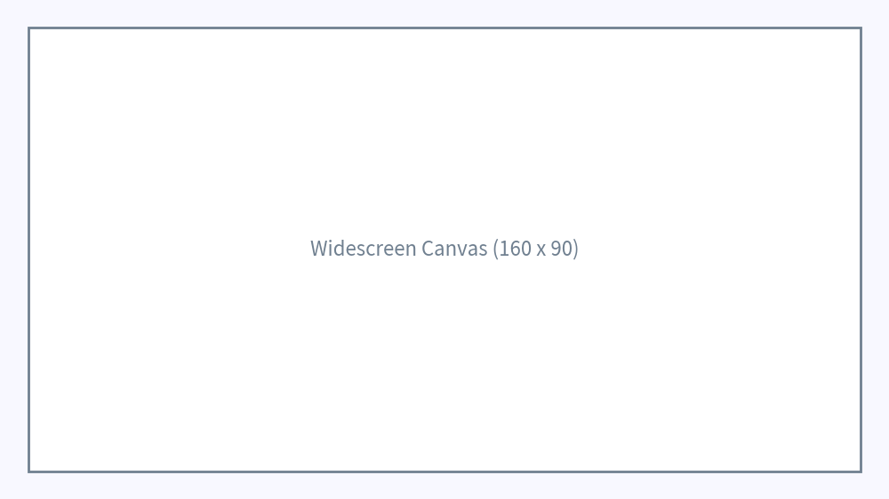
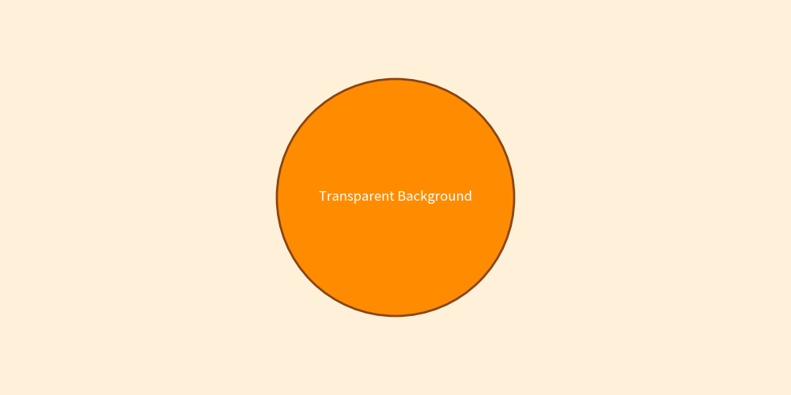

# Canvas & Coordinate System

The **Canvas** is the foundational surface in Drawlib upon which all shapes, lines, images, icons, and text elements are drawn. 

Drawlib manages the canvas state automatically behind public facade APIs like `config()`, `save()`, and `clear()`, ensuring that creating illustrations remains simple, declarative, and clean.

---

## 1. Canvas Architecture Overview

Drawlib follows a facade architecture where global functions in `drawlib.canvas` interact with an internal canvas singleton instance.

```
+-------------------------------------------------------------+
|                     User Code (APIs)                        |
|   config()           circle()           line()       save() |
+-------------------------+-----------------------------------+
                          | (interacts internally)
                          v
+-------------------------------------------------------------+
|                     Internal Canvas                         |
|   Coordinates     Style Stack     Grid Engine     Matplotlib|
+-------------------------------------------------------------+
```

### Public Canvas APIs
- **`config(...)`**: Configures canvas parameters such as coordinate dimensions, DPI resolution, background colors, and grid overlays.
- **`save(...)`**: Renders and exports the current canvas to an image file (PNG, JPG, WEBP, or PDF).
- **`clear()`**: Resets the canvas state, clearing all drawn elements and configurations.

---

## 2. 2D Cartesian Coordinate System

Drawlib uses a 2D Cartesian coordinate system `(x, y)` where `(0, 0)` is anchored at the **bottom-left corner** of the canvas.


```python
from drawlib.canvas import config
from drawlib.colors import Colors, Colors140
from drawlib.lines import line
from drawlib.shapes import circle
from drawlib.text import text
from drawlib.types import LineStyle, ShapeStyle, TextStyle

# Configure 100x50 canvas
config(width=100, height=50)

# Axes
line(xy1=(0, 0), xy2=(100, 0), style=LineStyle(line_color=Colors.Black, line_width=2))
line(xy1=(0, 0), xy2=(0, 50), style=LineStyle(line_color=Colors.Black, line_width=2))

# Grid center lines
line(xy1=(0, 25), xy2=(100, 25), style=LineStyle(line_color=Colors140.LightGray, line_width=1, line_style="dashed"))
line(xy1=(50, 0), xy2=(50, 50), style=LineStyle(line_color=Colors140.LightGray, line_width=1, line_style="dashed"))

# Coordinate markers
circle(xy=(0, 0), radius=2, style=ShapeStyle(fill_color=Colors.Red, line_color=Colors.Black))
text(xy=(3, 3), text="Origin (0,0)", style=TextStyle(text_color=Colors.Red, text_size=11, text_halign="left"))

circle(xy=(50, 25), radius=3, style=ShapeStyle(fill_color=Colors140.DodgerBlue, line_color=Colors.Black))
text(xy=(50, 29), text="Center (50, 25)", style=TextStyle(text_color=Colors140.DodgerBlue, text_size=12, text_valign="bottom"))

circle(xy=(100, 50), radius=2, style=ShapeStyle(fill_color=Colors.Green, line_color=Colors.Black))
text(xy=(97, 47), text="Top-Right (100,50)", style=TextStyle(text_color=Colors.Green, text_size=11, text_halign="right"))
```

<figure class="drawlib-image" style="text-align: center;">
  
  <figcaption class="drawlib-caption">2D Cartesian Coordinate System with Bottom-Left Origin (0,0)</figcaption>
</figure>


---

## 3. Configuring Canvas Grid

During the iterative process of positioning elements, enabling the grid overlay helps locate exact coordinates.

### Grid Options
- **`grid=True`**: Enables grid overlay during visual design.
- **`grid_only=True`**: Generates only the grid-overlay image without creating a second clean image file.
- **`grid_style`**: Applies a custom `LineStyle` to normal grid lines.
- **`grid_centerstyle`**: Applies a custom `LineStyle` to the center axis lines.


```python
from drawlib.canvas import config
from drawlib.colors import Colors, Colors140
from drawlib.shapes import rectangle
from drawlib.text import text
from drawlib.types import LineStyle, ShapeStyle, TextStyle

# Custom grid styling
config(
    width=100,
    height=60,
    grid=True,
    grid_style=LineStyle(line_color=Colors140.PowderBlue, line_width=1, line_style="dotted"),
    grid_centerstyle=LineStyle(line_color=Colors140.SteelBlue, line_width=2, line_style="solid")
)

rectangle(
    xy=(50, 30),
    width=60,
    height=30,
    style=ShapeStyle(fill_color=Colors140.AliceBlue, line_color=Colors140.SteelBlue, line_width=2)
)
text(
    xy=(50, 30),
    text="Styled Grid Overlay",
    style=TextStyle(text_color=Colors140.SteelBlue, text_size=14)
)
```

<figure class="drawlib-image" style="text-align: center;">
  
  <figcaption class="drawlib-caption">Canvas with Custom Styled Grid Overlay</figcaption>
</figure>


---

## 4. Canvas Dimensions & Aspect Ratio

Canvas size defines the logical coordinate boundaries `(width, height)`. By default, the canvas is **100 × 100**.

Adjusting the logical canvas size changes the relative positioning scale without altering the base pixel output dimensions.


```python
from drawlib.canvas import config
from drawlib.colors import Colors140
from drawlib.shapes import rectangle
from drawlib.text import text
from drawlib.types import ShapeStyle, TextStyle

# Set 16:9 aspect ratio coordinate space
config(width=160, height=90, background_color=Colors140.GhostWhite)

# Background border
rectangle(
    xy=(80, 45),
    width=150,
    height=80,
    style=ShapeStyle(fill_color=Colors140.White, line_color=Colors140.SlateGray, line_width=2)
)

text(
    xy=(80, 45),
    text="Widescreen Canvas (160 x 90)",
    style=TextStyle(text_color=Colors140.SlateGray, text_size=16)
)
```

<figure class="drawlib-image" style="text-align: center;">
  
  <figcaption class="drawlib-caption">Widescreen 16:9 Aspect Ratio Canvas (width=160, height=90)</figcaption>
</figure>


---

## 5. DPI & Output Resolution

Resolution and logical coordinate size are decoupled in Drawlib:
- **Logical Size**: Determines the `(x, y)` coordinate limits (e.g. `100x100`).
- **DPI (Dots Per Inch)**: Determines output pixel density. Default DPI is **100**.

### Pixel Resolution Calculation
Drawlib treats standard canvas width as **10 inches**. 
- Default `dpi=100` $\rightarrow$ $10\text{ in} \times 100\text{ DPI} = 1000\text{ px}$ image width.
- High resolution `dpi=200` $\rightarrow$ $10\text{ in} \times 200\text{ DPI} = 2000\text{ px}$ image width.

To generate exact Full HD (1920px width) output for a 1920x1080 canvas:
```python
config(width=1920, height=1080, dpi=192)
# 10 inches * 192 DPI = 1920 pixels width
```

---

## 6. Background Color & Transparency

Canvas background color and opacity can be set via `config()`:
- **`background_color`**: Accepts any `Color` tuple or preset like `Colors.Orange`.
- **`background_alpha`**: Opacity value from `0.0` (transparent) to `1.0` (opaque).


```python
from drawlib.canvas import config
from drawlib.colors import Colors140
from drawlib.shapes import circle
from drawlib.text import text
from drawlib.types import ShapeStyle, TextStyle

# Custom orange background with 0.15 transparency
config(width=100, height=50, background_color=Colors140.Orange, background_alpha=0.15)

circle(
    xy=(50, 25),
    radius=15,
    style=ShapeStyle(fill_color=Colors140.DarkOrange, line_color=Colors140.SaddleBrown, line_width=2)
)
text(
    xy=(50, 25),
    text="Transparent Background",
    style=TextStyle(text_color=Colors140.White, text_size=12)
)
```

<figure class="drawlib-image" style="text-align: center;">
  
  <figcaption class="drawlib-caption">Canvas with Custom Background Color and Opacity</figcaption>
</figure>


> [!NOTE]
> Setting `background_color=Colors.Transparent` or `background_alpha=0` generates a transparent background PNG. Note that format limitations apply (e.g. JPG does not support alpha channels).

---

## 7. Exporting & Saving (`save` / `clear`)

Exporting illustrations is handled by `save()`:

```python
from drawlib.canvas import save

# Save as <script_name>.png in current directory
save()

# Save with custom file path
save(file="output/diagram.png")

# Save in specific format (PNG, JPG, WEBP, PDF)
save(file="output/diagram", format="pdf")
```

### Supported Output Formats
- **PNG**: Standard lossless format with alpha support (default).
- **JPG**: Compressed image format.
- **WEBP**: Modern web image format.
- **PDF**: Vector document format.

### Refreshing Canvas State (`clear`)
When generating multiple illustrations within a loop or single script, call `clear()` between images to reset all drawn items and canvas configurations.

---

## Navigation

- [Back to Foundations Index](./index.md)
- [Next: Shapes Guide](./shapes.md)
