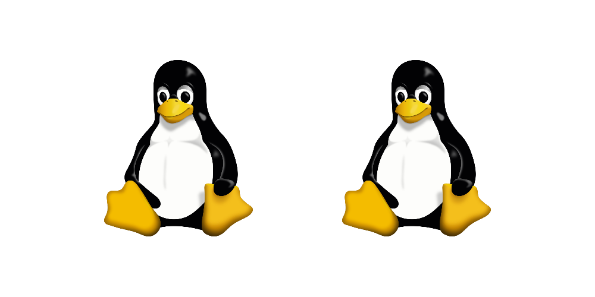
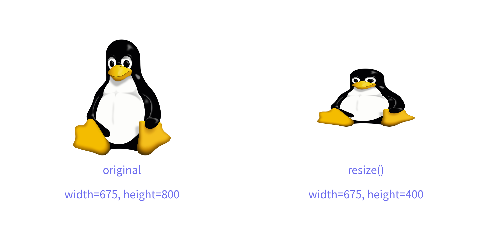
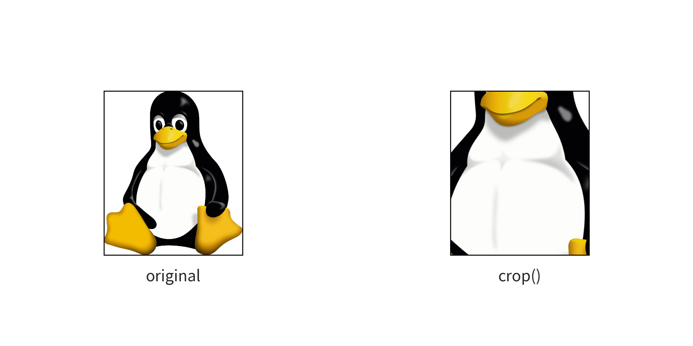
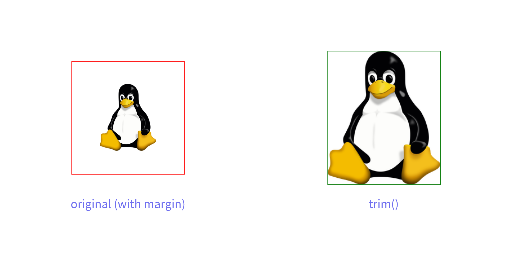
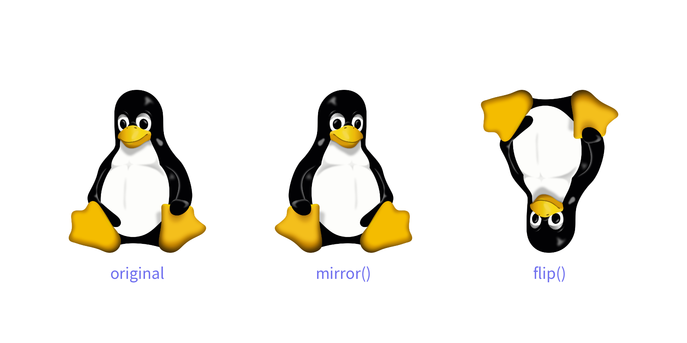
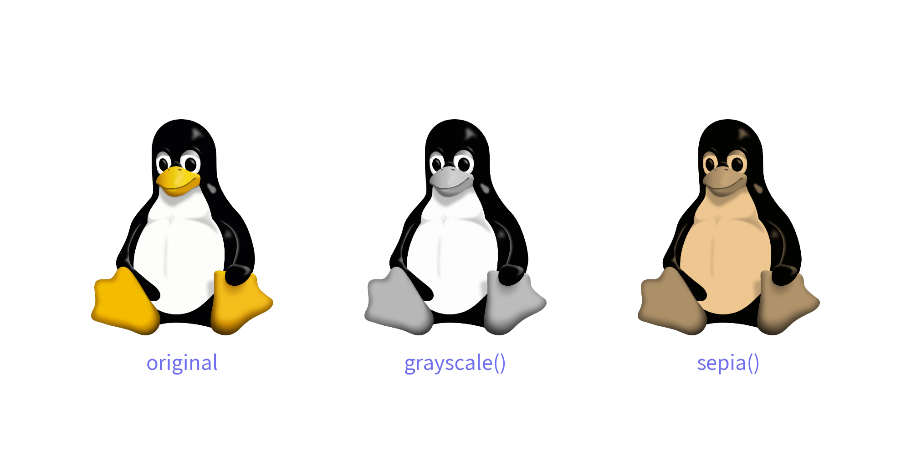
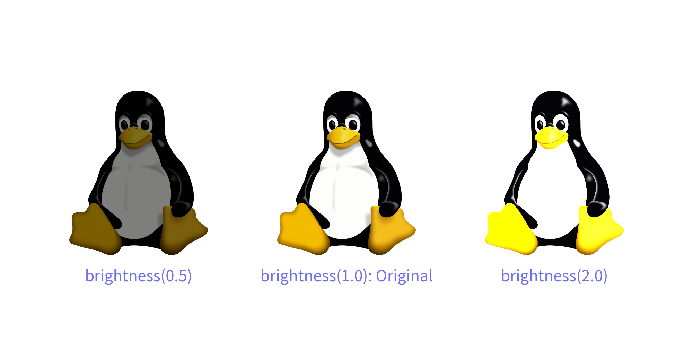
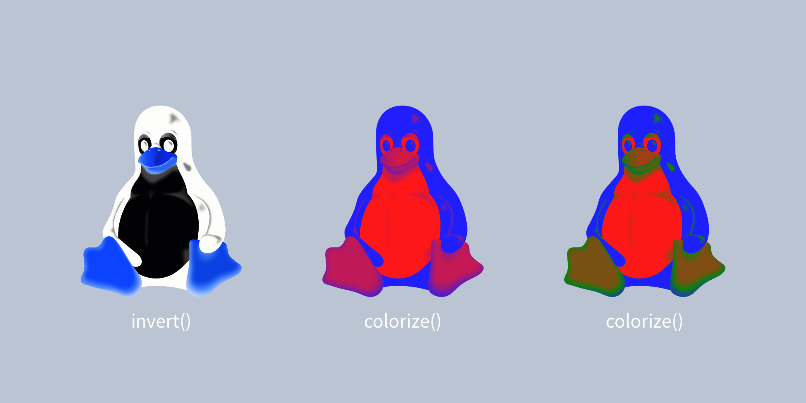
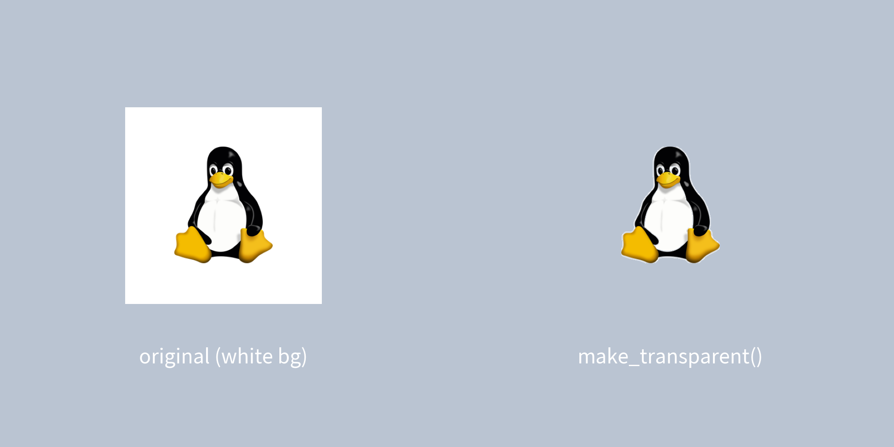
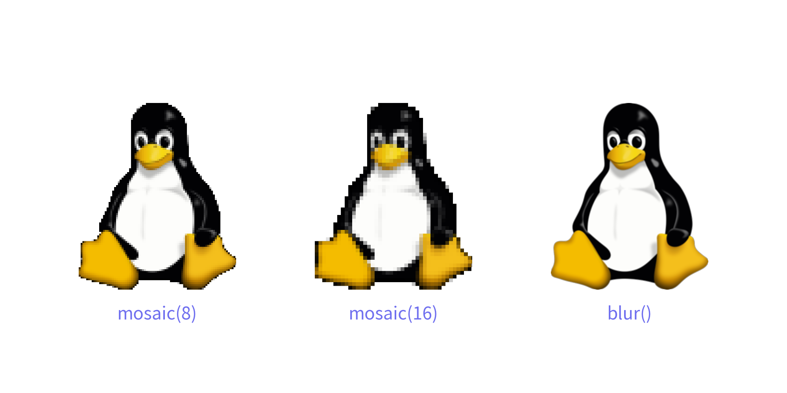

# Dimage


The `image()` function draws an image from a file. 
If you want to specify a file path and show it as is, providing a relative path is acceptable.

`Dimage` is an image data class in Drawlib. 
It is useful in the following situations:

- Applying effects to images
- Caching (loading data in one place and using it in many places)

The `image()` function can take a Dimage object and draw the image.


# Reusing Loaded Images


When loading an image from a file, creating a `Dimage` instance loads and stores the image data in memory as a variable. 
You can store a `Dimage` object in a variable and pass it to multiple `image()` calls without re-loading the image from disk.

Here is an example:


```python
from drawlib.canvas import setup
from drawlib.images import Dimage, image

setup(width=100, height=50)
im_linux = Dimage("../_assets/linux.png")
image((30, 25), 25, im_linux)
image((70, 25), 25, im_linux)
```

In this example, `im_linux` loads `../_assets/linux.png` once into memory. 
Passing `im_linux` to `image()` multiple times reuses the pre-loaded image efficiently.

Here is the output:


<div class="drawlib-image" style="text-align: center;">
  
</div>


Not only can you reuse images loaded from files, but you can also reuse images you have modified with effects. 
If you repeatedly use some images, we recommend using this feature as well.


# Things Controlled by ``image()``


Dimage is a helper for the `image()` function. 
Therefore, Dimage does not include features that are implemented in `image()`. 
These features are not included:

- Rotate: Controlled by the `angle` option
- Add Border: Controlled by the `line_width` and `line_color` attributes of `Style`


# Save Dimage to File


Dimage can save its data to a file without using Drawlib's canvas. 
The `save()` method performs this function. 
It requires a mandatory argument, `file`. 
While the file argument in Canvas's `save()` is optional, it is required for Dimage's `save()`.

If you provide a relative path, the image file will be saved relative to the script's path. 
An absolute path will also work.


# Get Image Pixel Size


You can get the original image size using the `get_image_size()` method. 
It returns a tuple of width and height. 

This method is helpful for determining the dimensions of the image before performing operations like `resize()` or `trim()`


# Resizing and Changing Aspect


The `resize()` method in Dimage takes two arguments: `width` and `height`. 
These dimensions refer to the original pixel size of the image data, not the size on Drawlib's canvas.

Before resizing, you can check the original width and height using the `get_image_size()` method. 
If you want to maintain the aspect ratio of the original image, you should calculate either the new width or the new height while keeping the ratio between them. 
If you want to change the aspect ratio, you need to calculate both the new width and height accordingly.

Here's an example of changing the aspect ratio where we halve the image height:


```python
from drawlib.canvas import setup
from drawlib.images import Dimage, image
from drawlib.text import text
from drawlib.styles import Colors, Styles

setup(width=100, height=50, dpi=200)

# original
original_image = Dimage("../_assets/linux.png")
image((25, 30), 20, original_image)
text((25, 15), "original", style=Styles.Primary)
width, height = original_image.get_image_size()
text((25, 10), f"width={width}, height={height}", style=Styles.Primary)

# resize
new_height = int(height / 2)
resized_image = original_image.resize(width, new_height)
image((75, 30), 20, resized_image)
text((75, 15), "resize()", style=Styles.Primary)
text((75, 10), f"width={width}, height={new_height}", style=Styles.Primary)
```

In this example, we retrieve the original image dimensions using `get_image_size()`.
And then resize the image using `resize()`.
We keep original width, but new height is half of original. 
Finally, the resized image is drawn with `image()` function.

Here is the output:


<div class="drawlib-image" style="text-align: center;">
  
</div>


# Crop


If an image contains unnecessary parts, you can trim or crop it using the `crop()` method. 
This method accepts the following arguments:

- x: Specifies the starting point from the left (0 to x pixels will be cropped).
- y: Specifies the starting point from the bottom (0 to y pixels will be cropped).
- width: Specifies the width of the cropped area starting from x.
- height: Specifies the height of the cropped area starting from y.

Here's an example that keeps the center 50% of the image:


```python
from drawlib.canvas import setup
from drawlib.images import Dimage, image
from drawlib.text import text
from drawlib.styles import Colors, Styles

setup(width=100, height=50, dpi=200)

# original
original_image = Dimage("../_assets/linux.png")
image((25, 25), 20, original_image, style=Styles.Primary.patch(image_border_width=1))
text((25, 10), "original", style=Styles.Primary)
width, height = original_image.get_image_size()

# trimming
x_start = int(width / 4)
crop_width = int(width / 2)
y_start = int(height / 4)
crop_height = int(height / 2)
cropped_image = original_image.crop(x_start, y_start, crop_width, crop_height)
image((75, 25), 20, cropped_image, style=Styles.Primary.patch(image_border_width=1))
text((75, 10), "crop()", style=Styles.Primary)
```

In this example, we calculate the cropping parameters to keep the center 50% of the image. 
We then use the `crop()` method to apply the cropping operation to the Dimage object. 
Finally, the cropped image can be used in drawing operations with `image()`.

Here is the output:


<div class="drawlib-image" style="text-align: center;">
  
</div>


# Trim Margins


While `crop()` requires you to specify manual bounding coordinates, `trim()` automatically removes outer margins from an image:

- `color`: Background color to remove.
  - `"auto"` (default): Automatically detects whether margins are transparent or a solid color by inspecting the image corners.
  - `None`: Trims transparent margins (requires alpha channel).
  - Specific color: Provide a color name (`"white"`, `"blue"`), hex code (`"#ffffff"`), `Color` object, or RGB tuple.
- `tolerance`: An integer (0–255, default 0) specifying color distance tolerance. Increasing tolerance is helpful when trimming images with slight compression artifacts or noisy background colors.

Here is an example:


```python
from PIL import Image
from drawlib.canvas import setup
from drawlib.images import Dimage, image
from drawlib.styles import Colors, Styles
from drawlib.text import text

setup(width=100, height=50, dpi=200)

# Create an image with wide margins for demonstration
base = Image.new("RGB", (400, 400), (255, 255, 255))
linux_pil = Dimage("../_assets/linux.png").resize(200, 237).get_pil_image()
base.paste(linux_pil, (100, 80), mask=linux_pil.split()[3])
original_with_margin = Dimage(base)

# Original image with border showing outer margins
image(
    (25, 27),
    22,
    original_with_margin,
    style=Styles.Primary.patch(image_border_width=1, image_border_color=Colors.Red),
)
text((25, 10), "original (with margin)", style=Styles.Primary)

# Automatically trim margins
trimmed = original_with_margin.trim()
image(
    (75, 27),
    22,
    trimmed,
    style=Styles.Primary.patch(image_border_width=1, image_border_color=Colors.Green),
)
text((75, 10), "trim()", style=Styles.Primary)
```

In this example, `trim()` detects the white margin around the subject automatically and crops the image to its tightly bounded content.

Here is the output:


<div class="drawlib-image" style="text-align: center;">
  
</div>


# Flip Horizontally and Vertically


You can easily flip an image using Dimage:

- Horizontal Flip: Use the `mirror()` method.
- Vertical Flip: Use the `flip()` method.

Here's an example:


```python
from drawlib.canvas import setup
from drawlib.images import Dimage, image
from drawlib.text import text
from drawlib.styles import Colors, Styles

setup(width=100, height=50, dpi=200)

# original
original_image = Dimage("../_assets/linux.png")
image((20, 25), 20, original_image)
text((20, 10), "original", style=Styles.Primary)

# mirror
image((50, 25), 20, original_image.mirror())
text((50, 10), "mirror()", style=Styles.Primary)

# flip
image((80, 25), 20, original_image.flip())
text((80, 10), "flip()", style=Styles.Primary)
```

Here is the output:


<div class="drawlib-image" style="text-align: center;">
  
</div>


# Change color


Drawlib provides several functions to modify the color of images:

- `grayscale()`: Converts the image to grayscale
- `sepia()`: Applies a sepia tone effect to the image

Here's an example:


```python
from drawlib.canvas import save, setup
from drawlib.images import Dimage, image
from drawlib.text import text
from drawlib.styles import Colors, Styles

setup(width=100, height=50, dpi=200)

# original
original_image = Dimage("../_assets/linux.png")
image((20, 25), 20, original_image)
text((20, 10), "original", style=Styles.Primary)

# grayscale
image((50, 25), 20, Dimage("../_assets/linux.png").grayscale())
text((50, 10), "grayscale()", style=Styles.Primary)

# sepia
image((80, 25), 20, original_image.sepia())
text((80, 10), "sepia()", style=Styles.Primary)
```

Here is the output.


<div class="drawlib-image" style="text-align: center;">
  
</div>


- `brightness()`:  Adjusts the brightness of the image

A value of `0.0` makes the image completely dark, `1.0` keeps the original brightness, and values greater than `1.0` increase the brightness.

Here's an example:


```python
from drawlib.canvas import setup
from drawlib.images import Dimage, image
from drawlib.text import text
from drawlib.styles import Colors, Styles

setup(width=100, height=50, dpi=200)

image((20, 25), 20, Dimage("../_assets/linux.png").brightness(0.5))
text((20, 10), "brightness(0.5)", style=Styles.Primary)

image((50, 25), 20, Dimage("../_assets/linux.png").brightness(1.0))
text((50, 10), "brightness(1.0): Original", style=Styles.Primary)

image((80, 25), 20, Dimage("../_assets/linux.png").brightness(2.0))
text((80, 10), "brightness(2.0)", style=Styles.Primary)
```

Here is an output.


<div class="drawlib-image" style="text-align: center;">
  
</div>


- `invert()`: Reverses the RGB values of the image
- `colorize()`: Applies colors to a grayscale image. If the image is not grayscaled, it will be automatically grayscaled before colorize.


```python
from drawlib.canvas import setup
from drawlib.preset_colors import DefaultColors
from drawlib.images import Dimage, image
from drawlib.text import text
from drawlib.styles import Colors, Styles

setup(width=100, height=50, dpi=200, background_color=Colors.Gray4)

# invert
image((20, 25), 20, Dimage("../_assets/linux.png").invert())
text((20, 10), "invert()", style=Styles.White)

# colorize
image(
    (50, 25),
    20,
    Dimage("../_assets/linux.png").colorize(
        from_black_to=DefaultColors.Blue,
        from_white_to=DefaultColors.Red,
    ),
)
text((50, 10), "colorize()", style=Styles.White)

# colorize 3 colors
image(
    (80, 25),
    20,
    Dimage("../_assets/linux.png").colorize(
        from_black_to=DefaultColors.Blue,
        from_white_to=DefaultColors.Red,
        from_mid_to=DefaultColors.Green,
    ),
)
text((80, 10), "colorize()", style=Styles.White)
```

Here is the output.


<div class="drawlib-image" style="text-align: center;">
  
</div>


# Make Background Transparent


If you have an illustration or icon with an unwanted solid background (such as white), `make_transparent()` turns that background color into transparent pixels (alpha = 0) in RGBA mode without changing the image dimensions:

- `color`: The color to make transparent.
  - `"auto"` (default): Automatically detects the background color from the four corners of the image.
  - Specific color: Provide a color name (`"white"`, `"blue"`), hex code (`"#ffffff"`), `Color` object, or RGB tuple.
- `tolerance`: An integer (0–255, default 0) specifying color distance tolerance.

Here is an example placed on a colored canvas:


```python
from PIL import Image
from drawlib.canvas import setup
from drawlib.images import Dimage, image
from drawlib.styles import Colors, Styles
from drawlib.text import text

setup(width=100, height=50, dpi=200, background_color=Colors.Gray4)

# Create an image with a solid white background
base = Image.new("RGB", (400, 400), (255, 255, 255))
linux_pil = Dimage("../_assets/linux.png").resize(200, 237).get_pil_image()
base.paste(linux_pil, (100, 80), mask=linux_pil.split()[3])
original_with_white_bg = Dimage(base)

# Original image shows a distracting white box on colored canvas
image((25, 27), 22, original_with_white_bg)
text((25, 10), "original (white bg)", style=Styles.White)

# Automatically convert the background to transparent
transparent_img = original_with_white_bg.make_transparent()
image((75, 27), 22, transparent_img)
text((75, 10), "make_transparent()", style=Styles.White)
```

Here is the output:


<div class="drawlib-image" style="text-align: center;">
  
</div>


# Apply Effects


You can apply various effects to images using Drawlib:

- `mosaic()`: Applies a mosaic effect to the image. You can specify the size of mosaic blocks with the optional `block_size` argument. Default is 8.
- `blur()`: Applies a blur effect to the image

Here's an example:


```python
from drawlib.canvas import setup
from drawlib.images import Dimage, image
from drawlib.text import text
from drawlib.styles import Colors, Styles

setup(width=100, height=50, dpi=200)

image((20, 25), 20, Dimage("../_assets/linux.png").mosaic(8))
text((20, 10), "mosaic(8)", style=Styles.Primary)

image((50, 25), 20, Dimage("../_assets/linux.png").mosaic(16))
text((50, 10), "mosaic(16)", style=Styles.Primary)

image((80, 25), 20, Dimage("../_assets/linux.png").blur())
text((80, 10), "blur()", style=Styles.Primary)
```

Here is the output.


<div class="drawlib-image" style="text-align: center;">
  
</div>


---

> [!TIP]
> To execute dynamic Drawlib Python code in an isolated subprocess and capture the rendered canvas output directly as a `Dimage` (for nested diagram composition, applying raster filters, or sandboxed previews), see [Rendering from Code (`get_dimage_from_code`)](../advanced_topics/dimage_from_code.md).

---

<p align="center"><em>© 2026 drawlib by Yuichi Ito. Released under the Apache 2.0 License.</em></p>
