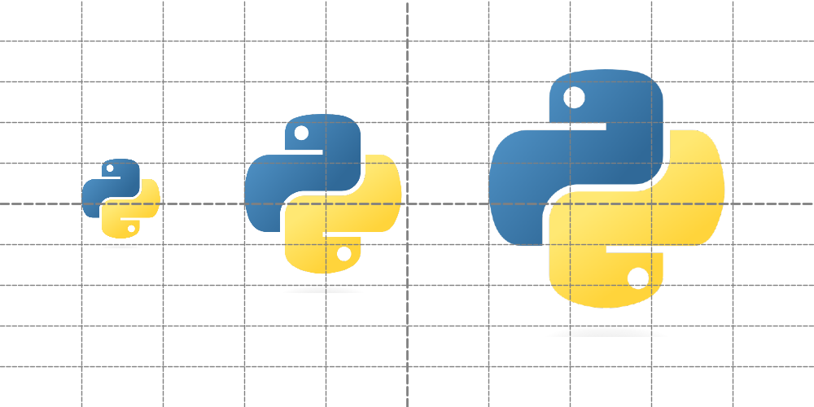
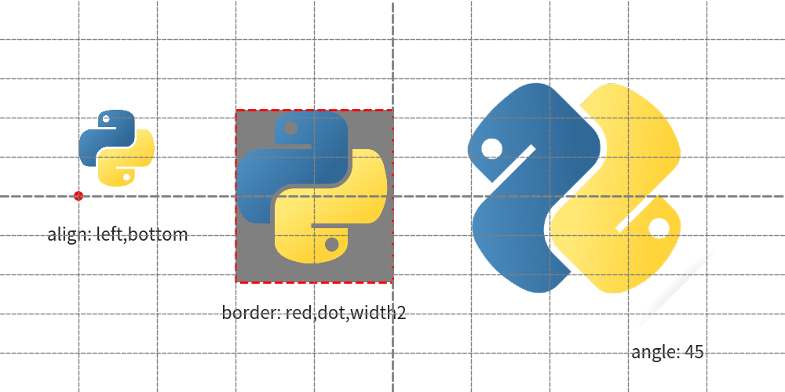
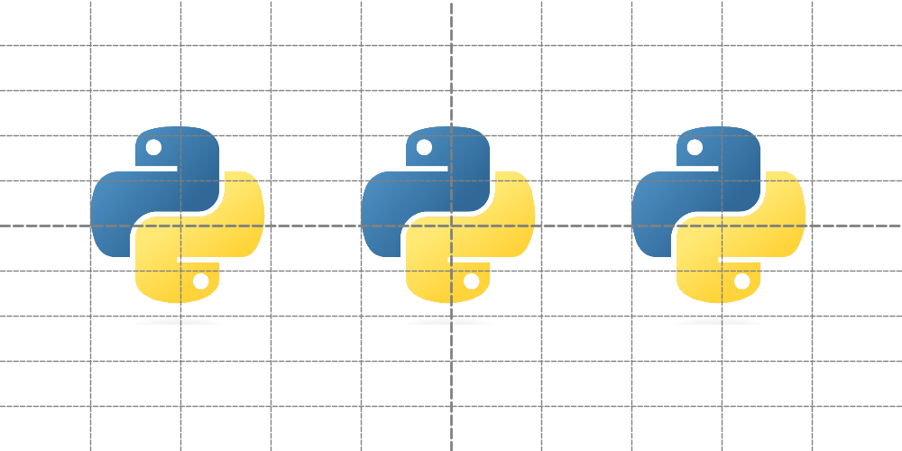

# Drawing Image


Drawlib utilizes the `image()` function for drawing images.
You can specify:

* Coordinate
* Size
* Image source (file path string, Dimage, PIL.Image.Image)
* Angle
* Styling options

In this document, we'll begin with the basics of the image() function, followed by explanations of styling and different types of original image data.


# image()


The image() function accepts the following arguments:

- xy: Coordinates specifying the position of the image.
- width: Width of the image.
- image: Source of the image, which can be a file path string, Dimage object, or PIL.Image.Image object.
- angle: Rotation angle of the image (optional).
- style: Styling information, either as a string name or a Style object.

Coordinates and alignment work similarly to other drawing elements. 
Let's start with an example:


```python
from drawlib.canvas import save, setup
from drawlib.images import image

setup(width=100, height=50, grid_only=True)

image(xy=(15, 25), width=10, image="../_assets/python.png")
image(xy=(40, 25), width=20, image="../_assets/python.png")
image(xy=(75, 25), width=30, image="../_assets/python.png")

save()
```

Executing this code generates the following output:


<div class="drawlib-image" style="text-align: center;">
  
</div>


By default, the xy coordinates position the center of the image.


# Style for Images


Images can be styled using the `Style` class, which includes:

* `text_halign`: Horizontal Align
* `text_valign`: Vertical Align
* `image_border_width`: Border line width
* `image_border_color`: Border line color
* `image_border_style`: Border line style
* `image_tint_color`: Tint color for monochrome masks
* `image_alpha`: Opacity (0.0 to 1.0)

Let's check image styling with an example.
Here is code that specifies styles:


```python
from drawlib.canvas import save, setup
from drawlib.colors import Colors
from drawlib.images import image
from drawlib.shapes import circle
from drawlib.text import text
from drawlib.config import styles

setup(width=100, height=50, grid_only=True)

image(
    xy=(10, 25),
    width=10,
    image="../_assets/python.png",
    style=styles.primary.patch(text_halign="left", text_valign="bottom"),
)
circle((10, 25), radius=0.5, style=styles.primary.patch(shape_fill_color=Colors.Red, shape_line_color=Colors.Red))
text((15, 20), "align: left,bottom", style=styles.primary)

image(
    xy=(40, 25),
    width=20,
    image="../_assets/python.png",
    style=styles.primary.patch(
        image_border_width=2,
        image_border_style="dashed",
        image_border_color=Colors.Red,
        image_tint_color=Colors.Gray,
    ),
)
text((40, 10), "border: red,dot,width2", style=styles.primary)

image(xy=(75, 25), width=30, image="../_assets/python.png", angle=45, style=styles.green_solid)
text((85, 5), "angle: 45", style=styles.primary)

save()
```

The first image changes alignment.
Default alignment is center,center, but left,bottom might be useful sometimes.

Changing image border line and add color for transparent part at 2nd example.
Default is no border, no fill.

The 3rd example changes angle of image.
With specifying preset style `styles.green_solid`.

Executing code generates this output.


<div class="drawlib-image" style="text-align: center;">
  
</div>


    image with styles

Styling an image with Style allows adjustments such as alignment changes, border customization, and rotation.


# Passing image objects


While file paths are commonly used, image() also accepts the following image objects:

`Dimage`: Drawlib's image utility class.
`PIL.Image.Image`: Images from the PIL (Pillow) library.

Here's an example demonstrating how to use these objects:


```python
import PIL.Image
from drawlib.canvas import save, setup
from drawlib.images import Dimage, image

setup(width=100, height=50, grid_only=True)

# 1. Specify file path string directly
image(xy=(20, 25), width=20, image="../_assets/python.png")

# 2. Specify pre-loaded Dimage instance (cached in memory)
dimage = Dimage("../_assets/python.png")
image(xy=(50, 25), width=20, image=dimage)

# 3. Specify PIL Image object
pil_image = PIL.Image.open("../_assets/python.png")
image(xy=(80, 25), width=20, image=pil_image)

save()
```

Function `image()` handles file paths, `Dimage` instances, and `PIL.Image.Image` objects interchangeably.


<div class="drawlib-image" style="text-align: center;">
  
</div>


As shown, all three approaches yield the same drawing output. 
`Dimage` and `PIL.Image.Image` are particularly useful when applying image effects or caching assets in memory across multiple drawing operations.

For a comprehensive guide on image transformations, filters, and caching with `Dimage`, see the [Dimage Guide](./dimage.md).

---

<p align="center"><em>© 2026 drawlib by Yuichi Ito. Released under the Apache 2.0 License.</em></p>
