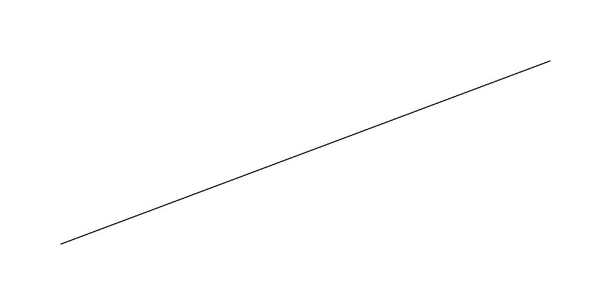
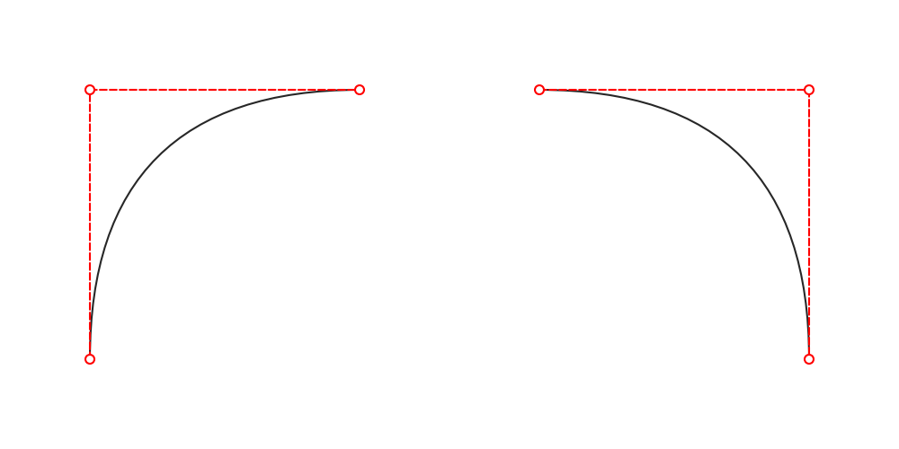
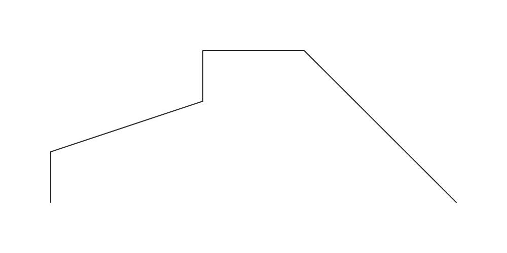
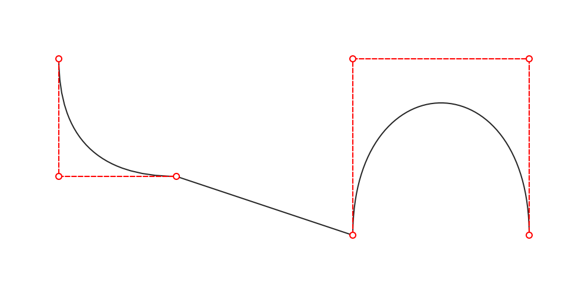
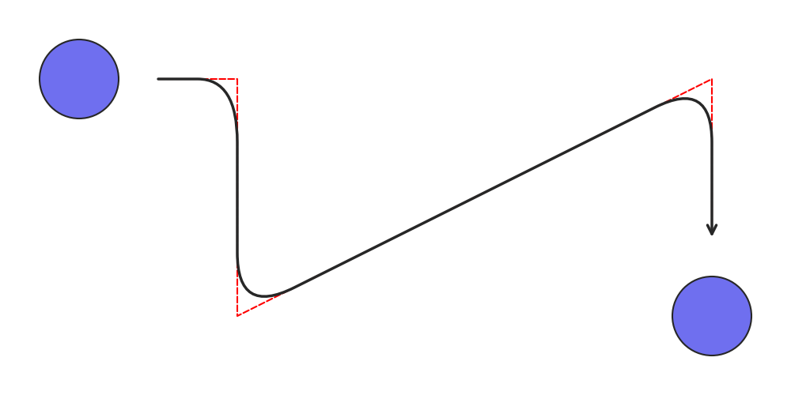
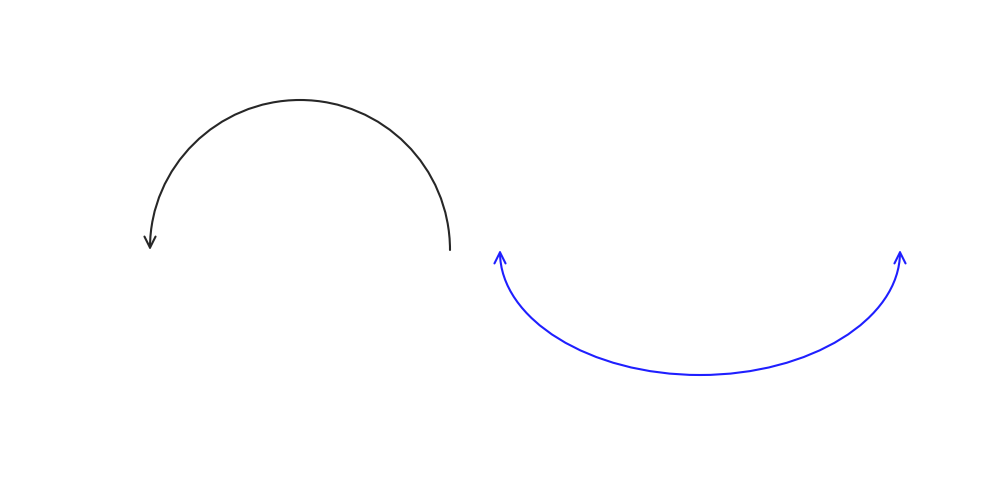

# Drawing line


Drawlib provides eight functions for drawing lines:

* `line()`: Straight line between two coordinates
* `line_curved()`: Smooth arc with a specified bend ratio
* `line_bezier1()`: Quadratic Bezier curve (1 control point)
* `line_bezier2()`: Cubic Bezier curve (2 control points)
* `lines()`: Multi-point connected polyline
* `lines_curved()`: Multi-point connected lines with rounded corners (`r`)
* `lines_bezier()`: Chained multi-segment Bezier spline
* `line_arc()`: Elliptical circular arc line

We will explain each of these functions in detail. 
They all share the following arguments:

- `arrowhead`: Specifies the type of arrowhead. Options are `["", "->", "<-", "<->", "-"]`.
- `width`: Specifies the line width. This should typically be configured within the style, but it is also available as an optional argument.
- `style`: Defines the line style. Requires a `Style` object (e.g., `styles.primary`).

Details on these options will be covered in the next section on line styles (see the following page).


# line()


The `line()` function is the most basic function for drawing lines. 
It requires three arguments (coordinates and style) and accepts two optional arguments.

* xy1: The start point of the line
* xy2: The end point of the line
* style: The style of the line (required)
* (optional) arrowhead: Specifies the type of arrow head
* (optional) width: The width of the line

Let's look at an example:


```python
from drawlib.canvas import config, save
from drawlib.lines import line

config(width=100, height=50)
line(xy1=(10, 10), xy2=(90, 40), style=styles.primary)
save()
```

In this example, we draw a line from (10, 10) to (90, 40) using `styles.primary`. 
This generates the following output:


<div class="drawlib-image" style="text-align: center;">
  
</div>


    straight line from xy1 to xy2


# line_curved()


The `line_curved()` function makes it easy to draw curved lines. 
While `line_bezier1()` and `line_bezier2()` can also draw curved lines, they require more complex curve control compared to `line_curved()`.

It requires three mandatory arguments and accepts two optional arguments.

* xy1: The start point of the line
* xy2: The end point of the line
* bend: The additional length beyond a direct connection, controlling the curvature.
* style: The style of the line (required)
* (optional) arrowhead: Specifies the type of arrow head
* (optional) width: The width of the line

For example, suppose xy1 is (10, 10) and xy2 is (10, 20). 
The distance between these points is 10 units.

- When `bend` is set to 0.2, the line is drawn from (10, 10) to (10, 20) with a length of 12 units (10 x 1.2).
- When `bend` is set to 0.4, the length is 14 units (10 x 1.4).

Negative values can also be used for bend, which maintains the length but reverses the bending direction. 
Let's check some examples:


```python
from drawlib.canvas import config, save
from drawlib.lines import line_curved
from drawlib.text import text

config(width=100, height=50)
line_curved(xy1=(10, 20), xy2=(90, 20), bend=0.4, style=styles.primary)
text((50, 7), "0.4", style=styles.primary)
line_curved(xy1=(10, 23), xy2=(90, 23), bend=0.2, style=styles.primary)
text((50, 18), "0.2", style=styles.primary)
line_curved(xy1=(10, 27), xy2=(90, 27), bend=-0.2, style=styles.primary)
text((50, 32), "-0.2", style=styles.primary)
line_curved(xy1=(10, 30), xy2=(90, 30), bend=-0.4, style=styles.primary)
text((50, 43), "-0.4", style=styles.primary)
save()
```

This code generates the following output:


<div class="drawlib-image" style="text-align: center;">
  
</div>


    curved line from xy1 to xy2


# line_bezier1()


The `line_bezier1()` function draws a Bézier curve with one control point. 
It requires four arguments (coordinates, control point, and style) and accepts two optional arguments.

* xy1: The start point of the line
* cp: The Bézier control point.
* xy2: The end point of the line
* style: The style of the line (required)
* (optional) arrowhead: Specifies the type of arrow head
* (optional) width: The width of the line

Bézier curves are a popular method for drawing smooth, curved lines. 
If you are not familiar with Bézier curves, it is recommended to research and understand the concept first. 

This code generates the following output:


```python
from drawlib.canvas import config, save
from drawlib.colors import Colors
from drawlib.lines import line, line_bezier1
from drawlib.shapes import circle

config(width=100, height=50)
line_bezier1(xy1=(10, 10), cp=(10, 40), xy2=(40, 40), style=styles.primary)
line(xy1=(10, 10), xy2=(10, 40), style=styles.primary.patch(line_style="dashed", line_color=Colors.Red))
line(xy1=(10, 40), xy2=(40, 40), style=styles.primary.patch(line_style="dashed", line_color=Colors.Red))
circle(xy=(10, 10), radius=0.5, style=styles.primary.patch(shape_fill_color=Colors.White, shape_line_color=Colors.Red))
circle(xy=(10, 40), radius=0.5, style=styles.primary.patch(shape_fill_color=Colors.White, shape_line_color=Colors.Red))
circle(xy=(40, 40), radius=0.5, style=styles.primary.patch(shape_fill_color=Colors.White, shape_line_color=Colors.Red))

line_bezier1(xy1=(60, 40), cp=(90, 40), xy2=(90, 10), style=styles.primary)
line(xy1=(60, 40), xy2=(90, 40), style=styles.primary.patch(line_style="dashed", line_color=Colors.Red))
line(xy1=(90, 40), xy2=(90, 10), style=styles.primary.patch(line_style="dashed", line_color=Colors.Red))
circle(xy=(60, 40), radius=0.5, style=styles.primary.patch(shape_fill_color=Colors.White, shape_line_color=Colors.Red))
circle(xy=(90, 40), radius=0.5, style=styles.primary.patch(shape_fill_color=Colors.White, shape_line_color=Colors.Red))
circle(xy=(90, 10), radius=0.5, style=styles.primary.patch(shape_fill_color=Colors.White, shape_line_color=Colors.Red))

save()
```

It generates this output.


<div class="drawlib-image" style="text-align: center;">
  
</div>


    Bézier curves from xy1 to xy2


# line_bezier2()


The `line_bezier2()` function draws a Bézier curve with two control points. 
It requires five arguments (coordinates, control points, and style) and accepts two optional arguments.

* xy1: The start point of the line
* cp1: The first Bézier control point.
* cp2: The second Bézier control point.
* xy2: The end point of the line
* style: The style of the line (required)
* (optional) arrowhead: Specifies the type of arrow head
* (optional) width: The width of the line

Drawing a Bézier curve with two control points is a popular method for creating smooth, curved lines. 
If you are not familiar with Bézier curves, it is recommended to research and understand the concept first.

Here is an example code:


```python
from drawlib.canvas import config, save
from drawlib.colors import Colors
from drawlib.lines import line, line_bezier2
from drawlib.shapes import circle

config(width=100, height=50)
line_bezier2(xy1=(10, 10), cp1=(10, 40), cp2=(40, 40), xy2=(40, 10), style=styles.primary)
line(xy1=(10, 10), xy2=(10, 40), style=styles.primary.patch(line_style="dashed", line_color=Colors.Red))
line(xy1=(10, 40), xy2=(40, 40), style=styles.primary.patch(line_style="dashed", line_color=Colors.Red))
line(xy1=(40, 40), xy2=(40, 10), style=styles.primary.patch(line_style="dashed", line_color=Colors.Red))
circle(xy=(10, 10), radius=0.5, style=styles.primary.patch(shape_fill_color=Colors.White, shape_line_color=Colors.Red))
circle(xy=(10, 40), radius=0.5, style=styles.primary.patch(shape_fill_color=Colors.White, shape_line_color=Colors.Red))
circle(xy=(40, 40), radius=0.5, style=styles.primary.patch(shape_fill_color=Colors.White, shape_line_color=Colors.Red))
circle(xy=(40, 10), radius=0.5, style=styles.primary.patch(shape_fill_color=Colors.White, shape_line_color=Colors.Red))

line_bezier2(xy1=(60, 40), cp1=(60, 10), cp2=(90, 10), xy2=(90, 40), style=styles.primary)
line(xy1=(60, 40), xy2=(60, 10), style=styles.primary.patch(line_style="dashed", line_color=Colors.Red))
line(xy1=(60, 10), xy2=(90, 10), style=styles.primary.patch(line_style="dashed", line_color=Colors.Red))
line(xy1=(90, 10), xy2=(90, 40), style=styles.primary.patch(line_style="dashed", line_color=Colors.Red))
circle(xy=(60, 40), radius=0.5, style=styles.primary.patch(shape_fill_color=Colors.White, shape_line_color=Colors.Red))
circle(xy=(60, 10), radius=0.5, style=styles.primary.patch(shape_fill_color=Colors.White, shape_line_color=Colors.Red))
circle(xy=(90, 10), radius=0.5, style=styles.primary.patch(shape_fill_color=Colors.White, shape_line_color=Colors.Red))
circle(xy=(90, 40), radius=0.5, style=styles.primary.patch(shape_fill_color=Colors.White, shape_line_color=Colors.Red))

save()
```

Executing this code generates the following output:


<div class="drawlib-image" style="text-align: center;">
  
</div>


    Bézier curves from xy1 to xy2


# line_arc()


The `line_arc()` function draws a line on the ellipse arc. If the width and height of the ellipse are same, line will be drawn on circle arc.


# lines()


The `lines()` function draws a line that passes through a series of provided points
It requires two arguments (coordinates and style) and accepts two optional arguments.

* xys: A list of (x, y) tuples representing the points the line should pass through.
* style: The style of the line (required)
* (optional) arrowhead: Specifies the type of arrow head
* (optional) width: The width of the line

The `xys` argument differs from the previous functions, but it is simply a list of (x, y) coordinates, such as `[(10, 10), (20, 40), (30, 10), (40, 40)]`.

Here is an example code:


```python
from drawlib.canvas import config, save
from drawlib.lines import lines

config(width=100, height=50)
lines(
    xys=[
        (10, 10),
        (10, 20),
        (40, 30),
        (40, 40),
        (60, 40),
        (90, 10),
    ],
    style=styles.primary,
)
save()
```

It generates this output.


<div class="drawlib-image" style="text-align: center;">
  
</div>


    lines which passes list of xy


# lines_bezier()


The `lines_bezier()` function is similar to `lines()`, but it can draw multiple straight lines, 
Bézier curves with one control point (bezier1), or Bézier curves with two control points (bezier2) from point to point. 

It takes three arguments (starting point, path points, and style) and two optional arguments.

* xy: The starting point.
* path_points: A list of tuples defining the path.
* style: The style of the line (required)
* (optional) arrowhead: Specifies the type of arrow head
* (optional) width: The width of the line

The `path_points` argument can be complex, as it accepts three types of tuples:

* (x, y): Draws a straight line from the last point to (x, y).
* ((cp_x, cp_y), (x, y)): Draws a bezier1 line from the last point to (x, y) with one control point (cp_x, cp_y).
* ((cp1_x, cp1_y), (cp2_x, cp2_y), (x, y)): Draws a bezier2 line from the last point to (x, y) with two control points (cp1_x, cp1_y) and (cp2_x, cp2_y).

Element of `path_points` are very similar to the previous functions line(), line_bezier1(), and line_bezier2(). 
We set almost the same arguments for elements of the path_points.

Let's see how it works with an example:


```python
from drawlib.canvas import config, save
from drawlib.colors import Colors
from drawlib.lines import line, lines_bezier
from drawlib.shapes import circle

config(width=100, height=50)

points = [
    ((10, 20), (30, 20)),
    (60, 10),
    ((60, 40), (90, 40), (90, 10)),
]
lines_bezier(xy=(10, 40), path_points=points, style=styles.primary)

# bezier1 help line
line(xy1=(10, 40), xy2=(10, 20), style=styles.primary.patch(line_style="dashed", line_color=Colors.Red))
line(xy1=(10, 20), xy2=(30, 20), style=styles.primary.patch(line_style="dashed", line_color=Colors.Red))
circle(xy=(10, 40), radius=0.5, style=styles.primary.patch(shape_fill_color=Colors.White, shape_line_color=Colors.Red))
circle(xy=(10, 20), radius=0.5, style=styles.primary.patch(shape_fill_color=Colors.White, shape_line_color=Colors.Red))
circle(xy=(30, 20), radius=0.5, style=styles.primary.patch(shape_fill_color=Colors.White, shape_line_color=Colors.Red))

# bezier2 help line
line(xy1=(60, 10), xy2=(60, 40), style=styles.primary.patch(line_style="dashed", line_color=Colors.Red))
line(xy1=(60, 40), xy2=(90, 40), style=styles.primary.patch(line_style="dashed", line_color=Colors.Red))
line(xy1=(90, 40), xy2=(90, 10), style=styles.primary.patch(line_style="dashed", line_color=Colors.Red))
circle(xy=(60, 10), radius=0.5, style=styles.primary.patch(shape_fill_color=Colors.White, shape_line_color=Colors.Red))
circle(xy=(60, 40), radius=0.5, style=styles.primary.patch(shape_fill_color=Colors.White, shape_line_color=Colors.Red))
circle(xy=(90, 40), radius=0.5, style=styles.primary.patch(shape_fill_color=Colors.White, shape_line_color=Colors.Red))
circle(xy=(90, 10), radius=0.5, style=styles.primary.patch(shape_fill_color=Colors.White, shape_line_color=Colors.Red))

save()
```

In this example, we use all three types of tuples as elements of path_points. 
They will create a straight line, a bezier1 line, and a bezier2 line. 

Executing this code generates the following output:


<div class="drawlib-image" style="text-align: center;">
  
</div>


This function can be used to draw curved lines from shape to shape like this:


```python
from drawlib.canvas import config, save
from drawlib.colors import Colors
from drawlib.lines import line, lines_bezier
from drawlib.shapes import circle

config(width=100, height=50)

circle((10, 40), radius=5, style=styles.primary)
lines_bezier(
    (20, 40),
    path_points=[
        (75, 40),
        ((90, 40), (90, 25)),
        (90, 20),
    ],
    arrowhead="->",
    style=styles.primary,
)
circle((90, 10), radius=5, style=styles.primary)

# bezier1 help line
line(xy1=(75, 40), xy2=(90, 40), style=styles.primary.patch(line_style="dashed", line_color=Colors.Red))
line(xy1=(90, 40), xy2=(90, 25), style=styles.primary.patch(line_style="dashed", line_color=Colors.Red))
circle(xy=(75, 40), radius=0.5, style=styles.primary.patch(shape_fill_color=Colors.White, shape_line_color=Colors.Red))
circle(xy=(90, 40), radius=0.5, style=styles.primary.patch(shape_fill_color=Colors.White, shape_line_color=Colors.Red))
circle(xy=(90, 25), radius=0.5, style=styles.primary.patch(shape_fill_color=Colors.White, shape_line_color=Colors.Red))
```

<div class="drawlib-image" style="text-align: center;">
  
</div>


For precise control, use this function. 
However, if you want to draw a simple curved line, we recommend using `lines_curved()` instead.


# lines_curved()


The `lines_curved()` function is a simplified syntax for `lines_bezier()`.

From an argument perspective, this function is almost the same as `lines()`, but it includes an additional argument `r` which specifies the length of the curve.
This automatically applies a bezier1 curve effect to lines with the specified length `r`. 
If you want to add related curves to all vertices, this function is very useful.

It takes three mandatory arguments and two optional arguments.

* xys: A list of (x, y) tuples representing the points the line should pass through.
* r: The length of the curve.
* style: The style of the line (required)
* (optional) arrowhead: Specifies the type of arrow head
* (optional) width: The width of the line

Here is an example code:


```python
from drawlib.canvas import config, save
from drawlib.colors import Colors
from drawlib.lines import lines, lines_curved
from drawlib.shapes import circle

config(width=100, height=50)

circle((10, 40), radius=5, style=styles.primary)
lines(
    [(20, 40), (30, 40), (30, 10), (90, 40), (90, 22)],
    style=styles.primary.patch(line_color=Colors.Red, line_style="dashed", line_width=1.5),
)
lines_curved(
    [(20, 40), (30, 40), (30, 10), (90, 40), (90, 20)],
    r=8,
    width=2.5,
    arrowhead="->",
    style=styles.primary,
)
circle((90, 10), radius=5, style=styles.primary)
save()
```

Executing this code generates the following output:


<div class="drawlib-image" style="text-align: center;">
  
</div>


    lines_curve()

The red dashed support line length is the value of `r`. 
If you set a large value, the curve becomes bigger. 
However, be careful: `r` should be smaller than the distance between points.


# line_arc()

The `line_arc()` function draws an elliptical or circular arc line.

It accepts the following arguments:

* `xy`: Center coordinate `(x, y)` of the ellipse
* `width`: Total horizontal width of the ellipse
* `height`: Total vertical height of the ellipse
* `style`: Line style (required)
* `angle_start`: Starting angle in degrees (default: `0`)
* `angle_end`: Ending angle in degrees (default: `180`)
* `angle`: Overall rotation angle of the ellipse (default: `0`)
* `arrowhead`: Arrowhead style (`""`, `"->"`, `"<-"`, `"<->"`, `"-"`)
* `linewidth`: Optional width of the line
* `ccw`: Counter-clockwise if `True` (default), clockwise if `False`


<div class="drawlib-image" style="text-align: center;">
  
</div>


---

<p align="center"><em>© 2026 drawlib by Yuichi Ito. Released under the Apache 2.0 License.</em></p>
