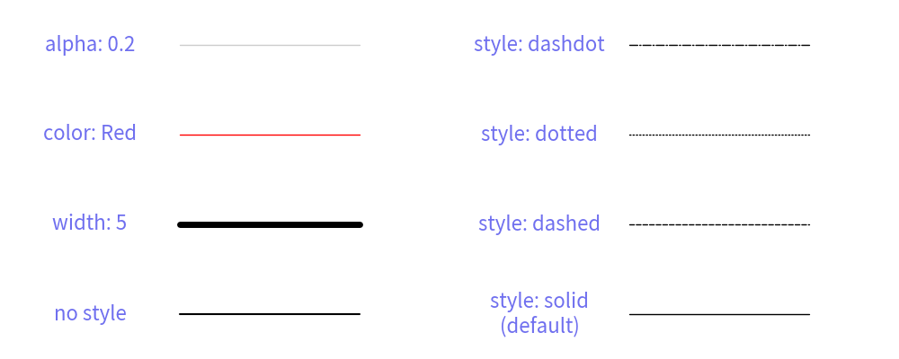
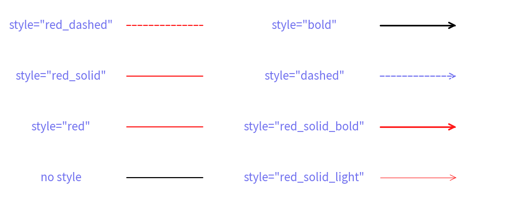

# Line Style


Drawlib provides six functions for drawing lines and lines with arrowheads:

* `line()`
* `line_curve()`
* `line_bezier1()`
* `line_bezier2()`
* `lines()`
* `lines_bezier()`

They all share the following optional arguments:

- `arrowhead`: Specifies the type of arrowhead. Options are `["", "->", "<-", "<->"]`.
- `width`: Specifies the line width. This should typically be configured within the style, but it is also available as an optional argument.
- `style`: Defines the line style. Accepts a Style object or a string (style name).

These optional arguments control the line's style. 
Regarding line width, you can control it using both the `width` argument and the `style` attribute. 
We recommend using the style attribute, as it is a visual parameter. 
If you configure it in the style, you can change the line width by modifying the shared style. 
However, since many users might want to change the line width easily, the width argument is provided as a shortcut.

Additionally, we have a function called `arrow()`. 
You might think it is similar to a line with an arrowhead, but it actually draws a thick and bold arrow shape, not an arrow line.


# Style for Lines


The `Style` object has the following attributes for line styling:

* `line_width`: Line width, represented as a float value.
* `line_color`: Line color, specified in RGB (0~255, 0~255, 0~255) or RGBA (0~255, 0~255, 0~255, 0~1.0). You can use the Color classes for convenience.
* `fill_alpha`: Line transparency, ranging from 0.0 (totally transparent) to 1.0 (fully opaque).
* `line_style`: Line style, which can be one of `["solid", "dashed", "dotted", "dashdot"]`. The default style is solid.
* `arrow_head_fill`: Arrowhead fill, indicating whether the arrowhead is filled (`True`) or not (`False`). The default is `False`.
* `arrow_head_scale`: Arrowhead scale, determining the size of the arrowhead. A larger value results in a larger arrowhead. The default scale is `20.0`.

The first four attributes (`line_width`, `line_color`, `fill_alpha`, `line_style`) affect both lines and lines with arrowheads. 
The last two attributes (`arrow_head_fill`, `arrow_head_scale`) specifically affect lines with arrowheads.
This structure allows for precise control over the appearance of lines and their associated arrowheads within Drawlib.

It's important to note that whether the arrowhead is present or not carries logical meaning, so it is considered a function argument rather than a style attribute.


# Drawing line with style


Let's explore different line styles through examples.


```python
from drawlib.canvas import config, save
from drawlib.colors import Colors
from drawlib.lines import line
from drawlib.text import text
from drawlib.types import Style

config(width=100, height=40)

text((10, 5), "no style")
line((20, 5), (40, 5))
text((10, 15), "width: 5")
line((20, 15), (40, 15), style=Style(line_width=5))
text((10, 25), "color: Red")
line((20, 25), (40, 25), style=Style(line_color=Colors.Red))
text((10, 35), "alpha: 0.2")
line((20, 35), (40, 35), style=Style(fill_alpha=0.2))

text((60, 5), "style: solid\n(default)")
line((70, 5), (90, 5), style=Style(line_style="solid"))
text((60, 15), "style: dashed")
line((70, 15), (90, 15), style=Style(line_style="dashed"))
text((60, 25), "style: dotted")
line((70, 25), (90, 25), style=Style(line_style="dotted"))
text((60, 35), "style: dashdot")
line((70, 35), (90, 35), style=Style(line_style="dashdot"))

save()
```




Running this code produces the following output:


```python
from drawlib.canvas import config, save
from drawlib.colors import Colors
from drawlib.lines import line
from drawlib.text import text
from drawlib.types import Style

config(width=100, height=40)

text((10, 5), "no style")
line((20, 5), (40, 5))
text((10, 15), "width: 5")
line((20, 15), (40, 15), style=Style(line_width=5))
text((10, 25), "color: Red")
line((20, 25), (40, 25), style=Style(line_color=Colors.Red))
text((10, 35), "alpha: 0.2")
line((20, 35), (40, 35), style=Style(fill_alpha=0.2))

text((60, 5), "style: solid\n(default)")
line((70, 5), (90, 5), style=Style(line_style="solid"))
text((60, 15), "style: dashed")
line((70, 15), (90, 15), style=Style(line_style="dashed"))
text((60, 25), "style: dotted")
line((70, 25), (90, 25), style=Style(line_style="dotted"))
text((60, 35), "style: dashdot")
line((70, 35), (90, 35), style=Style(line_style="dashdot"))

save()
```

<div class="drawlib-image" style="text-align: center;">
  
</div>


    lines with styles

This example demonstrates various line styles applied to lines using Drawlib.


# Drawing line arrow with style


All line functions in Drawlib support the `arrowhead` argument, which allows you to add arrowheads to lines.

The `arrowhead` argument accepts one of the following parameters:

- `""`: No arrowhead (default).
- `"->"`: Right arrowhead.
- `"<-"`: Left arrowhead.
- `"<->"`: Both right and left arrowheads.

You can customize the visual appearance of arrowheads using the following `Style` attributes:

* `arrow_head_fill`: Arrowhead fill. Determines whether the arrowhead is filled (`True`) or not (`False`). Default is `False`.
* `arrow_head_scale`: Arrowhead scale. Controls the size of the arrowhead. Larger values result in larger arrowheads. Default is `20.0`.

Let's see an example:


```python
from drawlib.canvas import config, save
from drawlib.colors import Colors
from drawlib.lines import line
from drawlib.text import text
from drawlib.types import Style

"""
config(width=100, height=50)

text((10, 5), "LineArrowStyle()", style=Style(text_size=14))
line((20, 5), (40, 5), )
text((10, 13), "width: 5")
line((20, 13), (40, 13), style=LineArrowStyle(lwidth=5))
text((10, 21), "color: Red")
line((20, 21), (40, 21), style=LineArrowStyle(color=Colors.Red))
text((10, 29), "alpha: 0.2")
line((20, 29), (40, 29), style=LineArrowStyle(alpha=0.2))
text((10, 37), "lstyle: dashed")
line((20, 37), (40, 37), style=LineArrowStyle(lstyle="dashed"))
text((10, 45), "hscale: 50\n(default: 20)")
line((20, 45), (40, 45), style=LineArrowStyle(hscale=50))

text((60, 5), "hstyle: ->\n(default)")
line((70, 5), (90, 5), style=LineArrowStyle(hstyle="->"))
text((60, 13), "style: <-")
line((70, 13), (90, 13), style=LineArrowStyle(hstyle="<-"))
text((60, 21), "style: <->")
line((70, 21), (90, 21), style=LineArrowStyle(hstyle="<->"))
text((60, 29), "style: -|>")
line((70, 29), (90, 29), style=LineArrowStyle(hstyle="-|>"))
text((60, 37), "style: <|-")
line((70, 37), (90, 37), style=LineArrowStyle(hstyle="<|-"))
text((60, 45), "style: <|-|>")
line((70, 45), (90, 45), style=LineArrowStyle(hstyle="<|-|>"))

save()
"""
```


Executing this code generates the following output:


```python
from drawlib.canvas import config, save
from drawlib.colors import Colors
from drawlib.lines import line
from drawlib.text import text
from drawlib.types import Style

"""
config(width=100, height=50)

text((10, 5), "LineArrowStyle()", style=Style(text_size=14))
line((20, 5), (40, 5), )
text((10, 13), "width: 5")
line((20, 13), (40, 13), style=LineArrowStyle(lwidth=5))
text((10, 21), "color: Red")
line((20, 21), (40, 21), style=LineArrowStyle(color=Colors.Red))
text((10, 29), "alpha: 0.2")
line((20, 29), (40, 29), style=LineArrowStyle(alpha=0.2))
text((10, 37), "lstyle: dashed")
line((20, 37), (40, 37), style=LineArrowStyle(lstyle="dashed"))
text((10, 45), "hscale: 50\n(default: 20)")
line((20, 45), (40, 45), style=LineArrowStyle(hscale=50))

text((60, 5), "hstyle: ->\n(default)")
line((70, 5), (90, 5), style=LineArrowStyle(hstyle="->"))
text((60, 13), "style: <-")
line((70, 13), (90, 13), style=LineArrowStyle(hstyle="<-"))
text((60, 21), "style: <->")
line((70, 21), (90, 21), style=LineArrowStyle(hstyle="<->"))
text((60, 29), "style: -|>")
line((70, 29), (90, 29), style=LineArrowStyle(hstyle="-|>"))
text((60, 37), "style: <|-")
line((70, 37), (90, 37), style=LineArrowStyle(hstyle="<|-"))
text((60, 45), "style: <|-|>")
line((70, 45), (90, 45), style=LineArrowStyle(hstyle="<|-|>"))

save()
"""
```

<div class="drawlib-image" style="text-align: center;">
  
</div>


    arrow lines with styles

This example demonstrates lines with different arrowhead styles and visual configurations using Drawlib.


# Theme's Pre-Defined Line Styles


Drawlib provides pre-defined line styles.
You can provide style via name easily.
What name you can use depends on theme you choose.

The style has this syntax: `<color>_<type>_<weight>`. 

- `<color>`: Specifies the color of the line.

`<type>` is one of thme.

- (default): solid line
- `solid`: solid line
- `dashed`: dashed line

`<weight>` is one of them

- (default): regular line width
- `light`: half of the default width
- `bold`: double the default width

If the type and weight are default, they may not be explicitly shown in the style name.

Let's look at an example:


```python
from drawlib.canvas import config, save
from drawlib.lines import line
from drawlib.text import text

config(width=100, height=40)

text((12, 5), "no style")
line((25, 5), (40, 5))
text((12, 15), 'style="red"')
line((25, 15), (40, 15), style="red")
text((12, 25), 'style="red_solid"')
line((25, 25), (40, 25), style="red_solid")
text((12, 35), 'style="red_dashed"')
line((25, 35), (40, 35), style="red_dashed")

text((60, 5), 'style="red_solid_light"')
line((75, 5), (90, 5), arrowhead="->", style="red_solid_light")
text((60, 15), 'style="red_solid_bold"')
line((75, 15), (90, 15), arrowhead="->", style="red_solid_bold")
text((60, 25), 'style="dashed"')
line((75, 25), (90, 25), arrowhead="->", style="dashed")
text((60, 35), 'style="bold"')
line((75, 35), (90, 35), arrowhead="->", style="bold")

save()
```


Executing this code generates the following output:


```python
from drawlib.canvas import config, save
from drawlib.lines import line
from drawlib.text import text

config(width=100, height=40)

text((12, 5), "no style")
line((25, 5), (40, 5))
text((12, 15), 'style="red"')
line((25, 15), (40, 15), style="red")
text((12, 25), 'style="red_solid"')
line((25, 25), (40, 25), style="red_solid")
text((12, 35), 'style="red_dashed"')
line((25, 35), (40, 35), style="red_dashed")

text((60, 5), 'style="red_solid_light"')
line((75, 5), (90, 5), arrowhead="->", style="red_solid_light")
text((60, 15), 'style="red_solid_bold"')
line((75, 15), (90, 15), arrowhead="->", style="red_solid_bold")
text((60, 25), 'style="dashed"')
line((75, 25), (90, 25), arrowhead="->", style="dashed")
text((60, 35), 'style="bold"')
line((75, 35), (90, 35), arrowhead="->", style="bold")

save()
```

<div class="drawlib-image" style="text-align: center;">
  
</div>


    lines with pre-defined style names

This example demonstrates lines drawn using pre-defined style names in Drawlib, showcasing different colors, line types, and thicknesses based on the specified styles.

---

<p align="center"><em>© 2026 drawlib by Yuichi Ito. Released under the Apache 2.0 License.</em></p>
