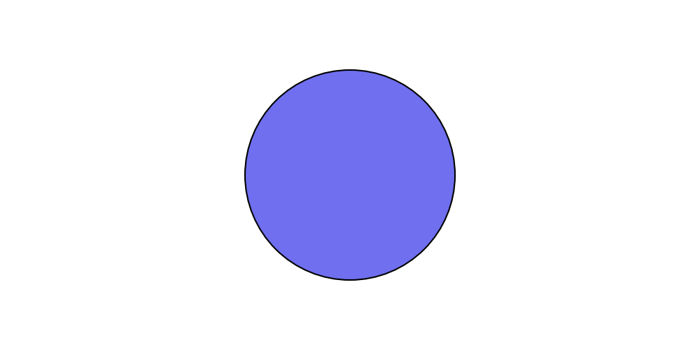
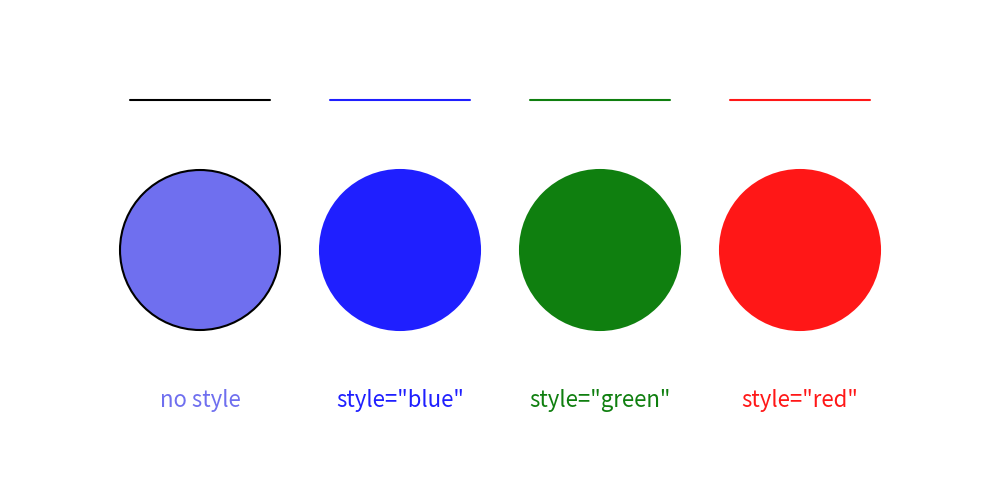
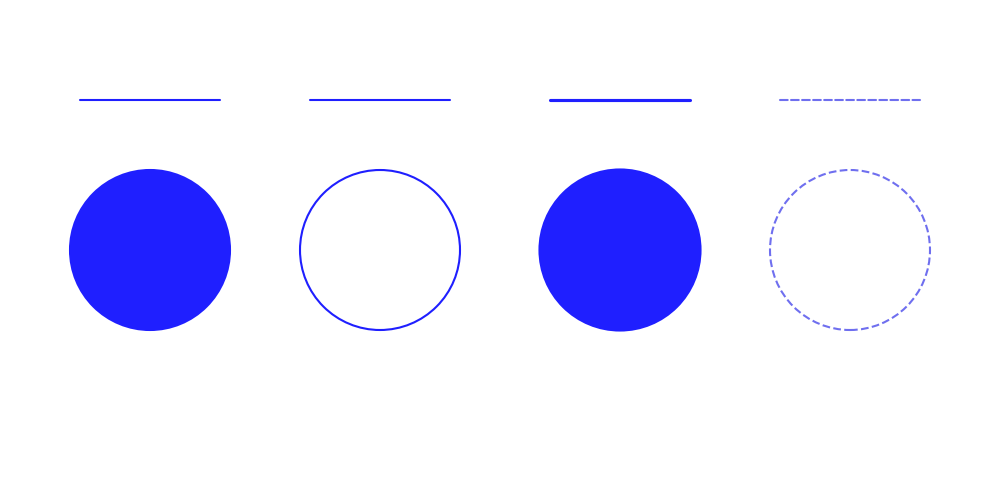

==================

# Preset Styles

Drawlib provides a preset styles feature under `drawlib.preset_styles`.
The default preset styles are applied automatically at the start of drawing.

A preset style is a collection of predefined `Style` objects for drawing items (icons, images, lines, shapes, text).
If you don't specify a style for drawing items, the default preset style will be applied.
Alternatively, you can specify a style with a shortcut name, such as `text((10, 10), "Hello", style="blue")`.

Understanding drawlib's preset styles will save you from defining many individual style objects.
Additionally, your illustrations will achieve visual consistency in styles.

Here are the key concepts of drawlib's preset styles system:

- Preset styles are accessed via `drawlib.preset_styles`.
- Official presets are available (`"default"`, `"essentials"`, `"monochrome"`).
- You can retrieve style objects using `get_style(name)`.
- Preset style names can be passed directly as strings to `style` parameters.
- Custom presets can be defined using `PresetStyles`.

# Official Style Presets

Drawlib includes three official style presets:

- `"default"`: Clean, beginner-friendly color palette with light blue highlights.
- `"essentials"`: Modern, rich palette with vibrant colors.
- `"monochrome"`: Sleek grayscale palette for documentation and technical diagrams.

You can inspect all available styles in a preset using `get_styles()` or preset-specific functions like `get_default_styles()`.


# Applying Preset Styles

Here is a circle drawn with default styles (no style specified):


```python
from drawlib.canvas import config, save
from drawlib.shapes import circle

config(width=100, height=50)
circle((50, 25), radius=15)
save()
```




Executing this code yields the following image:


```python
from drawlib.canvas import config, save
from drawlib.shapes import circle

config(width=100, height=50)
circle((50, 25), radius=15)
save()
```

<div class="drawlib-image" style="text-align: center;">
  
</div>


    Default preset style

If you don't provide any style, the default preset style is applied.


# Pre-defined Style Names

You can apply a preset style to drawing items using its name string.
Drawing functions accept the `style` argument, which takes `Style` objects as well as string style names.

The `default` preset includes the following primary color style names:

- `""` (blank): Default style applied when no style name is provided.
- `"red"`: Red accent color
- `"green"`: Green accent color
- `"blue"`: Blue accent color
- `"black"`: Black color
- `"white"`: White color

Let's see them in action.


```python
from drawlib.canvas import config, save
from drawlib.lines import line
from drawlib.shapes import circle
from drawlib.text import text

config(width=100, height=50)
line_y = 40
text_y = 10

# default style
line((13, line_y), (27, line_y))
circle((20, 25), radius=8)
text((20, text_y), text="no style")

# blue style
line((33, line_y), (47, line_y), style="blue")
circle((40, 25), radius=8, style="blue")
text((40, text_y), text='style="blue"', style="blue")

# green style
line((53, line_y), (67, line_y), style="green")
circle((60, 25), radius=8, style="green")
text((60, text_y), text='style="green"', style="green")

# red style
line((73, line_y), (87, line_y), style="red")
circle((80, 25), radius=8, style="red")
text((80, text_y), text='style="red"', style="red")

save()
```




Executing this code produces the following image:


```python
from drawlib.canvas import config, save
from drawlib.lines import line
from drawlib.shapes import circle
from drawlib.text import text

config(width=100, height=50)
line_y = 40
text_y = 10

# default style
line((13, line_y), (27, line_y))
circle((20, 25), radius=8)
text((20, text_y), text="no style")

# blue style
line((33, line_y), (47, line_y), style="blue")
circle((40, 25), radius=8, style="blue")
text((40, text_y), text='style="blue"', style="blue")

# green style
line((53, line_y), (67, line_y), style="green")
circle((60, 25), radius=8, style="green")
text((60, text_y), text='style="green"', style="green")

# red style
line((73, line_y), (87, line_y), style="red")
circle((80, 25), radius=8, style="red")
text((80, text_y), text='style="red"', style="red")

save()
```

<div class="drawlib-image" style="text-align: center;">
  
</div>


    Specifying preset style by name


# Style Naming Rules

Preset style names follow this syntax: `<color>_<type>_<weight>`.
If the color, type, or weight are default, they can be omitted in the style name.

- **Types**:
  - `flat`: Solid color with no border outline.
  - `solid`: Outline with no fill color.
  - `dashed`: Dashed outline with no fill color.
- **Weights**:
  - `light`: Thinner border width or lighter font weight.
  - `bold`: Thicker border width or bolder font weight.

Example:


```python
from drawlib.canvas import config, save
from drawlib.lines import line
from drawlib.shapes import circle
from drawlib.text import text

config(width=100, height=50)
line_y = 40
text_y = 10

line((8, line_y), (22, line_y), style="blue")
circle((15, 25), radius=8, style="blue")

line((31, line_y), (45, line_y), style="blue_solid")
circle((38, 25), radius=8, style="blue_solid")

line((55, line_y), (69, line_y), style="blue_bold")
circle((62, 25), radius=8, style="blue_bold")

line((78, line_y), (92, line_y), style="dashed")
circle((85, 25), radius=8, style="dashed")

save()
```


Executing this code results in the following image:


```python
from drawlib.canvas import config, save
from drawlib.lines import line
from drawlib.shapes import circle
from drawlib.text import text

config(width=100, height=50)
line_y = 40
text_y = 10

line((8, line_y), (22, line_y), style="blue")
circle((15, 25), radius=8, style="blue")

line((31, line_y), (45, line_y), style="blue_solid")
circle((38, 25), radius=8, style="blue_solid")

line((55, line_y), (69, line_y), style="blue_bold")
circle((62, 25), radius=8, style="blue_bold")

line((78, line_y), (92, line_y), style="dashed")
circle((85, 25), radius=8, style="dashed")

save()
```

<div class="drawlib-image" style="text-align: center;">
  
</div>


    Style type and weight variations

For detailed information on each preset style catalog, please refer to the Preset Styles section.

---

<p align="center"><em>© 2026 drawlib by Yuichi Ito. Released under the Apache 2.0 License.</em></p>
