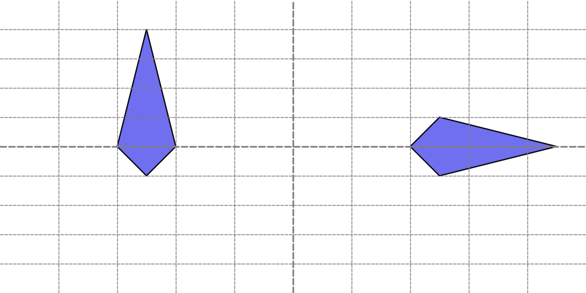

===============

# Drawing Shape


Drawlib provides a variety of functions for drawing shapes, from basic circles and rectangles to more specialized shapes like bubblespeech and chevrons. 
These functions are categorized into three types based on the shapes they draw:

* Circle-like shape: Specify `xy` and `radius`
* Rectangle-like shape: Specify `xy` and `width`, `height`
* Other shapes: Arrow(from `xy1` to `xy2`), Polygon(connects `xys` and filling) etc.


## Circle-like Shapes


Functions that draw circle-like shapes include:

* `circle()`
* `donuts()`
* `fan()`
* `regularpolygon()`
* `star()`
* `wedge()`


## Rectangle-like Shapes


Functions that draw rectangle-like shapes include:

* `arc()`
* `chevron()`
* `ellipse()`
* `parallelogram()`
* `rectangle()`
* `rhombus()`
* `trapezoid()`
* `triangle`


## Other Shapes


Functions that draw other types of shapes include:

* `arrow()`
* `polygon()`
* `shape()`

Let's explore all of these functions, except `shape()` which is covered on another page. 
The `shape()` function is useful for drawing custom shapes.

By default, all shapes are horizontally and vertically centered. 
This can be changed using the `Style()` object (via `text_halign` and `text_valign`). 
However, `arrow()` and `polygon()` do not have alignment attributes and will ignore these settings.

We'll discuss styling with `Style` on another page.


# Text of Shapes


All shapes can have text at their center. 
Before diving into each shape, let's explain this common feature.

Shape functions can take these three optional arguments:

* `text`: The text to display at the center of the shape.
* `textsize`: The font size of the text.
* `textstyle`: The style of the center text. You can configure the size and other properties here as well.

All of these arguments are optional. 
If you do not provide any value for text, no text will be shown.
We recommend setting font size at textstyle rather than textsize.


# Draw Other Type of Shapes


## polygon()


The `polygon()` function draws a shape that connects specified points to form a polygon. 
The start point and end point are automatically connected.

This function accepts the following arguments:

- xys: List of tuples specifying the points of the polygon [(x1, y1), (x2, y2), ..., (xn, yn)]
- style (optional): Style of the polygon
- text (optional): Centered text
- textstyle (optional): Style of the centered text

Let's explore an example:


```python
from drawlib.canvas import config, save
from drawlib.shapes import polygon
from drawlib.text import text

config(width=100, height=50, grid_only=True)
polygon(xys=[(25, 20), (30, 25), (25, 45), (20, 25)])
polygon(xys=[(70, 25), (75, 20), (95, 25), (75, 30)], text="polygon()")
save()
```


Here is an example output:


```python
from drawlib.canvas import config, save
from drawlib.shapes import polygon
from drawlib.text import text

config(width=100, height=50, grid_only=True)
polygon(xys=[(25, 20), (30, 25), (25, 45), (20, 25)])
polygon(xys=[(70, 25), (75, 20), (95, 25), (75, 30)], text="polygon()")
save()
```

<div class="drawlib-image" style="text-align: center;">
  
</div>


    polygon()

The `polygon()` function does not use an angle argument because the shape's orientation is determined by the order of the specified points. 
If you prefer to draw shapes with a standard coordinate system and angle features, consider using the `shape()` function.
