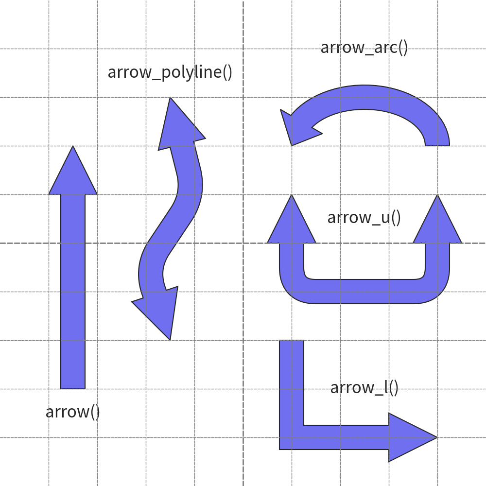
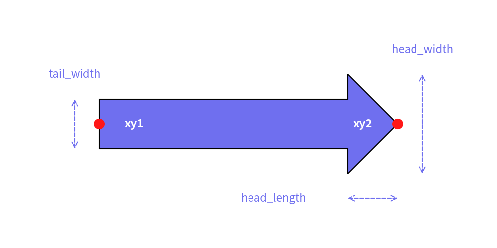
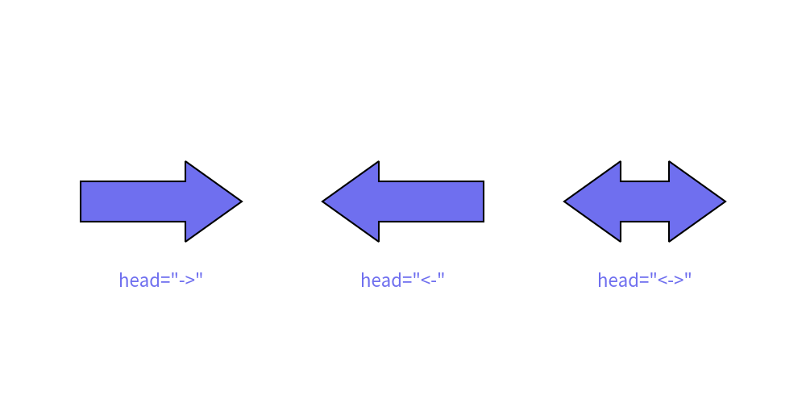
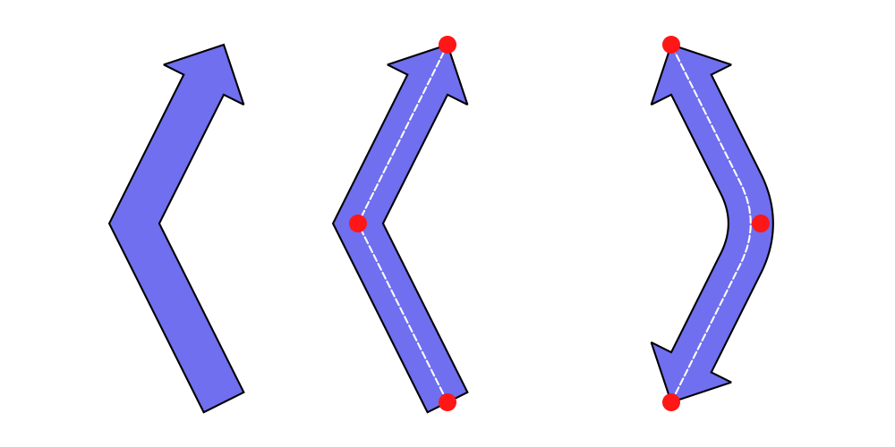
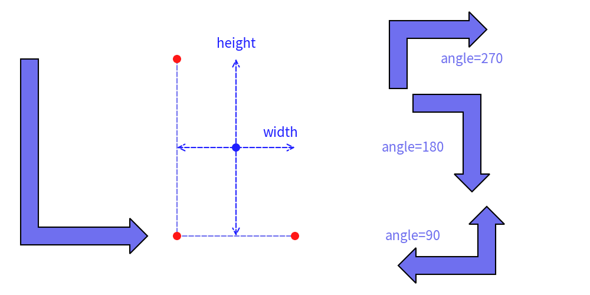
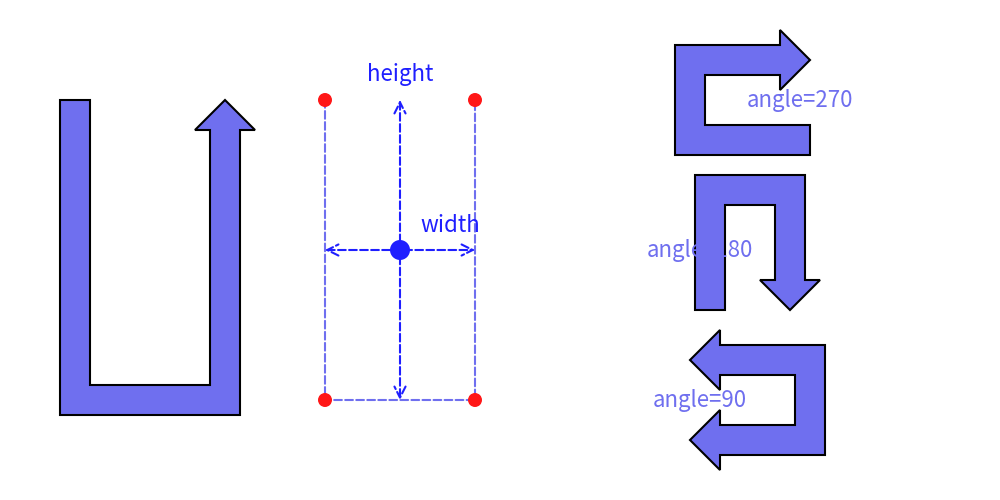
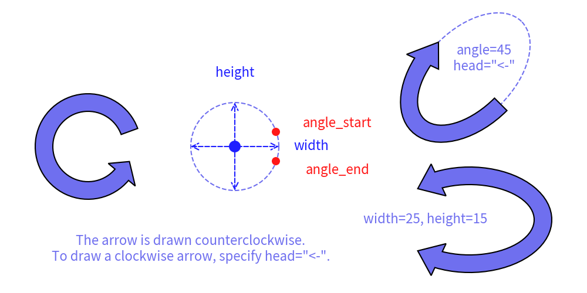

# Drawing Arrow Shapes


# Introductions


Arrow Shapes draw thick arrow.
There are these functios

- `arrow()`: Draw arrow from xy1 to xy2.
- `arrow_polyline`: Draw arrow which passes list of xys.
- `arrow_l`: Draw L shape arrow from top left to right bottom.
- `arrow_u`: Draw U shape arrow from top left to right top.
- `arrow_arc`: Draw ellipse arc arrow from start angle to end angle.

Here are arrow examples:


```python
from drawlib.canvas import config, save
from drawlib.fonts import FontRoboto
from drawlib.shapes import arrow, arrow_arc, arrow_l, arrow_polyline, arrow_u
from drawlib.text import text


config(width=100, height=100, grid_only=True)

x1 = 15
x2 = 35
x3 = 75

arrow((x1, 20), (x1, 70), tail_width=5, head_width=10, head_length=10)
text((x1, 15), "arrow()", size=24)
arrow_polyline(
    [(x2, 30), (x2 - 5, 45), (x2 + 5, 60), (x2, 80)],
    tail_width=5,
    head_width=10,
    head_length=10,
    head="<->",
    r=5,
)
text((x2, 85), "arrow_polyline()", size=24)

arrow_l((x3, 20), 30, 20, tail_width=5, head_width=10, head_length=10)
text((x3, 20), "arrow_l()", size=24)

arrow_u((x3, 50), 30, 20, tail_width=5, head_width=10, head_length=10, head="<->", r=5)
text((x3, 55), "arrow_u()", size=24)

arrow_arc(
    (x3, 70),
    width=30,
    height=20,
    tail_width=5,
    head_width=10,
    head_angle=30,
    angle_start=0,
    angle_end=180,
)
text((x3, 90), "arrow_arc()", size=24)

save()
```

<div class="drawlib-image" style="text-align: center;">
  
</div>


    arrow()


# Name of Arguments


All arrow functions have similar argument namings.
Understanding how to specify arrow size might be useful.


<div class="drawlib-image" style="text-align: center;">
  
</div>

<details class="drawlib-code-details">
<summary>Source Code</summary>

```python
from drawlib.canvas import config, save
from drawlib.fonts import FontRoboto
from drawlib.lines import line
from drawlib.shapes import arrow, circle
from drawlib.text import text


config(width=100, height=50)
arrow((20, 25), (80, 25), tail_width=10, head_width=20, head_length=10)

circle((20, 25), radius=1, style="red")
text((27, 25), "xy1", style="white_bold")
circle((80, 25), radius=1, style="red")
text((73, 25), "xy2", style="white_bold")

line((15, 20), (15, 30), style="dashed", arrowhead="<->")
text((15, 35), "tail_width")

line((85, 15), (85, 35), style="dashed", arrowhead="<->")
text((85, 40), "head_width")

line((70, 10), (80, 10), style="dashed", arrowhead="<->")
text((55, 10), "head_length")

save()
```

</details>


    Arrow size arguments.

- `xy` means coordinate of arrow. `xy1` and `xy2`, `xys` are used.
- `tail_width`: Tail width of arrow
- `head_width`: Head width of arrow
- `head_length`: Head length of arrow

You can specify arrow direction via arg `head`.


<div class="drawlib-image" style="text-align: center;">
  
</div>

<details class="drawlib-code-details">
<summary>Source Code</summary>

```python
from drawlib.canvas import config, save
from drawlib.fonts import FontRoboto
from drawlib.shapes import arrow
from drawlib.text import text


config(width=100, height=50)

arrow((10, 25), (30, 25), tail_width=5, head_width=10, head_length=7, head="->")
text((20, 15), 'head="->"')

arrow((40, 25), (60, 25), tail_width=5, head_width=10, head_length=7, head="<-")
text((50, 15), 'head="<-"')

arrow((70, 25), (90, 25), tail_width=5, head_width=10, head_length=7, head="<->")
text((80, 15), 'head="<->"')

save()
```

</details>


    Arrow size arguments.

- `->`: Draw arrow head at end of xy
- `<-`: Draw arrow head at start of xy
- `<->`: Draw arrow head at both start and end of xy


# Functions


## arrow()


The `arrow()` function draws an arrow shape between two points defined by `xy1` (start point) and `xy2` (end point). 
You can customize the arrow's tail and head sizes and styles.

This function accepts the following arguments:

- xy1: Start point coordinates (x1, y1)
- xy2: End point coordinates (x2, y2)
- tail_width: Width of the arrow's tail (not the head)
- head_width: Width of the arrow's head
- head_length: Length of the arrow's head
- head (optional): Style of the arrow's head (`"->"`, `"<-"`, `"<->"` for different configurations)
- style (optional): Style of the arrow
- text (optional): Centered text
- textstyle (optional): Style of the centered text

Let's explore an example:


```python
from drawlib.canvas import config, save
from drawlib.fonts import FontRoboto
from drawlib.shapes import arrow
from drawlib.text import text


config(width=100, height=50, grid_only=True)

arrow((5, 25), (45, 25), tail_width=10, head_width=20, head_length=10)
arrow(
    (75, 5),
    (75, 45),
    tail_width=10,
    head_width=20,
    head_length=10,
    head="<->",
    text="arrow()",
)
save()
```

Here is an example output:


<div class="drawlib-image" style="text-align: center;">
  
</div>


    arrow()

In the `arrow()` function, the angle of the arrow is determined automatically by its start and end points. 
The function does not use the alignment attributes (`text_halign` and `text_valign`) from `Style`.


## arrow_polyline


The `arrow_polyline` function draws an arrow which passes `xys` points.
It supports rounded edges.
It doesn't support having text inside.

- xys: List of arrow coordinates.
- tail_width: Width of the arrow's tail (not the head)
- head_width: Width of the arrow's head
- head_length: Length of the arrow's head
- head (optional): Style of the arrow's head (`"->"`, `"<-"`, `"<->"` for different configurations)
- r (optional): R of arrow line
- style (optional): Style of the arrow
- text (optional): Centered text
- textstyle (optional): Style of the centered text

Let's explore an example:


```python
from drawlib.canvas import config, save
from drawlib.fonts import FontRoboto
from drawlib.lines import lines, lines_curved
from drawlib.shapes import arrow_polyline, circle


config(width=100, height=50, grid=True)
arrow_polyline(
    [(25, 5), (15, 25), (25, 45)],
    tail_width=5,
    head_width=10,
    head_length=5,
)

arrow_polyline(
    [(50, 5), (40, 25), (50, 45)],
    tail_width=5,
    head_width=10,
    head_length=5,
)
lines([(50, 5), (40, 25), (50, 45)], style="white_dashed")
for dot in [(50, 5), (40, 25), (50, 45)]:
    circle(dot, radius=1, style="red_flat")

arrow_polyline(
    [(75, 5), (85, 25), (75, 45)],
    tail_width=5,
    head_width=10,
    head_length=5,
    r=5,
    head="<->",
)
lines_curved([(75, 5), (85, 25), (75, 45)], r=5, style="white_dashed")
for dot in [(75, 5), (85, 25), (75, 45)]:
    circle(dot, radius=1, style="red_flat")

save()
```

Here is an example output:


<div class="drawlib-image" style="text-align: center;">
  
</div>


    arrow_polyline()


## arrow_l


The `arrow_l` function is syntax sugar of `arrow_polyline`.
It draw "L" style arrow easily by specifying `width` and `height` and `angle`.

- xys: Center of arrow shape.
- width: width of arrow
- height: height of arrow
- tail_width: Width of the arrow's tail (not the head)
- head_width: Width of the arrow's head
- head_length: Length of the arrow's head
- head (optional): Style of the arrow's head (`"->"`, `"<-"`, `"<->"` for different configurations)
- r (optional): R of arrow line
- angle (optional): Angle of arrow
- style (optional): Style of the arrow


Let's explore an example:


```python
from drawlib.canvas import config, save
from drawlib.fonts import FontRoboto
from drawlib.lines import line, lines
from drawlib.shapes import arrow_l, circle
from drawlib.text import text


config(width=100, height=50, grid=True)
arrow_l(
    xy=(15, 25),
    width=20,
    height=30,
    tail_width=3,
    head_width=6,
    head_length=3,
)

arrow_l(
    xy=(40, 25),
    width=20,
    height=30,
    tail_width=3,
    head_width=6,
    head_length=3,
    style="white",
)
lines([(30, 40), (30, 10), (50, 10)], style="dashed")
for dot in [(30, 40), (30, 10), (50, 10)]:
    circle(dot, radius=0.7, style="red_flat")

circle((40, 25), radius=0.7, style="blue_flat")
line((30, 25), (50, 25), style="blue_dashed", arrowhead="<->")
text((47.5, 27.5), "width", style="blue")
line((40, 40), (40, 10), style="blue_dashed", arrowhead="<->")
text((40, 42.5), "height", style="blue")

arrow_l(
    xy=(75, 10),
    width=10,
    height=15,
    tail_width=3,
    head_width=6,
    head_length=3,
    angle=90,
    head="<->",
)
text((70, 10), "angle=90")

arrow_l(
    xy=(75, 25),
    width=10,
    height=15,
    tail_width=3,
    head_width=6,
    head_length=3,
    angle=180,
    head="<-",
)
text((70, 25), "angle=180")

arrow_l(
    xy=(75, 40),
    width=10,
    height=15,
    tail_width=3,
    head_width=6,
    head_length=3,
    angle=270,
    head="<-",
)
text((80, 40), "angle=270")

save()
```

Here is an example output:


<div class="drawlib-image" style="text-align: center;">
  
</div>


    arrow_l()

You need to change `angle` and direction of arrow `head` for drawing various style of L arrow. 


## arrow_u


The `arrow_u` function is syntax sugar of `arrow_polyline`.
It draw "U" style arrow easily by specifying `width` and `height` and `angle`.

- xy: Center of arrow shape.
- width: width of arrow
- height: height of arrow
- tail_width: Width of the arrow's tail (not the head)
- head_width: Width of the arrow's head
- head_length: Length of the arrow's head
- head (optional): Style of the arrow's head (`"->"`, `"<-"`, `"<->"` for different configurations)
- r (optional): R of arrow line
- angle (optional): Angle of arrow
- style (optional): Style of the arrow


Let's explore an example:


```python
from drawlib.canvas import config, save
from drawlib.fonts import FontRoboto
from drawlib.lines import line, lines
from drawlib.shapes import arrow_u, circle
from drawlib.text import text


config(width=100, height=50, grid=True)

arrow_u(
    xy=(15, 25),
    width=15,
    height=30,
    tail_width=3,
    head_width=6,
    head_length=3,
)

arrow_u(
    xy=(40, 25),
    width=15,
    height=30,
    tail_width=3,
    head_width=6,
    head_length=3,
    style="white",
)
lines([(32.5, 40), (32.5, 10), (47.5, 10), (47.5, 40)], style="dashed")
for dot in [(32.5, 40), (32.5, 10), (47.5, 10), (47.5, 40)]:
    circle(dot, radius=0.7, style="red_flat")

circle((40, 25), radius=1, style="blue_flat")
line((32.5, 25), (47.5, 25), style="blue_dashed", arrowhead="<->")
text((45, 27.5), "width", style="blue")
line((40, 40), (40, 10), style="blue_dashed", arrowhead="<->")
text((40, 42.5), "height", style="blue")

arrow_u(
    xy=(75, 10),
    width=8,
    height=12,
    tail_width=3,
    head_width=6,
    head_length=3,
    angle=90,
    head="<->",
)
text((70, 10), "angle=90")

arrow_u(
    xy=(75, 25),
    width=8,
    height=12,
    tail_width=3,
    head_width=6,
    head_length=3,
    angle=180,
    head="<-",
)
text((70, 25), "angle=180")

arrow_u(
    xy=(75, 40),
    width=8,
    height=12,
    tail_width=3,
    head_width=6,
    head_length=3,
    angle=270,
    head="<-",
)
text((80, 40), "angle=270")

save()
```

Here is an example output:


<div class="drawlib-image" style="text-align: center;">
  
</div>


    arrow_u()


You need to change `angle` and direction of arrow `head` for drawing various style of L arrow. 
  


## arrow_arc


The `arrow_arc` function draw arc on ellipse and circle(when width and height are same).
It specify ellipse `width` and `height`.
And also, you can specify where arrow start and end via `angle_start` and `angle_end`.
Please take care, length of head is specified by `head_angle`.
`head_angle=N` means drawing head within N degree.

- xy: Center of arrow shape.
- width: width of ellipse
- height: height of ellipse
- tail_width: Width of the arrow's tail (not the head)
- head_width: Width of the arrow's head
- head_angle: Length of the arrow's head by degree
- head (optional): Style of the arrow's head (`"->"`, `"<-"`, `"<->"` for different configurations)
- angle_start (optional): Where the arrow start. default is 0.
- angle_end (optional): Where the arrow end. default is 360.
- angle (optional): Angle of arrow
- style (optional): Style of the arrow

Let's explore an example:


```python
from drawlib.canvas import config, save
from drawlib.fonts import FontRoboto
from drawlib.lines import line
from drawlib.shapes import arc, arrow, arrow_arc, circle
from drawlib.text import text


config(width=100, height=50, grid=True)

arrow_arc(
    xy=(15, 25),
    width=15,
    height=15,
    tail_width=3,
    head_width=6,
    head_angle=20,
    angle_start=20,
    angle_end=340,
)

arrow_arc(
    xy=(40, 25),
    width=15,
    height=15,
    tail_width=3,
    head_width=6,
    head_angle=20,
    angle_start=20,
    angle_end=340,
    style="white",
)
arc(
    xy=(40, 25),
    width=15,
    height=15,
    # angle_start=20,
    # angle_end=340,
    style="dashed",
)
circle((40, 25), radius=1, style="blue_flat")
line((32.5, 25), (47.5, 25), style="blue_dashed", arrowhead="<->")
text((53, 25), "width", style="blue")
line((40, 17.5), (40, 32.5), style="blue_dashed", arrowhead="<->")
text((40, 37.5), "height", style="blue")

for dot in [(47, 27.5), (47, 22.5)]:
    circle(dot, radius=0.7, style="red_flat")

text((57.5, 29), "angle_start", style="red")
text((57.5, 21), "angle_end", style="red")

text((32.5, 7.5), 'The arrow is drawn counterclockwise.\nTo draw a clockwise arrow, specify head="<-".')

arrow_arc(
    xy=(80, 12.5),
    width=25,
    height=15,
    tail_width=3,
    head_width=6,
    head_angle=20,
    angle_start=225,
    angle_end=135,
    head="<->",
)
text((72.5, 12.5), "width=25, height=15")

arc(xy=(80, 37.5), width=25, height=15, angle=45, style="dashed")
arrow_arc(
    xy=(80, 37.5),
    width=25,
    height=15,
    tail_width=3,
    head_width=6,
    head_angle=20,
    angle_start=90,
    angle_end=270,
    angle=45,
    head="<-",
)
text((82.5, 40), 'angle=45\nhead="<-"')

save()
```

Here is an example output:


<div class="drawlib-image" style="text-align: center;">
  
</div>


    arrow_arc()

Please remember, arrow is always drawn from `angle_start` to `angle_end` counterclockwise.
If you want to draw clockwise arrow, please specify it via `head`.

---

<p align="center"><em>© 2026 drawlib by Yuichi Ito. Released under the Apache 2.0 License.</em></p>
