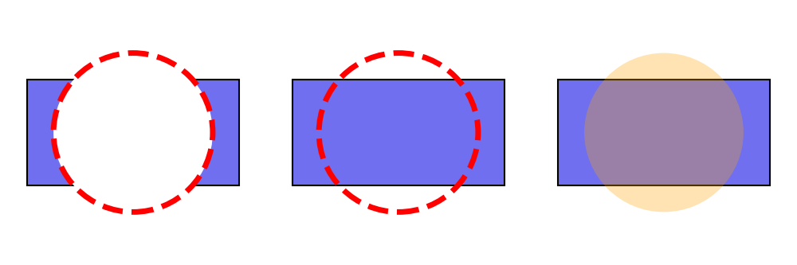
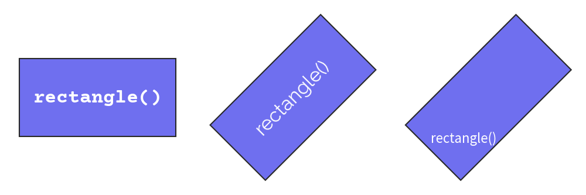
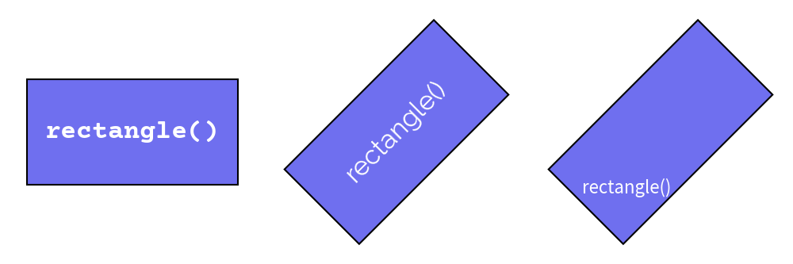
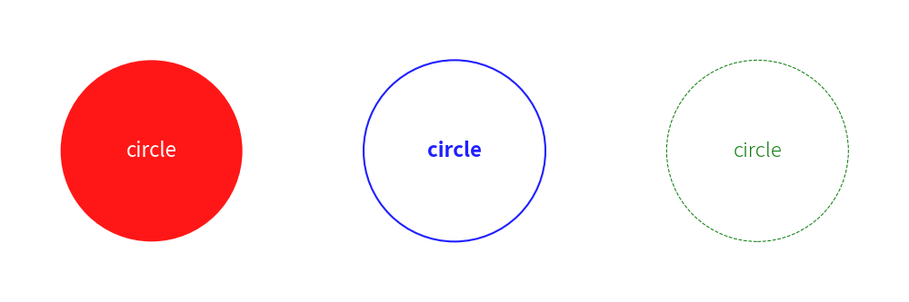

# Shape Style


Drawlib uses `Style` for styling shapes and the text inside them.


# Style for Shapes


The `Style` object is used for styling shapes and configuring shape alignment.

Here are the shape-related attributes of `Style`:

* `text_halign`: Horizontal alignment of shape
* `text_valign`: Vertical alignment of shape
* `line_width`: Border line width
* `line_color`: Border line color
* `line_style`: Border line style ("solid", "dashed", "dotted", "dashdot")
* `fill_color`: Fill color
* `fill_alpha`: Transparency

All of these attributes are optional. 
If you don't specify values for them, the default preset style values are applied.


## Alignment


You can configure the alignment of shapes, except for `arrow()` and `polygon()`, which specify drawing points explicitly and therefore do not have alignment options.

The default alignment is centered both horizontally and vertically. 
You can specify `"left"`, `"center"`, or `"right"` for horizontal alignment (`text_halign`). 
Similarly, you can specify `"bottom"`, `"center"`, or `"top"` for vertical alignment (`text_valign`). 
For more details and examples, please refer to the Coordinate and Alignment page.


## Style


`Style` possesses shape styling attributes:

* Line styling: `line_width`, `line_color`, `line_style`
* Fill styling: `fill_color`
* Transparency: `fill_alpha`

Here are three examples:


```python
from drawlib.canvas import config, save
from drawlib.colors import Colors, Colors140
from drawlib.shapes import circle, rectangle
from drawlib.types import Style

config(width=150, height=50)

# left
rectangle(xy=(25, 25), width=40, height=20)
circle(
    xy=(25, 25),
    radius=15,
    style=Style(
        line_width=5,
        line_color=Colors.Red,
        line_style="dashed",
        fill_color=Colors.White,
    ),
)

# center
rectangle(xy=(75, 25), width=40, height=20)
circle(
    xy=(75, 25),
    radius=15,
    style=Style(
        line_width=5,
        line_color=Colors.Red,
        line_style="dashed",
        fill_color=Colors.Transparent,
    ),
)

# right
rectangle(xy=(125, 25), width=40, height=20)
circle(
    xy=(125, 25),
    radius=15,
    style=Style(
        line_width=0,
        fill_color=Colors140.Orange,
        fill_alpha=0.3,
    ),
)
save()
```




Left example has non transparent style.
Center has fcolor transparent.
Right has alpha value.


```python
from drawlib.canvas import config, save
from drawlib.colors import Colors, Colors140
from drawlib.shapes import circle, rectangle
from drawlib.types import Style

config(width=150, height=50)

# left
rectangle(xy=(25, 25), width=40, height=20)
circle(
    xy=(25, 25),
    radius=15,
    style=Style(
        line_width=5,
        line_color=Colors.Red,
        line_style="dashed",
        fill_color=Colors.White,
    ),
)

# center
rectangle(xy=(75, 25), width=40, height=20)
circle(
    xy=(75, 25),
    radius=15,
    style=Style(
        line_width=5,
        line_color=Colors.Red,
        line_style="dashed",
        fill_color=Colors.Transparent,
    ),
)

# right
rectangle(xy=(125, 25), width=40, height=20)
circle(
    xy=(125, 25),
    radius=15,
    style=Style(
        line_width=0,
        fill_color=Colors140.Orange,
        fill_alpha=0.3,
    ),
)
save()
```

<div class="drawlib-image" style="text-align: center;">
  
</div>


    Shapes with Style

If you don't need a shape border line, set `line_width=0`. 
If you don't need a shape fill color, set `fill_color=Colors.Transparent` or `fill_color=Colors.White`. 
These are typical shape styling configurations.


# Styling Text Inside Shapes (textstyle)


Text drawn inside a shape via the `text` parameter is styled using a `Style` object passed to the `textstyle` parameter.

Common `Style` attributes used for shape text include:

- `text_color`: Text color
- `text_size`: Text size
- `text_font`: Text font
- `text_xy_shift`: Relative offset `(x, y)` from the shape center
- `text_angle`: Text angle (default follows the shape's angle)
- `text_halign`: Horizontal alignment
- `text_valign`: Vertical alignment

Here are three examples:


```python
from drawlib.canvas import config, save
from drawlib.colors import Colors
from drawlib.fonts import FontSansSerif, FontSerif
from drawlib.shapes import rectangle
from drawlib.text import text
from drawlib.types import Style

config(width=150, height=50)

# left
rectangle(
    xy=(25, 25),
    width=40,
    height=20,
    text="rectangle()",
    textstyle=Style(
        text_color=Colors.White,
        text_size=24,
        text_font=FontSerif.COURIER_BOLD,
    ),
)


# center
rectangle(
    xy=(75, 25),
    width=40,
    height=20,
    angle=45,
    text="rectangle()",
    textstyle=Style(
        text_color=Colors.White,
        text_size=24,
        text_font=FontSansSerif.RALEWAYS_REGULAR,
    ),
)


# right
rectangle(
    xy=(125, 25),
    width=40,
    height=20,
    angle=45,
    text="rectangle()",
    textstyle=Style(
        text_color=Colors.White,
        text_angle=0,
        text_xy_shift=(-12, -3),
    ),
)

save()
```


You can configure text styles.
But also, you can configure text positioning which you can see right example.

Below is a figure illustrating these styles:


```python
from drawlib.canvas import config, save
from drawlib.colors import Colors
from drawlib.fonts import FontSansSerif, FontSerif
from drawlib.shapes import rectangle
from drawlib.text import text
from drawlib.types import Style

config(width=150, height=50)

# left
rectangle(
    xy=(25, 25),
    width=40,
    height=20,
    text="rectangle()",
    textstyle=Style(
        text_color=Colors.White,
        text_size=24,
        text_font=FontSerif.COURIER_BOLD,
    ),
)


# center
rectangle(
    xy=(75, 25),
    width=40,
    height=20,
    angle=45,
    text="rectangle()",
    textstyle=Style(
        text_color=Colors.White,
        text_size=24,
        text_font=FontSansSerif.RALEWAYS_REGULAR,
    ),
)


# right
rectangle(
    xy=(125, 25),
    width=40,
    height=20,
    angle=45,
    text="rectangle()",
    textstyle=Style(
        text_color=Colors.White,
        text_angle=0,
        text_xy_shift=(-12, -3),
    ),
)

save()
```

<div class="drawlib-image" style="text-align: center;">
  
</div>


    Text in shapes with Style

As you can see from the center text example, text normally follows the shape's angle. 
However, you can override it, as shown in the right example. 
In that example, we also move the text positioning via `text_xy_shift`. 
The x and y values are not absolute coordinates but are relative to the shape's dimensions.


# Pre-defined Preset Styles


Shapes can use pre-defined styles from the preset styles you choose.

The style syntax is: `<color>_<type>_<weight>`. 
If the color, type, and weight are default, they are not shown in the style name.

Each style type has variations for line and fill styles. 
For shape text, predefined color and weight styles can also be supplied to `textstyle`.

- default: Has border and fill color
- `flat`: Has no border
- `solid`: Shape has an outline but no fill
- `dashed`: Dashed outline, no fill

Each weight type provides a variation of line width, except `flat` which has no border line.
When applied to `textstyle`, it controls font weight.

- `light`: Half of the default line width; font is light
- default: Regular line width; font is regular
- `bold`: Double the default line width; font is bold

Here are three examples:


```python
from drawlib.canvas import config, save
from drawlib.shapes import circle
from drawlib.text import text

config(width=150, height=50)

# left
circle(
    xy=(25, 25),
    radius=15,
    style="red_flat",
    text="circle",
    textstyle="white",
)

# center
circle(
    xy=(75, 25),
    radius=15,
    style="blue_solid",
    text="circle",
    textstyle="blue_bold",
)

# right
circle(
    xy=(125, 25),
    radius=15,
    style="green_dashed_light",
    text="circle",
    textstyle="green_light",
)
save()
```




Below is a figure illustrating these styles:


```python
from drawlib.canvas import config, save
from drawlib.shapes import circle
from drawlib.text import text

config(width=150, height=50)

# left
circle(
    xy=(25, 25),
    radius=15,
    style="red_flat",
    text="circle",
    textstyle="white",
)

# center
circle(
    xy=(75, 25),
    radius=15,
    style="blue_solid",
    text="circle",
    textstyle="blue_bold",
)

# right
circle(
    xy=(125, 25),
    radius=15,
    style="green_dashed_light",
    text="circle",
    textstyle="green_light",
)
save()
```

<div class="drawlib-image" style="text-align: center;">
  
</div>


    Pre-defined preset styles

---

<p align="center"><em>© 2026 drawlib by Yuichi Ito. Released under the Apache 2.0 License.</em></p>
