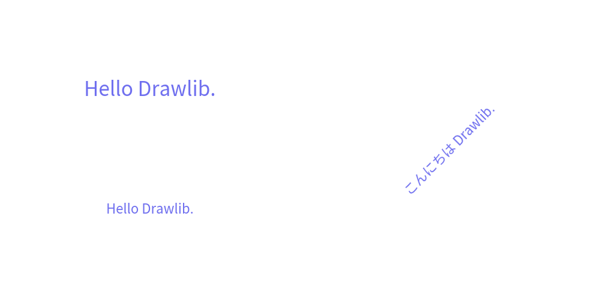
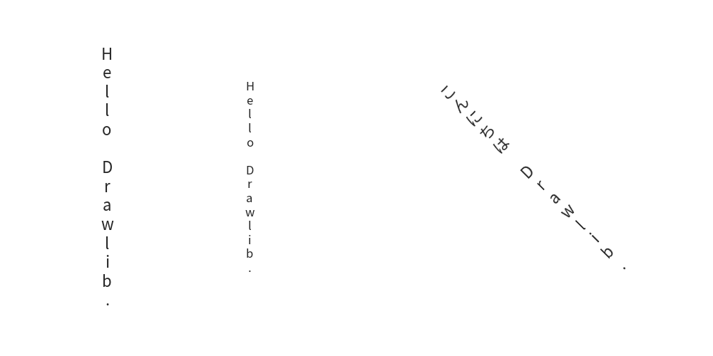
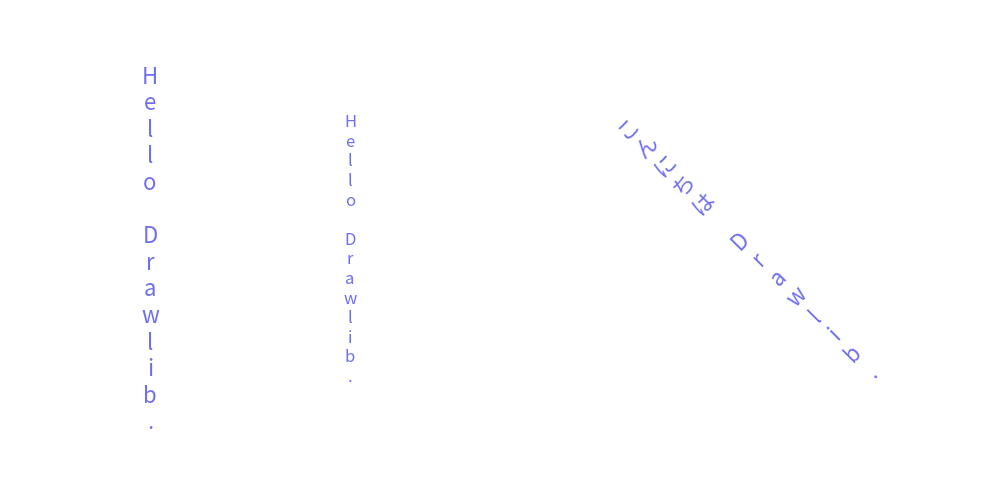
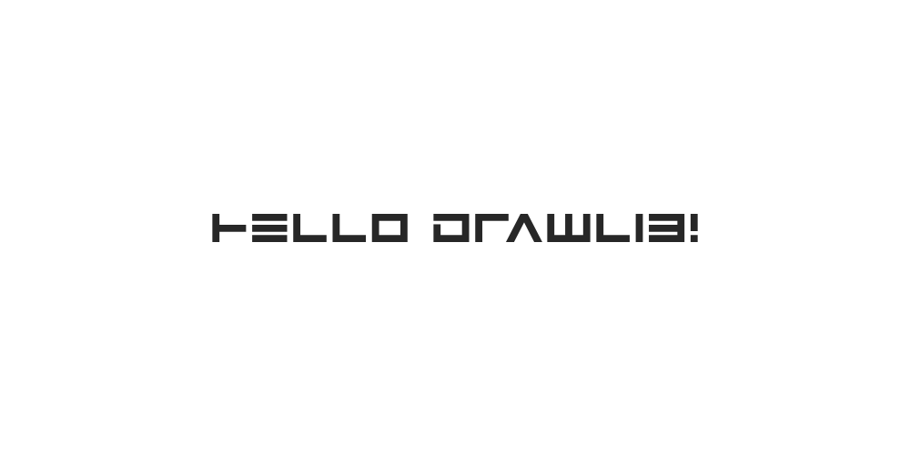
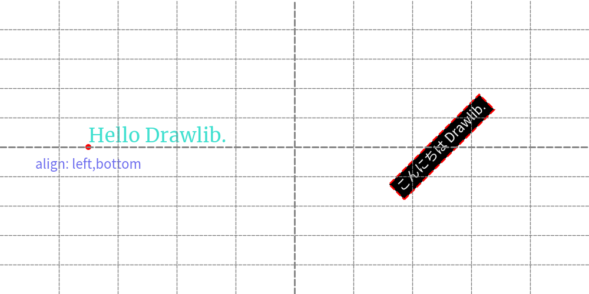
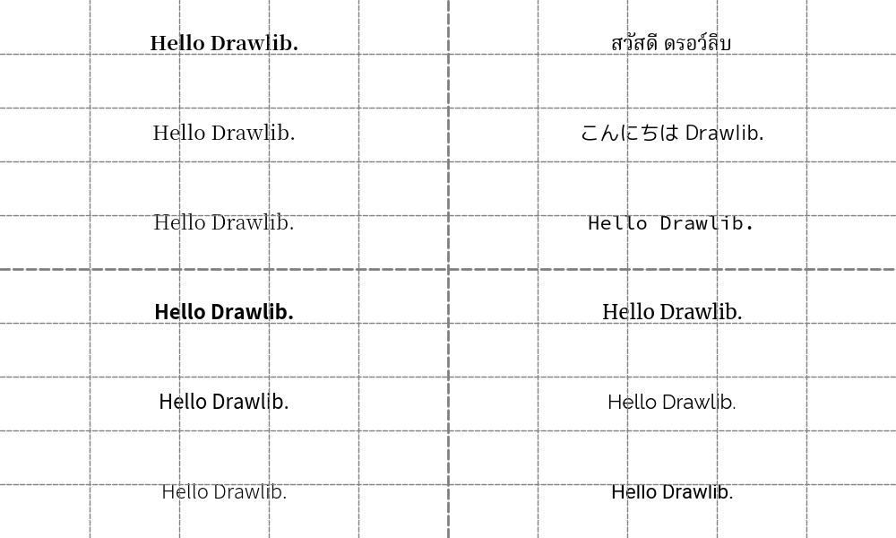
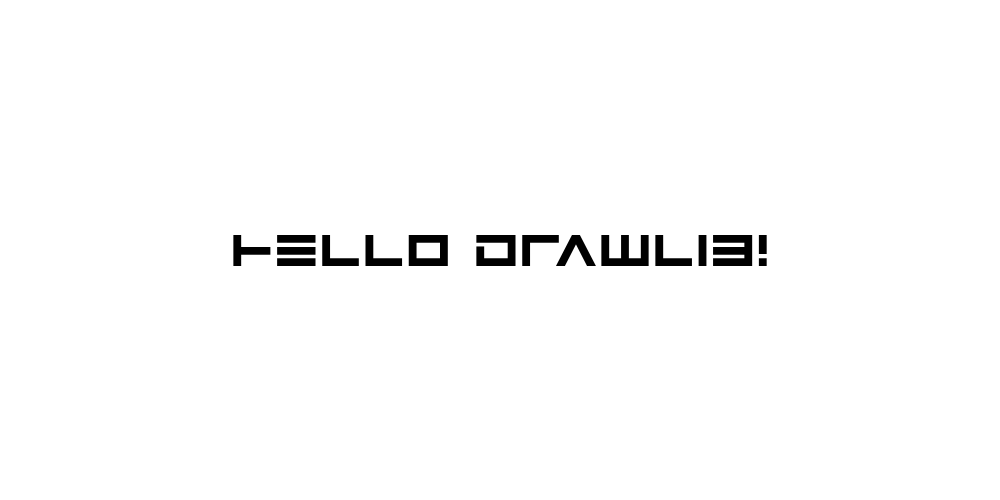
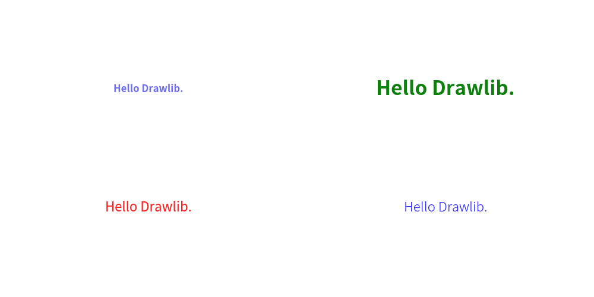

===============

# Drawing Text


Drawing text requires understanding the following concepts:

* text(): Function for drawing text
* Style: Unified style class (text styling attributes)
* font: How to specify fonts
* Theme's pre-defined styles

We will explain each of these concepts in this section.


# text()


Drawlib uses the `text()` function for drawing text. 
It takes the following arguments:

* xy: coordinate of drawing point
* text: text value
* size(optional): size of text font
* angle(optional): angle of text
* style(optional): text style

Font size can be changed with `size`, but it can also be changed by the `style` attribute. 
We recommend using the style attribute rather than size.
Similar to how you shouldn't configure text size in HTML but should do it in CSS, it's best to handle text styling via the style attribute for better consistency and flexibility.

We will explain style later, so for now, we will focus on the other arguments. 
Here are three examples:


```python
from drawlib.canvas import config, save
from drawlib.text import text

config(width=100, height=50)
text(xy=(25, 15), text="Hello Drawlib.")
text(xy=(25, 35), text="Hello Drawlib.", size=24)
text(xy=(75, 25), text="こんにちは Drawlib.", angle=45)
save()
```




Below is a figure illustrating these examples:


```python
from drawlib.canvas import config, save
from drawlib.text import text

config(width=100, height=50)
text(xy=(25, 15), text="Hello Drawlib.")
text(xy=(25, 35), text="Hello Drawlib.", size=24)
text(xy=(75, 25), text="こんにちは Drawlib.", angle=45)
save()
```

<div class="drawlib-image" style="text-align: center;">
  
</div>


   text()

Drawlib's default theme uses the multilingual font "Noto Sans CJK Japanese". 
This is a popular sans-serif font that supports CJK (Chinese, Japanese, Korean) in addition to the alphabet. 
As the font name suggests, it prioritizes Japanese but typically does not conflict with Chinese and Korean.

Fonts that prioritize Chinese and Korean are also provided. 
Additionally, other local language fonts are available for languages not supported by the default font.


# text_vertical()


While it is not common in alphabetic languages, vertically aligned text is popular in a few languages, such as Japanese. 
We provide the `text_vertical()` function to achieve this. 
The arguments are exactly the same as those for `text()`.

* xy: coordinate of drawing point
* text: text value
* size(optional): size of text font
* angle(optional): angle of text
* style(optional): text style

Here are three examples:


```python
from drawlib.canvas import config, save
from drawlib.text import text, text_vertical

config(width=100, height=50)
text_vertical(xy=(15, 25), text="Hello Drawlib.")
text_vertical(xy=(35, 25), text="Hello Drawlib.", size=12)
text_vertical(xy=(75, 25), text="こんにちは Drawlib.", angle=45)
save()
```




Below is a figure illustrating these examples:


```python
from drawlib.canvas import config, save
from drawlib.text import text, text_vertical

config(width=100, height=50)
text_vertical(xy=(15, 25), text="Hello Drawlib.")
text_vertical(xy=(35, 25), text="Hello Drawlib.", size=12)
text_vertical(xy=(75, 25), text="こんにちは Drawlib.", angle=45)
save()
```

<div class="drawlib-image" style="text-align: center;">
  
</div>


   text_vertical()

Please use `text_halign="center"` in Style. 
It is the default value. 
Horizontal align left/right will work, but it does not look nice except with monospaced fonts.


# Style for Text


In Drawlib, text is styled using the unified `Style` class.
It encompasses many attributes, categorized into "alignment", "text style", and "text background style".

`Style` has these text-related attributes:

* `text_halign`: Horizontal alignment of text. Options are "left", "center", "right".
* `text_valign`: Vertical alignment of text. Options are "bottom", "center", "top".
* `text_color`: Text color.
* `text_size`: Text size.
* `text_font`: Text font.
* `text_bg_fill_alpha`: Background alpha.
* `text_bg_line_width`: Background line width.
* `text_bg_line_color`: Background line color.
* `text_bg_line_style`: Background line style. Options are "solid", "dashed", "dotted", "dashdot".
* `text_bg_fill_color`: Background fill color.

The default alignment is "center" horizontally and "center" vertically. 
By default, no background is drawn.

Here are 2 examples.


```python
from drawlib.canvas import config, save
from drawlib.colors import Colors, Colors140
from drawlib.fonts import FontSerif
from drawlib.shapes import circle
from drawlib.text import text
from drawlib.types import Style

config(width=100, height=50, grid_only=True)
text(
    xy=(15, 25),
    text="Hello Drawlib.",
    style=Style(
        text_color=Colors140.Turquoise,
        text_size=24,
        text_halign="left",
        text_valign="bottom",
        text_font=FontSerif.MERRIWEATHER_REGULAR,
    ),
)
circle(xy=(15, 25), radius=0.5, style=Style(fill_color=Colors.Red, line_width=0))
text((15, 22), "align: left,bottom")

text(
    xy=(75, 25),
    angle=45,
    text="こんにちは Drawlib.",
    style=Style(
        text_color=Colors.White,
        text_bg_line_width=2,
        text_bg_line_color=Colors.Red,
        text_bg_line_style="dashed",
        text_bg_fill_color=Colors.Black,
    ),
)
save()
```




The left-side example configures alignment and text style, while the right-side example configures text background style.
Below is a figure illustrating these examples:


```python
from drawlib.canvas import config, save
from drawlib.colors import Colors, Colors140
from drawlib.fonts import FontSerif
from drawlib.shapes import circle
from drawlib.text import text
from drawlib.types import Style

config(width=100, height=50, grid_only=True)
text(
    xy=(15, 25),
    text="Hello Drawlib.",
    style=Style(
        text_color=Colors140.Turquoise,
        text_size=24,
        text_halign="left",
        text_valign="bottom",
        text_font=FontSerif.MERRIWEATHER_REGULAR,
    ),
)
circle(xy=(15, 25), radius=0.5, style=Style(fill_color=Colors.Red, line_width=0))
text((15, 22), "align: left,bottom")

text(
    xy=(75, 25),
    angle=45,
    text="こんにちは Drawlib.",
    style=Style(
        text_color=Colors.White,
        text_bg_line_width=2,
        text_bg_line_color=Colors.Red,
        text_bg_line_style="dashed",
        text_bg_fill_color=Colors.Black,
    ),
)
save()
```

<div class="drawlib-image" style="text-align: center;">
  
</div>


   Text with Style

In our opinion, there are few chances to use text background. 
Setting a white (or another canvas background color) background without a border can be useful for drawing text over shapes and lines in some situations.


# Font


Drawlib specifies fonts from Drawlib's font library or from your own font files. 
Drawlib does not use system fonts installed on your PC because using system fonts may result in inconsistent rendering across different environments.


## Basic Font Classes


Drawlib includes these basic Font classes:

* Font
* FontSanSerif
* FontSerif
* FontMonoSpace
* FontSourceCode
* FontRoboto

These classes contain popular fonts or fonts preferred by the Drawlib team.


## Local Language Fonts


Additionally, Drawlib supports local language fonts:

* FontArabic
* FontBrahmic
* FontChinese
* FontJapanese
* FontKorean
* FontThai

If your preferred language is not supported, please let us know. 
However, we can only support open-source free fonts at the moment.
And currently, we use Google fonts.

Here are font examples.


```python
from drawlib.canvas import config, save
from drawlib.fonts import Font, FontJapanese, FontMonoSpace, FontRoboto, FontSansSerif, FontSerif, FontThai
from drawlib.text import text
from drawlib.types import Style

config(width=100, height=60, grid_only=True)
text(xy=(25, 5), text="Hello Drawlib.", style=Style(text_font=Font.SANSSERIF_LIGHT))
text(xy=(25, 15), text="Hello Drawlib.", style=Style(text_font=Font.SANSSERIF_REGULAR))
text(xy=(25, 25), text="Hello Drawlib.", style=Style(text_font=Font.SANSSERIF_BOLD))
text(xy=(25, 35), text="Hello Drawlib.", style=Style(text_font=Font.SERIF_LIGHT))
text(xy=(25, 45), text="Hello Drawlib.", style=Style(text_font=Font.SERIF_REGULAR))
text(xy=(25, 55), text="Hello Drawlib.", style=Style(text_font=Font.SERIF_BOLD))

text(xy=(75, 5), text="Hello Drawlib.", style=Style(text_font=FontRoboto.ROBOTO_REGULAR))
text(xy=(75, 15), text="Hello Drawlib.", style=Style(text_font=FontSansSerif.RALEWAYS_REGULAR))
text(xy=(75, 25), text="Hello Drawlib.", style=Style(text_font=FontSerif.MERRIWEATHER_REGULAR))
text(xy=(75, 35), text="Hello Drawlib.", style=Style(text_font=FontMonoSpace.SOURCECODEPRO_REGULAR))
text(xy=(75, 45), text="こんにちは Drawlib.", style=Style(text_font=FontJapanese.MPLUS1P_REGULAR))
text(xy=(75, 55), text="สวัสดี ดรอว์ลิบ", style=Style(text_font=FontThai.SERIF_REGULAR))

save()
```




Below is a figure illustrating these examples:


```python
from drawlib.canvas import config, save
from drawlib.fonts import Font, FontJapanese, FontMonoSpace, FontRoboto, FontSansSerif, FontSerif, FontThai
from drawlib.text import text
from drawlib.types import Style

config(width=100, height=60, grid_only=True)
text(xy=(25, 5), text="Hello Drawlib.", style=Style(text_font=Font.SANSSERIF_LIGHT))
text(xy=(25, 15), text="Hello Drawlib.", style=Style(text_font=Font.SANSSERIF_REGULAR))
text(xy=(25, 25), text="Hello Drawlib.", style=Style(text_font=Font.SANSSERIF_BOLD))
text(xy=(25, 35), text="Hello Drawlib.", style=Style(text_font=Font.SERIF_LIGHT))
text(xy=(25, 45), text="Hello Drawlib.", style=Style(text_font=Font.SERIF_REGULAR))
text(xy=(25, 55), text="Hello Drawlib.", style=Style(text_font=Font.SERIF_BOLD))

text(xy=(75, 5), text="Hello Drawlib.", style=Style(text_font=FontRoboto.ROBOTO_REGULAR))
text(xy=(75, 15), text="Hello Drawlib.", style=Style(text_font=FontSansSerif.RALEWAYS_REGULAR))
text(xy=(75, 25), text="Hello Drawlib.", style=Style(text_font=FontSerif.MERRIWEATHER_REGULAR))
text(xy=(75, 35), text="Hello Drawlib.", style=Style(text_font=FontMonoSpace.SOURCECODEPRO_REGULAR))
text(xy=(75, 45), text="こんにちは Drawlib.", style=Style(text_font=FontJapanese.MPLUS1P_REGULAR))
text(xy=(75, 55), text="สวัสดี ดรอว์ลิบ", style=Style(text_font=FontThai.SERIF_REGULAR))

save()
```

<div class="drawlib-image" style="text-align: center;">
  
</div>


   Fonts

To change font styles, refer to the preset styles documentation.
You can create custom `Style` or `PresetStyles` objects to specify font settings across text elements.


## Custom Font


Drawlib offers a wide range of fonts. 
However, if you want to use fonts that are not supported, use the `FontFile` class. 
This class can be used in place of the basic font classes and accepts a font file as an argument.

Here is an examples which uses font avenger.


```python
from drawlib.canvas import config, save
from drawlib.text import text
from drawlib.types import Style

config(width=100, height=50)
text(
    (50, 25),
    "Hello Drawlib!",
    style=Style(
        text_size=36,
        text_font=FontFile("./avenger/regular.ttf"),
    ),
)
save()
```




Below is a figure illustrating these examples:


```python
from drawlib.canvas import config, save
from drawlib.text import text
from drawlib.types import Style

config(width=100, height=50)
text(
    (50, 25),
    "Hello Drawlib!",
    style=Style(
        text_size=36,
        text_font=FontFile("./avenger/regular.ttf"),
    ),
)
save()
```

<div class="drawlib-image" style="text-align: center;">
  
</div>


   FontFile

You can check the list of fonts supported by Drawlib in the Font documentation.


# Theme's pre-defined styles


Text in Drawlib can utilize pre-defined styles from the theme you select.

The style syntax is: `<color>_<type>_<weight>`.
If the color and weight are default, they are not explicitly shown in the style name.
However, text styles do not use the type variations that are used for lines and shapes.

Each weight type variation includes different font weights:

- `light`: Font weight light
- default: Font weight regular
- `bold`: Font weight bold

Here is an example script that demonstrates the use of theme-defined text styles:


```python
from drawlib.canvas import config, save
from drawlib.text import text

config(width=100, height=50)
text(xy=(25, 15), text="Hello Drawlib.", style="red")
text(xy=(25, 35), text="Hello Drawlib.", size=12, style="bold")
text(xy=(75, 15), text="Hello Drawlib.", style="blue_light")
text(xy=(75, 35), text="Hello Drawlib.", size=24, style="green_bold")
save()
```




Below is a figure illustrating these examples:


```python
from drawlib.canvas import config, save
from drawlib.text import text

config(width=100, height=50)
text(xy=(25, 15), text="Hello Drawlib.", style="red")
text(xy=(25, 35), text="Hello Drawlib.", size=12, style="bold")
text(xy=(75, 15), text="Hello Drawlib.", style="blue_light")
text(xy=(75, 35), text="Hello Drawlib.", size=24, style="green_bold")
save()
```

<div class="drawlib-image" style="text-align: center;">
  
</div>


   Theme's pre-defined styles

---

<p align="center"><em>© 2026 drawlib by Yuichi Ito. Released under the Apache 2.0 License.</em></p>
