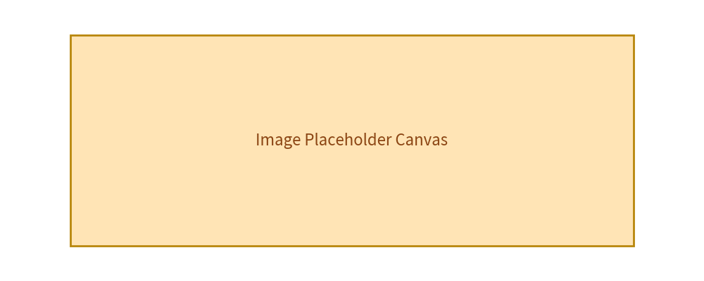

# Images & Effects Guide

Drawlib supports drawing external images onto the canvas via `image()`, and applying non-destructive effects using the string-like `Dimage` helper class.

---

## 1. Placing Images (`image`)

Images are placed at `xy` coordinates with a specified `width`. Height is automatically computed to preserve aspect ratio.


```python
from drawlib.canvas import config
from drawlib.colors import Colors140
from drawlib.shapes import rectangle
from drawlib.text import text
from drawlib.types import ShapeStyle, TextStyle

config(width=100, height=40)

rectangle(
    xy=(50, 20),
    width=80,
    height=30,
    style=ShapeStyle(fill_color=Colors140.Moccasin, line_color=Colors140.DarkGoldenRod, line_width=2)
)
text(
    xy=(50, 20),
    text="Image Placeholder Canvas",
    style=TextStyle(text_color=Colors140.SaddleBrown, text_size=16)
)
```




---

## 2. Image Processing (`Dimage`)

`Dimage` allows chaining operations such as `grayscale()`, `sepia()`, `flip_h()`, or `border()` prior to rendering.

```python
from drawlib.images import Dimage, image

img = Dimage("path/to/photo.png").sepia().flip_h()
image(xy=(50, 50), width=40, image=img)
```

---

## Navigation

- [Back to Index](./index.md)
- [Next: Themes & Styles](./themes.md)
