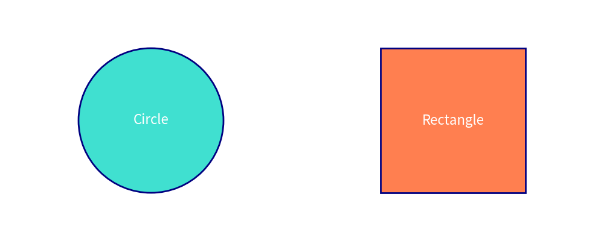

# Drawlib Documentation

**Drawlib** is a Python library crafted to facilitate **Illustration as Code**.
Define your diagrams and illustrations programmatically, manage them with Git, and automate document compilation.

---

## 1. Concept: Illustration as Code

In traditional workflows, illustrations are drawn manually in graphic tools. With Drawlib, you write Python code to generate clean vector graphics directly inside your Markdown documents and scripts.


```python
from drawlib.canvas import config
from drawlib.colors import Colors, Colors140
from drawlib.shapes import circle, rectangle
from drawlib.text import text
from drawlib.types import ShapeStyle, TextStyle

config(width=100, height=40)

# Draw circle and rectangle with custom styles
circle(xy=(25, 20), radius=12, style=ShapeStyle(fill_color=Colors140.Turquoise, line_color=Colors.Navy, line_width=2))
text(xy=(25, 20), text="Circle", style=TextStyle(text_color=Colors.White, text_size=16))

rectangle(xy=(75, 20), width=24, height=24, style=ShapeStyle(fill_color=Colors140.Coral, line_color=Colors.Navy, line_width=2))
text(xy=(75, 20), text="Rectangle", style=TextStyle(text_color=Colors.White, text_size=16))
```




---

## 2. Table of Contents

- [Quick Start](./quick_start.md) - Get started in 5 minutes
- **Foundations** (`./foundations/`)
  - [Canvas & Coordinate System](./foundations/canvas.md) - Coordinates, canvas size, resolution (DPI), grid overlays
  - [Shapes Guide](./shapes.md) - Circles, rectangles, polygons, stars, and arrows
  - [Lines Guide](./lines.md) - Straight lines, curves, polyline connectors, and arrowheads
  - [Text Guide](./text.md) - Typography, alignment, fonts, and text boxes
  - [Images Guide](./images.md) - Embedding images, cropping, and filter effects
  - [Icons Guide](./icons.md) - Over 1,500 Phosphor icons and icon badges
- **Themes & Styling** (`./themes/`)
  - [Themes Guide](./themes/themes.md) - Predefined themes, color palettes, and custom styles
- **SmartArts Diagrams** (`./smartarts/`)
  - [SmartArts Guide](./smartarts/smartarts.md) - Tables, trees, process lists, speech bubbles, and pyramids
- **Developer Tools** (`./tools/`)
  - [Document Builder](./tools/doc_builder.md) - Compiling Markdown documents into HTML/PDF

---

## 3. Core Principles

1. **Separation of Content and Style**: Similar to HTML and CSS, define drawing structures separately from visual themes.
2. **Version Control Friendly**: Store illustrations as plain code alongside your documentation in Git repositories.
3. **Automated Document Compilation**: Compile Markdown files containing `drawlib` code blocks into static Web sites or PDFs.
