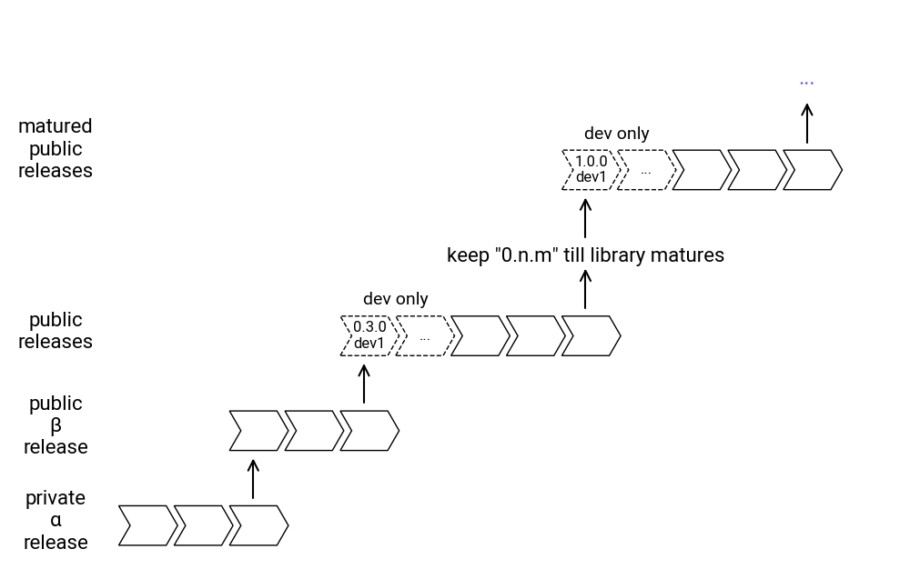

# Install

Drawlib can be installed using `uv` (recommended) or `pip`.


## Using uv (Recommended)

Add Drawlib to your project:

```bash
$ uv add drawlib
```

To install with optional PDF export support (`drawlib build pdf`):

```bash
$ uv add "drawlib[pdf]"
$ uv run playwright install chromium
```


## Using pip

Install Drawlib into your Python environment:

```bash
$ pip install drawlib
```

To install with optional PDF export support (`drawlib build pdf`):

```bash
$ pip install "drawlib[pdf]"
$ playwright install chromium
```

---

## Verifying Installation

After installation, verify that the `drawlib` CLI and library are installed:

```bash
# When using uv:
$ uv run drawlib --version

# When using pip / global environment:
$ drawlib --version
# or: $ python -m drawlib --version
```

The CLI manages document compilation (`drawlib build`), local preview servers (`drawlib serve`), project scaffolding (`drawlib init`), and diagram export. For more details, see the **[CLI Reference](../cli/index.md)**.

---

## Troubleshooting

Drawlib depends on `matplotlib`, which requires `msvc-runtime` on Windows. If it is not automatically installed on Windows systems, you may encounter the following error:

```text
ImportError: DLL load failed while importing _cext: The specified module could not be found
```

In this case, manually install `msvc-runtime`:

```bash
# Using uv:
$ uv pip install msvc-runtime

# Using pip:
$ pip install msvc-runtime
```

---

## Release Policy

Drawlib follows semantic versioning (`<major>.<minor>.<patch>`):

- **Major Version**: Significant architectural or API changes
- **Minor Version**: New features and minor API additions
- **Patch Version**: Bug fixes and minor maintenance

During development cycles, pre-release packages (`dev<n>`) are published for testing:

```bash
# Using uv:
$ uv add "drawlib==0.3.0.dev1"

# Using pip:
$ pip install "drawlib==0.3.0.dev1"
```

Once a feature cycle stabilizes, an official release (e.g. `0.3.1`) is published.


<div class="drawlib-image" style="text-align: center;">
  
</div>

<details class="drawlib-code-details">
<summary>Source Code</summary>

```python
from drawlib.canvas import save, setup
from drawlib.colors import Colors
from drawlib.fonts import FontRoboto
from drawlib.lines import line
from drawlib.shapes import arrow, chevron
from drawlib.text import text
from drawlib.config import styles


def draw_versions(x: float, y: float, versions: list[str]):
    width = 6
    height = 5
    corner_angle = 60
    padding = 1

    s1 = styles.blue_flat
    s2 = styles.primary.patch(line_style="dashed", shape_fill_color=Colors.Transparent, shape_line_color=Colors.Blue)
    st1 = styles.primary.patch(text_size=11, text_color=Colors.White, text_font=FontRoboto.ROBOTO_REGULAR)
    st2 = styles.primary.patch(text_size=11, text_color=Colors.Blue, text_font=FontRoboto.ROBOTO_REGULAR)
    for i, version in enumerate(versions):
        if len(versions) == 5 and i in [0, 1]:
            chevron(
                (x + (width + padding) * i, y),
                width=width,
                height=height,
                corner_angle=corner_angle,
                style=s2,
                text=version,
                textstyle=st2,
            )
        else:
            chevron(
                (x + (width + padding) * i, y),
                width=width,
                height=height,
                corner_angle=corner_angle,
                style=s1,
                text=version,
                textstyle=st1,
            )


setup(width=115, height=72)

ts = styles.primary.patch(text_size=16, text_font=FontRoboto.ROBOTO_REGULAR)
text((7, 6), "private\nα\nrelease", style=ts)
text((7, 18), "public\nβ\nrelease", style=ts)
text((7, 30), "public\nreleases", style=ts)
text((7, 51), "matured\npublic\nreleases", style=ts)

# v0.1
draw_versions(15, 3, ["0.1.1", "...", "0.1.n"])
line((32, 9), (32, 13.5), arrowhead="->", style=styles.primary)

# v0.2
draw_versions(29, 15, ["0.2.1", "...", "0.2.n"])
line((46, 21), (46, 25.5), arrowhead="->", style=styles.primary)

text((50, 34), "dev only", style=styles.primary.patch(text_size=14, text_font=FontRoboto.ROBOTO_REGULAR))
draw_versions(43, 27, ["0.3.0\ndev1", "...", "0.3.1", "...", "0.3.n"])
line((74, 33), (74, 37.5), arrowhead="->", style=styles.primary)
text((74, 39.5), 'keep "0.n.m" till library matures', style=styles.primary.patch(text_font=FontRoboto.ROBOTO_REGULAR))
line((74, 43), (74, 46.5), arrowhead="->", style=styles.primary)

text((78, 55), "dev only", style=styles.primary.patch(text_size=14, text_font=FontRoboto.ROBOTO_REGULAR))
draw_versions(71, 48, ["1.0.0\ndev1", "...", "1.0.1", "...", "1.0.n"])
line((102, 54), (102, 58.5), arrowhead="->", style=styles.primary)
text((102, 62), "...", style=styles.primary.patch(text_size=16, text_font=FontRoboto.ROBOTO_REGULAR))

arrow(
    (15, 67),
    (113, 67),
    tail_width=3,
    head_width=7,
    head_length=5,
    style=styles.blue_flat,
    text="Time",
    textstyle=styles.primary.patch(text_color=Colors.White, text_size=14, text_font=FontRoboto.ROBOTO_REGULAR),
)
```

</details>


---

<p align="center"><em>© 2026 drawlib by Yuichi Ito. Released under the Apache 2.0 License.</em></p>
