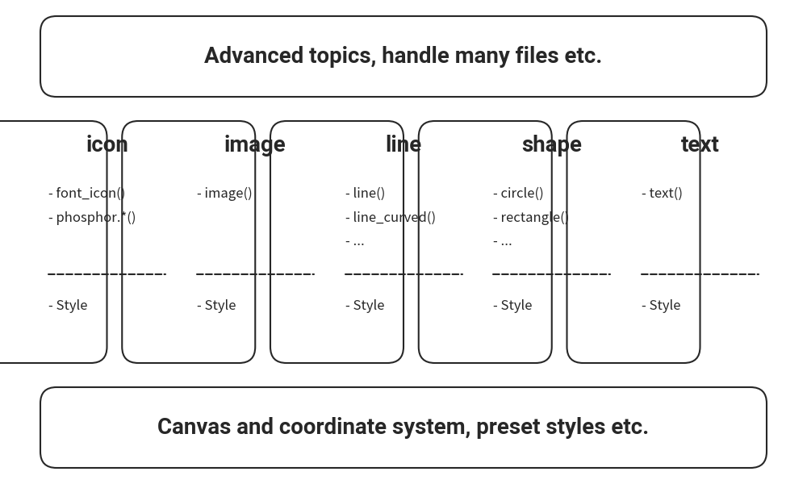

# Drawlib from a High Perspective


Drawing illustrations can be a complex task, but Drawlib aims to simplify this process by providing a range of APIs for drawing icons, images, lines, shapes, and text, complete with various styles.
You don't need to memorize every detail to start drawing; understanding the library's design allows you to write efficient code. 
IDEs can assist by providing quick access to classes, functions, and their options.

If you encounter difficulties, our API documentation offers comprehensive guidance on usage.


# Abstract API Structure


Drawlib is structured around the following APIs:

- Fundamental classes and functions: These include essential canvas manipulation methods such as `save()` and `config()`.
- Drawing functions: Examples include `circle()` and `line()`.
- Style class: The unified `Style` class defines the visual appearance of elements (lines, shapes, text, icons, images).
- Preset styles module (`drawlib.preset_styles`): Provides preset style configurations like `PresetStyles` and `get_styles()`.
- Advanced classes and functions: These components utilize the aforementioned APIs internally to provide extended functionality.


<div class="drawlib-image" style="text-align: center;">
  
</div>

<details class="drawlib-code-details">
<summary>Source Code</summary>

```python
from drawlib.canvas import config, save
from drawlib.colors import Colors
from drawlib.fonts import FontRoboto
from drawlib.icons import font_icon, phosphor
from drawlib.images import image
from drawlib.lines import line, line_curved
from drawlib.shapes import circle, rectangle, shape
from drawlib.text import text

textstyle_bold = styles.primary.patch(text_font=FontRoboto.ROBOTO_BOLD, text_size=20)
shapetextstyle_bold = styles.primary.patch(text_font=FontRoboto.ROBOTO_BOLD, text_size=20)
config(width=100, height=60, grid=True)


def bottom():
    rectangle(
        (50, 7),
        width=90,
        height=10,
        r=2,
        style=styles.primary.patch(shape_fill_color=Colors.Transparent),
        text="Canvas and coordinate system, preset styles etc.",
        textstyle=shapetextstyle_bold,
    )


def middle(x, width, name, functions, styles_list):
    rectangle(
        (x, 30),
        width=width,
        height=30,
        r=2,
        style=styles.primary.patch(shape_fill_color=Colors.Transparent),
    )
    tx = x + width / 2
    text((tx, 42), name, style=textstyle_bold)

    for i, function in enumerate(functions):
        text(
            (x + 1, 36 - i * 3),
            f"- {function}",
            style=styles.primary.patch(text_halign="left", text_size=12),
        )

    line((x + 1, 26), (x + width - 1, 26), style=styles.primary.patch(line_style="dashed"))

    for i, s in enumerate(styles_list):
        text(
            (x + 1, 22 - i * 3),
            f"- {s}",
            style=styles.primary.patch(text_halign="left", text_size=12),
        )


def top():
    rectangle(
        (50, 53),
        width=90,
        height=10,
        r=2,
        style=styles.primary.patch(shape_fill_color=Colors.Transparent),
        text="Advanced topics, handle many files etc.",
        textstyle=shapetextstyle_bold,
    )


bottom()

for i, t in enumerate([
    ("icon", ["font_icon()", "phosphor.*()"], ["Style"]),
    ("image", ["image()"], ["Style"]),
    ("line", ["line()", "line_curved()", "..."], ["Style"]),
    ("shape", ["circle()", "rectangle()", "..."], ["Style"]),
    ("text", ["text()"], ["Style"]),
]):
    start = 5
    width = 16.5
    space = (90 - (width * 5)) / 4
    x = start + (width + space) * i
    name = t[0]
    functions = t[1]
    styles_list = t[2]
    middle(x, width, name, functions, styles_list)

top()
```

</details>


The image above illustrates Drawlib's core components, categorized into five sections representing its various APIs. 
Despite its complexity, Drawlib maintains consistency in function arguments and style classes.

Once you grasp the fundamental concepts of the library, predicting the outcomes of functions and arguments becomes intuitive.

---

<p align="center"><em>© 2026 drawlib by Yuichi Ito. Released under the Apache 2.0 License.</em></p>
