# Quick Start


# Standard Procedure for Drawing with Drawlib


Below is the standard procedure for drawing using Drawlib:

1. Import Drawlib library: Begin by importing the Drawlib library into your Python environment.
2. (Optional) Import Your Style Code and Utilities: Optionally, import any custom style definitions or utility functions you may have.
3. (Optional) Configure the Canvas: Set up the canvas by specifying its size and resolution.
4. Draw Elements: Use Drawlib's APIs to draw icons, images, lines, shapes, or text on the canvas as needed.
5. Save the Canvas: Once your drawing is complete, save the canvas to an image file.

While detailed explanations will be provided in subsequent documents, let's briefly overview each step with an example.


```python
from drawlib.canvas import config, save
from drawlib.images import image
from drawlib.lines import line
from drawlib.shapes import circle
from drawlib.text import text

config(width=100, height=100)

line((10, 10), (90, 90))
circle((25, 75), radius=20)
image((75, 25), width=30, image="python.png")
text((75, 5), "Hello drawlib!")

save()
```


Execute this code using the Python command:


```text
$ python image_abstract1.py
```


After execution, an image file named "image_abstract1.png," corresponding to the code's content, will be generated.


```python
from drawlib.canvas import config, save
from drawlib.images import image
from drawlib.lines import line
from drawlib.shapes import circle
from drawlib.text import text

config(width=100, height=100)

line((10, 10), (90, 90))
circle((25, 75), radius=20)
image((75, 25), width=30, image="python.png")
text((75, 5), "Hello drawlib!")

save()
```

<div class="drawlib-image" style="text-align: center;">
  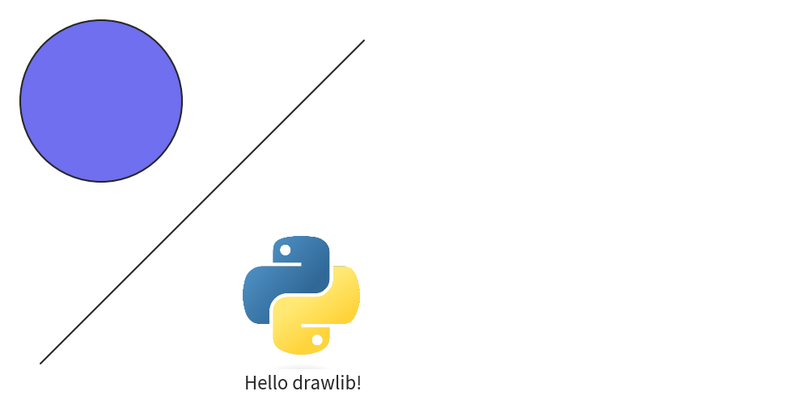
</div>


   image_abstract1.png (corresponding to code file name)

Now, let's proceed to explore the functionality of Drawlib step by step.


# Importing Drawlib


Drawlib is a pure Python library that you can import and use like any other library after installation. 
While many libraries spread their APIs across multiple packages, drawlib consolidates all its public APIs within the `drawlib` modules.

We recommend importing all APIs using the wildcard `*`, as shown below:


```python

```


Although conventional Python programming guidelines (PEP) discourage wildcard imports for clarity and maintenance reasons, in the context of illustrating typical scenarios, simplicity in accessing APIs takes precedence.

This import style ensures that you have immediate access to all the latest APIs available in your drawlib installation. 
You can then proceed to import your custom styles and utilities as needed, akin to importing CSS and utility JavaScript code in an HTML header. 
We will provide detailed explanations on this aspect later.

If you need to use older APIs, you can achieve this by importing them using the following style:


```python

```


Here, `v0_1` corresponds to version `0.1.*`.


# Configuring the Canvas Size and DPI


After importing the Drawlib library, you can start drawing. 
However, it's recommended to configure the canvas to define parameters such as size using the `config()` function. 
For example:


```python
from drawlib.canvas import config
config(width=100, height=100)
```


This snippet sets the canvas width to 100 units and height to 100 units. 
These units represent coordinates within the canvas, not pixel values. 
With both dimensions set to 100, the coordinate range for both x and y axes is from 0 to 100. 
If you set both dimensions to 10, specifying x=20 would be out of range. 
Drawlib does not raise an error in this case, but your item may not render as expected. 
By default, both width and height are set to 100 units.

If you configure the canvas with `config(width=200, height=100)`, it will produce a wider canvas while maintaining the coordinate system for each item. 
See the output image below:


```python
from drawlib.canvas import config, save
from drawlib.images import image
from drawlib.lines import line
from drawlib.shapes import circle
from drawlib.text import text

config(width=200, height=100)

line((10, 10), (90, 90))
circle((25, 75), radius=20)
image((75, 25), width=30, image="python.png")
text((75, 5), "Hello drawlib!")

save()
```

<div class="drawlib-image" style="text-align: center;">
  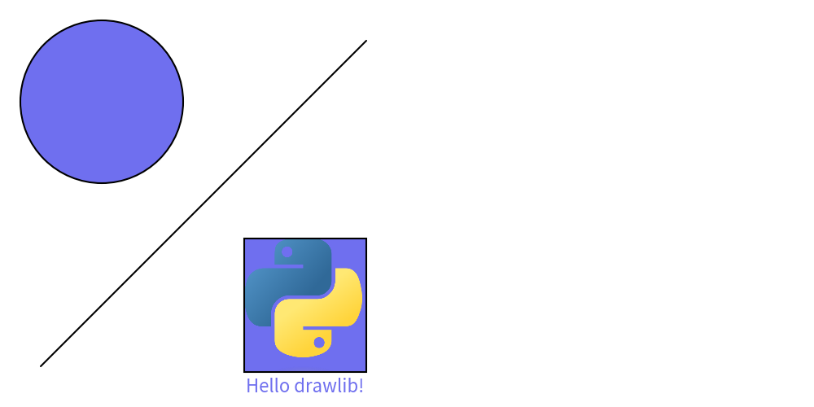
</div>


    image_config1.png

For higher resolution images, adjusting the DPI (Dots Per Inch) is necessary:


```python
from drawlib.canvas import config
config(dpi=200)
```


Drawlib maintains a consistent canvas width of 10 inches. 
Therefore, changes in the coordinate-based width from the previous example do not affect the output.

In the given example, a canvas size of "10 inches x 200 DPI" results in an image width of 2000 pixels.
Increasing the DPI to 400 would double the image width to 4000 pixels. 
However, generating high-resolution images consumes more time and disk space. 
While there is no maximum set value, a DPI of 1000 may be excessive.
Default DPI value is 100.


# Configuring the Canvas Grid


The `config()` function in Drawlib offers several advanced options, including the grid feature, 
which can be particularly useful for positioning items on your canvas quickly:


```python
from drawlib.canvas import config
config(width=100, height=100, grid=True)
```


Enabling `grid=True` adds a grid to your image without affecting the normal image generation. 
Therefore, there's no need to remove the `grid=True` option to obtain an image without a grid. 
If you specifically require only a grid image, you can use `grid_only=True` instead. 
By default, both grid and grid_only are set to False.

The effects of these adjustments are demonstrated in the following files:


```python
from drawlib.canvas import config, save
from drawlib.images import image
from drawlib.lines import line
from drawlib.shapes import circle
from drawlib.text import text

config(width=100, height=100, grid=True)

line((10, 10), (90, 90))
circle((25, 75), radius=20)
image((75, 25), width=30, image="python.png")
text((75, 5), "Hello drawlib!")

save()
```

<div class="drawlib-image" style="text-align: center;">
  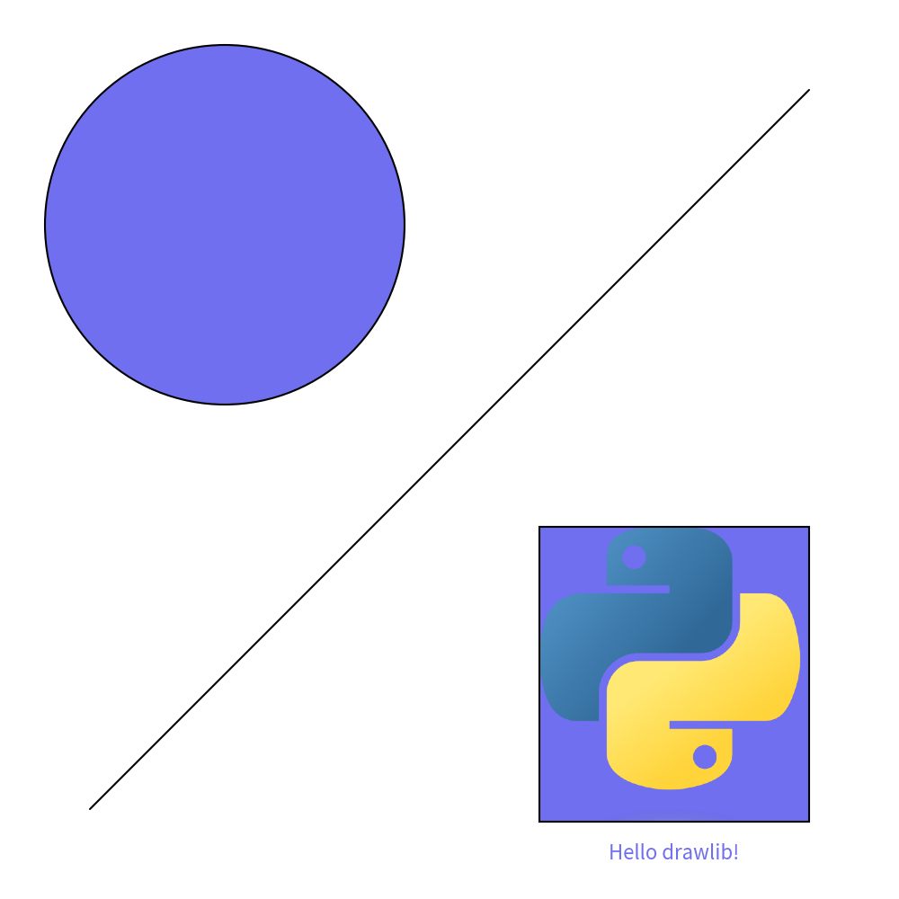
</div>


    Image without grid


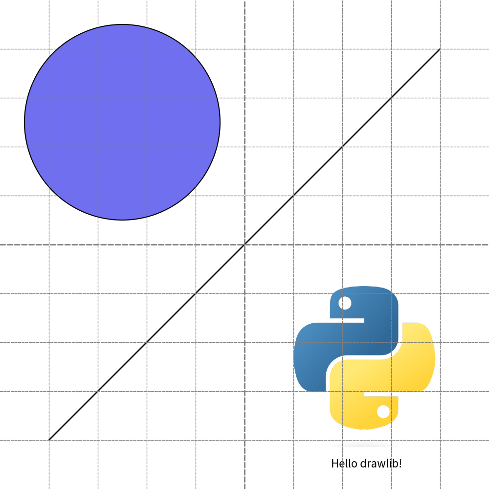


    Image with grid

Code file `image_config2.py` yield two files: `image_config2.png` and `image_config2_grid.png`.
Image file without grid is normal file name.
Image file with grid has `_grid` on its last.


# Coordinate and alignment


Drawlib organizes its drawing functionalities into five main categories: Icon, Image, Line, Shape, and Text. 
Before delving into these categories, understanding Drawlib's coordinate system is essential, as all drawing objects rely on it.

Each drawing object in Drawlib is positioned using xy coordinates. 
The placement of these xy coordinates depends on horizontal (`halign`) and vertical (`valign`) alignment settings. 
Common alignment options include:


## Horizontal alignment ``halign``


* left
* center
* right


## Vertical alignment ``valign``


* bottom
* center
* top

Let's examine these alignment options through an example:


```python
from drawlib.canvas import config, save
from drawlib.colors import Colors
from drawlib.shapes import circle
from drawlib.text import text
from drawlib.types import Style

config(width=100, height=50, grid_only=True)

circle(
    xy=(25, 25),
    radius=10,
    style=Style(text_halign="center", text_valign="center"),
)
circle(
    xy=(25, 25),
    radius=1,
    style=Style(fill_color=Colors.Red, line_color=Colors.Red),
)
text((25, 10), "Align center,center", style=Style(text_color=Colors.Red))

circle(
    xy=(75, 25),
    radius=10,
    style=Style(text_halign="left", text_valign="bottom"),
)
circle(
    xy=(75, 25),
    radius=1,
    style=Style(fill_color=Colors.Red, line_color=Colors.Red),
)
text((75, 10), "Align left,bottom", style=Style(text_color=Colors.Red))

save()
```

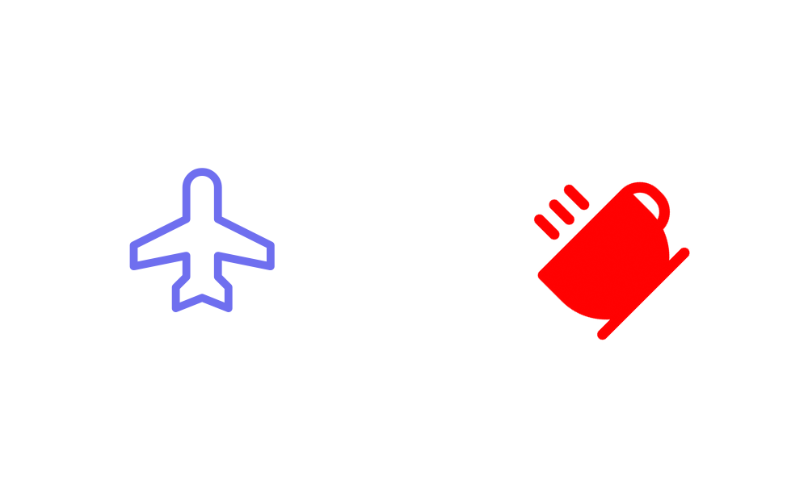


In this example, horizontal and vertical alignment are specified within the style object, with defaults set to `halign="center"` and `valign="center"`.

The resulting image demonstrates the effects of different alignments:


```python
from drawlib.canvas import config, save
from drawlib.colors import Colors
from drawlib.shapes import circle
from drawlib.text import text
from drawlib.types import Style

config(width=100, height=50, grid_only=True)

circle(
    xy=(25, 25),
    radius=10,
    style=Style(text_halign="center", text_valign="center"),
)
circle(
    xy=(25, 25),
    radius=1,
    style=Style(fill_color=Colors.Red, line_color=Colors.Red),
)
text((25, 10), "Align center,center", style=Style(text_color=Colors.Red))

circle(
    xy=(75, 25),
    radius=10,
    style=Style(text_halign="left", text_valign="bottom"),
)
circle(
    xy=(75, 25),
    radius=1,
    style=Style(fill_color=Colors.Red, line_color=Colors.Red),
)
text((75, 10), "Align left,bottom", style=Style(text_color=Colors.Red))

save()
```

<div class="drawlib-image" style="text-align: center;">
  
</div>


    Horizontal/Vertical alignments

In the image, the left circle's xy coordinates are aligned "center, center" as specified, 
while the right circle's xy coordinates are aligned "left, bottom".

By default, Drawlib sets the alignment for shapes like rectangles to "center, center". 
This differs from many other drawing systems, which often default to "left, bottom" for rectangle-related shapes. 
Drawlib's choice of "center, center" simplifies the process of aligning items of varying sizes both vertically and horizontally.

Despite the default setting, there may be cases where "left, bottom" alignment is preferred over "center, center". 
In such situations, it's recommended to define a custom style object with the desired alignment settings and apply it selectively to specific items.
You can overrides primary style with secondary style easily. Please take a look foundation chapter for details.


# Drawing icon


Drawing an icon is similar to drawing an image. 
However, while an image typically refers to a png/jpeg picture, drawlib's icon is a Font Icon. 
If you're unfamiliar with Font Icons, I recommend checking out FontAwesome first.

Drawlib offers convenient icon modules and functions for drawing icons:

* `phosphor`: General vector font icons from Phosphor Icons (https://phosphoricons.com).
* `gcp`: Official Google Cloud Platform diagram and architecture icons.
* `font_icon()`: Low-level function for custom font icon files.

Here's an example using phosphor:


```python
from drawlib.canvas import config, save
from drawlib.colors import Colors
from drawlib.icons import phosphor
from drawlib.types import Style

config(width=100, height=60, grid=True)

phosphor.airplane((25, 30), width=20)
phosphor.coffee(
    xy=(75, 30),
    width=20,
    angle=45,
    style=Style(text_color=Colors.Red, icon_style="fill"),
)

save()
```


This code generates the following output image:


```python
from drawlib.canvas import config, save
from drawlib.colors import Colors
from drawlib.icons import phosphor
from drawlib.types import Style

config(width=100, height=60, grid=True)

phosphor.airplane((25, 30), width=20)
phosphor.coffee(
    xy=(75, 30),
    width=20,
    angle=45,
    style=Style(text_color=Colors.Red, icon_style="fill"),
)

save()
```

<div class="drawlib-image" style="text-align: center;">
  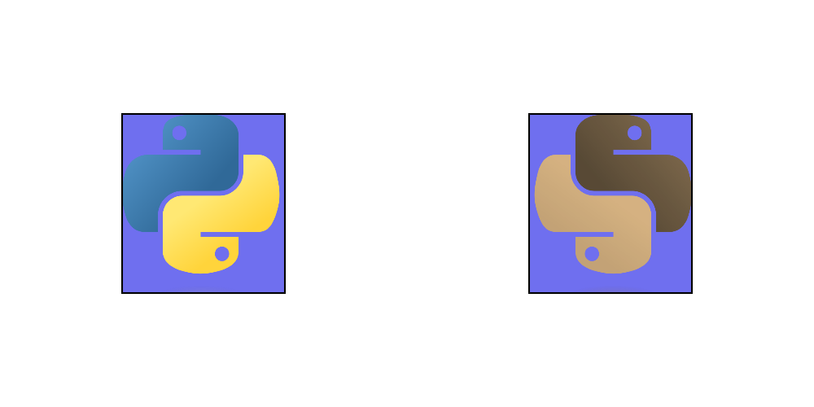
</div>


    phosphor and font_icon() draw icons

As demonstrated, the function name determines the icon to be drawn, while the `Style` object can be adjusted to modify color, style, and other attributes.

For detailed instructions on using the font_icon() function, please refer to the icon documentation. 
This topic is beyond the scope of this quick start guide.


# Drawing image


The `image()` function draws the provided image onto the Canvas at the specified xy coordinates and width. 
The height is automatically calculated based on the width to maintain the original image aspect ratio. 
If you need to adjust the aspect ratio, you can utilize the `Dimage` class, which I will discuss later.

Here's an example using the `image()` function:


```python
from drawlib.canvas import config, save
from drawlib.images import image
from drawlib.types import Style

config(width=100, height=50, grid=True)

image(xy=(25, 25), width=20, image="python.png")
image(
    xy=(75, 25),
    width=20,
    angle=45,
    image="python.png",
    style=Style(line_width=1),
)

save()
```

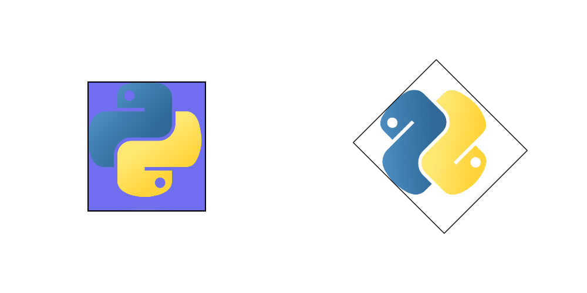


Execute this code using the Python command to get image.


```python
from drawlib.canvas import config, save
from drawlib.images import image
from drawlib.types import Style

config(width=100, height=50, grid=True)

image(xy=(25, 25), width=20, image="python.png")
image(
    xy=(75, 25),
    width=20,
    angle=45,
    image="python.png",
    style=Style(line_width=1),
)

save()
```

<div class="drawlib-image" style="text-align: center;">
  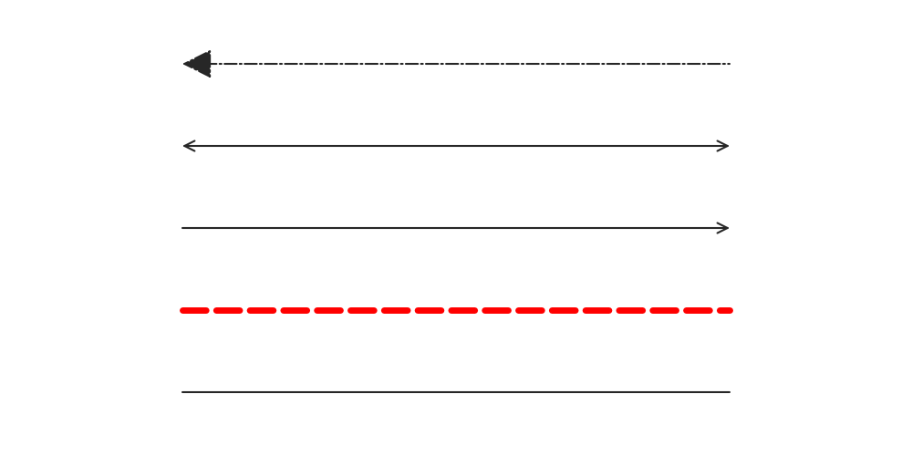
</div>


    image() draws image

As you can observe, you can specify the angle and use the `Style` object to manage alignment and border lines.

If you wish to modify the image itself, consider utilizing the `Dimage` class, which provides numerous methods for image manipulation. 
Take a look at this example:


```python
from drawlib._core.l2_models_._dimage import Dimage
from drawlib.canvas import config, save
from drawlib.images import image

config(width=100, height=50, grid=True)


image(xy=(25, 25), width=20, image="python.png")

dimg = Dimage("python.png").mirror().sepia()
image(xy=(75, 25), width=20, image=dimg)

save()
```


The `Dimage` class is a string-like object. 
Methods for applying effects do not modify the image itself but create a new image object. 
Therefore, we use method chaining to apply operations such as mirroring (horizontal reverse) and sepia (changing color).


```python
from drawlib._core.l2_models_._dimage import Dimage
from drawlib.canvas import config, save
from drawlib.images import image

config(width=100, height=50, grid=True)


image(xy=(25, 25), width=20, image="python.png")

dimg = Dimage("python.png").mirror().sepia()
image(xy=(75, 25), width=20, image=dimg)

save()
```

<div class="drawlib-image" style="text-align: center;">
  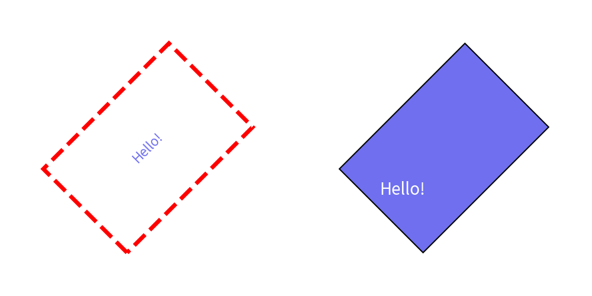
</div>


    Dimage applies effects to the image

Both the `image()` function and the `Dimage` class accept images from the popular Pillow library. 
If you wish to perform advanced image processing, it's advisable to do so using Pillow and then utilize image() and Dimage for handling the processed images.

Additionally, if the original image is of high resolution and drawlib compromises its quality upon saving, consider increasing the DPI (dots per inch) using the `config()` function.


# Drawing line


Drawlib features the `line()` function for drawing lines, but it offers various other line-drawing options as well:

* line
* line_curved
* line_bezier1
* line_bezier2
* lines
* lines_curved
* lines_bezier

Functions starting with "line" are designed to draw lines from point xy1 to point xy2, while those starting with "lines" are designed for lines passing through multiple points. 
Let's explore some of these line types:


```python
from drawlib.canvas import config, save
from drawlib.lines import line, line_curved, lines

config(width=100, height=50, grid=True)

line((20, 7), (80, 7))
line_curved((20, 20), (80, 20), bend=0.2)
line_curved((20, 30), (80, 30), bend=-0.2)
lines([(20, 40), (30, 45), (70, 45), (80, 40)])

save()
```

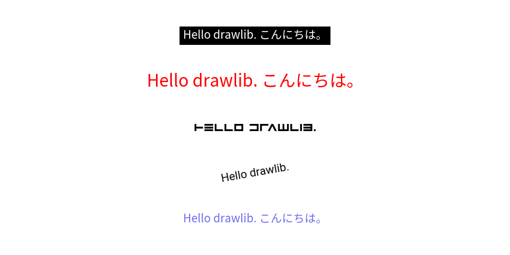


The `line_curved()` function draws a line from xy1 to xy2, but the bend parameter allows you to create curved lines. 
A bend value of 0.2 indicates a curved line 1.2 times longer than a straight line, while a value of -0.2 creates a curve in the opposite direction.


```python
from drawlib.canvas import config, save
from drawlib.lines import line, line_curved, lines

config(width=100, height=50, grid=True)

line((20, 7), (80, 7))
line_curved((20, 20), (80, 20), bend=0.2)
line_curved((20, 30), (80, 30), bend=-0.2)
lines([(20, 40), (30, 45), (70, 45), (80, 40)])

save()
```

<div class="drawlib-image" style="text-align: center;">
  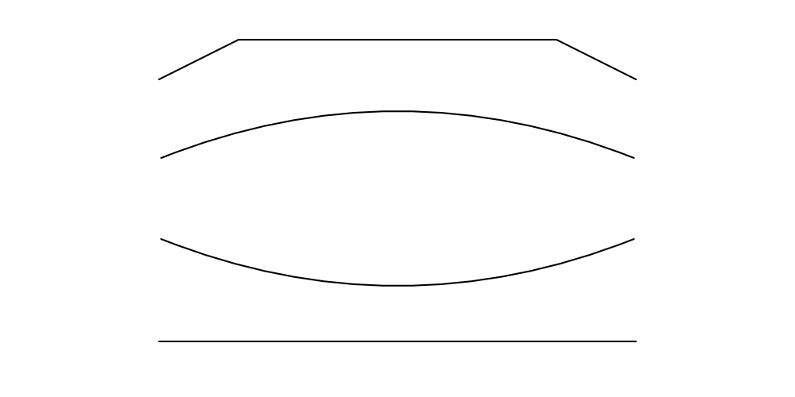
</div>


    image_line1.png

Bezier line functions are a bit more complex. 
Please refer to the line documentation for details. However, they are incredibly useful for controlling complex curves.

From point of line styling, we have these 2 categories.

* Arrow head
* Visual styles: Color, width, line style(solid, dashed etc) etc.

Arrow head has logical meaning (HTML equivalent), so we will specify it at function arg `arrowhead`.
But visual style has less meaning (CSS equivalent), then we will specify it as styling class `Style`.

Consider this example showcasing styling:


```python
from drawlib.canvas import config, save
from drawlib.colors import Colors
from drawlib.lines import line
from drawlib.types import Style

config(width=100, height=50, grid=True)

line((20, 7), (80, 7))
line(
    (20, 16),
    (80, 16),
    style=Style(line_style="dashed", line_width=5, line_color=Colors.Red),
)
line((20, 25), (80, 25), arrowhead="->")
line((20, 34), (80, 34), arrowhead="<->")
line((20, 43), (80, 43), arrowhead="<-", style=Style(arrow_head_scale=50, line_style="dashdot", arrow_head_fill=True))

save()
```

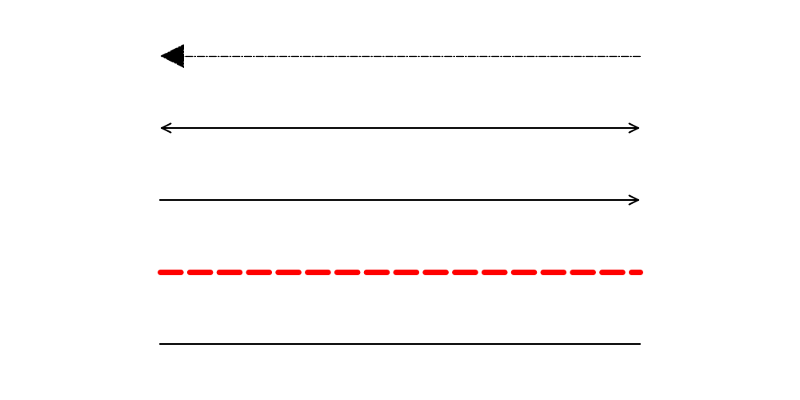


With `Style`, you can configure line width, color, style, and more. 
Arrow head style is specified in function directry.


```python
from drawlib.canvas import config, save
from drawlib.colors import Colors
from drawlib.lines import line
from drawlib.types import Style

config(width=100, height=50, grid=True)

line((20, 7), (80, 7))
line(
    (20, 16),
    (80, 16),
    style=Style(line_style="dashed", line_width=5, line_color=Colors.Red),
)
line((20, 25), (80, 25), arrowhead="->")
line((20, 34), (80, 34), arrowhead="<->")
line((20, 43), (80, 43), arrowhead="<-", style=Style(arrow_head_scale=50, line_style="dashdot", arrow_head_fill=True))

save()
```

<div class="drawlib-image" style="text-align: center;">
  
</div>


    line() draws line

While the `arrow()` function also draws arrows, it is not a line but rather a shape. 
Keep in mind that if you wish to draw an arrow line, utilize line() and related functions with LineArrowStyle.


# Drawing shapes


Drawlib's keyword `Shape` encompasses a variety of shapes such as circles, rectangles, and more. 
While you're already familiar with the `circle()` function, Drawlib version 0.1 introduces several other functions for drawing shapes:

* arrow()
* arc()
* bubblespeech()
* chevron()
* circle()
* donuts()
* ellipse()
* fan()
* parallelogram()
* polygon()
* rectangle()
* regularpolygon()
* rhombus()
* shape()
* star()
* trapezoid()
* triangle()
* wedge()

Most of these functions fall into one of two categories: circle-like or rectangle-like. 
Circle-type shapes are defined by parameters such as xy coordinates and radius, while rectangle-type shapes are defined by parameters like xy coordinates, width, and height. 
The exceptions are arrow(), polygon(), and shape().

We won't delve into the specifics in this quick start guide, but it's worth noting that the `shape()` function is particularly versatile for creating custom shape objects. 
When you use it, tasks like positioning your item at a specified xy coordinate and adjusting its angle are automatically handled.

Let's explore two examples: a circle-like shape, `star()`, and a rectangle-like shape, `rectangle()`.


```python
from drawlib.canvas import config, save
from drawlib.shapes import rectangle, star

config(width=100, height=50, grid=True)

star((25, 25), num_vertex=5, radius_ext=20, radius_int=7.5)
rectangle((75, 25), width=30, height=20, r=3, angle=45)

save()
```

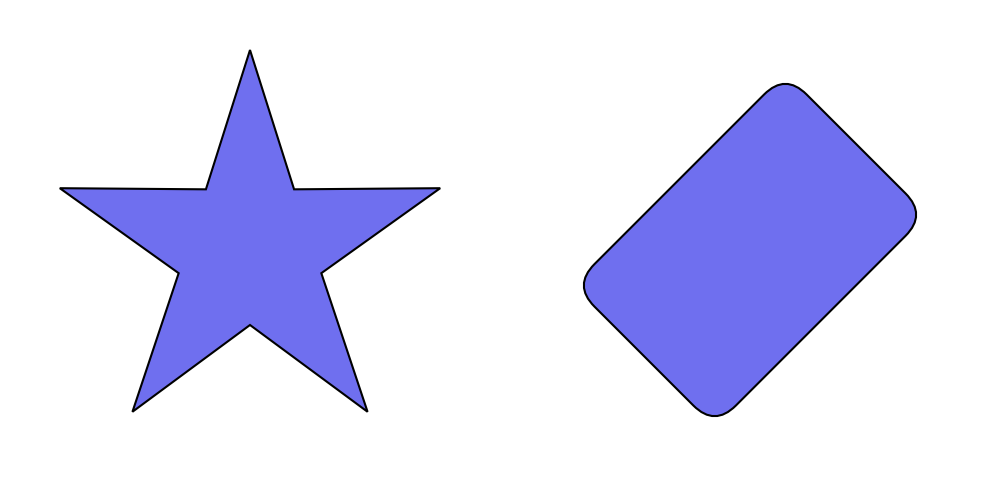


This code generates the following image:


```python
from drawlib.canvas import config, save
from drawlib.shapes import rectangle, star

config(width=100, height=50, grid=True)

star((25, 25), num_vertex=5, radius_ext=20, radius_int=7.5)
rectangle((75, 25), width=30, height=20, r=3, angle=45)

save()
```

<div class="drawlib-image" style="text-align: center;">
  
</div>


    image_shape1.png

Circle-type shapes are defined by their radius, while rectangle-type shapes are defined by their width and height. 
By default, the xy coordinate marks the center of the shape. 
Except for arrow() and polygon(), all functions can accept an angle parameter.

Shapes can also be styled using the `Style` class:

- `style`: for basic shape styling such as line width, line color, and fill color
- `textstyle`: for styling text within a shape

The `Style` object allows you to specify parameters like color, size, font, and more. 
When styling text within a shape, it also offers `text_xy_shift` and `text_angle` options. 
Specifying `text_xy_shift` allows you to adjust the position of the text within the shape. 
Keep in mind that the `text_angle` parameter in `Style` overrides the shape's angle for the text.

Let's examine a styling example:


```python
from drawlib.canvas import config, save
from drawlib.colors import Colors
from drawlib.shapes import rectangle
from drawlib.text import text
from drawlib.types import Style

config(width=100, height=50, grid=True)

rectangle(
    (25, 25),
    width=30,
    height=20,
    angle=45,
    text="Hello!",
    style=Style(line_style="dashed", line_width=5, line_color=Colors.Red, fill_color=Colors.Transparent),
)
rectangle(
    (75, 25),
    width=30,
    height=20,
    angle=45,
    text="Hello!",
    textstyle=Style(text_color=Colors.White, text_size=20, text_xy_shift=(-10, 0), text_angle=0),
)

save()
```


This code generates the following output:


```python
from drawlib.canvas import config, save
from drawlib.colors import Colors
from drawlib.shapes import rectangle
from drawlib.text import text
from drawlib.types import Style

config(width=100, height=50, grid=True)

rectangle(
    (25, 25),
    width=30,
    height=20,
    angle=45,
    text="Hello!",
    style=Style(line_style="dashed", line_width=5, line_color=Colors.Red, fill_color=Colors.Transparent),
)
rectangle(
    (75, 25),
    width=30,
    height=20,
    angle=45,
    text="Hello!",
    textstyle=Style(text_color=Colors.White, text_size=20, text_xy_shift=(-10, 0), text_angle=0),
)

save()
```

<div class="drawlib-image" style="text-align: center;">
  
</div>


    image_shape2.png

In the left example, we configure `Style` to add style to the rectangle. 
`line_width`, `line_color`, and `line_style` control the border, while `fill_color` sets the fill color. 
If you don't require a shape border line, simply set `line_width=0`, and if you don't need a fill color, set `fill_color=Colors.Transparent`. 
Notice how the text angle follows the shape angle by default.

In the right example, we configure `Style` for the text within the rectangle via `textstyle`. 
Parameters like `text_color`, `text_size`, `text_font` control typography, while options like `text_xy_shift` and `text_angle` adjust placement.

When you specify `text_xy_shift`, you can move the center point of the text. 
Remember that the xy value is not a global coordinate but is relative to the shape, taking its angle into account. 
Therefore, specifying `(-10, 0)` moves the center point not only to the left but also downward since the shape has a 45-degree angle.

The `text_angle` option in `Style` overrides the shape's angle for the text. 
If left unspecified, the text inside the right rectangle would be at a 45-degree angle. 
However, since we've specified `text_angle=0`, it remains horizontal.


# Drawing texts


The `text()` function is used to render text onto the canvas. 
It requires specifications for xy coordinates, the text message, and an optional angle. 
All other text parameters are defined within a `Style` object.

With `Style`, you can configure text color, size, font, alignment, and text background options (such as `text_bg_fill_color`, `text_bg_line_width`, etc.).

Let's examine some code examples:


```python
from drawlib.canvas import config, save
from drawlib.colors import Colors
from drawlib.fonts import FontRoboto
from drawlib.text import text
from drawlib.types import Style

config(width=100, height=50)

text((50, 7), "Hello drawlib. こんにちは。")
text(
    (50, 16),
    "Hello drawlib. こんにちは。",
    angle=10,
    style=Style(text_font=FontRoboto.ROBOTO_REGULAR),
)
text(
    (50, 25),
    "Hello drawlib.",
    style=Style(text_font=FontFile("avenger/regular.ttf")),
)
text(
    (50, 34),
    "Hello drawlib. こんにちは。",
    style=Style(text_color=Colors.Red, text_size=24),
)
text(
    (50, 43),
    "Hello drawlib. こんにちは。",
    style=Style(text_color=Colors.White, text_bg_fill_color=Colors.Black),
)
save()
```

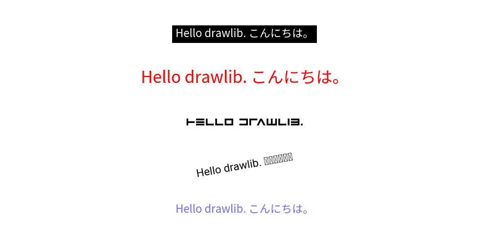


Executing this code yields the following image:


```python
from drawlib.canvas import config, save
from drawlib.colors import Colors
from drawlib.fonts import FontRoboto
from drawlib.text import text
from drawlib.types import Style

config(width=100, height=50)

text((50, 7), "Hello drawlib. こんにちは。")
text(
    (50, 16),
    "Hello drawlib. こんにちは。",
    angle=10,
    style=Style(text_font=FontRoboto.ROBOTO_REGULAR),
)
text(
    (50, 25),
    "Hello drawlib.",
    style=Style(text_font=FontFile("avenger/regular.ttf")),
)
text(
    (50, 34),
    "Hello drawlib. こんにちは。",
    style=Style(text_color=Colors.Red, text_size=24),
)
text(
    (50, 43),
    "Hello drawlib. こんにちは。",
    style=Style(text_color=Colors.White, text_bg_fill_color=Colors.Black),
)
save()
```

<div class="drawlib-image" style="text-align: center;">
  
</div>


    image_text_1.png

In this example, we've configured several text-related `Style` parameters. 
I've used Japanese text for testing purposes. 
As you can see, the Roboto font fails to render it correctly. 
Be cautious when using non-alphabet characters. 
Drawlib supports a variety of embedded fonts, categorized under Font-Something classes. 
For instance, Japanese fonts are defined within FontJapanese.

Remember, fonts are downloaded from the internet the first time you use them, after which they're cached locally within the drawlib library on your machine. 
Fonts that haven't been used before won't be downloaded. 
However, attempting to call text() with a new font can result in a download error. 
Therefore, make sure to download fonts before entering internet-restricted areas.

Calling text() with new font will make download error.
Please download fonts before you go to internet restricted area.

In the third example, we've prepared a font file locally and utilized it. 
If drawlib doesn't include the font you wish to use, you can provide it to the style's font parameter using the `FontFile` class.

In the fourth and fifth examples, we've configured text parameters such as color, size, and background. 
These settings may not be particularly complex, but it's important to note that the font size remains constant regardless of changes in canvas width and height. 
Doubling the canvas size won't result in halving the font text size; it remains the same as the original size.


# Using Official Theme


In Drawlib, you can define the style of drawing items using the unified `Style` class. 
However, specifying styles for each item can be cumbersome and may lead to inconsistency. 
To address this, Drawlib provides a theme and style feature, allowing you to choose a theme and easily apply its styles by name.

Here is an example. Note that the `style` argument takes text values.


```python
from drawlib.canvas import config, save
from drawlib.lines import line
from drawlib.shapes import circle
from drawlib.text import text

config(width=100, height=50)
x1 = 12
x2 = 34
x3 = 62
x4 = 88
line_y = 40
line_length = 7
circle_y = 25
text_y = 10

# blue style
line((x1 - line_length, line_y), (x1 + line_length, line_y), style="blue")
circle((x1, circle_y), radius=8, style="blue")
text((x1, text_y), text="blue", style="blue")

# blue solid style
line((x2 - line_length, line_y), (x2 + line_length, line_y), style="blue_solid")
circle((x2, circle_y), radius=8, style="blue_solid")
text((x2, text_y), text='style="blue_solid"', style="blue")

# green dashed style
line((x3 - line_length, line_y), (x3 + line_length, line_y), style="green_dashed_bold")
circle((x3, circle_y), radius=8, style="green_dashed_bold")
text((x3, text_y), text='style="green_dashed_bold"', style="green_bold")

# red flat style
line((x4 - line_length, line_y), (x4 + line_length, line_y), style="red")
circle((x4, circle_y), radius=8, style="red_flat")
text((x4, text_y), text='style="red_flat"', style="red")

save()
```

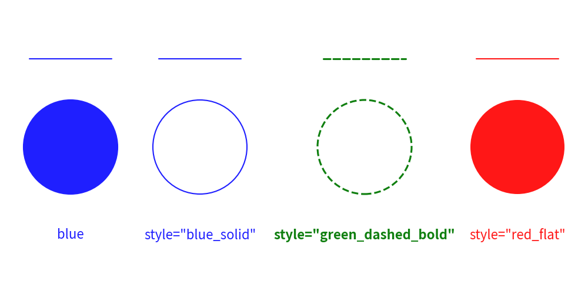


The style has this syntax: `<color>_<type>_<weight>`. 
If the type and weight are default, they are not shown in the style name. 
Executing this code yields the following image:


```python
from drawlib.canvas import config, save
from drawlib.lines import line
from drawlib.shapes import circle
from drawlib.text import text

config(width=100, height=50)
x1 = 12
x2 = 34
x3 = 62
x4 = 88
line_y = 40
line_length = 7
circle_y = 25
text_y = 10

# blue style
line((x1 - line_length, line_y), (x1 + line_length, line_y), style="blue")
circle((x1, circle_y), radius=8, style="blue")
text((x1, text_y), text="blue", style="blue")

# blue solid style
line((x2 - line_length, line_y), (x2 + line_length, line_y), style="blue_solid")
circle((x2, circle_y), radius=8, style="blue_solid")
text((x2, text_y), text='style="blue_solid"', style="blue")

# green dashed style
line((x3 - line_length, line_y), (x3 + line_length, line_y), style="green_dashed_bold")
circle((x3, circle_y), radius=8, style="green_dashed_bold")
text((x3, text_y), text='style="green_dashed_bold"', style="green_bold")

# red flat style
line((x4 - line_length, line_y), (x4 + line_length, line_y), style="red")
circle((x4, circle_y), radius=8, style="red_flat")
text((x4, text_y), text='style="red_flat"', style="red")

save()
```

<div class="drawlib-image" style="text-align: center;">
  
</div>


    image_theme1.png

Drawlib offers several official themes:

- `default`
- `essentials`
- `monochrome`

The style naming rules are consistent across all themes. 
However, the `default` theme default primarily focuses on colors to keep it simple for beginners.
You can check the available style names and color variations in the preset styles documentation.

Here's how you can print the available styles in a theme:


```python
from drawlib.types import Style


# +----------------+---+-------+------+------+-------+-------------+------------+--------+--------------+-------------+
# | class \ name   |   | light | bold | flat | solid | solid_light | solid_bold | dashed | dashed_light | dashed_bold |
# +----------------+---+-------+------+------+-------+-------------+------------+--------+--------------+-------------+
# | Style      | x | x     | x    | x    |       |             |            |        |              |             |
# | Style     | x | x     | x    | x    | x     | x           | x          | x      | x            | x           |
# | Style      | x | x     | x    |      | x     | x           | x          | x      | x            | x           |
# | Style     | x | x     | x    | x    | x     | x           | x          | x      | x            | x           |
# | Style | x | x     | x    |      |       |             |            |        |              |             |
# | Style      | x | x     | x    |      |       |             |            |        |              |             |
# +----------------+---+-------+------+------+-------+-------------+------------+--------+--------------+-------------+

# +----------------+-----+-----------+----------+----------+-----------+-----------------+----------------+------------+------------------+-----------------+
# | class \ name   | red | red_light | red_bold | red_flat | red_solid | red_solid_light | red_solid_bold | red_dashed | red_dashed_light | red_dashed_bold |
# +----------------+-----+-----------+----------+----------+-----------+-----------------+----------------+------------+------------------+-----------------+
# | Style      | x   | x         | x        | x        |           |                 |                |            |                  |                 |
# | Style     | x   | x         | x        | x        | x         | x               | x              | x          | x                | x               |
# | Style      | x   | x         | x        |          | x         | x               | x              | x          | x                | x               |
# | Style     | x   | x         | x        | x        | x         | x               | x              | x          | x                | x               |
# | Style | x   | x         | x        |          |           |                 |                |            |                  |                 |
# | Style      | x   | x         | x        |          |           |                 |                |            |                  |                 |
# +----------------+-----+-----------+----------+----------+-----------+-----------------+----------------+------------+------------------+-----------------+

# +----------------+-------+-------------+------------+------------+-------------+-------------------+------------------+--------------+--------------------+-------------------+
# | class \ name   | green | green_light | green_bold | green_flat | green_solid | green_solid_light | green_solid_bold | green_dashed | green_dashed_light | green_dashed_bold |
# +----------------+-------+-------------+------------+------------+-------------+-------------------+------------------+--------------+--------------------+-------------------+
# | Style      | x     | x           | x          | x          |             |                   |                  |              |                    |                   |
# | Style     | x     | x           | x          | x          | x           | x                 | x                | x            | x                  | x                 |
# | Style      | x     | x           | x          |            | x           | x                 | x                | x            | x                  | x                 |
# | Style     | x     | x           | x          | x          | x           | x                 | x                | x            | x                  | x                 |
# | Style | x     | x           | x          |            |             |                   |                  |              |                    |                   |
# | Style      | x     | x           | x          |            |             |                   |                  |              |                    |                   |
# +----------------+-------+-------------+------------+------------+-------------+-------------------+------------------+--------------+--------------------+-------------------+

# +----------------+------+------------+-----------+-----------+------------+------------------+-----------------+-------------+-------------------+------------------+
# | class \ name   | blue | blue_light | blue_bold | blue_flat | blue_solid | blue_solid_light | blue_solid_bold | blue_dashed | blue_dashed_light | blue_dashed_bold |
# +----------------+------+------------+-----------+-----------+------------+------------------+-----------------+-------------+-------------------+------------------+
# | Style      | x    | x          | x         | x         |            |                  |                 |             |                   |                  |
# | Style     | x    | x          | x         | x         | x          | x                | x               | x           | x                 | x                |
# | Style      | x    | x          | x         |           | x          | x                | x               | x           | x                 | x                |
# | Style     | x    | x          | x         | x         | x          | x                | x               | x           | x                 | x                |
# | Style | x    | x          | x         |           |            |                  |                 |             |                   |                  |
# | Style      | x    | x          | x         |           |            |                  |                 |             |                   |                  |
# +----------------+------+------------+-----------+-----------+------------+------------------+-----------------+-------------+-------------------+------------------+

# +----------------+-------+-------------+------------+------------+-------------+-------------------+------------------+--------------+--------------------+-------------------+
# | class \ name   | black | black_light | black_bold | black_flat | black_solid | black_solid_light | black_solid_bold | black_dashed | black_dashed_light | black_dashed_bold |
# +----------------+-------+-------------+------------+------------+-------------+-------------------+------------------+--------------+--------------------+-------------------+
# | Style      | x     | x           | x          | x          |             |                   |                  |              |                    |                   |
# | Style     | x     | x           | x          | x          | x           | x                 | x                | x            | x                  | x                 |
# | Style      | x     | x           | x          |            | x           | x                 | x                | x            | x                  | x                 |
# | Style     | x     | x           | x          | x          | x           | x                 | x                | x            | x                  | x                 |
# | Style | x     | x           | x          |            |             |                   |                  |              |                    |                   |
# | Style      | x     | x           | x          |            |             |                   |                  |              |                    |                   |
# +----------------+-------+-------------+------------+------------+-------------+-------------------+------------------+--------------+--------------------+-------------------+

# +----------------+-------+-------------+------------+------------+-------------+-------------------+------------------+--------------+--------------------+-------------------+
# | class \ name   | white | white_light | white_bold | white_flat | white_solid | white_solid_light | white_solid_bold | white_dashed | white_dashed_light | white_dashed_bold |
# +----------------+-------+-------------+------------+------------+-------------+-------------------+------------------+--------------+--------------------+-------------------+
# | Style      | x     | x           | x          | x          |             |                   |                  |              |                    |                   |
# | Style     | x     | x           | x          | x          | x           | x                 | x                | x            | x                  | x                 |
# | Style      | x     | x           | x          |            | x           | x                 | x                | x            | x                  | x                 |
# | Style     | x     | x           | x          | x          | x           | x                 | x                | x            | x                  | x                 |
# | Style | x     | x           | x          |            |             |                   |                  |              |                    |                   |
# | Style      | x     | x           | x          |            |             |                   |                  |              |                    |                   |
# +----------------+-------+-------------+------------+------------+-------------+-------------------+------------------+--------------+--------------------+-------------------+
```


---

<p align="center"><em>© 2026 drawlib by Yuichi Ito. Released under the Apache 2.0 License.</em></p>
