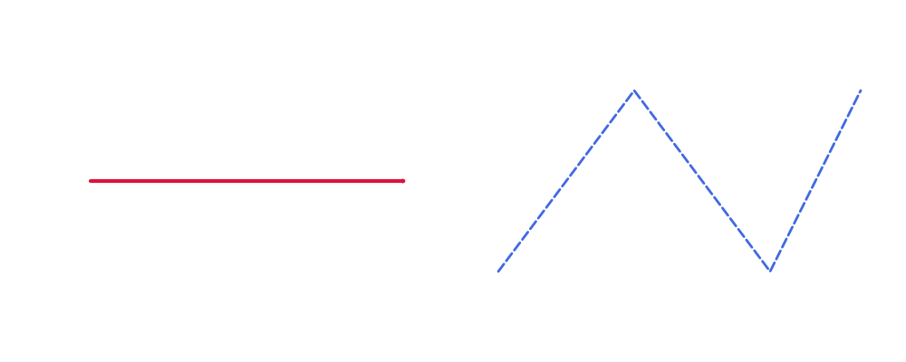
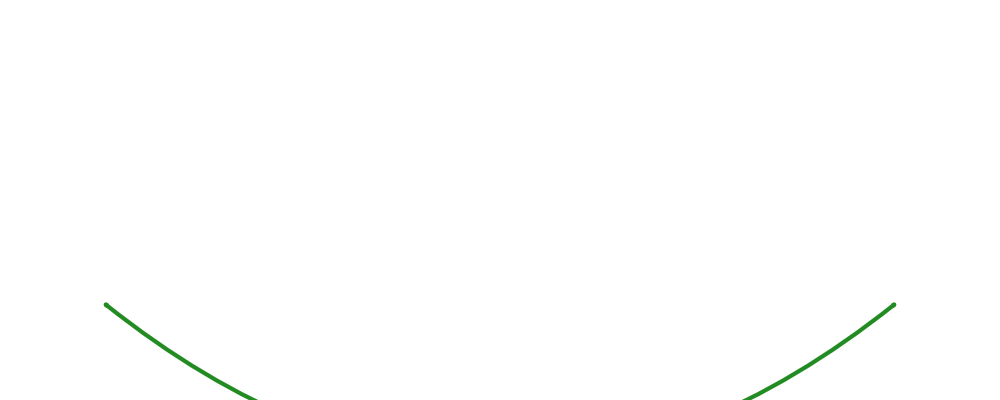

# Lines & Curves Guide

Drawlib supports straight lines, polylines, curved arcs, and Bezier curves with customizable arrowheads and line styling (`LineStyle`).

---

## 1. Straight Lines & Polylines


```python
from drawlib.canvas import config
from drawlib.colors import Colors, Colors140
from drawlib.lines import line, lines
from drawlib.types import LineStyle

config(width=100, height=40)

# Straight line with arrowheads
line(
    xy1=(10, 20),
    xy2=(45, 20),
    arrowhead="->",
    style=LineStyle(line_color=Colors140.Crimson, line_width=3, arrow_head_scale=1.5)
)

# Dashed lines
lines(
    xys=[(55, 10), (70, 30), (85, 10), (95, 30)],
    style=LineStyle(line_color=Colors140.RoyalBlue, line_width=2, line_style="dashed")
)
```




---

## 2. Curved Lines (`line_curved`)

The `bend` parameter specifies the curvature intensity (e.g. `bend=0.3` creates a convex curve, `bend=-0.3` creates a concave curve).


```python
from drawlib.canvas import config
from drawlib.colors import Colors140
from drawlib.lines import line_curved
from drawlib.types import LineStyle

config(width=100, height=40)

line_curved(
    xy1=(10, 10),
    xy2=(90, 10),
    bend=0.4,
    arrowhead="<->",
    style=LineStyle(line_color=Colors140.ForestGreen, line_width=3, arrow_head_scale=1.5)
)
```




---

## Navigation

- [Back to Index](./index.md)
- [Next: Text Guide](./text.md)
