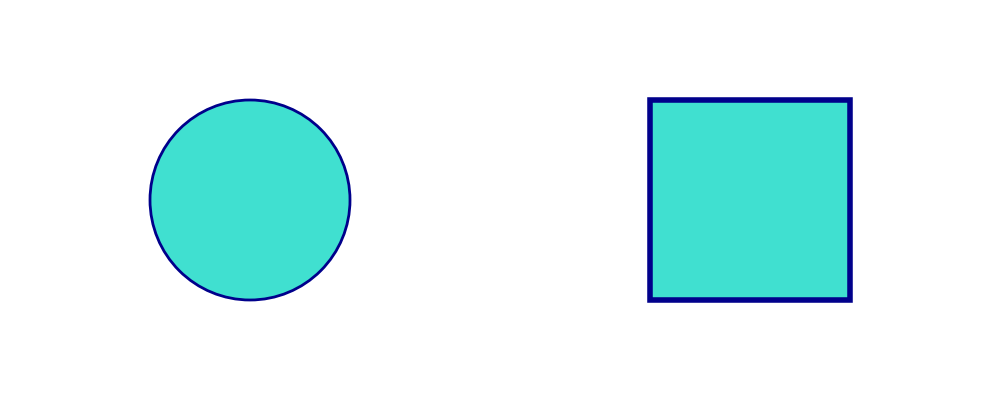

========================================

# Creating Custom Presets with PresetStyles

Drawlib provides official style presets (`default`, `essentials`, `monochrome`), but you can also define custom style presets for your project using `PresetStyles`.

A `PresetStyles` is a dataclass containing `Style` objects for key style roles.

# PresetStyles Definition

`PresetStyles` accepts the following attributes:

- `primary`: Primary style object.
- `light`: Light style object.
- `bold`: Bold style object.
- `flat`: Flat style object.
- `solid`: Solid style object.
- `dashed`: Dashed style object.
- `background_color` (optional): Default background color tuple (default is white).
- `sourcecode_font` (optional): Default font for code rendering.

# Defining a Custom Preset

Here is an example of creating a custom preset:


```python
from drawlib.canvas import config, save
from drawlib.colors import Colors140
from drawlib.preset_styles import PresetStyles
from drawlib.shapes import circle, rectangle
from drawlib.types import Style

custom_preset = PresetStyles(
    primary=Style(fill_color=Colors140.Turquoise, line_color=Colors140.DarkBlue, line_width=2),
    light=Style(fill_color=Colors140.LightCyan, line_color=Colors140.DarkBlue, line_width=1),
    bold=Style(fill_color=Colors140.Turquoise, line_color=Colors140.DarkBlue, line_width=4),
    flat=Style(fill_color=Colors140.Turquoise, line_color=None, line_width=0),
    solid=Style(fill_color=None, line_color=Colors140.DarkBlue, line_width=2),
    dashed=Style(fill_color=None, line_color=Colors140.DarkBlue, line_width=2, line_style="dashed"),
)

config(width=100, height=40)

circle(xy=(25, 20), radius=10, style=custom_preset.primary)
rectangle(xy=(75, 20), width=20, height=20, style=custom_preset.bold)

save()
```


Executing this code produces the following image:


```python
from drawlib.canvas import config, save
from drawlib.colors import Colors140
from drawlib.preset_styles import PresetStyles
from drawlib.shapes import circle, rectangle
from drawlib.types import Style

custom_preset = PresetStyles(
    primary=Style(fill_color=Colors140.Turquoise, line_color=Colors140.DarkBlue, line_width=2),
    light=Style(fill_color=Colors140.LightCyan, line_color=Colors140.DarkBlue, line_width=1),
    bold=Style(fill_color=Colors140.Turquoise, line_color=Colors140.DarkBlue, line_width=4),
    flat=Style(fill_color=Colors140.Turquoise, line_color=None, line_width=0),
    solid=Style(fill_color=None, line_color=Colors140.DarkBlue, line_width=2),
    dashed=Style(fill_color=None, line_color=Colors140.DarkBlue, line_width=2, line_style="dashed"),
)

config(width=100, height=40)

circle(xy=(25, 20), radius=10, style=custom_preset.primary)
rectangle(xy=(75, 20), width=20, height=20, style=custom_preset.bold)

save()
```

<div class="drawlib-image" style="text-align: center;">
  
</div>


    Custom PresetStyles execution

---

<p align="center"><em>© 2026 drawlib by Yuichi Ito. Released under the Apache 2.0 License.</em></p>
