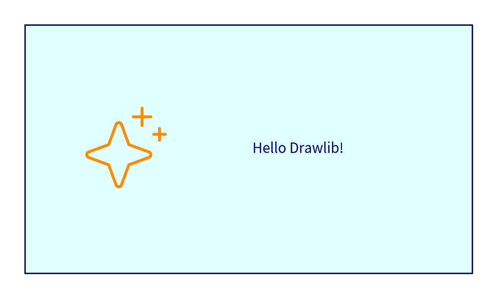
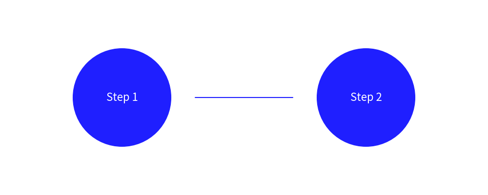

# Quick Start Guide

Get started with **Drawlib** in 5 minutes! Learn how to configure your canvas, draw elements, and apply styles.

---

## 1. Installation

Install `drawlib` using `pip` or `uv`:

```bash
pip install drawlib
# or
uv add drawlib
```

---

## 2. Standard Procedure for Drawing

The standard workflow in Drawlib involves:

1. Import required domain modules (e.g., `canvas`, `colors`, `shapes`, `text`).
2. Configure canvas dimensions and DPI with `config()`.
3. Draw elements (shapes, lines, icons, text).
4. Save or compile the canvas automatically.


```python
from drawlib.canvas import config
from drawlib.colors import Colors, Colors140
from drawlib.icons import icon_phosphor
from drawlib.shapes import rectangle
from drawlib.text import text
from drawlib.types import IconStyle, ShapeStyle, TextStyle

# 1. Initialize 100x60 canvas
config(width=100, height=60)

# 2. Draw background rectangle
rectangle(
    xy=(50, 30),
    width=90,
    height=50,
    style=ShapeStyle(fill_color=Colors140.LightCyan, line_color=Colors.Navy, line_width=2)
)

# 3. Add phosphor icon
icon_phosphor.sparkle(
    xy=(25, 30),
    width=18,
    style=IconStyle(text_color=Colors140.DarkOrange)
)

# 4. Add text
text(
    xy=(60, 30),
    text="Hello Drawlib!",
    style=TextStyle(text_color=Colors.Navy, text_size=20)
)
```




---

## 3. Applying Themes and Preset Styles

Drawlib allows applying predefined theme styles by name rather than hardcoding style properties for every item.


```python
from drawlib.canvas import config
from drawlib.lines import line
from drawlib.shapes import circle
from drawlib.text import text

config(width=100, height=40)

# Apply preset styles
circle(xy=(25, 20), radius=10, style="blue")
text(xy=(25, 20), text="Step 1", style="white")

line(xy1=(40, 20), xy2=(60, 20), style="blue")

circle(xy=(75, 20), radius=10, style="blue")
text(xy=(75, 20), text="Step 2", style="white")
```




---

## Navigation

- [Back to Index](./index.md)
- [Next: Canvas Guide](./canvas_guide.md)
