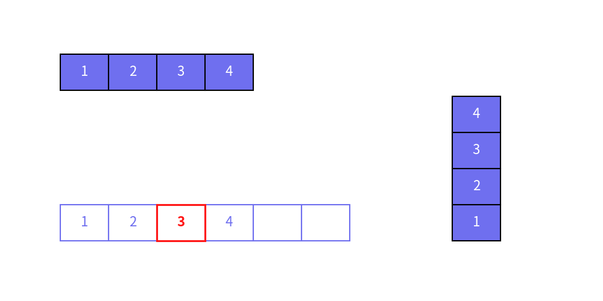

=============

# BoxList


BoxList draws list of texts within boxes.
Here is examples of BoxList.


```python
from drawlib.canvas import config, save
from drawlib.smartarts import BoxList, dsart

config(width=100, height=50)

b1 = dsart.BoxList(default_text_style="white")
b1.extend(["1", "2", "3", "4"])
b1.draw(xy=(10, 35), box_width=8, box_height=6)


b2 = dsart.BoxList(default_box_style="solid", default_text_style="")
b2.extend(["1", "2"])
b2.append("3", box_style="red_solid_bold", text_style="red_bold")
b2.extend(["4", "", ""])
b2.draw(xy=(10, 10), box_width=8, box_height=6)

b3 = dsart.BoxList(default_text_style="white")
b3.extend(["1", "2", "3", "4"])
b3.draw(xy=(75, 10), box_width=8, box_height=6, align="bottom")

save()
```

<div class="drawlib-image" style="text-align: center;">
  
</div>


    image1.png

As you can see, BoxList supports changing size, style and alignments.


# Quick Start


BoxList is used in these procedures.

1. Create object with specifying default styles.
2. Add single or multiple items to list with optional style.
3. draw with specifying xy, size and align.

Here is an example code.


```python
from drawlib.canvas import config, save
from drawlib.smartarts import BoxList, dsart

config(width=100, height=50)

b1 = dsart.BoxList(default_text_style="white")
b1.extend(["1", "2", "3", "4"])
b1.draw(xy=(10, 35), box_width=8, box_height=6)


b2 = dsart.BoxList(default_box_style="solid", default_text_style="")
b2.extend(["1", "2"])
b2.append("3", box_style="red_solid_bold", text_style="red_bold")
b2.extend(["4", "", ""])
b2.draw(xy=(10, 10), box_width=8, box_height=6)

b3 = dsart.BoxList(default_text_style="white")
b3.extend(["1", "2", "3", "4"])
b3.draw(xy=(75, 10), box_width=8, box_height=6, align="bottom")

save()
```


This function call draws a bubble speech shape with a tail starting from the right edge, beginning at 30% from the bottom, extending to 70% along its path.


```python
from drawlib.canvas import config, save
from drawlib.smartarts import BoxList, dsart

config(width=100, height=50)

b1 = dsart.BoxList(default_text_style="white")
b1.extend(["1", "2", "3", "4"])
b1.draw(xy=(10, 35), box_width=8, box_height=6)


b2 = dsart.BoxList(default_box_style="solid", default_text_style="")
b2.extend(["1", "2"])
b2.append("3", box_style="red_solid_bold", text_style="red_bold")
b2.extend(["4", "", ""])
b2.draw(xy=(10, 10), box_width=8, box_height=6)

b3 = dsart.BoxList(default_text_style="white")
b3.extend(["1", "2", "3", "4"])
b3.draw(xy=(75, 10), box_width=8, box_height=6, align="bottom")

save()
```

<div class="drawlib-image" style="text-align: center;">
  
</div>


    image1.png


# Alignment and XY


BoxList supports 4 alignment.

- `left`: Left to right. Default
- `right`: Right to left
- `bottom`: Bottom to top
- `top`: Top to bottom

Each BoxList location depends on args `xy` of function `draw`.


```python
from drawlib.canvas import config, save
from drawlib.smartarts import BoxList, dsart

config(width=100, height=50)

b1 = dsart.BoxList(default_text_style="white")
b1.extend(["1", "2", "3", "4"])
b1.draw(xy=(10, 35), box_width=8, box_height=6)


b2 = dsart.BoxList(default_box_style="solid", default_text_style="")
b2.extend(["1", "2"])
b2.append("3", box_style="red_solid_bold", text_style="red_bold")
b2.extend(["4", "", ""])
b2.draw(xy=(10, 10), box_width=8, box_height=6)

b3 = dsart.BoxList(default_text_style="white")
b3.extend(["1", "2", "3", "4"])
b3.draw(xy=(75, 10), box_width=8, box_height=6, align="bottom")

save()
```


# API Specification


## ``BoxList()``


Initialize BoxList.

Args.

- default_box_style (Union[str, Style, None]): The style for the boxes.
- default_text_style (Union[str, Style, None]): The style for the text inside the boxes.


## ``append()``


Appends a new box with text to the BoxList.

Args:

- text (str): The text to be displayed inside the box.
- box_style (Union[str, Style, None], optional): The style for the box. Can be a style name, a Style object, or None. If None, the default box style is used.
- text_style (Union[str, Style, None], optional): The style for the text inside the box. Can be a style name, a Style object, or None. If None, the default text style is used.


## ``insert()``


Inserts a new box with text at a specified position in the BoxList.

Args:

- index (int): The position at which to insert the new box.
- text (str): The text to be displayed inside the box.
- box_style (Union[str, Style, None], optional): The style for the box. Can be a style name, a Style object, or None. If None, the default box style is used.
- text_style (Union[str, Style, None], optional): The style for the text inside the box. Can be a style name, a Style object, or None. If None, the default text style is used.


## ``extend()``


Extends the BoxList by appending multiple boxes with text.

Args:

- texts (List[str]): A list of texts to be displayed inside the boxes.
- box_style (Union[str, Style, None], optional): The style for the boxes. Can be a style name, a Style object, or None. If None, the default box style is used.
- text_style (Union[str, Style, None], optional): The style for the text inside the boxes. Can be a style name, a Style object, or None. If None, the default text style is used.


## ``draw()``


Draws a list of boxes at the specified location.

Args:

- xy (Tuple[float, float]): The starting point (x, y) to draw the list of boxes.
- box_width (float): The width of each box.
- box_height (float): The height of each box.
- align (Literal["left", "right", "bottom", "top"]): The alignment of the boxes relative to the starting point.

---

<p align="center"><em>© 2026 drawlib by Yuichi Ito. Released under the Apache 2.0 License.</em></p>
