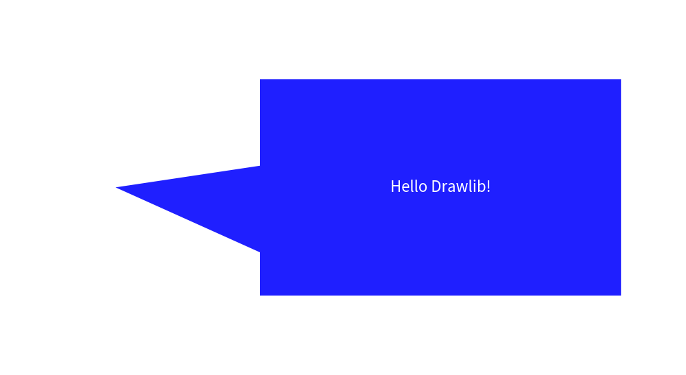
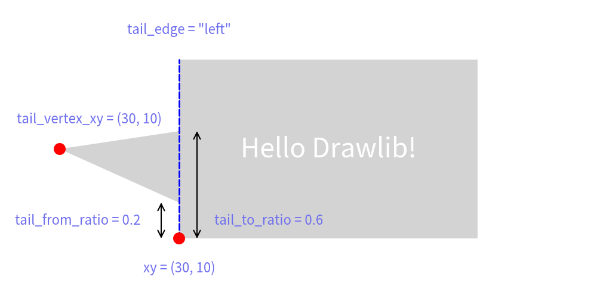

# Bubblespeech


The Bubblespeech feature in Drawlib allows you to create irregular bubble-shaped speech graphics, often used in illustrations. 
It's implemented within the `smartarts` module as part of the Smart Art functions, offering advanced shape drawing capabilities.

Here's an example of using Bubblespeech in Drawlib:


```python
from drawlib.canvas import config, save
from drawlib.colors import Colors
from drawlib.smartarts import bubblespeech
from drawlib.text import text
from drawlib.types import Style

config(width=100, height=50)
bubblespeech(
    xy=(30, 10),
    width=50,
    height=30,
    tail_edge="left",
    tail_start_ratio=0.2,
    tail_vertex_xy=(10, 25),
    tail_end_ratio=0.6,
    style=Style(line_width=0, fill_color=Colors.Blue),
    text="Hello Drawlib!",
    textstyle=Style(text_size=32, text_color=Colors.White),
)
save()
```

This function call draws a bubble speech shape with a tail starting from the right edge, beginning at 30% from the bottom, extending to 70% along its path.


<div class="drawlib-image" style="text-align: center;">
  
</div>


    image1.png

In the example above, the options for drawing Bubblespeech are specified. The key parameters include:

- xy: Coordinates specifying the position of the bottom-left corner.
- tail_edge: Specifies the edge from which the tail extends (`left`, `right`, `bottom`, `top`).
- tail_from_ratio: Determines where the tail starts along the specified edge (0.0 to 1.0).
- tail_vertex_xy: Specifies the exact vertex location of the tail.
- tail_to_ratio: Specifies where the tail ends along its path (must be greater than tail_from_ratio).

Please refer the below picture for understanding the parameters.


<div class="drawlib-image" style="text-align: center;">
  
</div>


    image2.png

Ellipse like bubblespeech is not supported yet.

---

<p align="center"><em>© 2026 drawlib by Yuichi Ito. Released under the Apache 2.0 License.</em></p>
