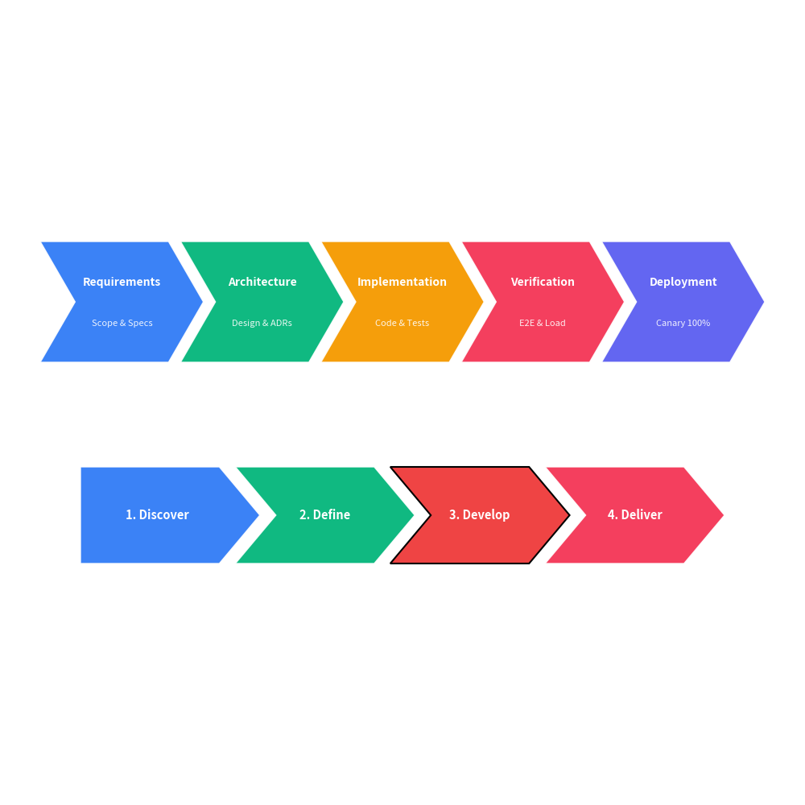

=============

# ChevronProcess

Class `ChevronProcess` renders sequential chevron (arrowhead block) process diagrams, ideal for pipelines, project phases, and operational procedures.


```python
from drawlib import canvas
from drawlib._core.l3_styles import Style
from drawlib.smartarts import ChevronProcess

canvas.initialize()

# 1. Multi-phase pipeline with titles and descriptions
cp1 = ChevronProcess(spacing=1.5)
cp1.append("Requirements", description="Scope & Specs")
cp1.append("Architecture", description="Design & ADRs")
cp1.append("Implementation", description="Code & Tests")
cp1.append("Verification", description="E2E & Load")
cp1.append("Deployment", description="Canary 100%")
cp1.draw(xy=(5.0, 55.0), width=90.0, height=15.0)

# 2. Pentagonal flat-start process with custom highlight
cp2 = ChevronProcess(flat_left_end=True, corner_angle=50.0, spacing=2.0)
cp2.append("1. Discover")
cp2.append("2. Define")
cp2.append("3. Develop", style=Style(fill_color=(239, 68, 68, 1.0), line_width=1.5))
cp2.append("4. Deliver")
cp2.draw(xy=(10.0, 30.0), width=80.0, height=12.0)
```

<figure class="drawlib-image" style="text-align: center;">
  
  <figcaption class="drawlib-caption">Chevron Process Examples</figcaption>
</figure>


---

## 1. Quick Start

Create a sequential chevron flow:

```python
from drawlib import canvas
from drawlib.smartarts import ChevronProcess

canvas.initialize()

process = ChevronProcess(spacing=1.5)
process.append("Phase 1", description="Planning")
process.append("Phase 2", description="Execution")
process.append("Phase 3", description="Review")

process.draw(xy=(5.0, 45.0), width=90.0, height=14.0)
```

---

## 2. API Specification

### `ChevronProcess()`

Initialize a ChevronProcess instance.

**Args:**
- `corner_angle` (`float`): Angle of the arrowhead point in degrees (between 10.0 and 80.0). Defaults to `60.0`.
- `spacing` (`float`): Horizontal gap between consecutive chevrons. Defaults to `1.5`.
- `flat_left_end` (`bool`): Whether the first chevron has a flat vertical left edge instead of an indentation. Defaults to `False`.
- `default_style` (`str | Style | None`): Default background style for chevrons. If `None`, colors from `palette` are applied automatically.
- `default_textstyle` (`str | Style | None`): Default style for primary title text.
- `default_description_style` (`str | Style | None`): Default style for secondary description text.
- `palette` (`Sequence[tuple[int, int, int]] | None`): Optional sequence of colors to automatically style consecutive steps.

### Methods

- `append(text, description="", style=None, textstyle=None, description_style=None)`: Append a step to the chevron process.
- `extend(texts, descriptions=None)`: Append multiple steps at once.
- `insert(index, text, description="", style=None, textstyle=None, description_style=None)`: Insert a step at the specified index.
- `draw(xy, width=90.0, height=12.0, item_width=None)`: Draw the chevron process on the canvas starting at bottom-left coordinate `xy`.
