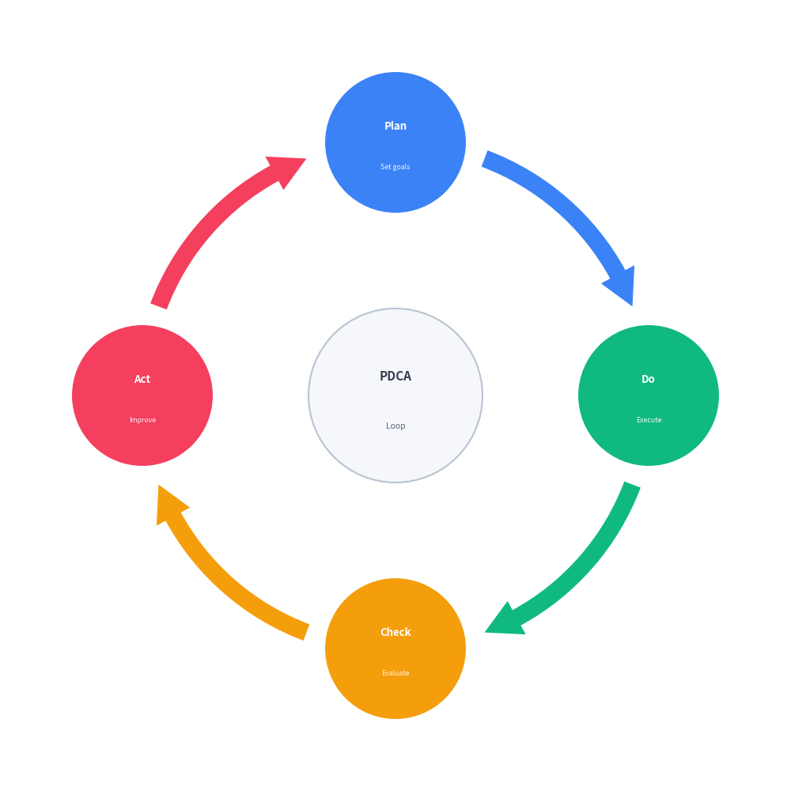
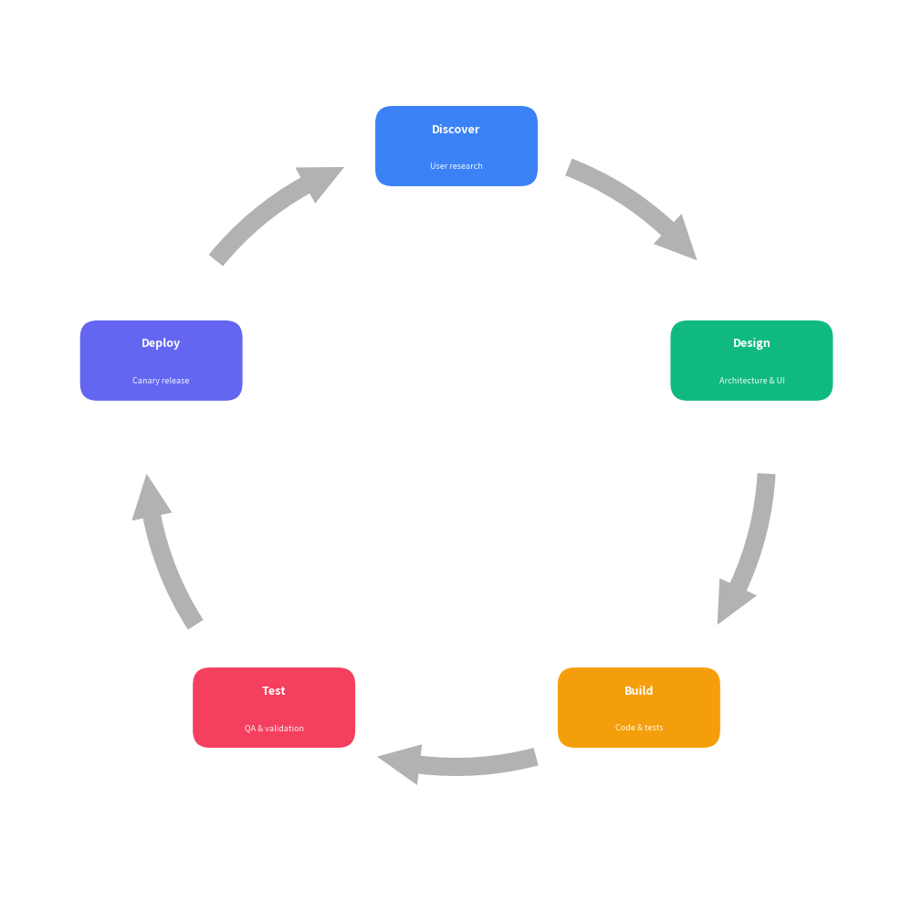

=============

# Cycle

Class `Cycle` renders circular and cyclical process diagrams, perfect for continuous workflows such as PDCA loops, agile iterations, life cycles, and feedback mechanisms.


```python
from drawlib import canvas
from drawlib.smartarts import Cycle

canvas.initialize()

# Classic PDCA cycle with center topic and matching arc arrows
cycle = Cycle(
    center_text="PDCA",
    center_description="Loop",
    center_radius=11.0,
    node_radius=9.0,
    arrow_width=2.2,
    arrow_head_width=4.8,
)
cycle.append("Plan", description="Set goals")
cycle.append("Do", description="Execute")
cycle.append("Check", description="Evaluate")
cycle.append("Act", description="Improve")
cycle.draw(xy=(50.0, 50.0), radius=32.0)
```

<figure class="drawlib-image" style="text-align: center;">
  
  <figcaption class="drawlib-caption">Classic PDCA Circular Cycle</figcaption>
</figure>


```python
from drawlib import canvas
from drawlib.smartarts import Cycle

canvas.initialize()

# Continuous product lifecycle with rounded rectangle blocks
cycle = Cycle(
    node_shape="rectangle",
    node_size=(18.0, 9.0),
    arrow_width=2.0,
    arrow_head_width=4.5,
    arrow_color_mode="monochrome",
)
cycle.append("Discover", description="User research")
cycle.append("Design", description="Architecture & UI")
cycle.append("Build", description="Code & tests")
cycle.append("Test", description="QA & validation")
cycle.append("Deploy", description="Canary release")
cycle.draw(xy=(50.0, 50.0), radius=34.0)
```

<figure class="drawlib-image" style="text-align: center;">
  
  <figcaption class="drawlib-caption">5-Stage Lifecycle with Rectangle Nodes</figcaption>
</figure>


---

## 1. Quick Start

Create a circular workflow diagram:

```python
from drawlib import canvas
from drawlib.smartarts import Cycle

canvas.initialize()

cycle = Cycle()
cycle.append("Plan", description="Define goals")
cycle.append("Do", description="Implement")
cycle.append("Check", description="Review")
cycle.append("Act", description="Scale")

cycle.draw(xy=(50.0, 50.0), radius=32.0)
```

---

## 2. API Specification

### `Cycle()`

Initialize a Cycle SmartArt instance.

**Args:**
- `clockwise` (`bool`): Whether the cycle flows clockwise (`True`) or counter-clockwise (`False`). Defaults to `True`.
- `start_angle` (`float`): Angle in degrees for the first node (`0` is right, `90` is top). Defaults to `90.0`.
- `node_shape` (`Literal["circle", "rectangle", "none"]`): Shape of step nodes. Defaults to `"circle"`.
- `node_radius` (`float`): Radius of step circles when `node_shape` is `"circle"`. Defaults to `8.0`.
- `node_size` (`tuple[float, float]`): Width and height `(w, h)` when `node_shape` is `"rectangle"`. Defaults to `(18.0, 10.0)`.
- `description_placement` (`Literal["inside", "outside"]`): Placement of description text. Defaults to `"inside"`.
- `arrow_type` (`Literal["arc", "line", "none"]`): Style of connecting arrows (`"arc"` for curved block arrow, `"line"` for arc line, or `"none"`). Defaults to `"arc"`.
- `arrow_width` (`float`): Tail thickness of block arrow or line width of arc line arrow. Defaults to `2.0`.
- `arrow_head_width` (`float`): Head width of block arrow. Defaults to `4.5`.
- `arrow_color_mode` (`Literal["monochrome", "match_source", "match_target"]`): Arrow color resolution. Defaults to `"match_source"`.
- `arrow_gap` (`float`): Distance margin between arrow endpoints and step nodes. Defaults to `2.5`.
- `default_style` (`str | Style | None`): Default style for step nodes. If `None`, palette colors are automatically applied.
- `default_textstyle` (`str | Style | None`): Default style for primary title text.
- `default_description_style` (`str | Style | None`): Default style for secondary description text.
- `default_arrow_style` (`str | Style | None`): Default style for connecting arrows.
- `palette` (`Sequence[tuple[int, int, int]] | None`): Optional sequence of colors to style consecutive steps.
- `center_text` (`str`): Optional title text for the center node (creating a Radial Cycle).
- `center_description` (`str`): Optional description text for the center node.
- `center_radius` (`float`): Radius of the center circle. Defaults to `10.0`.
- `center_style` (`str | Style | None`): Custom style for the center node circle.
- `center_textstyle` (`str | Style | None`): Custom style for the center node title.
- `center_description_style` (`str | Style | None`): Custom style for the center node description text.

### Methods

- `append(text, description="", style=None, textstyle=None, description_style=None, arrow_style=None)`: Append a step to the cycle.
- `extend(texts, descriptions=None)`: Append multiple steps at once.
- `insert(index, text, description="", style=None, textstyle=None, description_style=None, arrow_style=None)`: Insert a step at the specified index.
- `set_center(text, description="", radius=None, style=None, textstyle=None, description_style=None)`: Configure the optional center node for a Radial Cycle.
- `draw(xy, radius=35.0, align="center")`: Draw the cycle on the canvas at `xy`.
