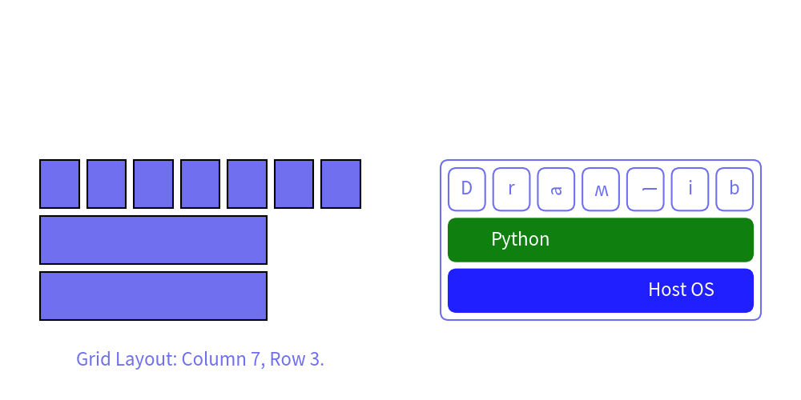

# GridLayout


Class `GridLayout` draws smart art grid layouted rectangles.


```python
from drawlib.canvas import config, save
from drawlib.smartarts import GridLayout
from drawlib.text import text

config(width=100, height=50, grid=True)

gl1 = GridLayout(num_column=7, num_row=3)
gl1.add(position=(0, 0), width=5, height=1, text="Host OS")
gl1.add(position=(0, 1), width=5, height=1, text="Python")
gl1.add(position=(0, 2), width=1, height=1, text="D")
gl1.add(position=(1, 2), width=1, height=1, text="r")
gl1.add(position=(2, 2), width=1, height=1, text="a")
gl1.add(position=(3, 2), width=1, height=1, text="w")
gl1.add(position=(4, 2), width=1, height=1, text="l")
gl1.add(position=(5, 2), width=1, height=1, text="i")
gl1.add(position=(6, 2), width=1, height=1, text="b")
gl1.draw((5, 10), width=40, height=20, margin=1)
text((25, 5), text="Grid Layout: Column 7, Row 3.")

gl2 = GridLayout(num_column=7, num_row=3, default_r=1, default_style="solid")
gl2.add(position=(0, 0), width=7, height=1, text="Host OS", style="blue", textstyle="white", text_xy_shift=(10, 0))
gl2.add(position=(0, 1), width=7, height=1, text="Python", style="green", textstyle="white", text_xy_shift=(-10, 0))
gl2.add(position=(0, 2), width=1, height=1, text="D")
gl2.add(position=(1, 2), width=1, height=1, text="r")
gl2.add(position=(2, 2), width=1, height=1, text="a", textangle=90)
gl2.add(position=(3, 2), width=1, height=1, text="w", textangle=180)
gl2.add(position=(4, 2), width=1, height=1, text="l", textangle=270)
gl2.add(position=(5, 2), width=1, height=1, text="i")
gl2.add(position=(6, 2), width=1, height=1, text="b")
gl2.draw((55, 10), width=40, height=20, margin=1, outer_style="solid", outer_r=1)

save()
```

<div class="drawlib-image" style="text-align: center;">
  
</div>


    image1.png

You can draw grid layout with these procedure.

1. Initialize instance with specifying number of columns and rows.
2. Add grid layout items with optional custom style
3. Draw pyramid with specified position, size and alignment.


# API Specification


## GridLayout()


Initializes a GridLayout instance.

Args:

- num_column (int): The number of columns in the grid.
- num_row (int): The number of rows in the grid.
- default_r (int, optional): The default radius for the rectangles. Defaults to 0.
- default_style (Union[str, Style, None], optional): The default style for the rectangles. Can be a string key, a Style object, or None. Defaults to None.
- default_textstyle (Union[str, Style, None], optional): The default text style for the rectangles. Can be a string key, a Style object, or None. Defaults to None.
- default_textangle (Optional[float], optional): The default angle for the text inside the rectangles. If None, no angle is applied. Defaults to None.


## add()


Add an item to the grid layout.

Args:

- position (Tuple[int, int]): Cell start (column, row) point.
- width (int): How many column cells.
- height (int): How many row cells.
- r (Optional[int], optional): The radius of the item. Default is None, which uses the default radius.
- style (Union[str, Style, None], optional): The style of the item. Can be a string key for a predefined style, a Style object, or None to use the default style.
- text (str, optional): The text associated with the item. Default is an empty string.
- textstyle (Union[str, Style, None], optional): The text style of the item. Can be a string key for a predefined text style, a Style object, or None to use the default text style.
- textangle (Optional[float], optional): The angle of the text. Default is None, which is same to 0.
- text_xy_shift (Optional[Tuple[float, float]], optional): The XY shift of the text. Default is None, which is same to (0, 0).


## draw()


Draw the grid layout.

Args:

- xy (Tuple[float, float]): The x and y coordinates of the top-left corner of the grid.
- width (float): The total width of the grid.
- height (float): The total height of the grid.
- margin (float): The margin between grid items.
- outer_r (int, optional): The radius for the outer grid border. Default is 0.
- outer_style (Union[str, Style, None], optional): The style for the outer grid border. Can be a string key for a predefined style, a Style object, or None.


## draw_flexible()


Draw the grid layout with flexible column widths and row heights.

Args:

- xy (Tuple[float, float]): The x and y coordinates of the top-left corner of the grid.
- column_widths (List[float]): The widths of each column.
- column_margins (List[float]): The margins between columns.
- row_heights (List[float]): The heights of each row.
- row_margins (List[float]): The margins between rows.
- outer_r (int, optional): The radius for the outer grid border. Default is 0.
- outer_style (Union[str, Style, None], optional): The style for the outer grid border. Can be a string key for a predefined style, a Style object, or None.

---

<p align="center"><em>© 2026 drawlib by Yuichi Ito. Released under the Apache 2.0 License.</em></p>
