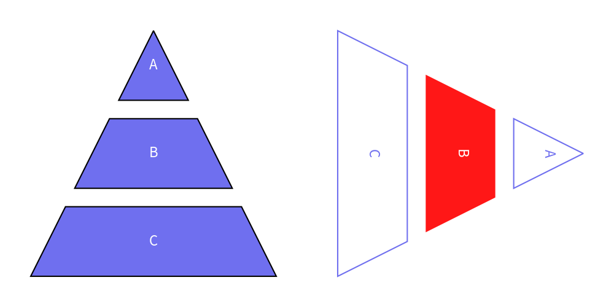

# Pyramid


Class `Pyramid` draws smart art pyramid with custom style and orientation.


```python
from drawlib.canvas import config
from drawlib.smartarts import Pyramid

config(width=100, height=50)

p1 = Pyramid(default_textstyle="white")
p1.add(text="A")
p1.add(text="B")
p1.add(text="C")
p1.draw((5, 5), width=40, height=40, margin=3)

p2 = Pyramid(default_style="solid", default_textangle=270)
p2.add(text="A")
p2.add(text="B", style="red_flat", textstyle="white")
p2.add(text="C")
p2.draw((55, 5), width=40, height=40, margin=3, align="left")
```

<div class="drawlib-image" style="text-align: center;">
  
</div>


You can draw pyramid with these procedure.

1. Initialize instance with specifying default style
2. Add pyramid items with optional custom style
3. Draw pyramid with specified position, size and alignment.


# API Specification


## ``Pyramid()``


Initialize instance.

Args

- default_style (Union[str, Style, None], optional): The default style for the pyramid shapes. It can be a string that maps to a `Style` or a `Style` instance. Defaults to None.
- default_textstyle (Union[str, Style, None], optional): The default text style for the pyramid shapes. It can be a string that maps to a `Style` or a `Style` instance. Defaults to None.
- default_textangle (Optional[float], optional): The default rotation angle for the text within the pyramid shapes. Defaults to None.
- default_text_xy_shift (Optional[Tuple[float, float]], optional): The default x and y shift for the text within the pyramid shapes. Defaults to None.


## ``add()``


Add an item to the pyramid.

Args:

- text (str): The text associated with the item.
- style (Union[str, Style, None], optional): The style of the item. Can be a string key for a predefined style, a Style object, or None to use the default style.
- textstyle (Union[str, Style, None], optional): The text style of the item. Can be a string key for a predefined text style, a Style object, or None to use the default text style.
- textangle (Optional[float], optional): The angle of the text. Default is None, which is same to 0.
- text_xy_shift (Optional[Tuple[float, float]], optional): The XY shift of the text. Default is None, which is same to (0, 0).


## ``draw()``


Draw smart art pyramid.

Args:

- xy (Tuple[float, float]): The x and y coordinates of the bottom-left corner of the pyramid.
- width (float): The width of the pyramid.
- height (float): The heifht of the pyramid.
- margin (float): The margin between pyramid items.
- align (str): Alignment of a pyramid.
- order (str): Item order. "vertex -> base" or "base -> vertex". default is "vertex -> base".


## ``draw_flexible()``


Draw smart art pyramid with flexible pyramid item heights.

Args:

- xy (Tuple[float, float]): The x and y coordinates of the bottom-left corner of the pyramid.
- width (float): The width of the pyramid.
- item_heights (float): The height of the each pyramid items.
- margins (float): The margin between pyramid items.
- align (str): Alignment of a pyramid.
- order (str): Item order. "vertex -> base" or "base -> vertex". default is "vertex -> base".

---

<p align="center"><em>© 2026 drawlib by Yuichi Ito. Released under the Apache 2.0 License.</em></p>
