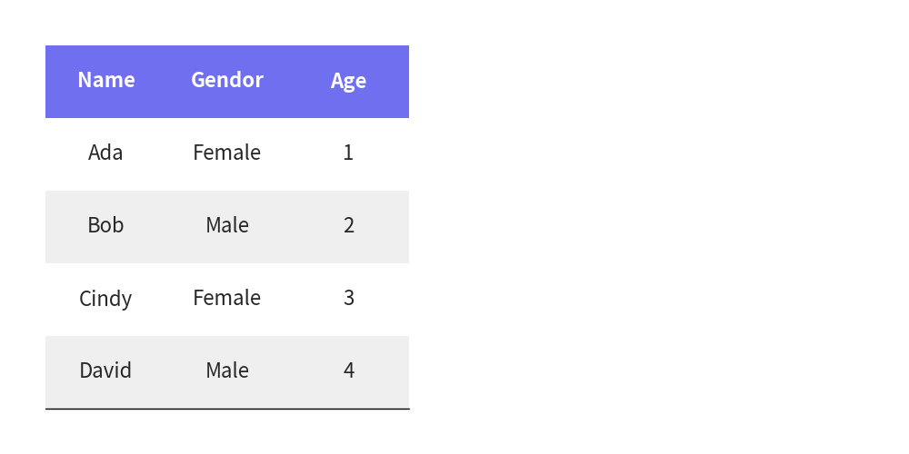

=============

# Table


Class `dsart.Table` is used for drawing table.


```python
from drawlib.canvas import config, save
from drawlib.smartarts import Table, dsart

config(width=100, height=50, grid=True)

t1 = dsart.Table()
t1.draw(
    xy=(5, 45),
    width=40,
    height=40,
    data=[
        ["Name", "Gendor", "Age"],
        ["Ada", "Female", "1"],
        ["Bob", "Male", "2"],
        ["Cindy", "Female", "3"],
        ["David", "Male", "4"],
    ],
)

save()
```

<div class="drawlib-image" style="text-align: center;">
  
</div>


    image1.png

You can draw pyramid with these procedure.

1. Initialize instance
2. Apply table styles
3. Draw table with providing coordinate, size and matrix table data


# API Specification


## ``dsart.Table()``


Initialize instance. No args.


## ``clear_styles()``


Clear all styles. No args.


## ``set_predefined_style()``


Apply predefined styles.

Args:

- name (Literal["default", "monochrome", "white"]): The name of the predefined style.


## ``set_style_cell_headers()``


Sets the style for both column and row headers.

Args:

- background_color (Union[Tuple[int, int, int], Tuple[int, int, int, float]]): The background color of the headers.
- textstyle (Union[str, Style]): The text style of the headers. Can be a string key for predefined styles or a Style object.


## ``set_style_cell_header()``


Sets the style for the column header.

Args:

- background_color (Union[Tuple[int, int, int], Tuple[int, int, int, float]]): The background color of the column header.
- textstyle (Union[str, Style]): The text style of the column header. Can be a string key for predefined styles or a Style object.


## ``set_style_cell_rowheader()``


Sets the style for the row header.

Args:

- background_color (Union[Tuple[int, int, int], Tuple[int, int, int, float]]): The background color of the row header.
- textstyle (Union[str, Style]): The text style of the row header. Can be a string key for predefined styles or a Style object.


## ``set_style_cell_evenodd()``


Sets alternating styles for even and odd rows.

Args:

- even_color (Union[Tuple[int, int, int], Tuple[int, int, int, float]]): The background color for even rows.
- even_textstyle (Union[str, Style]): The text style for even rows. Can be a string key for predefined styles or a Style object.
- odd_color (Union[Tuple[int, int, int], Tuple[int, int, int, float]]): The background color for odd rows.
- odd_textstyle (Union[str, Style]): The text style for odd rows. Can be a string key for predefined styles or a Style object.


## ``set_style_cell()``


Sets the style for specific cells.

Args:

- background_color (Union[Tuple[int, int, int], Tuple[int, int, int, float]]): The background color of the cells.
- textstyle (Union[str, Style]): The text style of the cells. Can be a string key for predefined styles or a Style object.
- rows (Optional[List[int]]): A list of row indices to apply the style to. If None, applies to all rows.
- columns (Optional[List[int]]): A list of column indices to apply the style to. If None, applies to all columns.


## ``set_style_border()``


Sets the style for table borders.

Args:

- top (Union[str, Style, None]): Style for the top border. Can be a string key for predefined styles or a Style object.
- top2 (Union[str, Style, None]): Style for the secondary top border. Can be a string key for predefined styles or a Style object.
- bottom (Union[str, Style, None]): Style for the bottom border. Can be a string key for predefined styles or a Style object.
- left (Union[str, Style, None]): Style for the left border. Can be a string key for predefined styles or a Style object.
- left2 (Union[str, Style, None]): Style for the secondary left border. Can be a string key for predefined styles or a Style object.
- right (Union[str, Style, None]): Style for the right border. Can be a string key for predefined styles or a Style object.
- between_columns (Union[str, Style, None]): Style for borders between columns. Can be a string key for predefined styles or a Style object.
- between_rows (Union[str, Style, None]): Style for borders between rows. Can be a string key for predefined styles or a Style object.


## ``draw()``


Draws the table with equal-sized cells.

Args:

- xy (Tuple[float, float]): The coordinates where the table should be drawn.
- width (float): The total width of the table.
- height (float): The total height of the table.
- data (List[List[Any]]): The data to be displayed in the table.


## ``draw_flexible()``


Draws the table with flexible cell sizes.

Args:

- xy (Tuple[float, float]): The coordinates where the table should be drawn.
- column_widths (List[float]): A list of widths for each column.
- row_heights (List[float]): A list of heights for each row.
- data (List[List[Any]]): The data to be displayed in the table.

---

<p align="center"><em>© 2026 drawlib by Yuichi Ito. Released under the Apache 2.0 License.</em></p>
