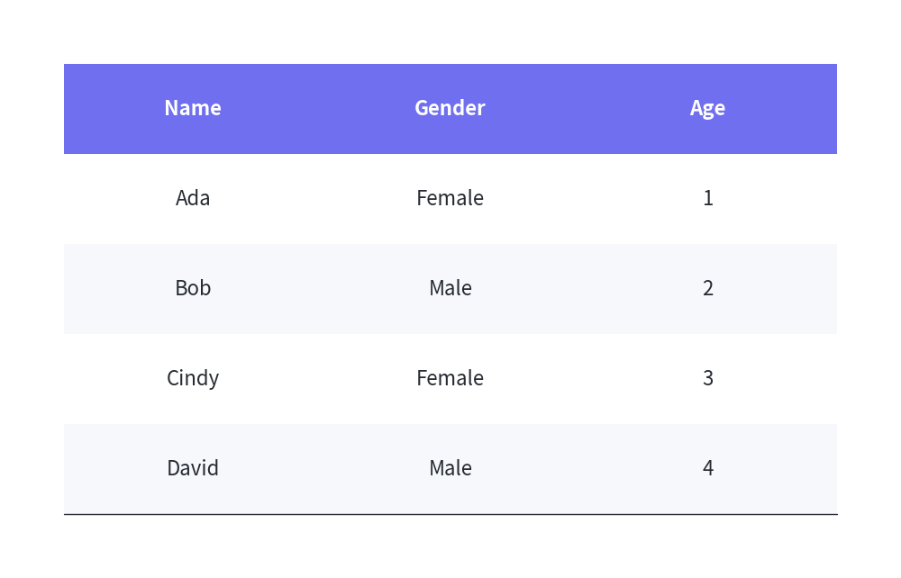

# Table


Class `Table` is used for drawing tabular data with customizable headers, borders, and row banding.


```python
from drawlib.canvas import setup
from drawlib.smartarts import Table
from drawlib.styles import Styles

setup(width=70, height=45)

t1 = Table(
    default_text_style=Styles.Primary,
    header_text_style=Styles.Bold,
    header_cell_style=Styles.PrimaryLight,
    border_style=Styles.MutedLight,
)
t1.draw(
    xy=(5, 40),
    width=60,
    height=35,
    data=[
        ["Name", "Gender", "Age"],
        ["Ada", "Female", "1"],
        ["Bob", "Male", "2"],
        ["Cindy", "Female", "3"],
        ["David", "Male", "4"],
    ],
)
```

<figure class="drawlib-image" style="text-align: center;">
  
  <figcaption class="drawlib-caption">Table Example</figcaption>
</figure>


You can draw tables with these procedures:

1. Initialize a `Table` instance (passing default cell, header, or border styles).
2. Optionally customize row, column, or cell styles via `set_style_*` methods.
3. Draw the table with `draw()` providing coordinate, size, and matrix data.


# API Specification


## ``Table()``


Initialize instance. Specify styles such as `default_cell_style`, `default_text_style`, `header_cell_style`, `header_text_style`, and `border_style`. If no styles are provided and no cell styles are configured, calling `draw()` will raise a `ValueError`.


## ``clear_styles()``


Clear all styles. No args.


## ``set_style_cell_headers()``


Sets the style for both column and row headers.

Args:

- background_color (Union[Tuple[int, int, int], Tuple[int, int, int, float], str, Color]): The background color of the headers.
- textstyle (Style): The text style of the headers.


## ``set_style_cell_header()``


Sets the style for the column header.

Args:

- background_color (Union[Tuple[int, int, int], Tuple[int, int, int, float], str, Color]): The background color of the column header.
- textstyle (Style): The text style of the column header.


## ``set_style_cell_rowheader()``


Sets the style for the row header.

Args:

- background_color (Union[Tuple[int, int, int], Tuple[int, int, int, float], str, Color]): The background color of the row header.
- textstyle (Style): The text style of the row header.


## ``set_style_cell_evenodd()``


Sets alternating styles for even and odd rows.

Args:

- even_color (Union[Tuple[int, int, int], Tuple[int, int, int, float], str, Color]): The background color for even rows.
- even_textstyle (Style): The text style for even rows.
- odd_color (Union[Tuple[int, int, int], Tuple[int, int, int, float], str, Color]): The background color for odd rows.
- odd_textstyle (Style): The text style for odd rows.


## ``set_style_cell()``


Sets the style for specific cells.

Args:

- background_color (Union[Tuple[int, int, int], Tuple[int, int, int, float], str, Color]): The background color of the cells.
- textstyle (Style): The text style of the cells.
- rows (Optional[List[int]]): A list of row indices to apply the style to. If None, applies to all rows.
- columns (Optional[List[int]]): A list of column indices to apply the style to. If None, applies to all columns.


## ``set_style_border()``


Sets the style for table borders.

Args:

- top (Optional[Style]): Style for the top border.
- top2 (Optional[Style]): Style for the secondary top border.
- bottom (Optional[Style]): Style for the bottom border.
- left (Optional[Style]): Style for the left border.
- left2 (Optional[Style]): Style for the secondary left border.
- right (Optional[Style]): Style for the right border.
- between_columns (Optional[Style]): Style for borders between columns.
- between_rows (Optional[Style]): Style for borders between rows.


## ``draw()``


Draws the table with equal-sized cells.

Args:

- xy (Tuple[float, float]): The coordinates where the table should be drawn.
- width (float): The total width of the table.
- height (float): The total height of the table.
- data (List[List[Any]]): The data to be displayed in the table.


## ``draw_flexible()``


Draws the table with flexible cell sizes.

Args:

- xy (Tuple[float, float]): The coordinates where the table should be drawn.
- column_widths (List[float]): A list of widths for each column.
- row_heights (List[float]): A list of heights for each row.
- data (List[List[Any]]): The data to be displayed in the table.

---

<p align="center"><em>© 2026 drawlib by Yuichi Ito. Released under the Apache 2.0 License.</em></p>
