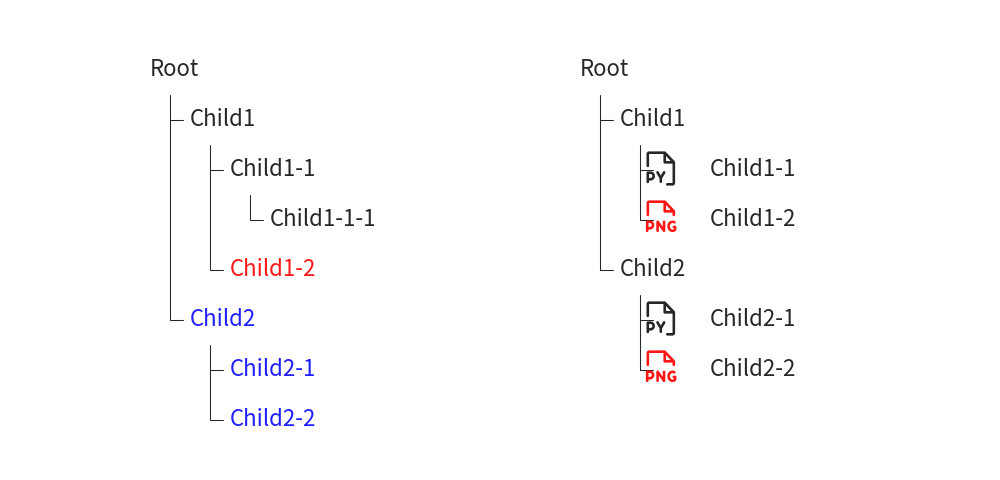

# Tree


Class `Tree` draws smart art tree which is similar to `tree` command output.


```python
from drawlib.canvas import config
from drawlib.icons import phosphor
from drawlib.smartarts import TreeNode

config(width=100, height=48)

tree1 = TreeNode(
    "Root",
    default_textstyle=styles.primary,
    default_linestyle=styles.light,
    default_line_horizontal_margin=2,
    default_line_horizontal_length=2,
    default_line_vertical_margin=5,
    children=[
        TreeNode(
            "Child1",
            children=[
                TreeNode(
                    "Child1-1",
                    children=[
                        TreeNode("Child1-1-1"),
                    ],
                ),
                TreeNode("Child1-2", textstyle=styles.red),
            ],
        ),
        TreeNode(
            text="Child2",
            default_textstyle=styles.blue,
            children=[
                TreeNode("Child2-1"),
                TreeNode("Child2-2"),
            ],
        ),
    ],
)
tree1.draw((15, 41.0))


TreeNode.register_drawing_item(
    name="py_file",
    location="before",
    padding_width=5,
    function=phosphor.file_py,
    style=styles.primary,
    args={"width": 4},
)
TreeNode.register_drawing_item(
    name="png_file",
    location="before",
    padding_width=5,
    function=phosphor.file_png,
    style=styles.red,
    args={"width": 4},
)

tree2 = TreeNode(
    "Root",
    default_textstyle=styles.primary,
    default_linestyle=styles.light,
    default_line_horizontal_margin=2,
    default_line_horizontal_length=2,
    default_line_vertical_margin=5,
    children=[
        TreeNode(
            "Child1",
            children=[
                TreeNode(
                    "Child1-1",
                ).set_drawing_item("py_file"),
                TreeNode("Child1-2").set_drawing_item("png_file"),
            ],
        ),
        TreeNode(
            "Child2",
            children=[
                TreeNode("Child2-1").set_drawing_item("py_file"),
                TreeNode("Child2-2").set_drawing_item("png_file"),
            ],
        ),
    ],
)

tree2.draw((58, 41.0))
```

<div class="drawlib-image" style="text-align: center;">
  
</div>


Each Tree instances are nodes of tree structure.
Node can contain children nodes and able to override the style.

You can draw tree with these procedure.

1. Create root tree node
2. Add children nodes
3. Draw tree with providing coordinate


# API Specification


## ``Tree()``


Initializes a TreeNode instance with specific text, styles, and optional children.
Styles are mandatory for root node. Optional for child nodes.

Args:

- text (str): The text content for the tree node.
- textstyle (Optional[Style], optional): The text style for the node. Defaults to None.
- linestyle (Optional[Style], optional): The line style for the node. Defaults to None.
- line_horizontal_margin (Optional[float], optional): The margin for horizontal lines. Defaults to None.
- line_horizontal_length (Optional[float], optional): The length of horizontal lines. Defaults to None.
- line_vertical_margin (Optional[float], optional): The margin for vertical lines. Defaults to None.
- children (Optional[List[TreeNode]], optional): A list of child nodes connected to this node. Defaults to None.
- default_textstyle (Optional[Style], optional): The default text style for child nodes. Defaults to None.
- default_linestyle (Optional[Style], optional): The default line style for child nodes. Defaults to None.
- default_line_horizontal_margin (Optional[float], optional): The default horizontal margin for lines of child nodes. Defaults to None.
- default_line_horizontal_length (Optional[float], optional): The default horizontal length for lines of child nodes. Defaults to None.
- default_line_vertical_margin (Optional[float], optional): The default vertical margin for lines of child nodes. Defaults to None.


## ``register_drawing_item()``


Class method.
Register a drawing item for the tree node.
This class returns current tree node instance.

Args:

- name (str): Name of drawing item.
- location (Literal["before", "after"]): The location of the drawing item relative to the text.
- padding_width (float): The padding width for the drawing item.
- function (Callable): The function to render the drawing item.
- style (Style): The style for the drawing item.
- args (dict): The arguments for the function.


## ``set_drawing_item()``


Set a drawing item for the tree node.

Args:
            
- name (str): Name of drawing item.


## ``draw()``


Draw the tree node and its children.
ValueError is raised if any of the default styles or margins are None.

Args:

- xy (Tuple[float, float]): The coordinates to start drawing.

---

<p align="center"><em>© 2026 drawlib by Yuichi Ito. Released under the Apache 2.0 License.</em></p>
