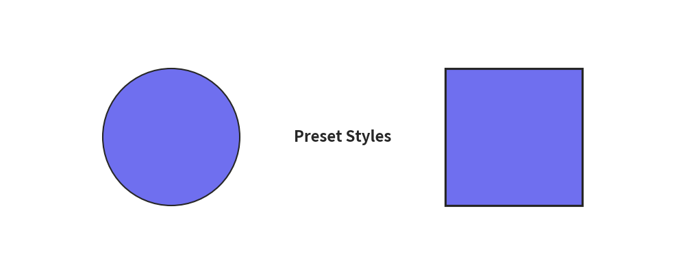
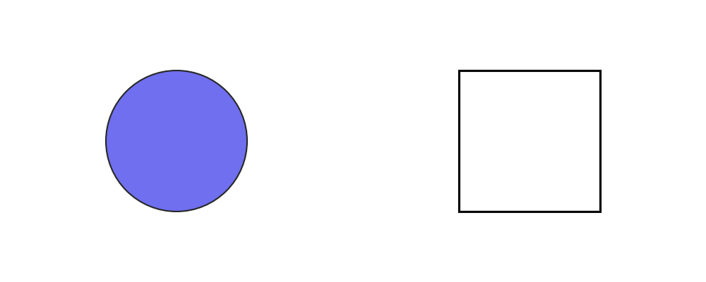
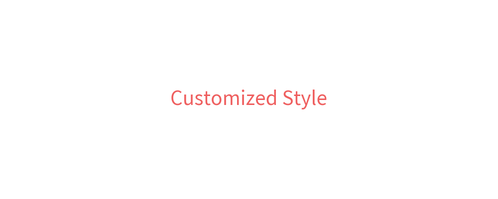

# Advanced Preset Styles Topics

In this section, we cover advanced topics for working with preset styles in `drawlib.preset_styles`.

# Accessing Styles via `get_styles()` or the Global `styles` Catalog

Drawlib provides style presets as catalog objects (`BasePresetStyles`) containing strongly-typed `Style` objects for key roles and colors.
You can retrieve the styles catalog using `get_styles()`:

```python
from drawlib.preset_styles import get_styles

styles = get_styles()  # default catalog
```

In `doc_builder` Markdown code blocks, the active `styles` catalog is automatically injected into the global scope.

## Standard Style Roles

You can access standard preset styles directly by attribute or key:

- `styles.primary`: The default primary style.
- `styles.light`: Light line/font weight style.
- `styles.bold`: Bold line/font weight style.
- `styles.flat`: Filled shape with no border line.
- `styles.solid`: Outlined shape with no fill color.
- `styles.dashed`: Outlined shape with dashed line style.

Example:

```python
from drawlib.canvas import config
from drawlib.preset_styles import get_styles
from drawlib.shapes import circle, rectangle
from drawlib.text import text

config(width=100, height=40)
styles = get_styles()

style_primary = styles.primary
style_bold = styles.bold

circle((25, 20), radius=10, style=style_primary)
rectangle((75, 20), width=20, height=20, style=style_bold)
text((50, 20), "Preset Styles", style=styles.bold)
```

Executing this code produces the following output:


<div class="drawlib-image" style="text-align: center;">
  
</div>


## Using Color Names and Combinations

You can also access color-specific styles (e.g., `styles.red_flat`, `styles.blue_solid`, `styles.red_bold`):

```python
from drawlib.canvas import config
from drawlib.preset_styles import get_styles
from drawlib.shapes import circle, rectangle
from drawlib.text import text

config(width=100, height=40)
styles = get_styles()

circle((25, 20), radius=10, style=styles.red_flat)
rectangle((75, 20), width=20, height=20, style=styles.blue_solid)
text((50, 20), "Combined Style", style=styles.red_bold)
```

Executing this code produces:


<div class="drawlib-image" style="text-align: center;">
  
</div>


# Accessing Official Style Presets

Drawlib includes three official style presets: `default`, `essentials`, and `monochrome`.
You can access full `BasePresetStyles` objects using `get_styles()` or the dedicated functions:

- `get_styles("default")` / `get_default_styles()`
- `get_styles("essentials")` / `get_essentials_styles()`
- `get_styles("monochrome")` / `get_monochrome_styles()`

Each `BasePresetStyles` instance contains `primary`, `light`, `bold`, `flat`, `solid`, and `dashed` `Style` attributes.

Example:

```python
from drawlib.canvas import config
from drawlib.preset_styles import get_styles
from drawlib.shapes import circle, rectangle

essentials = get_styles("essentials")
monochrome = get_styles("monochrome")

config(width=100, height=40)

circle((25, 20), radius=10, style=essentials.primary)
rectangle((75, 20), width=20, height=20, style=monochrome.bold)
```

Output:


<div class="drawlib-image" style="text-align: center;">
  
</div>


# Customizing Style Objects with `.patch()`

Because `Style` objects in Drawlib are immutable (`frozen=True`), styles are customized using the `.patch()` method to create new derived `Style` instances safely:

```python
from drawlib.canvas import config
from drawlib.colors import ColorsDefault
from drawlib.preset_styles import get_styles
from drawlib.text import text

styles = get_styles()
custom_style = styles.blue.patch(text_size=28, text_color=ColorsDefault.Red)

config(width=100, height=40)
text((50, 20), "Customized Style", style=custom_style)
```

Output:


<div class="drawlib-image" style="text-align: center;">
  
</div>


---

<p align="center"><em>© 2026 drawlib by Yuichi Ito. Released under the Apache 2.0 License.</em></p>
