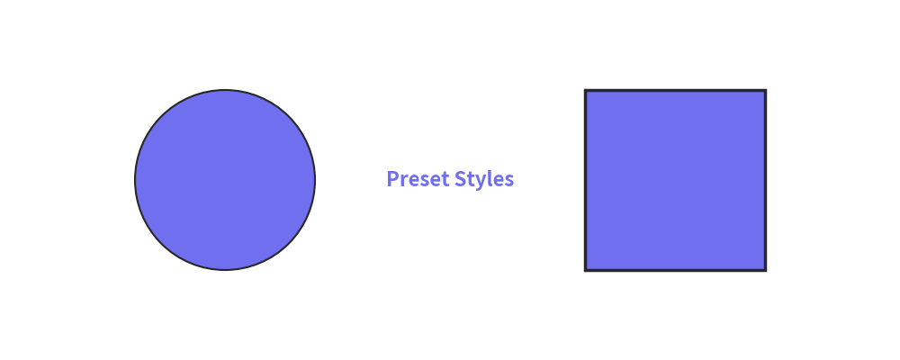
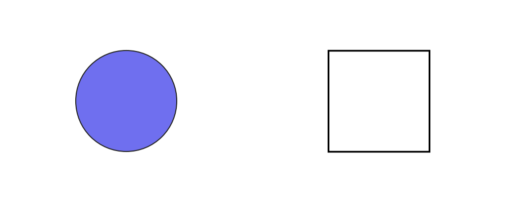
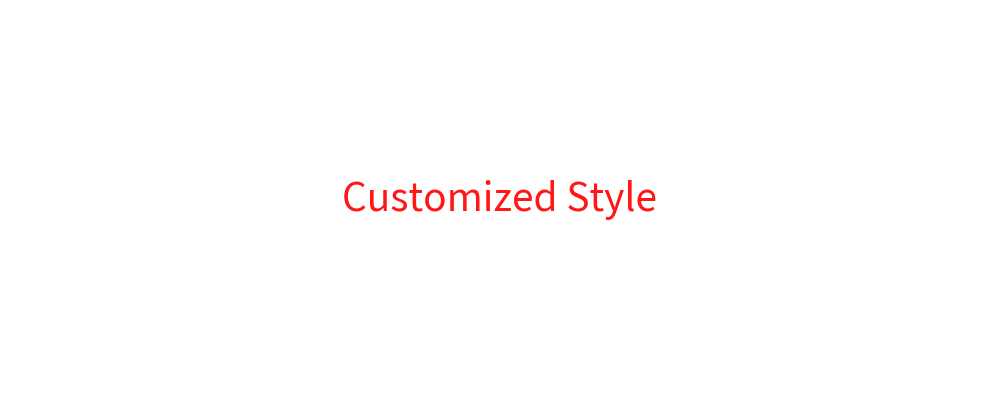

# Advanced Preset Styles Topics

In this section, we cover advanced topics for working with preset styles in `drawlib.preset_styles` and `drawlib.styles`.

# Accessing Styles via `drawlib.styles` or Official Catalogs

Drawlib provides style presets as catalog objects (`BaseStyles`) containing strongly-typed `Style` objects for key roles and colors.
The recommended way to access styles in drawing code is via `drawlib.styles`:

```python
from drawlib.styles import Colors, Styles
```

This provides direct access to the active project styles (defaulting to `EssentialsStyles`) and allows styles to be themed dynamically across the entire project via `styles.py` files.

## Standard Style Roles

You can access standard preset styles directly by attribute or key:

- `Styles.Primary`: The default primary style.
- `Styles.Light`: Light line/font weight style.
- `Styles.Bold`: Bold line/font weight style.
- `Styles.Flat`: Filled shape with no border line.
- `Styles.Solid`: Outlined shape with no fill color.
- `Styles.Dashed`: Outlined shape with dashed line style.

Example:

```python
from drawlib.canvas import setup
from drawlib.styles import Colors, Styles
from drawlib.shapes import circle, rectangle
from drawlib.text import text

setup(width=100, height=40)

style_primary = Styles.Primary
style_bold = Styles.Bold

circle((25, 20), radius=10, style=style_primary)
rectangle((75, 20), width=20, height=20, style=style_bold)
text((50, 20), "Preset Styles", style=Styles.Bold)
```

Executing this code produces the following output:


<div class="drawlib-image" style="text-align: center;">
  
</div>


## Using Color Names and Combinations

You can also access color-specific styles (e.g., `Styles.RedFlat`, `Styles.BlueSolid`, `Styles.RedBold`):

```python
from drawlib.canvas import setup
from drawlib.styles import Colors, Styles
from drawlib.shapes import circle, rectangle
from drawlib.text import text

setup(width=100, height=40)

circle((25, 20), radius=10, style=Styles.RedFlat)
rectangle((75, 20), width=20, height=20, style=Styles.BlueSolid)
text((50, 20), "Combined Style", style=Styles.RedBold)
```

Executing this code produces:


<div class="drawlib-image" style="text-align: center;">
  
</div>


# Accessing Official Style Presets

# Accessing Official Style Catalogs Directly

Drawlib includes three official immutable style catalogs: `DefaultStyles`, `GoogleStyles`, and `MonochromeStyles`.
You can import them directly from `drawlib.preset_styles`:

- `from drawlib.preset_styles import DefaultStyles`
- `from drawlib.preset_styles import GoogleStyles`
- `from drawlib.preset_styles import MonochromeStyles`

Each `BaseStyles` instance contains `Primary`, `Light`, `Bold`, `Flat`, `Solid`, `Dashed`, and color-specific `Style` attributes.

Example:

```python
from drawlib.canvas import setup
from drawlib.preset_styles import DefaultStyles, MonochromeStyles
from drawlib.shapes import circle, rectangle

setup(width=100, height=40)

circle((25, 20), radius=10, style=DefaultStyles.Primary)
rectangle((75, 20), width=20, height=20, style=MonochromeStyles.Bold)
```

Output:


<div class="drawlib-image" style="text-align: center;">
  
</div>


# Customizing Style Objects with `.patch()`

Because `Style` objects in Drawlib are immutable (`frozen=True`), styles are customized using the `.patch()` method to create new derived `Style` instances safely:

```python
from drawlib.canvas import setup
from drawlib.preset_colors import DefaultColors
from drawlib.styles import Colors, Styles
from drawlib.text import text

custom_style = Styles.Blue.patch(text_size=28, text_color=DefaultColors.Red)

setup(width=100, height=40)
text((50, 20), "Customized Style", style=custom_style)
```

Output:


<div class="drawlib-image" style="text-align: center;">
  
</div>


# Patching Typography Globally with `Styles.PatchFont()`

When creating illustrations or documentation in Japanese, Chinese, or specialized brand typefaces, setting fonts individually on each shape or text call is tedious and prone to missing glyphs (e.g. tofu boxes on bold text).

You can patch all font definitions across the entire active style catalog using `Styles.PatchFont()`:

```python
from drawlib.styles import Colors, Styles
from drawlib.fonts import FontJapanese

# Patch regular and bold fonts for all styles in the active catalog
Styles.PatchFont(
    regular=FontJapanese.SANSSERIF_REGULAR,
    bold=FontJapanese.SANSSERIF_BOLD,
)
```

### Parameter Resolution:
- **`regular`**: Serves as the fallback default font for all styles in the catalog (including bold and light if not overridden).
- **`bold`** (keyword-only): Overrides all bold styles (such as `Styles.Bold`, `Styles.BlueBold`, etc.).
- **`light`** (keyword-only): Overrides all light styles (such as `Styles.Light`, `Styles.RedLight`, etc.).
- **`sourcecode`** (keyword-only): Updates the default monospace font used by source code rendering components (`Styles.SourcecodeFont`).

This method is commonly configured in your project's `styles.py` so that all diagrams automatically render with the appropriate font.

---

<p align="center"><em>© 2026 drawlib by Yuichi Ito. Released under the Apache 2.0 License.</em></p>
