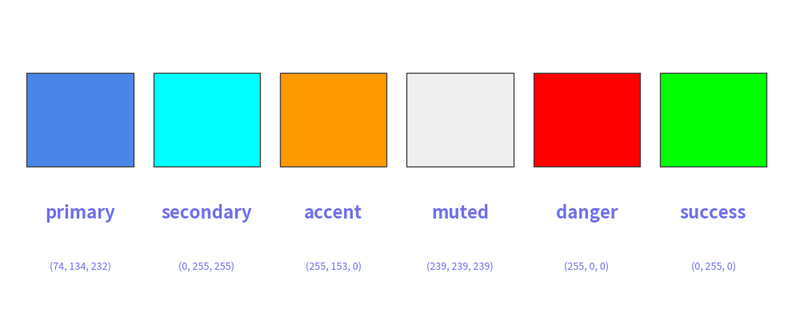
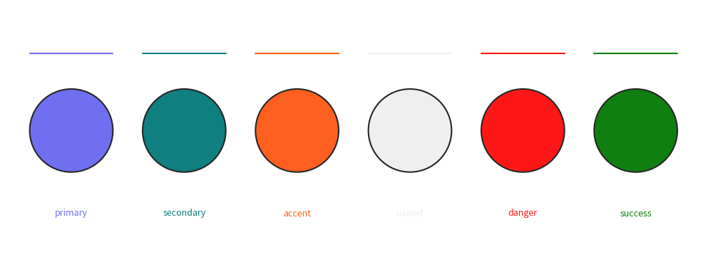

# Official Preset Styles: google

The `google` preset styles collection provides a modern palette based on Google Sheets and Material design standards.
It features rich, harmonious tints across multiple hues and full first-class support for semantic roles.

# Colors

The `google` preset styles provide neutral greys, 10 primary hue families with light and dark steps, and semantic mappings:

<figure class="drawlib-image" style="text-align: center;">
  
  <figcaption class="drawlib-caption">Preset styles google color chart</figcaption>
</figure>

# Semantic Roles

Drawlib maps the `google` theme colors to **6 core semantic roles**:

| Role | Theme Color | Hex | Intended Usage |
| :--- | :--- | :--- | :--- |
| **`primary`** | `GoogleBlue` | `#4285F4` | Main services, application logic, core actions |
| **`secondary`** | `Blue5` | `#0B5394` | Data stores, databases, caches, queues |
| **`accent`** | `Orange4` | `#E69138` | Clients, users, gateways, focal callouts |
| **`muted`** | `Gray3` | `#D9D9D9` | Group boundaries, VPC/subnets, containers |
| **`danger`** | `GoogleRed` | `#EA4335` | Alerts, errors, security risks, failures |
| **`success`** | `GoogleGreen` | `#34A853` | Completed milestones, verified status, healthy state |

In addition, `light` (`Gray1`) and `dark` (`Gray8`) are available for surface cards and high-contrast typography.
Each role provides 10 orthogonal variants (`bordered`, `bold`, `light`, `flat`, `outline`, `outline_bold`, `outline_light`, `dashed`, `dashed_bold`, `dashed_light`).

<figure class="drawlib-image" style="text-align: center;">
  
  <figcaption class="drawlib-caption">Semantic Roles in Action</figcaption>
</figure>

