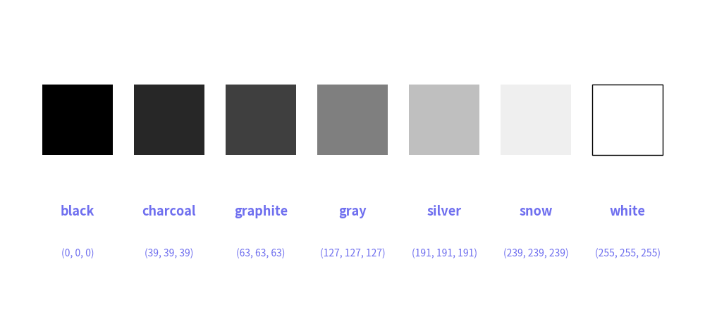

# Official Preset Styles: monochrome


The `monochrome` preset styles has colors between black and white.
There are many possibility that printed documents and published books has only black color.
These preset styles are useful for those kinds of situations.

The styling rules are the same as those for the `default` preset styles. 
If you are unfamiliar with these rules, please refer to the documentation for the default preset styles first, as this document does not provide detailed styling information.


# Colors


The `monochrome` preset styles possess 7 colors between black and white.


<figure class="drawlib-image" style="text-align: center;">
  
  <figcaption class="drawlib-caption">Preset styles monochrome color chart</figcaption>
</figure>


Here is a list of the colors. 
You can use `ColorsMonochrome` to retrieve RGB codes by their names.

- `black`: RGB(0, 0, 0)
- `charcoal`: RGB(39, 39, 39)
- `graphite`: RGB(63, 63, 63)
- `gray`: RGB(127, 127, 127)
- `silver`: RGB(191, 191, 191)
- `snow`: RGB(239, 239, 239)
- `white`: RGB(255, 255, 255)


# Style Names


Here is a list of style names.


```python
from drawlib.types import Style


# +----------------+---+-------+------+------+-------+-------------+------------+--------+--------------+-------------+
# | Item \ Name    |   | light | bold | flat | solid | solid_light | solid_bold | dashed | dashed_light | dashed_bold |
# +----------------+---+-------+------+------+-------+-------------+------------+--------+--------------+-------------+
# | Icon           | x | x     | x    | x    |       |             |            |        |              |             |
# | Image          | x | x     | x    | x    | x     | x           | x          | x      | x            | x           |
# | Line           | x | x     | x    |      | x     | x           | x          | x      | x            | x           |
# | Shape          | x | x     | x    | x    | x     | x           | x          | x      | x            | x           |
# | ShapeText      | x | x     | x    |      |       |             |            |        |              |             |
# | Text           | x | x     | x    |      |       |             |            |        |              |             |
# +----------------+---+-------+------+------+-------+-------------+------------+--------+--------------+-------------+

# +----------------+-------+-------------+------------+------------+-------------+-------------------+------------------+--------------+--------------------+-------------------+
# | Item \ Name    | black | black_light | black_bold | black_flat | black_solid | black_solid_light | black_solid_bold | black_dashed | black_dashed_light | black_dashed_bold |
# +----------------+-------+-------------+------------+------------+-------------+-------------------+------------------+--------------+--------------------+-------------------+
# | Icon           | x     | x           | x          | x          |             |                   |                  |              |                    |                   |
# | Image          | x     | x           | x          | x          | x           | x                 | x                | x            | x                  | x                 |
# | Line           | x     | x           | x          |            | x           | x                 | x                | x            | x                  | x                 |
# | Shape          | x     | x           | x          | x          | x           | x                 | x                | x            | x                  | x                 |
# | ShapeText      | x     | x           | x          |            |             |                   |                  |              |                    |                   |
# | Text           | x     | x           | x          |            |             |                   |                  |              |                    |                   |
# +----------------+-------+-------------+------------+------------+-------------+-------------------+------------------+--------------+--------------------+-------------------+

# +----------------+----------+----------------+---------------+---------------+----------------+----------------------+---------------------+-----------------+-----------------------+----------------------+
# | Item \ Name    | charcoal | charcoal_light | charcoal_bold | charcoal_flat | charcoal_solid | charcoal_solid_light | charcoal_solid_bold | charcoal_dashed | charcoal_dashed_light | charcoal_dashed_bold |
# +----------------+----------+----------------+---------------+---------------+----------------+----------------------+---------------------+-----------------+-----------------------+----------------------+
# | Icon           | x        | x              | x             | x             |                |                      |                     |                 |                       |                      |
# | Image          | x        | x              | x             | x             | x              | x                    | x                   | x               | x                     | x                    |
# | Line           | x        | x              | x             |               | x              | x                    | x                   | x               | x                     | x                    |
# | Shape          | x        | x              | x             | x             | x              | x                    | x                   | x               | x                     | x                    |
# | ShapeText      | x        | x              | x             |               |                |                      |                     |                 |                       |                      |
# | Text           | x        | x              | x             |               |                |                      |                     |                 |                       |                      |
# +----------------+----------+----------------+---------------+---------------+----------------+----------------------+---------------------+-----------------+-----------------------+----------------------+

# +----------------+----------+----------------+---------------+---------------+----------------+----------------------+---------------------+-----------------+-----------------------+----------------------+
# | Item \ Name    | graphite | graphite_light | graphite_bold | graphite_flat | graphite_solid | graphite_solid_light | graphite_solid_bold | graphite_dashed | graphite_dashed_light | graphite_dashed_bold |
# +----------------+----------+----------------+---------------+---------------+----------------+----------------------+---------------------+-----------------+-----------------------+----------------------+
# | Icon           | x        | x              | x             | x             |                |                      |                     |                 |                       |                      |
# | Image          | x        | x              | x             | x             | x              | x                    | x                   | x               | x                     | x                    |
# | Line           | x        | x              | x             |               | x              | x                    | x                   | x               | x                     | x                    |
# | Shape          | x        | x              | x             | x             | x              | x                    | x                   | x               | x                     | x                    |
# | ShapeText      | x        | x              | x             |               |                |                      |                     |                 |                       |                      |
# | Text           | x        | x              | x             |               |                |                      |                     |                 |                       |                      |
# +----------------+----------+----------------+---------------+---------------+----------------+----------------------+---------------------+-----------------+-----------------------+----------------------+

# +----------------+------+------------+-----------+-----------+------------+------------------+-----------------+-------------+-------------------+------------------+
# | Item \ Name    | gray | gray_light | gray_bold | gray_flat | gray_solid | gray_solid_light | gray_solid_bold | gray_dashed | gray_dashed_light | gray_dashed_bold |
# +----------------+------+------------+-----------+-----------+------------+------------------+-----------------+-------------+-------------------+------------------+
# | Icon           | x    | x          | x         | x         |            |                  |                 |             |                   |                  |
# | Image          | x    | x          | x         | x         | x          | x                | x               | x           | x                 | x                |
# | Line           | x    | x          | x         |           | x          | x                | x               | x           | x                 | x                |
# | Shape          | x    | x          | x         | x         | x          | x                | x               | x           | x                 | x                |
# | ShapeText      | x    | x          | x         |           |            |                  |                 |             |                   |                  |
# | Text           | x    | x          | x         |           |            |                  |                 |             |                   |                  |
# +----------------+------+------------+-----------+-----------+------------+------------------+-----------------+-------------+-------------------+------------------+

# +----------------+--------+--------------+-------------+-------------+--------------+--------------------+-------------------+---------------+---------------------+--------------------+
# | Item \ Name    | silver | silver_light | silver_bold | silver_flat | silver_solid | silver_solid_light | silver_solid_bold | silver_dashed | silver_dashed_light | silver_dashed_bold |
# +----------------+--------+--------------+-------------+-------------+--------------+--------------------+-------------------+---------------+---------------------+--------------------+
# | Icon           | x      | x            | x           | x           |              |                    |                   |               |                     |                    |
# | Image          | x      | x            | x           | x           | x            | x                  | x                 | x             | x                   | x                  |
# | Line           | x      | x            | x           |             | x            | x                  | x                 | x             | x                   | x                  |
# | Shape          | x      | x            | x           | x           | x            | x                  | x                 | x             | x                   | x                  |
# | ShapeText      | x      | x            | x           |             |              |                    |                   |               |                     |                    |
# | Text           | x      | x            | x           |             |              |                    |                   |               |                     |                    |
# +----------------+--------+--------------+-------------+-------------+--------------+--------------------+-------------------+---------------+---------------------+--------------------+

# +----------------+------+------------+-----------+-----------+------------+------------------+-----------------+-------------+-------------------+------------------+
# | Item \ Name    | snow | snow_light | snow_bold | snow_flat | snow_solid | snow_solid_light | snow_solid_bold | snow_dashed | snow_dashed_light | snow_dashed_bold |
# +----------------+------+------------+-----------+-----------+------------+------------------+-----------------+-------------+-------------------+------------------+
# | Icon           | x    | x          | x         | x         |            |                  |                 |             |                   |                  |
# | Image          | x    | x          | x         | x         | x          | x                | x               | x           | x                 | x                |
# | Line           | x    | x          | x         |           | x          | x                | x               | x           | x                 | x                |
# | Shape          | x    | x          | x         | x         | x          | x                | x               | x           | x                 | x                |
# | ShapeText      | x    | x          | x         |           |            |                  |                 |             |                   |                  |
# | Text           | x    | x          | x         |           |            |                  |                 |             |                   |                  |
# +----------------+------+------------+-----------+-----------+------------+------------------+-----------------+-------------+-------------------+------------------+

# +----------------+-------+-------------+------------+------------+-------------+-------------------+------------------+--------------+--------------------+-------------------+
# | Item \ Name    | white | white_light | white_bold | white_flat | white_solid | white_solid_light | white_solid_bold | white_dashed | white_dashed_light | white_dashed_bold |
# +----------------+-------+-------------+------------+------------+-------------+-------------------+------------------+--------------+--------------------+-------------------+
# | Icon           | x     | x           | x          | x          |             |                   |                  |              |                    |                   |
# | Image          | x     | x           | x          | x          | x           | x                 | x                | x            | x                  | x                 |
# | Line           | x     | x           | x          |            | x           | x                 | x                | x            | x                  | x                 |
# | Shape          | x     | x           | x          | x          | x           | x                 | x                | x            | x                  | x                 |
# | ShapeText      | x     | x           | x          |            |             |                   |                  |              |                    |                   |
# | Text           | x     | x           | x          |            |             |                   |                  |              |                    |                   |
# +----------------+-------+-------------+------------+------------+-------------+-------------------+------------------+--------------+--------------------+-------------------+
```

---

<p align="center"><em>© 2026 drawlib by Yuichi Ito. Released under the Apache 2.0 License.</em></p>
